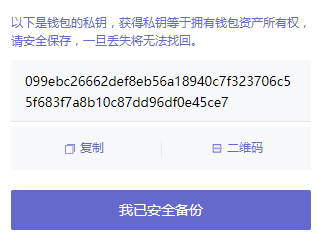

## Overview

账户类型

> 以下三种账户类型作为账号密码均可登录

- 助记词

  

- 私钥

  

- Keystore

  

## imToken

 

主页：https://www.token.im/

帮助中心：https://support.token.im/hc/zh-cn

代币名称 token name

合约 contact

钱包 wallets

资产 assets

## TokenPocket

 

主页：https://www.tokenpocket.pro/

## TronLink

主页：https://www.tronlink.org/

## TrustWallet

 

主页：https://trustwallet.com/
