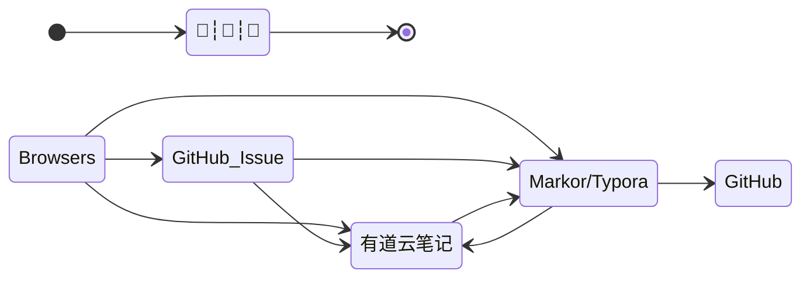

 

  

    <i>技术不会可以学，难的是如何找到好的学习资源。</i>
    👏<a href="/index-theme-vue.html#/home/book">不知道如何获取新技术？</a> 还可以按 📖<a href="/index-theme-vue.html#/tech-stack/README">技术体系</a>进行学习。
  

1. [Get started](home/get-started.md)🔻
2. _基础_ > [开发规范](home/README.md#开发规范) + [软件版本号](home/语义版本号.md) + [目录结构](home/toc.md) + [术语表](home/README.md#术语表)
3. *服务器端* > [PHP](back-end/php/README.md) + [Apache](back-end/apache.md) + [MySQL](database/mysql/README.md) + [Redis](database/redis/README.md) + [Nginx](back-end/nginx.md) + [Composer](back-end/composer/README.md) + [ThinkPHP](back-end/thinkphp/README.md) + [宝塔](tools/bt.md)
4. _[前端](front-end/README.md)_ > 
    - [HTML](front-end/html/README.md)
    - [CSS](front-end/css/README.md) >> [命名规则](front-end/css/css-命名规则.md) + [框架](开发框架/README.md#css-框架)
    - [JavaScript](front-end/javascript/README.md) >> [框架](开发框架/README.md#javascript-框架) + [插件](开发框架/javascript-plugins.md)
    - [jQuery](front-end/jquery.md) >> [插件](开发框架/README.md#jQueryjs)
    - [Node.js](front-end/node.js/README.md) >> 
        - [工具](front-end/node.js/nodejs-modules.md) >>> [Browsersync](front-end/node.js/README.md#browser-sync) + [rollup.js](front-end/node.js/nodejs-modules#rollupjs)
    - [浏览器开发者工具](tools/browser.md#开发者工具)
5. _Web 服务器_ > [Apache](back-end/apache.md) + [Nginx](back-end/nginx.md) + [Docker](back-end/docker.md)
6. _浏览器_ > [Browser](tools/browser.md) + [Mobile Browser](os/mobile/browser.md) + [Browser Extension](tools/browser-extensions.md)
7. _网络_ > [HTTP](essential/http.md) + [CORS（跨域）](essential/http.md#跨域) + [DNS](essential/dns.md) + [Hosts](tools/hosts.md) + [VPN](tools/vpn.md) + [IP](essential/README.md#ip)
8. _加速工具_ > [Mirror](home/README.md#镜像站) + [CDN](front-end/README.md#cdn-⚡)
9. _Shell_ >
    - [Windows cmd /*.bat](os/windows/README.md#windows-bat-脚本)
    - [Windows powershell /*.ps1](os/windows/README.md#windows-powershell)
    -  [Linux Shell /Bash-*.sh](os/linux/linux-shell.md)（[*Bash 脚本教程*](https://wangdoc.com/bash/)）
    - [Git Bash](https://git-scm.com/book/en/v2/Appendix-A:-Git-in-Other-Environments-Git-in-Bash)（*命令行工具*）
    - _命令_ >>
        - [Windows](os/windows/windows-cli.md)
        - [Linux](os/linux/linux%20指令.md)
10. _Version Control_ > [Git](tools/git.md) + [GitHub](tools/github.md)（[加速工具](tools/github.md#工具-1)）
11. _[操作系统](os/README.md)_ > [Windows](os/windows/README.md) >> [快捷键](os/windows/README.md#windows-快捷键-⌨) + [Linux](os/linux/README.md) + [macOS](os/mac/README.md) + [Mobile](os/mobile/README.md)
12. _Android Apps_ > [Termux](os/mobile/app-termux.md)（[Browsersync](os/mobile/app-termux.md#%e5%a6%82%e4%bd%95%e5%ae%89%e8%a3%85-nodejs-%e5%92%8c-browsersync-%ef%bc%9f)👏） + [Markor](os/mobile/README.md#markor) + [Acode](os/mobile/README.md#acode) + [MGit](os/mobile/mgit.md) + [MIUI](os/mobile/mi.md)
13. _模板_ > [文档模板](home/document-template.md) + [官网模板](开发框架/official-website.md) + [后台管理模板](开发框架/后台模板/README.md)
14. _文档网站生成_ >  [Docsify](tools/docsify.md) + [文档网站生成器](开发框架/README.md#文档网站生成器)
15. _大厂_ > [Microsoft]() + [Apple Inc.]()
