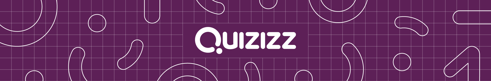

# _portal

<small>*插图来源于：[Quzizz](https://quizizz.com/?lng=zh-CN)*</small>

常用
---

- [jaywcjlove (小弟调调\) · GitHub](https://github.com/jaywcjlove)
    - 文档：
        1. [Quick Reference & Quick Reference](https://wangchujiang.com/reference/)
        2. [技术文档导航 - Dev Site](https://wangchujiang.com/dev-site/)
    - 工具：
        1. [Home - Web Tools](https://wangchujiang.com/tools/)
        2. [Search SVG Icons @icongo](https://icongo.github.io/)
        3. [Convert HEX & RGB colors to UIColor](https://uiwjs.github.io/ui-color/)
- [公开文档 · 语雀](https://www.yuque.com/markyun/doc)

文档手册
---

- 综合
    - [菜鸟教程 - 学的不仅是技术，更是梦想！](https://www.runoob.com/)
- 前端
    - [MDN Web Docs](https://developer.mozilla.org/zh-CN/)
    - [网道 - 互联网开发文档](https://wangdoc.com/)
      - [HTML 教程 - 网道](https://wangdoc.com/html/)
      - [JavaScript 教程 - 网道](https://wangdoc.com/javascript/)
      - [ES6 教程 - 网道](https://wangdoc.com/es6/)
      - [TypeScript 教程 - 网道](https://wangdoc.com/typescript/)
      - [Bash 脚本教程 - 网道](https://wangdoc.com/bash/)
    - [冴羽写博客的地方](https://github.com/mqyqingfeng/Blog)
      - [JavaScript 专题系列](https://github.com/mqyqingfeng/Blog#专题系列)
      - [JavaScript 深入系列](https://github.com/mqyqingfeng/Blog#深入系列)
      - [ES6 系列](https://github.com/mqyqingfeng/Blog#es6-%E7%B3%BB%E5%88%97)
    - [阮一峰的网络日志](http://www.ruanyifeng.com/blog/) 👉 [分类整理](home/book.md#阮一峰的网络日志)

学习社区
---

- https://www.freecodecamp.org/ - *Learn to Code — For Free — Coding Courses for Busy People* [GitHub](https://github.com/freeCodeCamp)

    - https://github.com/freeCodeCamp/freeCodeCamp - *GitHub - freeCodeCamp/freeCodeCamp: freeCodeCamp.org's open-source codebase and curriculum. Learn to code for free.*
    
        
        

    - https://github.com/freeCodeCamp/devdocs - *GitHub - freeCodeCamp/devdocs: API Documentation Browser* [Website](https://devdocs.io/)

      
      

浏览器扩展
---

- [Crx搜搜 - 一个牛X的扩展和应用商店](https://www.crxsoso.com/)
- [Tampermonkey](os/tools/tampermonkey.md)
    - [沉浸式翻译](https://download.immersivetranslate.com/immersive-translate.user.js)
- [CopyTabTitleUrl](os/tools/browser-extensions.md#copy-tab-title-url)

写作辅助工具
---

- [文档模板](home/document-template.md)
- [代码片段](snippets/README.md)
- [在线工具](os/tools/web-app.md)
  - [菜鸟工具](https://c.runoob.com/)
    - [正则表达式在线测试](https://c.runoob.com/front-end/854/)
  - [URL编解码](https://tool.browser.qq.com/urlencode.html)
- [Markdown Guide](https://www.markdownguide.org/)
- [iconfont-阿里巴巴矢量图标库](https://www.iconfont.cn/)
- [Icons Icon | Font Awesome](https://fontawesome.com/v6/icons/)

网址导航
---

- [Bypasszone | Your Free Web Proxy for Anonymity](https://bypasszone.net/)
- [GitHub: Let’s build from here · GitHub](https://github.com/)
- [Ecosia - the search engine that plants trees](https://www.ecosia.org/) 🚫

快速导航（Quick Links）
---

- [Emojipedia](https://emojipedia.org/)
- [廖雪峰的官方网站](https://www.liaoxuefeng.com/)
- [阿虚同学](os/tools/search.md#阿虚同学) 👉 [阿虚同学的储物间](https://axutongxue.com/)
- [程序员英语词汇宝典](https://learn-english.dev/)
- [Bootstrap中文网](https://www.bootcss.com/)

文档插件（Document Plug-in）
---

- [docsify](os/tools/docsify.md) 👉 [docsify 官网](https://docsify.js.org/#/)（[GitHub](https://github.com/docsifyjs/docsify/)）
- [Animate.css 官网](https://animate.style/)
- [Element UI](framework/README.md#Element-UI-🔥) 👉 [Element⁺ 官网](https://element-plus.gitee.io/zh-CN/)
- [PrismJS](framework/javascript-plugins.md#prismjs) 👉 [Prism 官网](https://prismjs.com/index.html)
- [SweetAlert2 官网](https://sweetalert2.github.io/)
- [Primer CSS](framework/README.md#primer-css-🔥) 👉 [Primer CSS 官网](https://primer.style/design/)
- [Bootstrap](framework/README.md#bootstrap-🔥) 👉 [Bootstrap 官网](https://getbootstrap.com/)
