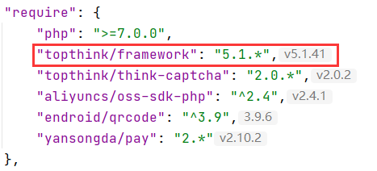
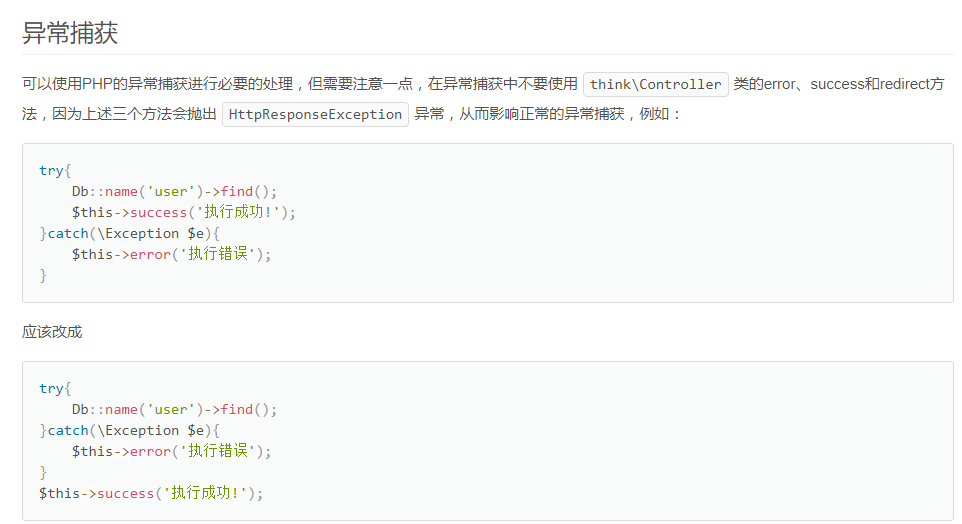

 

## 官方

> ThinkPHP 是一个免费开源的，快速、简单的面向对象的 轻量级PHP开发框架 ，创立于2006年初，遵循Apache2开源协议发布，是为了敏捷WEB应用开发和简化企业应用开发而诞生的。ThinkPHP从诞生以来一直秉承简洁实用的设计原则，在保持出色的性能和至简的代码的同时，也注重易用性。并且拥有众多的原创功能和特性，在社区团队的积极参与下，在易用性、扩展性和性能方面不断优化和改进，已经成长为国内最领先和最具影响力的WEB应用开发框架，众多的典型案例确保可以稳定用于商业以及门户级的开发。

主页：https://www.thinkphp.cn/ - *ThinkPHP框架 | 中文最佳实践PHP开源框架,专注WEB应用快速开发8年！*

GitHub：https://github.com/top-think - *ThinkPHP · GitHub*

开发手册：  
https://www.kancloud.cn/manual/thinkphp5_1/ - *ThinkPHP5.1完全开发手册 · 看云*  
https://www.kancloud.cn/manual/thinkphp6_0/ - *ThinkPHP6.0完全开发手册 · 看云*


## 开发规范

*thinkphp5.1* https://www.kancloud.cn/manual/thinkphp5_1/353949  
*thinkphp6.0* https://www.kancloud.cn/manual/thinkphp6_0/1037482


## 目录结构

*thinkphp5*

扩展类库存放目录 `extend`

第三方类库（Composer）存放目录 `vendor`


## 时间查询

*thinkphp5.1* https://www.kancloud.cn/manual/thinkphp5_1/354029  
*thinkphp6.0* https://www.kancloud.cn/manual/thinkphp6_0/1037565

```php
// 查询今天的数据
whereTime('create_time', 'today')
whereDay('create_time') // thinkphp6.0
// 查询某天的数据
// 查询“2018-06-01”的数据
whereDay('create_time', '2018-06-01') // thinkphp6.0
// 查询大于某个时间
// SELECT * FROM `base_user` WHERE  `create_time` >= 1643385600
// 1643385600 = 2022-01-29 00:00:00
whereTime('create_time', '>=', '2022-01-01')
```


## 分页查询

*thinkphp5.1* https://www.kancloud.cn/manual/thinkphp5_1/354120  
*thinkphp6.0* https://www.kancloud.cn/manual/thinkphp6_0/1037638


```php
$r = db("user")->paginate(3, false);
// 获取总记录数 
$r->total();
// 获取记录列表
$r->items();
// 获取当前页码
$r->currentPage();
// 获取每页记录数
$r->listRows();
```


*参考链接*  
[thinkphp5使用paginate查询分页数据如何获取总记录数](https://www.cnblogs.com/joeblackzqq/p/11509145.html)


## 事务操作

*thinkphp5.1* https://www.kancloud.cn/manual/thinkphp5_1/354035  
*thinkphp6.0* https://www.kancloud.cn/manual/thinkphp6_0/1037573


数据库事务操作在`foreach`等循环中使用`continue`一定要提交或回滚

例：

```php
foreach ($user_machine_list as $index => $item) {
    \think\Db::startTrans();
    try {
        if ($item['times'] >= $item['duration']) {
            \think\Db::commit();
            continue;
        }
        \think\Db::commit();
    } catch (\Exception $e) {
        \think\Db::rollback();
        throw $e;
    }
}
```

以下为错误示例，不能将 `\think\Db::startTrans();` 放至循环体外

```php
\think\Db::startTrans();
foreach ($user_machine_list as $index => $item) {
    try {
        if ($item['times'] >= $item['duration']) {
            \think\Db::commit();
            continue;
        }
        \think\Db::commit();
    } catch (\Exception $e) {
        \think\Db::rollback();
        throw $e;
    }
}
```

测试用例

```php
// 项目NEB
public function test()
{
    $lists = Db::name('stats_user_log')
        ->select();
    if (empty($lists) || $lists->isEmpty()) {
        return 'end';
    }
    foreach ($lists as $vo) {
        Db::startTrans();
        try {
            $update_ret = Db::name('stats_user_log')
                ->where('id', $vo['id'])
                ->where('stats_time', $vo['stats_time'])
                ->update(['stats_time' => time()]);
            // 限制每秒执行一次
            if (!$update_ret) {
                Db::commit(); // 更新失败表示已更新,抛出异常防止重复执行
                continue;
            }

            // 判断数字奇数还是偶数
            if ($vo['id'] % 2 == 0) {
                // 偶数
                dump($vo['id'].'偶数');
            } else {
                // 奇数
                exception('奇数');
            }

            Db::commit();
        } catch (\Exception $e) {
            Db::rollback();
            dump($e->getMessage());
        }
    }
    return '';
}
```


## 多语言

> 在模板中输出语言变量（lang_var）
>
> - 两种方式
>
>   1. `{$Think.lang.lang_var}`
>
>      不支持中文变量，例如：`{$Think.lang.主题}`
>
>      支持英文变量，例如：`{$Think.lang.theme}`
>
>   2. `{:lang('lang_var')}`
>
>      支持中文变量，例如：`{:lang(''主题')'}`
>
>      支持英文变量，例如：`{:lang('theme')}`

*thinkphp5.1* https://www.kancloud.cn/manual/thinkphp5_1/354119  
*thinkphp5.1（验证器）* https://www.kancloud.cn/manual/thinkphp5_1/354103  
*thinkphp6.0* https://www.kancloud.cn/manual/thinkphp6_0/1037637  
*thinkphp6.0（验证器）* https://www.kancloud.cn/manual/thinkphp6_0/1037626


👍 验证器可这样用

```php
// 验证数据
$validate_result = $this->validate($param, [
    'id' => 'require|number',
    'amount|'.lang('数量') => 'require|number|>:0',
    'price|'.lang('单价') => 'require|float|>:0',
    'password|'.lang('安全密码') => 'min:6',
],[]);
if (true !== $validate_result) {
    exception($validate_result);
}
```


变量传入支持

方式1 - 使用命名绑定方式，例如：

```php
// 定义
'file_format' => '文件格式: {:format},文件大小：{:size}',
// 使用
lang('file_format',['format' => 'jpeg,png,gif,jpg','size' => '2MB'])
```

👍 方式2 - 使用格式字串，如果你需要使用第三方的翻译工具，建议使用该方式定义变量。

```php
// 定义
'file_format' => '文件格式: %s,文件大小：%d',
// 使用
lang('file_format',['jpeg,png,gif,jpg','2MB'])
```


## 应用模块

!> 尽量使用公共的方法，操作、修改方便

!> 控制器（`controller`）方法命名使用驼峰

!> 功能（`common.php`）方法命名使用字母加下划线

- 控制层 - _controller_  
    - 接收/处理用户传输的数据，控制用户请求的数据以什么视图展现给用户

- 视图层 - _view_  
    - 放置网页界面以便控制器的随时调用

- 模型层 - _model_

- 验证层 - _validate_  
    - 存放表单数据等验证信息


### 后台应用 admin

*thinkphp5.1*

`html`文件存放目录：application/admin/view/


### 前台应用 home

*thinkphp5.1*

`html`文件存放目录：application/home/view/default

公共`html`文件存放目录：application/home/view/default/public/

模板继承：application/home/view/default/public/base.html


### 默认应用 index


### 接口应用 api

v1

v2

...

v(n)


### 公共应用 common

controller

1. Reward.php 静态奖励/动态奖励

model

1. 验证层
2. 模型层

validate

 

### 消息队列应用 queue


### 定时任务应用 task/cron/crontab

Reward.php/`Income.php` 奖励发放

1. static() 静态奖励
2. dynamic() 动态奖励
3. recmd() 直推奖励
4. node() 节点奖励
5. team() 团队奖励
6. average() 平分奖池
7. pool() 奖池奖励
8. recommend()/invite() 推荐奖励/邀请奖励
9. group() 拼团奖励
10. grade()/vip() 等级奖励

 

Achievement.php 业绩统计

1. run()

 

Upgrade.php/`Grade.php` 等级升级/`改变等级（包含升降级）`

（upgrade升级;downgrade降级）

1. run()
2. stats() 数据统计
3. execute() 执行升级
4. executeAll() 执行所有
5. upgrade() 升级
6. downgrade() 降级

 

Group.php 拼团

1. prize() 开奖

 

Repair.php 数据修复

 

Check.php 数据检测

 

Power.php 算力

 

Market.php 火币行情接口  
参考项目：`猎鹰`、`swarm`

1. tickers()


### 测试应用 test


## 控制器

### 基类

Base.php

Base添加前缀增加文件的辨识度，如：ApiBase.php / AdminBase.php


### 登录/注册类

Login.php

`adminLogin()` 后台免密登录

`register()` 注册

`login()` 登录

`logout()` 登出

`captcha()` 图形验证码

thinkphp3.2

```html
 time()))}" alt="captcha" onclick="this.src='{:U(\'/Home/Login/verify\')}?'+Math.random();">
```


thinkphp5.0

```html
 time()])}" alt="captcha" onclick="this.src='{:url(\'/home/login/captcha\')}?'+Math.random();">
```


`sendSms()` 发送短信

短信验证码倒计时

 

验证码 verification codes

短信验证码文案：

内容：【公司签名】验证码6856。请在注册页面中输入以完成注册。

例如：

【NBA会员】验证码6856。请在注册页面中输入以完成注册。

【SKY】您的验证码是{:code}，有效期5分钟，请在页面中提交验证码完成验证。

 

`sendEmail()` 发送邮件

邮箱验证码倒计时

 

文案参考个人邮箱（caiyongwen@yeah.net）中的文件夹分类 > 邮箱验证

邮箱验证码文案：

邮件标题：欢迎注册<项目名>

邮件内容：你本次注册的验证码为：194559，请在5分钟之内使用它！

 

验证邮箱文案：

邮件标题：<项目名>新用户激活

邮件文案：感谢您注册EasyWeb网站，请点击此激活链接激活您的账户：https://eleadmin.com/account/active/ea04fc42e4b843e899d3d242f0285fad，如果无法验证，请复制链接使用浏览器打开。

 

`verifyEmail()` 验证邮箱

`forgetPassword()` 忘记密码

`retrievePassword()` 找回密码

`download()` APP下载

thinkphp3.2

```php
public function download()
{
    $famlePath = $_GET['resum'];
    $file_dir = ROOT_PATH . 'public' . DS . 'uploads' . '/' . "$famlePath";   // 下载文件存放目录
    // 检查文件是否存在
    if (! file_exists($file_dir) ) {
        $this->error('文件未找到');
    } else {
        // 打开文件
        $file1 = fopen($file_dir, "r");
        // 输入文件标签
        Header("Content-type: application/octet-stream");
        Header("Accept-Ranges: bytes");
        Header("Accept-Length:".filesize($file_dir));
        Header("Content-Disposition: attachment;filename=" . $file_dir);
        ob_clean();   // 重点！！！
        flush();     // 重点！！！！可以清除文件中多余的路径名以及解决乱码的问题：
        //输出文件内容
        //读取文件内容并直接输出到浏览器
        echo fread($file1, filesize($file_dir));
        fclose($file1);
        exit();
    }
}
```

 

thinkphp 3.2 `参考项目vcf`

```php
/**
 * 下载安卓APP
 */
public function downloadApk()
{
    $Http = new \Org\Net\Http();
    $Http::download('.'. C('DEFAULT_WEB_ANDROID_APK'), 'x182085-adr-v102.apk');
}
```


`agreement()` 注册协议

`app()` 获取APP信息

`createAccount()` 创建账户


### 会员账户类

`Member.php`

1. bindPayment() 绑定支付(付款/收款)方式 | 绑定收付款账号
2. signin() 签到
3. bindWithdrawalAccount() 绑定提现账户

`Membersecurity.php` 会员账号信息

1. modifyPwd() 修改登录密码
2. modifyPayPwd() 修改支付密码
3. retrievePassword() 找回密码

`Memberbank.php` 会员银行卡

1. bindBank() 绑定银行卡

`Memberinviter.php` / `Membershare.php` 会员分享邀请

`Memberteam.php` 会员团队

1. teamInfo() 会员团队基本信息
2. teamlist() 会员团队详细信息（分页）

 

修改密码

1. type 类型 1登录密码 2安全密码
2. old_password 旧密码
3. new_password 新密码
4. new_password_confirm 确认新密码

 

### 资产钱包类

`Wallet.php`/`Finance.php`/`Assets.php`

1. finance()
2. record() 记录明细
3. withdrawal() 提现
4. convert() 划转 [币币间划转] 转换（例：word转换为pdf）

 \- from

 \- to

 \- 数量（amount）

 \- 安全密码（payment_password）

5. exchange()/swap() 兑换 [不同币币间兑换]

 \- from

 \- to

 \- 数量（amount）

 \- 安全密码（payment_password）

6. transfer() 转移;划转 [转给他人]

 \- 接收人（receiver）：不能给自己转

 \- 数量（amount）：

 \- 安全密码（payment_password）：

 \- 谷歌验证


### 新闻消息类

News.php

1. message() 消息列表
2. detail() 消息详情

 

新闻|资讯分类

1. 新闻 news
2. 消息 message
3. 公告 announcement
4. 通知 notice/`notification`
5. 白皮书 white paper
6. 轮播图 banner
7. 快讯 news
8. 文章 article
9. 规则 rule
10. 攻略 strategy
11. 关于 about
12. 联系我们 contact
13. 常见问题 faq
14. 用户许可协议 
15. 协议/注册协议 agreement
16. 隐私政策 privacy
17. 使用条款 terms
18. 其他 other


### 订单类

Order.php

 

### 商品类

Goods.php

 

### 展示+索引类

Index.php

 

### 短信类

application/common/controller

1. SmsMeilian.php
2. SmsBao.php


### 文章类

Article.php


### 上传类

Upload.php

1. image()
2. file()


上传图片资源 `png,jpeg,jpg,gif`

```php
public function image(){}
```


tp5.1

```php
$info = $file->validate([
    'size' => 25678,
    'ext'  => 'jpg,png,gif'
])->move('./uploads');
```


这里验证的文件大小`size`是`25678B`（字节byte）

1KB = 1024B（字节byte）

1MB = 1024KB

1GB = 1024MB

1TB = 1024GB

如何查看电脑图片文件的大小

选中图片文件右键查看属性中的大小、占用空间

 


## 数据库

### 聚合查询

```php
// 当条件不存在时，返回的结果是null
$sums = Db::name('user')
    ->whereLike('path', '%-' . $user['id'] . '-%')
    ->field('SUM(`pledge`) AS all_pledge,SUM(`pool`) AS all_pool')
    ->select();
```


```php
// 当条件不存在时，返回结果的是0.0
$all_pool = Db::name('user')
    ->whereLike('path', '%-' . $user['id'] . '-%')
    ->sum('pool');
```


### 更新

自增/自减更新

```php
$result = Db::name('user')
    ->where('id', 1)
    ->update([
        'money' => ['inc', 100],
        'price' => ['dec', 100]
    ]);
```

或者

```php
$result = Db::name('user')
    ->where('id', 1)
    ->update([
        'money' => Db::raw('money+100'),
        'price' => Db::raw('price-100')
    ]);
```

上述 `update` 方法返回影响数据的条数，没修改任何数据返回 0


## 模型

### action命名

- `get + model_name` 获取单条数据

- `all + model_name` 添加多条数据

- `add + model_name` 添加单条数据

- `update + model_name` 更新单条数据

- `checkIsExist` 检查是否存在

- `getExchangeRate` 获取兑换比率


### 获取单条数据

`get + 模型名` 例：getUser()

```php
/**
 * 获取单条数据
 * @param bool $is_valid 是否正常用户
 */
public static function getUser($where, $field = '*', $is_valid = true)
{
    if ($is_valid) {
        $where = array_merge($where, [
            'status'      => 1,
            'delete_time' => 0
        ]);
    }
    return self::with(['user_bank', 'wallet'])
        ->where($where)
        ->field($field)
        ->fetchSql(false)
        ->find();
}
```


### 更新单条数据

`update + 模型名`

```php
/**
 * 更新单条数据
 */
public static function updateWallet($data, $where, $field = true)
{
    return (new self())->allowField($field)->save($data, $where);
}
```


### 检查是否存在

```php
/**
 * 检查是否存在
 */
public static function checkIsExist($field, $value)
{
    $uid = self::where($field, $value)
        ->where('status', 1)
        ->value('id');
    return empty($uid) ? false : true;
}
```


### 获取兑换比率

```php
/**
 * 获取兑换比率
 * @param null $from_currency_id
 * @param null $to_currency_id
 * @return bool|string
 * @throws \Exception
 */
public static function getExchangeRate($from_currency_id = null, $to_currency_id = null)
{
    $list = (new Currency)->whereIn('id', [$from_currency_id, $to_currency_id])
        ->where('status', 1)
        ->column('price', 'id');
    if (count($list) != 2) {
        // 币种不存在
        exception('币种不存在', 400);
    }
    return bcdiv($list[$from_currency_id], $list[$to_currency_id], 4);
}
```


### 获取多条数据

`all + 模型名`

```php
/**
 * 获取多条数据
 */
public static function allUser($where, $field = '*', $page = ['current_page'=>1,'per_page'=>20], $order = [])
{
    $model = self::where($where);
    if (!empty($order) && is_array($order)) {
        $model->order($order);
    }
    return $model
        ->where('status', 1)
        ->where('delete_time', 0)
        ->field($field)
        ->fetchSql(false)
        // ->select();
        ->paginate($page['per_page'], false, [
            'page' => $page['current_page'],
        ]);
    
  /*return [
      'data' => $user_info->items(),
      'meta' => [
          'pagination' => [
              'total'     => $user_info->total(),
              'count'     => $user_info->count(),
              'per_page'   => $user_info->listRows(),
              'current_page' => $user_info->currentPage(),
              'total_pages'  => $user_info->lastPage(),
              'link'     => [
                  'next' => ''
              ]
          ]
      ]
  ];*/
}
```


### 添加单条数据

`add + 模型名`

```php
/**
 * 添加单条数据
 */
public static function addUser($data)
{
    return self::create($data, true);
}
```

 

### 添加多条数据

`addAll + 模型名`

```php
/**
 * 添加多条数据
 */
public static function addAllWallet($data)
{
    return self::saveAll($data, false);
}
```


### 分层

逻辑层/服务层/事件层

 

修改器

自动时间戳

 

### 数据完成

tp5.1使用修改器`$data`参数设置的需要使用数据完成

```php
protected $insert = ['pid'];
public function setPidAttr($value, $data)
{
    $pid = self::where('mobile', $data['inviter_mobile'])->value('id');
    return empty($pid) ? 0 : $pid;
}
```


### 模型关联

 \- 关联预载入（结合 `一对一关联 -> 绑定属性到父模型`使用）

 \- 代码实现：查看项目`swarm` WalletLog模型 + 财务管理调用模型的代码

```php
/**
 * 一对一关联user表
 */
public function user()
{
    return $this->hasOne('User', 'id', 'user_id')->bind([
        'mobile'
    ]);
}
```


### 获取器

https://www.kancloud.cn/manual/thinkphp6_0/1037588

```php
/**
 * 获取状态（xxx）
 */
public function getStatusTextAttr($value, $data)
{
    $statusVia = [
        -1 => '封号',
        0  => '锁定',
        1  => '正常'
    ];
    return $statusVia[$data['status']];
}
```


读取数据时如何追加？

https://www.kancloud.cn/manual/thinkphp6_0/1037591

```php
// 使用 `->append(['status_text'])` 追加
$list = User::where('status', 1)
    ->append(['status_text'])
    ->order('create_time desc')
    ->page($page, 15)
    ->select();
```


### 搜索器

```php
/**
 * 搜索user_id
 * @param $query
 * @param $value
 * @param $data
 */
public function searchUserIdAttr($query, $value, $data)
{
    $query->where('user_id', $value);
}
```


## 验证

后台表单令牌必验证

在 `model` 中使用

```php
// 验证数据（thinkphp6 可用）
$Validate = new \think\Validate();
$validate_result = $Validate->check($data, [
    'email|'.lang('邮箱')  => 'require|email|unique:user',
    'password|'.lang('登录密码') => 'require|min:8|confirm',
    'paypwd|'.lang('安全密码') => 'require|min:6|confirm',
    'invit|'.lang('邀请码') => 'require',
]);
if (true !== $validate_result) {
    exception($Validate->getError());
}
```

在 `controller` 中使用

```php
// ⚠️类必须继承控制器基础类（/app/BaseController.php）
// 验证数据（thinkphp6 可用）
$validate_result = $this->validate($data, [
    'email|'.lang('邮箱')  => 'require|email|unique:user',
    'password|'.lang('登录密码') => 'require|min:8|confirm',
    'paypwd|'.lang('安全密码') => 'require|min:6|confirm',
    'email_captcha|'.lang('邮箱验证码') => 'require|length:6|number',
    'invit|'.lang('邀请码') => 'require',
    'is_accept|'.lang('勾选注册协议') => 'require|accepted',
]);
if (true !== $validate_result) {
    exception($validate_result);
}
```


### FAQs

验证场景 `append` 追加的错误信息不能与 `protected $rule = [];` 中的一致，否则会跳过验证

错误示例 🌰

```php
protected $rule = [
    'to_amount|数量' => 'require|float|>:0',
];
public function sceneUserWithdraw()
{
    return $this->only([
        'to_amount',
    ])->append('to_amount|数量', 'checkWalletMoney:withdrawal');
}
```

以上代码因为`数量`重复，所有会跳过验证，应该把其中的一个数量改为提现数量或者其他

### 常用验证

#### 账户内购买验证

验证商品信息

验证输入数量

验证交易密码

验证账户余额

#### 会员注册

- 用户名 username

  必须|唯一|至少6位的字母加数字组合

  `'require|unique:member|regex:/^(?![0-9]+$)(?![a-zA-Z]+$)[0-9A-Za-z]{6,}$/',`

  或

  `'require|unique:member|min:6|alphaNum',`

- 昵称 nickname

  必须|25位长度

  `'require|max:25',`

- 手机号 mobile

  必须|是否为有效的手机|唯一

  `'require|mobile|unique:user',`

- 邮箱 email

  必须|是否为email地址|唯一

  `'require|email|unique:user',`

   

  `$regexp = "^([_a-z0-9-]+)(\.[_a-z0-9-]+)*@([a-z0-9-]+)(\.[a-z0-9-]+)*(\.[a-z]{2,4})$";`

- 登录密码 password

  必须|至少8位|是否和另外一个字段的值一致

  `'require|min:8|confirm',`

  error_message：登录密码不一致

  

  'password_require' => '请输入登录密码',

  'password_min' => '登录密码至少8位',

  'password_confirm' => '登录密码不一致',

- 安全密码 payment_password / security_password

  必须|至少6位|是否和另外一个字段的值一致|固定6位

  `'require|min:6|confirm|length:6',`

  error_message：支付密码不一致

  

  'payment_password_require' => '请输入安全密码',

  'payment_password_min' => '安全密码至少6位',

  'payment_password_confirm' => '安全密码不一致',

  'payment_password_length' => '请输入6位安全密码',

- 邀请码 invitation_code

  见 composer 的 hashids/hashids

- 短信验证码 sms_captcha

  必须|数字|6位长度

  `'require|number|length:6',`

- 注册协议 is_accept

  必须|是否已同意(已勾选)

  `'require|accepted',`

  error_message：未勾选隐私政策注册协议

- 图片url地址 img_src

  必须|否为有效的URL地址

  `'require|url',`

- 真实姓名

  `'truename' => 'require',`

  'truename_require' => '请输入姓名',

  'truename_require' => 'Please type in your name',

- 银行卡号

  `'bank_card_number' => 'require|number',`

  'bank_card_number_require' => '请输入银行卡号',

  'bank_card_number_number' => '银行卡号必须是数字',

  'bank_card_number_require' => 'Please enter bank card number',

  'bank_card_number_number' => 'Bank card number must be a number',

- 开户行

  `'bank_name' => 'require',`

  

  'bank_name_require' => '请输入开户行',

  'bank_name_require' => 'Please enter the bank',

   

- 身份证号码

  `'idcard' => 'require|alphaNum',`

  'idcard_require' => '请输入身份证号码',

  'idcard_alphaNum' => '身份证号码只能是字母和数字',

  'idcard_require' => 'Please enter your ID number',

  'idcard_alphaNum' => 'ID number can only be letters and numbers',

#### 正负整数

```php
!is_numeric($post_data['price']) || false !== strpos($post_data['price'], '.')
```

 

#### 数量

```php
if (!preg_match('/^[0-9]+(.[0-9]{1,4})?$/', $data['money']) || !($data['money'] > 0)) {
    exception('数量格式错误');
    exception('兑换金额格式错误');
}
```

 

规则

`'money' => 'require|float|>:0',`

`'money' => 'require|number|>:0', // 一定要带上 >:0，因为 number 包含0`

 

错误信息

填写大于0的数量

填写正确的数量

最低出售数量5枚

 

#### 数量倍数

- 规则
  - 方式一
  
    ```php
    // 限制100的倍数
    $limit = 100;
    $multiple = $post_data['to_amount']/$limit;
    if (!preg_match('/^\d+$/', $multiple) || $multiple <= 0) {
        return '数量必须为'. $limit. '的倍数';
    }
    ```
  
  
  - 方式二（推荐）
  
    ```php
    // 限制100的倍数
    $limit = 100;
    $multiple = $post_data['to_amount']/$limit;
    if (!preg_match('/^[1-9][0-9]*$/', $multiple)) { // 非零的正整数
        return '数量必须为'. $limit. '的倍数';
    }
    ```
  

 

- 错误信息

  数量为`$limit`的倍数起售

 

- 测试
  - ✔️$post_data[‘to_amount’] = 100 // 正确（测试结果：pass）
  - ✔️$post_data[‘to_amount’] = 10 // 错误（测试结果：pass）
  - ✔️$post_data[‘to_amount’] = 0 // 错误（测试结果：pass）
  - ✔️$post_data[‘to_amount’] = -10 // 错误（测试结果：pass）
  - ✔️$post_data[‘to_amount’] = -100 // 错误（测试结果：pass）

 

- 多语言

  - // 定义

    '数量为的倍数' => '数量为%d的倍数',

    '元素碎片枚起售倍数' => '元素碎片%d枚的倍数起售',

    '宝箱碎片枚起售倍数' => '宝箱碎片%d枚的倍数起售',

  - // 使用

    lang('数量为的倍数', [$limit])


#### 价格

规则

'price' => 'require|float|>:0',

 

错误信息

填写大于0的价格

填写正确的价格

最低出售价格5

 

#### 钱包地址

##### ETH / BSC钱包地址

 

// ETH钱包地址 `0x258F9769Edd6957d1c1Cd25F265e9FDEDD0C00FC`

// BSC钱包地址 `0xbe8abf163d5f020ee65ea6bff87043b5bfc6702a`

- 方式 1（推荐）

```php
if (!preg_match('/^0[x|X][0-9a-zA-Z]{40}$/', $param_data['to_address'])) {
    exception('地址格式错误');
} else {
    $result_data = $this->withdrawalErc20();
}
```

 

- 方式 2（不够严谨）

 

```php
if (stripos($data['address'], '0x') !== 0 || strlen($data['address']) != 42) {
    exception(lang('address_format_error'));
}
```

 

测试

✔️$data['address'] = '0x67712e1b7225ffad4d8281c3fbbe3372f7baca76'; // 正确（测试结果：pass）

✔️$data['address'] = '0x67712e1b7225ffad4d8281c3fbbe3372f7baca7'; // 错误（测试结果：pass）

✔️$data['address'] = '067712e1b7225ffad4d8281c3fbbe3372f7baca76'; // 错误（测试结果：pass）

✔️$data['address'] = '67712e1b7225ffad4d8281c3fbbe3372f7baca76'; // 错误（测试结果：pass）

✔️$data['address'] = '0x67712e1b72372f7baca76'; // 错误（测试结果：pass）

❌$data['address'] = '0x67712e1b7225ffad4d8281c3fbbe3372f7baca7-'; // 正确（测试结果：fail）

 

##### TRX钱包地址

// TRX钱包地址 `TBF6qH2i9L7DWst5hrTShzrVGKvQ8qZ2xf`

- 方式 1

```php
if (!preg_match('/^[t|T][0-9a-zA-Z]{33}$/', $param_data['to_address'])) {
    exception('地址格式错误');
} else {
    $result_data = $this->withdrawalTrc20();
}
```

 

- 方式 2

```php
if (!preg_match('/^[t|T][0-9a-zA-Z]{33}$/', $param_data['to_address'])) {
    exception('TRON地址格式有误');
}
```

 

- 方式 3

```php
if (stripos($data['withdrawal_address'], 'T') !== 0 && strlen($data['withdrawal_address']) != 34) {
    exception('地址格式错误');
}
```

 

#### 时间验证

验证某个字段的值是否为指定格式的日期

 

格式

`'time' => 'dateFormat:H:m - H:m'`

✔️正确

```
10:00 - 11:00
```

❌错误

```
10:00:00 - 11:00:00

10:00:00 ~ 11:00:00

10:00 ~ 11:00

10:00 ~ 11:00:00
```

 

#### 手机号或者邮箱

#### 错误信息

- 当请求数据错误时提示：

  请求参数异常 `param_error`

 

- 当请求数据缺少时提示：

  缺少必要参数 `miss_param`

  ```php
  $diff = [
      'userid',
      'money',
      'currency_id',
      'wallet_type',
      'log_id',
  ];
  if (array_diff($diff, array_keys($data)) || array_diff(array_keys($data), $diff)) {
      exception('缺少必要参数');
  }
  ```

  

- 当请求用户数据为空时提示：

   无效的用户 `invalid_user`

  

- 当请求数据不等于某值或不在某范围内时提示：

  无效的参数 `invalid_param`

  

- 当请求数据查库为空时提示：

  请求数据有误 `request_data_error`


- 当更新数据前已更新时提示：

  此等级不可重复标记

  

- 当更新条件错误时显示：

  数据（更新）异常 `update_error`


#### 自定义验证

tp5.1官方手册地址：[验证 -> 验证器 -> 自定义验证规则](https://www.kancloud.cn/manual/thinkphp5_1/354102)

`checkMobileIsExist()` // 验证手机号码是否存在

`checkUserIsExist()` // 验证用户是否存在

`checkSecurityPassword` // 验证安全密码

`checkWalletMoney()` // 验证钱包余额

`checkSmsCaptcha()` // 验证短信验证码

 

例 🌰：

```php
protected function checkUserIsExist($value, $rules, $data)
{
    switch ($rules)
    {
        case 'id':
            $value = decode_invite_code($value);
            break;
        default:
    }
    $is_exist = \app\common\model\User::checkIsExist($rules, $value);
    return $is_exist ? true : '推荐人不存在';
}
```

 

```php
namespace app\index\validate;

use think\Validate;

class User extends Validate
{
    protected $rule = [
        'name'  =>  'checkName:thinkphp',
        'email' =>  'email',
    ];
    
    protected $message = [
        'name'  =>  '用户名必须',
        'email' =>  '邮箱格式错误',
    ];
    // 自定义验证规则
    protected function checkName($value,$rule,$data=[]) {
        return $rule == $value ? true : '名称错误';
    }
}
```

注：上面的`thinkphp`对应的是下面的`$rule`参数

 

#### 验证场景

注释格式

```php
/**
 * 定义验证场景 - 用户绑定付款方式
 * @return User
 */
```

 

`adminCreate()` 管理员添加

`userRegister()` 用户注册

`userLogin()` 用户登录

`userForgetPassword()` 忘记密码

`userPurchase()` 用户购买

`userTransfer()` 用户划转


个人惯用

```php
$result = $this->validate($post_data, '\app\admin\validate\Machine');
if (true !== $result) {
    $this->error($result);
}
```

 

#### **表单令牌**

Tp6

`<input type="hidden" name="__token__" value="{$token}" />`

或

`{:token_field()}`

模板中使用`{$token}`，需要整个页面刷新后才会生成新的 **token**，使用 **ajax** 局部刷新只会生成同一个 **token**


可尝试把 **token** 验证放到新增、更新数据之前验证


```php
// 验证数据
$validate_result = $this->validate($param, [
    'id' => 'require|number',
    'password' => 'confirm|min:8',
    'pay_pwd' => 'confirm|min:6|token' // 表单令牌,token放最后验证,防止最终验证完出现令牌错误
],[
    'password.confirm' => '登录密码不一致',
    'password.min' => '登录密码至少8位',
    'pay_pwd.confirm' => '支付密码不一致',
    'pay_pwd.min' => '支付密码至少6位',
]);
if (true !== $validate_result) {
    exception($validate_result);
}
```


## Common.php

### 自定义日志处理

1. 在`/application/common`文件中添加一下代码

   ```php
   /**
    * 基于 thinkphp5.1 实现的自定义日志处理
    * 使用示例：custom_log($e->getFile() .'----'. $e->getLine() .'---'. $e->getMessage());
    * @param $msg
    */
   function custom_log($msg)
   {
       \think\facade\Log::init([
           // 日志记录方式，支持 file socket 或者自定义驱动类
           'type'        => 'File',
           //日志保存目录
           'path'        => env('module_path') . 'log/',
           //单个日志文件的大小限制，超过后会自动记录到第二个文件
           'file_size'   => 2097152,
           //日志的时间格式，默认是` c `
           'time_format' => 'c',
           // error和sql日志单独记录
           'apart_level' => ['error'],
       ]);
       \think\facade\Log::write($msg, 'error');
   }
   ```

   Linux服务器需要目录权限，用以下方式减少报错问题

   ```php
   /**
    * 基于 thinkphp5.1 实现的自定义日志处理
    * 使用示例：custom_log($e->getFile() .'----'. $e->getLine() .'---'. $e->getMessage());
    * @param $msg
    */
   function custom_log($msg)
   {
       $log_path = [
           'custom_log',
           strtolower(request()->module()),
           strtolower(request()->controller()),
           strtolower(request()->action())
       ];
       $path = request()->env('runtime_path').implode(DIRECTORY_SEPARATOR, $log_path);
       \think\facade\Log::init([
           // 日志记录方式，支持 file socket 或者自定义驱动类
           'type'        => 'File',
           //日志保存目录
           'path'        => $path,
           //单个日志文件的大小限制，超过后会自动记录到第二个文件
           'file_size'   => 2097152,
           //日志的时间格式，默认是` c `
           'time_format' => 'c',
           // error和sql日志单独记录
           'apart_level' => ['error'],
       ]);
       \think\facade\Log::write($msg, 'error');
   }
   ```

   

2. 在需要记录错误日志的位置添加如下代码

   ```php
   custom_log($e->getFile() .'----'. $e->getLine() .'---'. $e->getMessage());
   trace($e->getFile() .'----'. $e->getLine() .'---'. $e->getMessage(), 'error');
   ```


### 自动生成文件版本号

```php
/**
 * 自动生成文件版本号
 * @param $file_name
 * @return string
 */
function auto_version($file_name)
{
    if (file_exists($_SERVER['DOCUMENT_ROOT'] . $file_name)) {
        $ver = filemtime($_SERVER['DOCUMENT_ROOT'] . $file_name);
    } else {
        $ver = 1;
    }
    return $file_name . '?v=' . $ver;
}
```


### 获取数值所属区间

<i class="fa fa-external-link"></i> 参考：https://segmentfault.com/q/1010000015752520

```php
/**
 * 获取数值所属区间
 * @param float $number 数值
 * @param array $rangeArray 区间数组 [0=>'大于0',100=>'大于100',1000=>'大于1000']
 * @param string $default 不在区间时的默认返回值
 * @return mixed|string 返回区间对应的value
 */
public static function getNumRange(float $number, array $rangeArray, string $default = '')
{
    foreach ($rangeArray as $key => $value) {
        if ($number >= $key) {
            $default = $value;
        } else {
            break;
        }
    }
    return $default;
}
```


### 获取日期范围

```php
/**
 * 获取日期范围
 * @param string $time
 * @param string $format
 * @param int $day
 * @param int $interval
 * @return array
 */
private static function getDateRange($time = '', $format = 'Y-m-d', $day = 7, $interval = 1)
{
    $time = $time != '' ? $time : time();
    // 组合数据
    $date = [];
    for ($i = 1; $i <= $day; $i++) {
        if ($i % $interval == 0 || $i == $day) {
            $date[$i] = date($format, strtotime('+' . $i - $day . ' days', $time));
        }
    }
    return $date;
}
```


### 生成随机字符串

> 参考tp6.0图形验证码源码

```php
private static function generateRandomStr($number = 1)
{
    if ($number == 0) {
        return false;
}
// 字符集合
    $code_set = '0123456789abcdefghijklmnopqrstuvwxyzABCDEFGHIJKLMNOPQRSTUVWXYZ';
    $characters = str_split($code_set);
    $str ='';
    for($i = 0; $i < abs($number); $i++) {
        $str .= $characters[mt_rand(0, count($characters) - 1)];
    }
    return $str;
}

//生成6位随机验证码
function codestr(){
    $arr=array_merge(range('a','b'),range('A','B'),range('0','9'));
    shuffle($arr);
    $arr=array_flip($arr);
    $arr=array_rand($arr,6);
    $res='';
    foreach ($arr as $v){
        $res.=$v;
}
return $res;
}
```


### 生成随机小数

```php
/**
 * 生成0~1随机小数
 * @param Int  $min
 * @param Int  $max
 * @return Float
 */
function randFloat($min=0, $max=1){
  return $min + mt_rand()/mt_getrandmax() * ($max-$min);
}
```


### 隐藏中间的值（例：134****1234）

```php
/**
 * 字符串的一部分替换为另一个字符串
 * 例1：’尼你你你你尼‘ 替换成 '尼****尼' =》 mb_substr_replace('尼你你你你尼', null, 1, -1)
 * 例2：’尼你你你尼‘ 替换成 '尼**尼' =》 mb_substr_replace('尼你你你尼', '**', 1, -1)
 *
 * @param $string
 * @param null $replace
 * @param int $offset
 * @param int $length
 * @return string|string[]
 */
function mb_substr_replace($string, $replace = null, $offset = 2, $length = -2)
{
    $search = mb_substr($string, $offset, $length);
    if (is_null($replace)) {
        for ($i = 0; $i<mb_strlen($search); $i++)
        {
            $replace .= '*';
        }
    }
    return str_replace($search, $replace, $string);
}
```


### 保留小数点后4位

```php
//保留小数点后4位
function digits($num) {
	return substr(sprintf("%.6f", $num), 0, -2);
}
```


### 截取字符串前25个字符后面的用...代替

```php
//富文本操作
function cut_out($str) {
	$content_01 = $str; //从数据库获取富文本content
	$content_02 = htmlspecialchars_decode($content_01); //把一些预定义的 HTML 实体转换为字符
	$content_03 = str_replace("&nbsp;", "", $content_02); //将空格替换成空
	$contents = strip_tags($content_03); //函数剥去字符串中的 HTML、XML 以及 PHP 的标签,获取纯文本内容
	if (mb_strlen($contents, 'utf8') > 25) {
		$con = mb_substr($contents, 0, 25, "utf-8") . '...'; //返回字符串中的前100字符串长度的字符
	} else {
		$con = $contents;
	}

	return $con;
}
```


## 注意⚠️

1. 后台建议不要用模型的模型关联功能进行搜索查询数据

   例：  
   `user_machine`表中没有`mobile`字段，而`UserMachine`模型关联了`user`表的`mobile`字段，现在想通过`mobile`字段查找`user_machine`表中该会员的数据，模型关联查询暂没发现如何实现

   

## Composer

[composer 类库](/开发框架/第三方类库)


## FAQ

### 如何将 composer 类库下载放置 extend 中使用

以 `composer require hashids/hashids` 为例🌰

- 下载

  ?> 文件夹名取 *hashids/hashids* 前一个 *hashids*，子文件夹名取后一个 *hashids*

  1. 在桌面新建 *hashids* 文件夹和子文件夹 *hashids*，进入子文件夹鼠标右键打开终端工具 *Git Bash Here*，输入 *composer require hashids/hashids* 下载类库；
  2. 将下载好的 *hashids* 文件夹移至项目根目录 *extend* 文件夹。

- 使用

  !> 下面的代码在 *thinkphp6.0* 中使用！

  ```php
  <?php
  
  
  namespace app\api\controller;
  
  use Hashids\Hashids;
  
  class Kit
  {
      public function hashids()
      {
          require_once root_path() . 'extend/hashids/hashids/vendor/autoload.php'; // 引入自动加载
          $hashids = new Hashids();
  
          $id = $hashids->encode(1, 2, 3); // o2fXhV
          $numbers = $hashids->decode($id); // [1, 2, 3]
          halt($id,$numbers);
      }
  }
  
  ```


### 源码中如何快速定位 thinkphp 版本?

1. 打开项目根目录，找到 composer.json 文件并打开查看 topthink/framework 的值就是框架版本

   

2. 使用命令行“查看当前框架版本”

   `php think version`

### tp6 获取请求的模块名、类名和方法名

参考链接：https://blog.csdn.net/haibo0668/article/details/117604658


获取请求模块名：`$module = app('http')->getName();`

### 使用 try catch 异常处理




## 更多

[cmd 下运行 thinkphp （主要用于定时任务.bat）](http://www.thinkphp.cn/code/1517.html)

