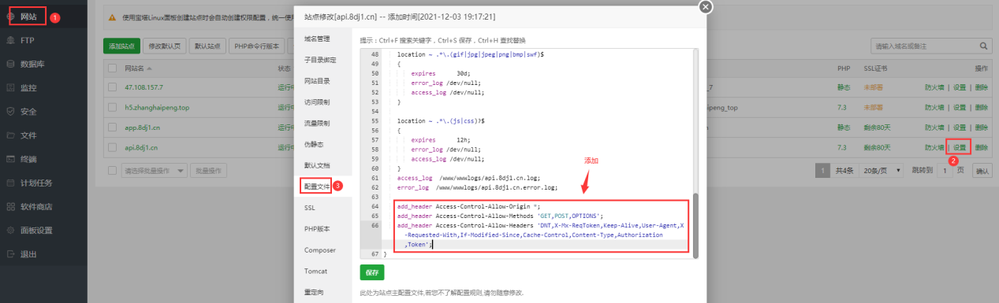
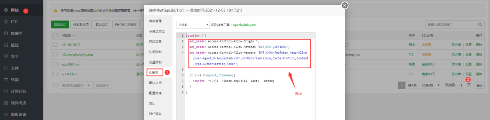

## Introduction

> **跨源资源共享**（[CORS](https://developer.mozilla.org/zh-CN/docs/Glossary/CORS)，或通俗地译为跨域资源共享）是一种基于 [HTTP](https://developer.mozilla.org/zh-CN/docs/Glossary/HTTP) 头的机制，该机制通过允许服务器标示除了它自己以外的其他[源](https://developer.mozilla.org/zh-CN/docs/Glossary/Origin)（域、协议或端口），使得浏览器允许这些源访问加载自己的资源。跨源资源共享还通过一种机制来检查服务器是否会允许要发送的真实请求，该机制通过浏览器发起一个到服务器托管的跨源资源的“预检”请求。在预检中，浏览器发送的头中标示有 HTTP 方法和真实请求中会用到的头。
>
> —— https://developer.mozilla.org/zh-CN/docs/Web/HTTP/CORS - *跨源资源共享（CORS） - HTTP | MDN*

## Tutorials

https://developer.mozilla.org/zh-CN/docs/Web/HTTP/CORS - *跨源资源共享（CORS）*

https://developer.mozilla.org/zh-CN/docs/Web/Security/Same-origin_policy - *浏览器的同源策略*

## Link

👍 https://github.com/campcc/blog/issues/15 - *可能是最好的跨域解决方案了*

### cookie 跨域

https://www.cnblogs.com/xfstu/p/15705285.html - *thinkphp解决cookie跨域*

https://blog.csdn.net/leejianjun/article/details/52880253 - *ThinkPHP中的跨域名共享session*

https://www.cnblogs.com/shitouzi/archive/2017/10/03/7623885.html - *thinkphp中session跨域问题*

https://cloud.tencent.com/developer/article/1190563 - *【thinkphp】跨域共享cookies session*


## Code

<!-- tabs:start -->

### **uni-app**

https://ask.dcloud.net.cn/article/35267 - *uni-app H5跨域问题解决方案（CORS、Cross-Origin）*


### **php ✅**

```php
header('Content-Type:text/html; charset=utf-8'); // 设置程序编码
header('Access-Control-Allow-Origin:*');
header('Access-Control-Allow-Origin:http://tongxuehui.qw1000.cn'); // 指定允许其他域名访问
header('Access-Control-Allow-Methods:GET, POST, PATCH, PUT, DELETE, OPTIONS'); // 响应类型
header('Access-Control-Allow-Headers:Authorization, Content-Type, If-Match, If-Modified-Since, If-None-Match, If-Unmodified-Since, X-Requested-With');
header('Access-Control-Allow-Credentials:true'); // 配置允许发送认证信息 比如cookies（会话机制的前提）
```

------

参考链接 👇

https://www.cnblogs.com/mmykdbc/p/8024105.html - *PHP后台代码解决跨域问题*


### **thinkphp**

**tp3.2.3**

http://www.thinkphp.cn/topic/55695.html - *TP3.2.3 怎么开启允许跨域*


------

**tp5.1**

https://www.jb51.net/article/171692.htm - *ThinkPHP 5.1 跨域配置方法*

 

- 方式一：需要有官方开发手册 `路由` 内容的基础

  > 根目录 `/route` 下新建 `api.php` 文件

  ```php
  use think\facade\Route;
  
  // 设置 api 模块跨域请求
  Route::rule(':controller/:function', 'api/:controller/:function')
      ->header('Access-Control-Allow-Origin', '*')
      ->header('Access-Control-Allow-Credentials', 'true')
      ->header('Access-Control-Allow-Headers', 'Origin, X-Requested-With, Content-Type, Accept, Connection, User-Agent, Cookie, Authorization, Token')
      ->allowCrossDomain();
  
  return [
  
  ];
  ```

  或者

  > [手册 -- 路由 -> 跨域请求](https://www.kancloud.cn/manual/thinkphp5_1/489844)

  ```php
  // 设置 api 模块跨域请求
  Route::rule('api/:version/:controller/:function','api/:version.:controller/:function')
    ->header('Access-Control-Allow-Origin','*')
    ->header('Access-Control-Allow-Credentials', 'true')
    ->header('Access-Control-Allow-Headers', 'Origin,X-Requested-With,Content-Type,Accept,Connection,User-Agent,Cookie,Token')
    ->allowCrossDomain();
  ```

  


- 方式二：直接添加 `header()` 函数


------

**参考链接 👇**

https://zhuanlan.zhihu.com/p/105386883 - *Thinkphp 允许跨域问题(实例+解决方法)*

https://www.cnblogs.com/lamplnmp/p/13141689.html - *thinkphp5 关于跨域的一些坑，附上解决办法（比较全面了）*


### **nginx**

```nginx
add_header Access-Control-Allow-Origin *;
add_header Access-Control-Allow-Methods 'GET,POST,OPTIONS';
add_header Access-Control-Allow-Headers 'DNT,X-Mx-ReqToken,Keep-Alive,User-Agent,X-Requested-With,If-Modified-Since,Cache-Control,Content-Type,Authorization,Token';
```

------

方式一：




方式二：



------

参考链接：

1. https://www.bt.cn/bbs/forum.php?mod=viewthread&tid=81405 - *nginx反向代理允许跨域应该怎么设置*


### **chrome**

1. 修改谷歌浏览器的配置；

2. 浏览器输入 URL：`chrome://flags/#schemeful-same-site` ；

3. 将 *default* 改为 *disabled* 即可。

------

参考链接 👇

https://blog.csdn.net/qq_40504777/article/details/118676848 - *http和https跨域问题*


 <!-- tabs:end -->


## Tool

> 跨域请求调试工具

### 浏览器扩展

https://mp.weixin.qq.com/s/JJgFvz5cUkFrLfqGPfHOgw - *跨域了？装个插件就够了！*

### 浏览器 DevTools-Console

```js
var xhr = new XMLHttpRequest();

xhr.open('GET', 'https://www.04007.cn/');

// xhr.open('GET', 'https://www.04007.cn/?username=xxx&password=xxx');

xhr.setRequestHeader('token','');

xhr.send(null);

xhr.onload = function(e) {

  var xhr = e.target;

  console.log(xhr.responseText);

}
```

参考：

1. 👍 http://www.04007.cn/article/799.html - *跨域调试 - 浏览器随意打开一个网页 console中输入以下代码调试（注：http或https要一致）*

2. https://www.runoob.com/ajax/ajax-tutorial.html - *AJAX 教程 | 菜鸟教程*

## FAQs

### 本地开发调试出现无法跨域的问题

- 检查电脑或浏览器是否开启了 **VPN** 。

- 使用浏览器“无痕窗口”开发调试。

