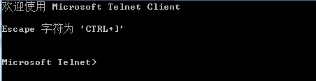
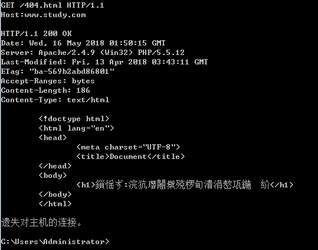

# HTTP

## 简介

> **超文本传输协议（HTTP）** 是一个用于传输超媒体文档（例如 HTML）的[应用层](https://en.wikipedia.org/wiki/Application_Layer)协议。它是为 Web 浏览器与 Web 服务器之间的通信而设计的，但也可以用于其他目的。HTTP 遵循经典的[客户端 - 服务端模型](https://en.wikipedia.org/wiki/Client–server_model)，客户端打开一个连接以发出请求，然后等待直到收到服务器端响应。HTTP 是[无状态协议](http://en.wikipedia.org/wiki/Stateless_protocol)，这意味着服务器不会在两个请求之间保留任何数据（状态）。尽管通常基于 TCP/IP 层，但它可以在任何可靠的[传输层](https://zh.wikipedia.org/wiki/传输层)上使用，也就是说，该协议不会像 UDP 那样静默的丢失消息。[RUDP](https://en.wikipedia.org/wiki/Reliable_User_Datagram_Protocol)——作为 UDP 的可靠化升级版本——是一种合适的替代选择。
>
> 超文本传输协议是互联网应用最为广泛的一种网络协议，是从 www 服务器传输超文本到客户浏览器的传输协议。
>
> <cite>—— [HTTP | MDN](https://developer.mozilla.org/zh-CN/docs/Web/HTTP)</cite>


## 教程

1. https://developer.mozilla.org/zh-CN/docs/Web/HTTP - *HTTP | MDN*

2. https://www.runoob.com/http/http-tutorial.html - *菜鸟教程*

3. https://www.kancloud.cn/kancloud/tealeaf-http/43837 - *HTTP 下午茶*

4. https://segmentfault.com/a/1190000017874063 - *一篇文章带你了解http/https*


## 版本

### 1.0

HTTP 1.0 规定浏览器与服务器只保持短暂的连接，浏览器的每次请求都需要与服务器建立一个 TCP 连接，服务器完成请求处理后立即断开 TCP 连接，服务器不跟踪每个客户也不记录过去的请求。

### 1.1

- HTTP/1.1 支持持久连接，在一个 TCP 连接上可以传送多个 HTTP 请求和响应，减少了建立和关闭连接的消耗和延迟。
  - HTTP/1.1 还允许客户端不用等待上一次请求结果返回，就可以发出下一次请求，但服务器端必须按照接收到客户端请求的先后顺序依次回送响应结果，以保证客户端能够区分出每次请求的响应内容，这样也显著地	减少了整个下载过程所需要的时间。
  - HTTP/1.1 中增加 Host 请求头字段后，WEB 浏览器可以使用主机头名来明确表示要访问服务器上的哪个 WEB 站点，这才实现了在一台 WEB 服务器上可以在同一个 IP 地址和端口号上使用不同的主机名来创建多个虚拟 WEB 站点。
  - HTTP/1.1 还提供了与身份认证、状态管理和 Cache 缓存等机制相关的请求头和响应头
- HTTP/1.1 加入了一个新的状态码 100（Continue）Status(节约带宽)。客户端事先发送一个只带头域的请求，如果服务器因为权限拒绝了请求，就回送响应码 401（Unauthorized）；如果服务器接收此请求就回送响应码 100，客户端就可以继续发送带实体的完整请求了。100 (Continue) 状态代码的使用，允许客户端在发 request 消息 body 之前先用 request header 试探一下 server，看 server 要不要接收 request body，再决定要不要发 request body。
- HTTP/1.1 中引入了 Chunked transfer-coding 来解决上面这个问题，发送方将消息分割成若干个任意大小的数据块，每个数据块在发送时都会附上块的长度，最后用一个零长度的块作为消息结束的标志。这种方法允许发送方只缓冲消息的一个片段，避免缓冲整个消息带来的过载。
- HTTP/1.1 在 1.0 的基础上加入了一些 cache 的新特性，当缓存对象的 Age 超过 Expire 时变为 stale 对象，cache 不需要直接抛弃 stale 对象，而是与源服务器进行重新激活（revalidation）。

- 1.1 提高了系统的效率，优化了性能

打开一个网页必须传送很多数据，TCP 协议提供传输控制，按顺序组织数据，和错误纠正。

1. URL 地址栏输入网址或点击超链接访问

2. 通过 URL 请求服务器端的资源，返回请求的文件、错误信息、或者其他信息

3. 客户端向服务器端发送请求（消息）

4. 建立连接 > 发送请求信息 > 发送响应信息 > 关闭连接

5. 客户端发送请求 > 服务器端收到请求，发回一个状态行，HTTP/1.1 200 OK，和响应的消息

传输速度：文档先于图形显示

一次 HTTP 操作称作为一个事务

HTTP/1.0，这是第一个在通讯中指定版本号的 HTTP 协议版本，至今仍被广泛采用，特别是在代理服务器中。

HTTP/1.1，当前版本。持久连接被默认采用，并能很好地配合代理服务器工作。还支持以管道方式同时发送多个请求，以便降低线路负载，提高传输速度。

HTTP/1.1 相较于 HTTP/1.0 协议的区别主要体现在：

1. 缓存处理
2. 带宽优化及网络连接的使用
3. 错误通知的管理
4. 消息在网络中的发送
5. 互联网地址的维护
6. 安全性及完整性

### 2.0


## 响应状态码

- 100 Continue 服务器仅接收到部分请求，但是一旦服务器并没有拒绝该请求，客户端应该继续发送其余的请求。（HTTP 1.1新）
- 101 Switching Protocols 服务器转换协议：服务器将遵从客户的请求转换到另外一种协议。（HTTP 1.1新）
- 200 OK 请求成功（其后是对GET和POST请求的应答文档。）
- 201 Created 请求被创建完成，同时新的资源被创建。
- 202 Accepted 供处理的请求已被接受，但是处理未完成。
- 203 Non-authoritative Information 文档已经正常地返回，但一些应答头可能不正确，因为使用的是文档的拷贝。（HTTP 1.1新）
- 204 No Content 没有新文档。浏览器应该继续显示原来的文档。如果用户定期地刷新页面，而 Servlet 可以确定用户文档足够新，这个状态代码是很有用的。
- 205 Reset Content 没有新文档。但浏览器应该重置它所显示的内容。用来强制浏览器清除表单输入内容。（HTTP 1.1新）
- 206 Partial Content 客户发送了一个带有Range头的GET请求，服务器完成了它。（HTTP 1.1新）
- 300 Multiple Choices 多重选择。链接列表。用户可以选择某链接到达目的地。最多允许五个地址。
- 301 Moved Permanently 所请求的页面已经转移至新的url。
- 302 Found 所请求的页面已经临时转移至新的url。
- 303 See Other 所请求的页面可在别的url下被找到。
- 304 Not Modified 未按预期修改文档。客户端有缓冲的文档并发出了一个条件性的请求（一般是提供 If-Modified-Since 头表示客户只想比指定日期更新的文档）。服务器告诉客户，原来	缓冲的文档还可以继续使用。
- 305 Use Proxy 客户请求的文档应该通过Location头所指明的代理服务器提取。（HTTP 1.1新）
- 306 Unused 此代码被用于前一版本。目前已不再使用，但是代码依然被保留。
- 307 Temporary Redirect 被请求的页面已经临时移至新的url。（HTTP 1.1新）
- 400 Bad Request 服务器未能理解请求。
- 401 Unauthorized 被请求的页面需要用户名和密码。
- 402 Payment Required 此代码尚无法使用。
- 403 Forbidden 对被请求页面的访问被禁止。
- 404 Not Found 服务器无法找到被请求的页面。
- 405 Method Not Allowed 请求中指定的方法不被允许。（HTTP 1.1新）
- 406 Not Acceptable 服务器生成的响应无法被客户端所接受。（HTTP 1.1新）
- 407 Proxy Authentication Required用户必须首先使用代理服务器进行验证，这样请求才会被处理。（HTTP 1.1新）
- 408 Request Timeout 请求超出了服务器的等待时间。（HTTP 1.1新）
- 409 Conflict 由于冲突，请求无法被完成。（HTTP 1.1新）
- 410 Gone 被请求的页面不可用。（HTTP 1.1新）
- 411 Length Required "Content-Length" 未被定义。如果无此内容，服务器不会接受请求。（HTTP 1.1新）
- 412 Precondition Failed 请求中的前提条件被服务器评估为失败。（HTTP 1.1新）
- 413 Request Entity Too Large 由于所请求的实体的太大，服务器不会接受请求。（HTTP 1.1新）
- 414 Request-url Too Long 由于url太长，服务器不会接受请求。当post请求被转换为带有很长的查询信息的 get 请求时，就会发生这种情况。（HTTP 1.1新）
- 415 Unsupported Media Type 由于媒介类型不被支持，服务器不会接受请求。
- 416 Requested Range Not Satisfiable 服务器不能满足客户在请求中指定的Range头。（HTTP 1.1新）
- 417 Expectation Failed 执行失败。
- 423 锁定的错误。
- 500 Internal Server Error 请求未完成。服务器遇到不可预知的情况
- 501 Not Implemented 请求未完成。服务器不支持所请求的功能。
- 502 Bad Gateway 请求未完成。服务器从上游服务器收到一个无效的响应。
- 503 Service Unavailable 请求未完成。服务器临时过载或当机。
- 504 Gateway Timeout 网关超时。（HTTP 1.1新）
- 505 HTTP Version Not Supported 服务器不支持请求中指明的HTTP协议版本。（HTTP 1.1新）

1. https://blog.csdn.net/elifefly/article/details/3964766/ - *HTTP 1.1 与 HTTP 1.0 的比较_html 1.1 和 1.0-CSDN 博客*
2. https://www.cnblogs.com/gofighting/p/5421890.html - *HTTP1.0 和 HTTP1.1 的区别 - 雪之灵 - 博客园*
3. https://baike.baidu.com/item/TCP/IP协议 - *TCP/IP 协议_百度百科*
4. https://www.cnblogs.com/yongshaoye/p/7423881.html - *JS 中的跨域问题 - 泳少爷 - 博客园*
5. https://www.cnblogs.com/2050/p/3191744.html - *js 中几种实用的跨域方法原理详解 - 无双 - 博客园*
6. https://www.sohu.com/a/110071655_464071 - *缓存系列文章 --4. 缓存的粒度控制*
7. https://blog.csdn.net/dinglang_2009/article/details/53420215 - *如何提高缓存命中率 - CSDN 博客*
8. https://www.zhihu.com/question/24863332 - *什么是面向切面编程 AOP？ - 知乎*
9. https://baike.baidu.com/item/AOP/1332219?fromtitle=面向切面编程&fromid=6016335 - *AOP（面向切面编程）_百度百科*
10. https://www.cnblogs.com/cxz/p/6538516.html - *PHP 中的 http 协议 - 当归远志 - 博客园*
11. https://baike.baidu.com/item/http/243074 - *HTTP_百度百科*


## HTTPS

1. 👍 https://www.cnblogs.com/qlongbg/p/12074016.html - _关于http与https_


## SSL/TLS

> （Secure Sockets Layer 安全套接字协议），及其继任者传输层安全（Transport Layer Security，TLS）是为网络通信提供安全及数据完整性的一种安全协议。TLS与SSL在传输层与应用层之间对网络连接进行加密。

链接

1. http://www.ruanyifeng.com/blog/2014/02/ssl_tls.html - *SSL/TLS协议运行机制的概述*

2. https://www.chastephp.com/delicious.html - *证书申请及配置*

证书品牌

1. Let's Encrypt

    - 官网 https://letsencrypt.org （免费证书）

2. DigiCert

    - 官网 https://www.digicert.com/ - *SSL Digital Certificate Authority - Encryption & Authentication*

    - 事件 https://zhuanlan.zhihu.com/p/146104587 - *通知！Symantec品牌证书已正式更名为Digicert*

SSL 配置

- https://ssl-config.mozilla.org - *Mozilla SSL Configuration Generator*

证书生成

  - https://toutyrater.github.io/advanced/tls.html#证书生成 - *TLS · V2Ray 配置指南|V2Ray 白话文教程*


## MIME

> 媒体类型（通常称为 Multipurpose Internet Mail Extensions 或 MIME 类型 ）是一种标准，用来表示文档、文件或字节流的性质和格式。它在IETF RFC 6838中进行了定义和标准化。<https://developer.mozilla.org/zh-CN/docs/Web/HTTP/Basics_of_HTTP/MIME_types>

请参阅 [IANA MIME 类型](http://www.iana.org/assignments/media-types/)，获得标准 MIME 类型的完整列表。

https://www.solvusoft.com/en/mime-multipurpose-internet-mail-extensions/ - *Multipurpose Internet Mail Extensions (MIME) Encyclopedia*


## Headers

https://developer.mozilla.org/zh-CN/docs/Web/HTTP/Headers - *HTTP Headers - HTTP | MDN*

- Content-type（响应类型）

  - application/json; charset=utf-8
  - image/png; charset=utf-8

  - MIME - *Content-type 的值即为 mime 的值*
    - image/bmp
    - image/gif
    - image/jpeg
    - image/png
    - image/x-icon
    - text/html

- Content-length

- 浏览器缓存

  https://segmentfault.com/a/1190000009970329 - *最常被遗忘的Web性能优化：浏览器缓存*

- last-modified

- etag

- expires

- cache-control

- Request

- Response

- 字符集和字符编码相关的消息头是 `Accept-Charset / Content-Type`

  - `Accept-Charset`：浏览器申明自己接收的字符集，这就是本文前面介绍的各种字符集和字符编码，如gb2312，utf-8（通常我们说Charset包括了相应的字符编码方案）；

  - `Accept-Encoding`：浏览器申明自己接收的编码方法，通常指定压缩方法，是否支持压缩，支持什么压缩方法（gzip，deflate），（注意：这不是只字符编码）；

  - `Accept-Language`：浏览器申明自己接收的语言。语言跟字符集的区别：中文是语言，中文有多种字符集，比如big5，gb2312，gbk等等；

  - `Content-Type`：WEB服务器告诉浏览器自己响应的对象的类型和字符集。例如：Content-Type: text/html; charset='gb2312'

  - `Content-Encoding`：WEB服务器表明自己使用了什么压缩方法（gzip，deflate）压缩响应中的对象。例如：Content-Encoding：gzip

  - `Content-Language`：WEB服务器告诉浏览器自己响应的对象的语言。

HTTP 协议采用请求 / 响应模型

客户端请求头：

- 请求方法：get/post
- URL
- 协议版本：HTTP/1.0 HTTP/1.1
- 请求修饰符
- 客户信息
- 内容（类似于MIME的消息结构）

服务器端响应头：

- 协议的版本：HTTP/1.0 HTTP/1.1
- 成功或错误的状态码：200 OK
- 服务器信息
- 实体元信息
- 实体内容

HTTP 头域：

- 通用头（包含请求和响应消息都支持的头域）
  - Cache-Control
  - Connection
  - Date
  - Pragma
- 请求头
  - 第一行：
    - Method  Request-URI  HTTP-Version
    - Host
    - Referer
    - Range
    - User-Agent
- 响应头
  - 第一行：HTTP-Version  Status-Code Reason-Phrase
  - 1xx:信息响应类，表示接收到请求并且继续处理
  - 2xx:处理成功响应类，表示动作被成功接收、理解和接受
  - 3xx:重定向响应类，为了完成指定的动作，必须接受进一步处理
  - 4xx:客户端错误，客户请求包含语法错误或者是不能正确执行
  - 5xx:服务端错误，服务器不能正确执行一个正确的请求

  - Location	用于重定向接收者到一个新URI地址
  - Server

- 实体头
  - Content-Type
  - Content-Range
  - Last-modified

中介：
  - 代理（proxy）
  - 网关（gateway）
  - 通道（tunnel）

报文格式
  - 请求报文格式：
    - 请求行 - 通用信息头 - 请求头 - 实体头 - 报文主体

  - 应答/响应报文格式：
    - 状态行 - 通用信息头 - 响应头 - 实体头 - 报文主体


### User-Agent

1. https://www.useragents.me/ - *Useragents — The Latest and Most Common (Updated Weekly)*

2. http://useragent.kuzhazha.com/ - *UserAgent大全_常用的UserAgent库下载_UserAgent在线工具_流行的UserAgent手机库UA_UA标识网*


### HTTP 身份验证

1. https://developer.mozilla.org/zh-CN/docs/Web/HTTP/Authentication -  *HTTP 身份验证 - HTTP | MDN*

2. https://blog.csdn.net/ai2000ai/article/details/85775484 - *HTTP basic auth*


## 用法

### 使用 Telnet 模拟 HTTP 请求

> 在终端中发送一个 HTTP 1.0/HTTP 1.1 请求后查看返回的数据值。

操作步骤：

1. 打开运行 WAMP；

2. 打开 Windows 系统的 telnet 客户端（控制面板 -> 程序和功能 -> 打开和关闭windows功能 -> 找到Telnet服务器/客户端并勾选）

3. 通过 cmd 终端打开 telnet
    - （1）键盘输入 `telnet 127.0.0.1 80`（本虚拟机 IP：127.0.0.1，端口号：80） -> 回车
        
    - （2）键盘输入 <kbd>ctrl</kbd> + <kbd>]</kbd>
        
    - （3）键盘输入 回车键
    - （4）输入请求的文件路径 -> 回车 （`不要有错别字，否则执行失败，需重新开始`）
        ```
        GET /message/add.php HTTP/1.1
        ```
        注释：
        - `GET` 为请求方式
        - `/message/add.php` 为虚拟主机根目录下 message 目录中的 add.php 文件
        - `HTTP/1.1` 为 HTTP 的 1.1 协议
    - （5）输入主机名 -> 回车两下提交请求
        ```
        Host:www.study.com
        ```
    - （6）提交请求后出现如下页面表示请求成功
        

参考文档：

1. https://blog.csdn.net/rain722/article/details/53047116 - *Telnet 模拟 HTTP 请求_telnet 模拟请求 - CSDN 博客*
2. https://blog.csdn.net/hrbeuwhw/article/details/7531775 - *1. 命令行窗口中用 telnet 测试 HTTP 协议 - CSDN 博客*


## 常见问题

### 跨域

有关详细信息，请参阅“[cross-domain](essential/cross-domain.md)”。


### HTTP 与 HTTPS 的区别

1. https://www.runoob.com/w3cnote/http-vs-https.html - *HTTP 与 HTTPS 的区别 | 菜鸟教程*
