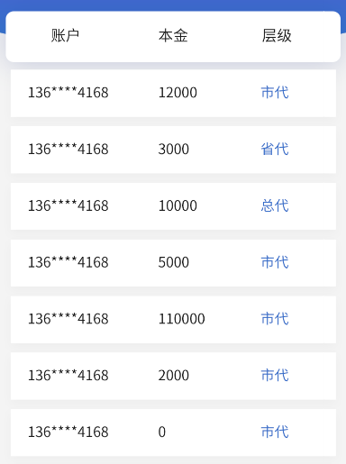
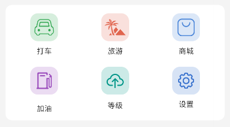
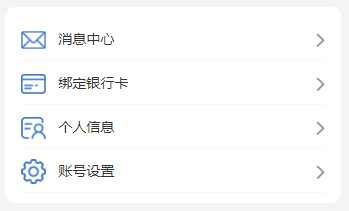
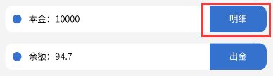
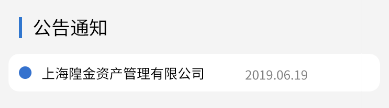

# CSS 命名规则

## 开发思路

> 参考大平台的 UI 设计

1. https://ant.design/index-cn - *Ant Design* [国内镜像](https://ant-design.antgroup.com/index-cn/) `React`

2. https://xiaomi.github.io/hiui/ - *HiUI* [GitHub](https://github.com/XiaoMi/hiui) `React`

    

3. https://vant-contrib.gitee.io/vant/#/zh-CN - *Vant 4 - 轻量、可定制的移动端组件库* `Vue 3`

4. https://element.eleme.io/#/zh-CN - *Element* `Vue 2`

    

5. https://www.uviewui.com/ - *uView 2.0 - 全面兼容 nvue 的 uni-app 生态框架 - uni-app UI 框架* `uni-app`

6. https://dev.dcloud.net.cn/mui/ - *MUI* [GitHub](https://github.com/dcloudio/mui)

7. ~~http://www.hcoder.net/hui - *Hui*~~

### 设计

> 视觉框架

- [设计 - HiUI Design](https://xiaomi.github.io/hiui/design/introduction/)

  - [字体](https://xiaomi.github.io/hiui/design/font/)

    - 字号字阶：主字体大小为 14px 最佳

    - 字体行高：若字体为 14，行高为 22，相差为 8；若字体为 12，行高 20；若字体为 16，行高为 24

- [设计 - Ant Design](https://ant-design.antgroup.com/docs/spec/introduce-cn)

  - [字体](https://ant-design.antgroup.com/docs/spec/font-cn)

## 开始使用

统一浏览器默认样式

- http://amazeui.shopxo.net/css/normalize/ - *CSS - Normalize | Amaze UI*

    1. https://meyerweb.com/eric/tools/css/reset/ - *rest.css*

        /blue)

    2. https://github.com/necolas/normalize.css - *normalize.css*

        


### Bootstrap

https://getbootstrap.com/ - *Bootstrap · The most popular HTML, CSS, and JS library in the world.*

https://www.bootcss.com/ - *Bootstrap中文网*

- https://v5.bootcss.com/ - *Bootstrap v5 中文文档 · Bootstrap 是全球最受欢迎的 HTML、CSS 和 JS 前端工具库。 | Bootstrap 中文网*

- https://v4.bootcss.com/ - *Bootstrap v4 中文文档 · Bootstrap 是全球最受欢迎的 HTML、CSS 和 JS 框架，用于开发响应式布局、移动设备优先的 WEB 项目。 | Bootstrap 中文网*

- https://v3.bootcss.com/ - *Bootstrap v3 中文文档 · Bootstrap 是最受欢迎的 HTML、CSS 和 JavaScript 框架，用于开发响应式布局、移动设备优先的 WEB 项目。 | Bootstrap 中文网*


### Amaze UI

https://amazeui.shopxo.net/ - *Amaze UI | 中国首个开源 HTML5 跨屏前端框架*

- https://amazeui.shopxo.net/css/ - *CSS | Amaze UI*

- https://amazeui.shopxo.net/javascript/ - *JS 插件 | Amaze UI*

- https://amazeui.shopxo.net/widgets/ - *Web 组件 | Amaze UI*


## 开发前看

### HTML / CSS 规范

http://amazeui.shopxo.net/getting-started/html-css/ - *开始使用 - Html-css | Amaze UI*

模块状态：`{命名空间}-{模块名}-{状态描述}`

常用状态有：hover, current, selected, disabled, focus, blur, checked, success, error 等

子模块：`{命名空间}-{模块名}-{子模块名}`

常用模块名有：bd(body)，cnt(content)，hd(header)，text(txt)，img(images/pic)，title，item，cell，icon 等， 词义表达组件要实现的功能。

模块嵌套：

```html
<ul class="am-nav">
    <li class="am-nav-item">
        <a href="#">nav Triggle Link</a>
        <ul class="am-subnav">
            <li class="am-subnav-item">
                <a href="#">subNav Triggle Link</a>
                    <ul class="am-list">
```

需要特别注意的 Class

Amaze UI 中有两个表示状态的 class：

`.am-active` - 激活

`.am-disabled` - 禁用

不要单独使用、直接在里面编写样式！！！

```css
/* 可以嵌套用 */
.am-nav .am-active {
 ...
}

/* 可以堆叠用 */
.am-btn.am-active {
 ...
}

/* 绝不要单独用！！！ */
.am-active {
 color: red;
}
```


### Class 命名说明

http://amazeui.shopxo.net/css/#class-ming-ming-shuo-ming - *CSS | Amaze UI*

```css
.am-post      {} /* Block */

.am-post-title   {} /* Element */

.am-post-meta    {} /* Element */

.am-post-sticky   {} /* Generic Modifier - status */

.am-post-active    {} /* Generic Modifier - status */

.am-post-title-highlight {}  /* Element Modifier */
```


### BEM 命名规范

> **获取来源**：https://element-plus.gitee.io/zh-CN/guide/theming.html - *主题 | Element Plus*

https://juejin.cn/post/6844903672162304013 - *CSS — BEM 命名规范 - 掘金*


## Layout 布局

### Container 布局容器

> From [Bootstrap v5](https://v5.bootcss.com/docs/layout/containers/)

- `.container`
  - `.row`
    - `.col` `.col-sm`

---

- `.container` *外层容器 固定宽度*
  - `.item`

---

- `.container`
  - `.row`
    - `.cell`

---

- `.container-fluid` 全屏宽度 - _via Bootstrap_
- `.container-sm`
- `.container-md`
- `.container-lg`
- `.container-xl`
    - `.header` 顶栏容器
    - `.aside` 侧边栏容器
    - `.main` 主要区域容器
    - `.footer` 底栏容器
    - `.item `子元素
    - `.topmenu` 顶部菜单
    - `.sidemenu` 侧边菜单

---

- `.title` 标题
- `.value` 值
- `.content` 内容
- `.header`
- `.body`
    - `.content`
- `.footer`
- `.fl` 左浮动
- `.fr` 右浮动
- `.center` 水平居中
- `.cf` 或 `.clearfix`

```css
am-cf:after,.am-cf:before {
  content: " ";
  display: table;
}
```

`.prev` 前一个

`.next` 下一个

```css
.am-cf:after {
  clear: both
}
```

`.active`

`.nav` 导航栏

`.item` 子元素

`.row` 行 - _via Bootstrap_

`.col` 列 - _via Bootstrap_

`.cell`

`.text` 文本内容

`.card` - _via Element_

`.cell` - _via Vant_

`.box` 盒子

`.wrap` 表示块内元素会自动换行

`.wrap` 有独自占一行的意思 - *via uViewUI radio 组件*

> From Bootstrap

- `.wrapper`
  - `.content-main`
  - `.content-secondary`

`.footer-line` - *via HUI*

`.list`

`.thumb` / `.thumbnail` 缩略图

`.vertical` 垂直

`.horizontal` 水平

`.radial` 径向

`.group` > `.item` - *via uViewUI*

`.top` `.right` `.center` `.bottom` `.left`


### Flex 布局

教程：

1. http://www.ruanyifeng.com/blog/2015/07/flex-grammar.html - _Flex 布局教程：语法篇_

2. https://www.ruanyifeng.com/blog/2015/07/flex-examples.html - _Flex 布局教程：实例篇_

<details>

`justify-content` 属性定义了项目在主轴上的对齐方式。

`align-items` 属性定义项目在交叉轴上如何对齐。

`align-content` 属性定义了多根轴线的对齐方式。如果项目只有一根轴线，该属性不起作用。

`flex-wrap` 一条轴线排不下，换行

`flex-flow` flex-direction 属性和 flex-wrap 属性的简写形式，默认值为 row nowrap

`justify-content` 定义了项目在主轴(横轴)上的对齐方式

```css
-flex-container {
    display: flex;
    display: -webkit-flex;
    align-items: center;
    -webkit-align-items: center;
    justify-content: space-between;
    -webkit-justify-content: space-between;
}

-flex-item {
    flex: 1;
    -webkit-flex: 1;
    -webkit-box-flex: 1;
}
```

> From HUI

- -flex

> From [Bootstrap v5](https://v5.bootcss.com/docs/utilities/flex/)

- container
    - row
    - row-cols-1
    - row-cols-2
    - row-cols-3
    - row-cols-4
    - row-cols-5
    - row-cols-6
    - align-items-start
    - align-items-center
    - align-items-end
    - justify-content-start
    - justify-content-center
    - justify-content-end
    - justify-content-around
    - justify-content-between
    - no-gutters
        - col
        - col-auto
        - col-1
        - col-2
        - col-3
        - col-4
        - col-5
        - col-6
        - col-7
        - col-8
        - col-9
        - col-10
        - col-11
        - col-12
    - align-self-start
    - align-self-center
    - align-self-end

```css
container {
    width: 100%;
    padding-right: 15px;
    padding-left: 15px;
    margin-right: auto;
    margin-left: auto;
}
row {
    display: -ms-flexbox;
    display: flex;
    -ms-flex-wrap: wrap;
    flex-wrap: wrap;
    margin-right: -15px;
    margin-left: -15px;
}
row-cols-1>* {
    -ms-flex: 0 0 100%;
    flex: 0 0 100%;
    max-width: 100%;
}
row-cols-2>* {
    -ms-flex: 0 0 50%;
    flex: 0 0 50%;
    max-width: 50%;
}
row-cols-3>* {
    -ms-flex: 0 0 33.333333%;
    flex: 0 0 33.333333%;
    max-width: 33.333333%;
}
row-cols-4>* {
    -ms-flex: 0 0 25%;
    flex: 0 0 25%;
    max-width: 25%;
}
row-cols-5>* {
    -ms-flex: 0 0 20%;
    flex: 0 0 20%;
    max-width: 20%
}
row-cols-6>* {
    -ms-flex: 0 0 16.666667%;
    flex: 0 0 16.666667%;
    max-width: 16.666667%
}
.align-items-start {
    -ms-flex-align: start!important;
    align-items: flex-start!important;
}
.align-items-center {
    -ms-flex-align: center!important;
    align-items: center!important;
}
.align-items-end {
    -ms-flex-align: end!important;
    align-items: flex-end!important;
}
.justify-content-start {
    -ms-flex-pack: start!important;
    justify-content: flex-start!important;
}
.justify-content-center {
    -ms-flex-pack: center!important;
    justify-content: center!important;
}
.justify-content-end {
    -ms-flex-pack: end!important;
    justify-content: flex-end!important;
}
.justify-content-around {
    -ms-flex-pack: distribute!important;
    justify-content: space-around!important;
}
.justify-content-between {
    -ms-flex-pack: justify!important;
    justify-content: space-between!important;
}
.no-gutters {
    margin-right: 0;
    margin-left: 0;
}
```

```css
.col {
    position: relative;
    width: 100%;
    padding-right: 15px;
    padding-left: 15px;
    -ms-flex-preferred-size: 0;
    flex-basis: 0;
    -ms-flex-positive: 1;
    flex-grow: 1;
    min-width: 0;
    max-width: 100%;
}
col-auto {
    -ms-flex: 0 0 auto;
    flex: 0 0 auto;
    width: auto;
    max-width: 100%
}
.col-1 {
    -ms-flex: 0 0 8.333333%;
    flex: 0 0 8.333333%;
    max-width: 8.333333%
}
.col-2 {
    -ms-flex: 0 0 16.666667%;
    flex: 0 0 16.666667%;
    max-width: 16.666667%
}
.col-3 {
    -ms-flex: 0 0 25%;
    flex: 0 0 25%;
    max-width: 25%
}
.col-4 {
    -ms-flex: 0 0 33.333333%;
    flex: 0 0 33.333333%;
    max-width: 33.333333%
}
.col-5 {
    -ms-flex: 0 0 41.666667%;
    flex: 0 0 41.666667%;
    max-width: 41.666667%
}
.col-6 {
    -ms-flex: 0 0 50%;
    flex: 0 0 50%;
    max-width: 50%
}
.col-7 {
    -ms-flex: 0 0 58.333333%;
    flex: 0 0 58.333333%;
    max-width: 58.333333%
}
.col-8 {
    -ms-flex: 0 0 66.666667%;
    flex: 0 0 66.666667%;
    max-width: 66.666667%
}
.col-9 {
    -ms-flex: 0 0 75%;
    flex: 0 0 75%;
    max-width: 75%
}
.col-10 {
    -ms-flex: 0 0 83.333333%;
    flex: 0 0 83.333333%;
    max-width: 83.333333%
}
.col-11 {
    -ms-flex: 0 0 91.666667%;
    flex: 0 0 91.666667%;
    max-width: 91.666667%
}
.col-12 {
    -ms-flex: 0 0 100%;
    flex: 0 0 100%;
    max-width: 100%
}
```

---

> 排序

order-first

order-last

order-1

order-2

order-3

order-4

order-5

order-6

order-7

order-8

order-9

order-10

order-11

order-12

```css
.order-first {
    -ms-flex-order: -1;
    order: -1
}
.order-last {
    -ms-flex-order: 13;
    order: 13
}
.order-0 {
    -ms-flex-order: 0;
    order: 0
}
.order-1 {
    -ms-flex-order: 1;
    order: 1
}
.order-2 {
    -ms-flex-order: 2;
    order: 2
}
.order-3 {
    -ms-flex-order: 3;
    order: 3
}
.order-4 {
    -ms-flex-order: 4;
    order: 4
}
.order-5 {
    -ms-flex-order: 5;
    order: 5
}
.order-6 {
    -ms-flex-order: 6;
    order: 6
}
.order-7 {
    -ms-flex-order: 7;
    order: 7
}
.order-8 {
    -ms-flex-order: 8;
    order: 8
}
.order-9 {
    -ms-flex-order: 9;
    order: 9
}
.order-10 {
    -ms-flex-order: 10;
    order: 10
}
.order-11 {
    -ms-flex-order: 11;
    order: 11
}
.order-12 {
    -ms-flex-order: 12;
    order: 12
}
```

```css
.align-self-start {
    -ms-flex-item-align: start!important;
    align-self: flex-start!important;
}
.align-self-center {
    -ms-flex-item-align: center!important;
    align-self: center!important;
}
.align-self-end {
    -ms-flex-item-align: end!important;
    align-self: flex-end!important;
}
```

</details>

### Grid 栅格布局

> From [Amaze UI](http://amazeui.shopxo.net/css/grid/)

```html
<div class="am-g">
  <div class="am-u-sm-4">4</div>
  <div class="am-u-sm-8">8</div>
</div>
```

> From [Bootstrap v5](https://v5.bootcss.com/docs/layout/grid/), [Bootstrap v3](https://v3.bootcss.com/css/#grid)

- -container
  - -row
  - -col
    - -col-xs-
    - -col-sm-
    - -col-md-
    - -col-lg-
    - **列偏移**
    - -col-xs-offset-*
    - -col-sm-offset-*
    - -col-md-offset-*
    - -col-lg-offset-*

```html
<div class="container text-center">
  <div class="row">
    <div class="col">
      Column
    </div>
    <div class="col">
      Column
    </div>
    <div class="col">
      Column
    </div>
  </div>
</div>
```

### ~~Position 布局~~


### ~~Table 布局~~


## Helpers 工具

### Color 颜色

- 字体色

  <span style="background-color: #5eb95e">#5eb95e</span>

- 边框色

  <span style="background-color: #f0ececa8">#f0ececa8</span>

- bg-背景色

  <span style="background-color: #eaeaea">\#eaeaea</span>

  <span style="background-color: #a7a7a7">\#a7a7a7</span>

  <span style="background-color: #666666">\#666666</span>

  <span style="background-color: #999999">\#999999</span>

  <span style="background-color: #f72e36">\#f72e36</span>

> From [uViewUI](https://www.uviewui.com/components/color.html)

- 颜色类型
  - -primary 蓝色 <span style="color: #3c9cff">#3c9cff</span>
  - -success 绿色 <span style="color: #5ac725">#5ac725</span>
  - -error 红色 <span style="color: #f56c6c">#f56c6c</span>
  - -warning 黄色 <span style="color: #f9ae3d">#f9ae3d</span>
  - -info 灰色 <span style="color: #909399">#909399</span>

- 颜色状态
  - -primary 常规颜色 <span style="color: #3c9cff">#3c9cff</span>
  - -primary-dark 加深颜色 <span style="color: #398ade">#398ade</span>
  - -primary-disabled 稍浅颜色 <span style="color: #9acafc">#9acafc</span>
  - -primary-light 变浅颜色 <span style="color: #ecf5ff">#ecf5ff</span>


### Border 边框

> From Bootstrap https://v5.bootcss.com/docs/utilities/borders/

- **Additive/ 加法**
  - `.border{border: 1 solid #dee2e6 !important;}`
  - `.border-top{border-top: 1px solid #dee2e6 !important;}`
  - `.border-right{border-right: 1px solid #dee2e6 !important;}`
  - `.border-bottom{border-bottom: 1px solid #dee2e6 !important;}`
  - `.border-left{border-left: 1px solid #dee2e6 !important;}`

- **Subtractive/ 减法**
  - `.border-0{border: 0 !important;}`
  - `.border-top-0{border-top: 0 !important;}`
  - `.border-right-0{border-right: 0 !important;}`
  - `.border-bottom-0{border-bottom: 0 !important;}`
  - `.border-left-0{border-left: 0 !important;}`

- **Border-color**
  - `.border-primary{border-color: rgba(13,110,253,1)) !important;}`
  - -border-secondary
  - -border-success
  - -border-danger
  - -border-warning
  - -border-info
  - -border-light
  - -border-dark
  - -border-white

- **Border-radius**
  - `.rounded{border-radius: 0.375rem !important;}`
  - `.rounded-top{border-top-left-radius: 0.375rem !important;border-top-right-radius: 0.375rem !important;}`
  - -rounded-right
  - -rounded-bottom
  - -rounded-left
  - `.rounded-circle{border-radius: 50% !important;}`
  - `.rounded-pill{border-radius: 50rem !important;}`
  - `.rounded-0{border-radius: 0 !important;}`
  - `.rounded-1{border-radius: 0.25rem !important;}`
  - `.rounded-2{border-radius: 0.375rem !important;}`
  - `.rounded-3{border-radius: 0.5rem !important;}`
  - `.rounded-4{border-radius: 1rem !important;}`
  - `.rounded-5{border-radius: 2rem !important;}`

- **Sizes**
  - -rounded-sm
  - -rounded-lg

> From [Amaze UI](http://amazeui.shopxo.net/css/)

`-border-vertical` 垂直方向边框

```css
.border {
    border: 1px solid #dee2e6!important;
}
.border-top {
    border-top: 1px solid #dee2e6!important;
}
.border-right {
    border-right: 1px solid #dee2e6!important;
}
.border-bottom {
    border-bottom: 1px solid #dee2e6!important;
}
.border-left {
    border-left: 1px solid #dee2e6!important;
}
.border-0 {
    border: 0!important;
}
.border-top-0 {
    border-top: 0!important;
}
.border-right-0 {
    border-right: 0!important;
}
.border-bottom-0 {
    border-bottom: 0!important;
}
.border-left-0 {
    border-left: 0!important;
}
.border-primary {
    border-color: #007bff!important;
}
.border-secondary {
    border-color: #6c757d!important;
}
.border-success {
    border-color: #28a745!important;
}
.border-danger {
    border-color: #dc3545!important;
}
.border-warning {
    border-color: #ffc107!important;
}
.border-info {
    border-color: #17a2b8!important;
}
.border-light {
    border-color: #f8f9fa!important;
}
.border-dark {
    border-color: #343a40!important;
}
.border-white {
    border-color: #fff!important;
}
.am-square {
    border-radius: 0
}
.am-radius {
    border-radius: 2px
}
.am-round {
    border-radius: 1000px
}
.am-circle {
    border-radius: 50%
}
```


### Text 文本

> From Bootstrap https://v5.bootcss.com/docs/utilities/text/

- 对齐方式
  - `.text-left{text-align: left !important;}`
  - `.text-center{text-align: center !important;}`
  - `.text-right{text-align: right !important;}`
  - -text-justify
  - -text-nowrap

- 文字颜色
  - -text-muted <span style="color:#777">#777</span>
  - -text-white <span style="background-color: #000;color:#fff">#fff</span>
  - -text-primary <span style="color:#337ab7">#337ab7</span>
  - -text-secondary
  - -text-success <span style="color:#3c763d">#3c763d</span>
  - -text-warning <span style="color:#8a6d3b">#8a6d3b</span>
  - -text-danger <span style="color:#31708f">#31708f</span>
  - -text-info <span style="color:#31708f">#31708f</span>
  - -text-reset inherit
  - `.text-black{color: rgba(0,0,0,1) !important;}`
  - `.text-white{color: rgba(255,255,255,1) !important;}`
  - `.text-black-50{color: rgba(0,0,0,.5) !important;}`
  - `.text-white-50{color: rgba(255,255,255,.5) !important;}`

- 改变大小写
  - `.text-lowercase{text-transform: lowercase !important;}`
  - `.text-uppercase{text-transform: uppercase !important;}`
  - `.text-capitalize{text-transform: capitalize !important;}`

- 单词中断

  ```css
  -text-break {
      word-break: break-word!important;
      word-wrap: break-word!important;
  }
  ```

- 字体粗细和斜体

  ```css
  -font-weight-bold {
      font-weight: 700!important;
  }
  -font-weight-bolder {
      font-weight: bolder!important;
  }
  -font-weight-normal {
      font-weight: 400!important;
  }
  -font-weight-light {
      font-weight: 300!important;
  }
  -font-weight-lighter {
      font-weight: lighter!important;
  }
  -font-italic {
      font-style: italic!important;
  }
  ```

- 重置颜色

  - `.text-reset {color: inherit !important;}`

- 文本装饰

  - 下划线：`.text-decoration-underline {text-decoration: underline !important;}`
  - 删除线：`.text-decoration-line-through {text-decoration: line-through !important;}`
  - 移除文本装饰：`.text-decoration-none {text-decoration: none !important;}`

> From [Amaze UI](http://amazeui.shopxo.net/css/utility/#wen-ben-gong-ju)

- 文字大小
  - -text-xs 12px 1rem
  - -text-sm 14px 1.25rem
  - -text-default 16px 1.5rem
  - -text-lg 18px 1.75rem
  - -text-xl 24px 2rem
  - -text-xxl 32px 2.5rem
  - -text-xxxl 42px

- 文字换行及截断 - *via Amazeui*

  ```css
  -text-truncate {
      overflow: hidden;
      text-overflow: ellipsis;
      white-space: nowrap;
  }
  ```

- 禁止文字换行
  - -text-nowrap

    ```css
    .text-nowrap {
        white-space: nowrap!important;
    }
    ```


### Typography 文字

> From [MUI](https://www.dcloud.io/hellomui/examples/typography.html)

```css
h1 {
    font-size: 36px;
    line-height: 1;
    margin-top: 5px;
    margin-bottom: 5px;
}
h2 {
    font-size: 30px;
    line-height: 1;
    margin-top: 5px;
    margin-bottom: 5px;
}
h3 {
    font-size: 24px;
    line-height: 1;
    margin-top: 5px;
    margin-bottom: 5px;
}
h4 {
    font-size: 18px;
    line-height: 1;
    margin-top: 5px;
    margin-bottom: 5px;
}
h5 {
    font-size: 14px;
    font-weight: 400;
    line-height: 1;
    margin-top: 5px;
    margin-bottom: 5px;
}
h6 {
    font-size: 12px;
    font-weight: 400;
    line-height: 1;
    margin-top: 5px;
    margin-bottom: 5px;
}
```


### Background 背景

- 水平或垂直平铺(设置背景图像是否及如何重复)

  - `background-repeat: no-repeat;`

- 设置背景图像的起始位置

  - `background-position: center;`

  - `background-size: cover;`

- 背景图像是否固定或者随着页面的其余部分滚动

  - `background-attachment: fixed;`

- 简写属性（[可参考菜鸟教程](https://www.runoob.com/css/css-background.html)）（[可参考MDN Web Docs](https://developer.mozilla.org/zh-CN/docs/Web/CSS/background)）

  - `body {background:#ffffff url('img_tree.png') no-repeat right top;}`


#### 背景色

> From Bootstrap https://v5.bootcss.com/docs/utilities/background/

- -bg-primary  
    <span style="color: #fff;background-color: #337ab7;">color: #fff;background-color: #337ab7;</span>
- -bg-success  
    <span style="background-color: #dff0d8;">background-color: #dff0d8;</span>
- -bg-info  
    <span style="background-color: #d9edf7;">background-color: #d9edf7;</span>
- -bg-warning  
    <span style="background-color: #fcf8e3;">background-color: #fcf8e3;</span>
- -bg-danger  
    <span style="background-color: #f2dede;">background-color: #f2dede;</span>
- -bg-light  
    <span style="background-color: #f8f9fa!important;">background-color: #f8f9fa!important;</span>
- -bg-white  
    <span style="background-color: #fff!important;">background-color: #fff!important;</span>


#### 渐变背景色

- -bg-gradient-primary
- -bg-gradient-secondary
- -bg-gradient-success
- -bg-gradient-danger
- -bg-gradient-warning
- -bg-gradient-info
- -bg-gradient-light
- -bg-gradient-dark


#### 背景大小

- -bg-xxs
- -bg-xs
- -bg-sm
- -bg-default
- -bg-lg
- -bg-xl
- -bg-xxl
- -bg-xxxl


#### 背景图

- 页面背景容器（整个网页面的容器，防止页面滚动、不同设备打开出现的补白情况）

  ```css
  -bg-i-page-container {
      position: fixed;
      top: 0;
      right: 0;
      bottom: 0;
      left: 0;
      z-index: -1;
  }
  ```

  例子：

  ```css
  -bg-i-share {
      background: rgb(48, 118, 206) url("assets/i/background/bg-i-share.png") center/cover no-repeat;
  }
  ```

- 页面背景
  - -bg-i-page-primary {}

- 元素背景
  - -bg-i-box-primary {}

- 背景图形状命名
  - 圆形 circle / round
  - 正方形 square
  - 长方形 rectangle

- 背景图色系命名
  - 深色 dark
  - 浅色 light


### Horizontal Rules 水平线

> From [Bootstrap v5](https://v5.bootcss.com/docs/5.3/content/reboot/#horizontal-rules)

```css
hr {
  margin: 1rem 0;
  color: inherit;
  border: 0;
  border-top: 1px solid;
  opacity: .25;
}
```


### Vertical Rule 垂直线

> From [Bootstrap v5](https://v5.bootcss.com/docs/5.3/helpers/vertical-rule)

```css
.vr {
  display: inline-block;
  align-self: stretch;
  width: 1px;
  min-height: 1em;
  background-color: currentcolor;
  opacity: .25;
}
```


## Components 组件

### Jumbotron 巨幕

> From [Bootstrap v3](https://v3.bootcss.com/components/#jumbotron)

```css
-jumbotron {
  padding: 2rem 1rem;
  margin-bottom: 2rem;
  background-color: #e9ecef;
  border-radius: .3rem;
}
```


### Badge 徽章

> From [Bootstrap v5](https://v5.bootcss.com/docs/components/badge/)

- badge

```html
<span class="badge">New</span>
```

```css
.badge {
  --bs-badge-padding-x: 0.65em;
  --bs-badge-padding-y: 0.35em;
  --bs-badge-font-size: 0.75em;
  --bs-badge-font-weight: 700;
  --bs-badge-color: #fff;
  --bs-badge-border-radius: 0.375rem;
  display: inline-block;
  padding: var(--bs-badge-padding-y) var(--bs-badge-padding-x);
  font-size: var(--bs-badge-font-size);
  font-weight: var(--bs-badge-font-weight);
  line-height: 1;
  color: var(--bs-badge-color);
  text-align: center;
  white-space: nowrap;
  vertical-align: baseline;
  border-radius: var(--bs-badge-border-radius);
}
```


#### Tag 标签

`-tag`

> From [Vant](https://vant-contrib.gitee.io/vant/mobile.html#/zh-CN/tag)

- `.vant-tag`
- 基础用法
  - `.vant-tag--primary`
  - `.vant-tag--success`
  - `.van-tag--danger`
  - `.van-tag--warning`
- 样式风格
  - `.van-tag--plain` 空心样式
  - `.van-tag--round` 圆角样式
  - `.van-tag--mark` 标记样式
- 标签大小
  - `.van-tag--medium` 中号标签
  - `.van-tag--large` 大号标签
- 自定义颜色

```html
<!-- 基础用法 -->
<span class="van-tag van-tag--primary">标签</span>
<!-- 样式风格 -->
<span class="van-tag van-tag--plain van-tag--primary">标签</span>
<!-- 标签大小 -->
<span class="van-tag van-tag--medium van-tag--primary">标签</span>
<!-- 自定义颜色 -->
<span style="background: rgb(114, 50, 221);" class="van-tag van-tag--default">标签</span>
```


### Icon 图标

> From [Amaze UI](https://amazeui.shopxo.net/css/icon/)

- 图片 icon
  - `-img-icon`

---

- 块状居中
  - `-icon-center` [标签：i]

---

- 尺寸大小
  - `-icon-sm` [标签：i]
  - `-icon-md` [标签：i]
  - `-icon-lg` [标签：i]

---

- 图片文件及样式命名
  - `-icon-home` 实心图标（选中）
  - `-icon-home-o` 空心图标（未选中）
  - 或
  - `-icon-home-line` 线性图标（未选中）
  - `-icon-home-fill` 填充图标（选中）

---

- 图片命名
  - `icon-home-ingots` 元宝
  - `icon-home-upgrade` 升级
  - `icon-home-packet` 红包
  - `icon-home-oil` 加油
  - `icon-home-car` 打车
  - `icon-home-tour` 旅游
  - `icon-home-mall` 商城
  - `icon-ft-home` 首页
  - `icon-ft-home-checked` 首页（选中）
  - `icon-ft-task` 任务
  - `icon-ft-task-checked` 任务（选中）
  - `icon-ft-asset` 理财
  - `icon-ft-asset-checked` 理财（选中）
  - `icon-ft-trade` 交易
  - `icon-ft-trade-checked` 交易（选中）
  - `icon-ft-me` 我的
  - `icon-ft-me-checked` 我的（选中）
  - `icon-me-payment` 支付方式
  - `icon-me-message` 消息中心
  - `icon-me-share` 分享
  - `icon-me-team` 团队
  - `icon-me-integral` 积分
  - `icon-me-service` 客服
  - `icon-me-exit` 退出
  - `icon-me-realname` 实名认证
  - `icon-auth-processing` 认证审核中
  - `icon-auth-passed` 认证审核通过
  - `icon-me-bank-o` 银行卡
  - `icon-me-profile-o` 个人信息
  - `icon-me-setting-o` 设置

```css
/* icon 图标 */
[class*=ev-icon-]:before {
    content: "";
    display: inline-block;
    width: 1.4rem;
    height: 1.4rem;
    font: normal normal normal 1.6rem/1 FontAwesome,sans-serif;
    font-size: inherit;
    text-rendering: auto;
    -webkit-font-smoothing: antialiased;
    -moz-osx-font-smoothing: grayscale;
    -webkit-transform: translate(0,0);
    -ms-transform: translate(0,0);
    transform: translate(0,0);
    background-size: contain;
    background-position: center;
    background-repeat: no-repeat;
}
.ev-icon-user-o:before {
    background-image: url("../i/icon/icon-user-o.png");
}
.ev-icon-lock-o:before {
    background-image: url("../i/icon/icon-lock-o.png");
}
.ev-icon-home-o:before {
    background-image: url("../i/icon/icon-home-o.png");
}
.ev-icon-asset-o:before {
    background-image: url("../i/icon/icon-asset-o.png");
}
.ev-icon-me-o:before {
    background-image: url("../i/icon/icon-me-o.png");
}
/* 选中状态图标 */
.ev-icon-home:before,
.am-active .ev-icon-home-o:before {
    background-image: url("../i/icon/icon-home.png");
}
.ev-icon-asset:before,
.am-active .ev-icon-asset-o:before {
    background-image: url("../i/icon/icon-asset.png");
}
.ev-icon-me:before,
.am-active .ev-icon-me-o:before {
    background-image: url("../i/icon/icon-me.png");
}
/* 块状居中图标 */
.ev-icon-center:before {
    display: block;
    margin: 0 auto;
}
/* 图标大小 */
/* 普通字体的 150% */
.ev-icon-sm:before {
    width: 2.1rem;
    height: 2.1rem;
}
/* 普通字体的 200% */
.ev-icon-md:before {
    width: 2.8rem;
    height: 2.8rem;
}
/* 普通字体的 250% */
.ev-icon-lg:before {
    width: 3.5rem;
    height: 3.5rem;
}
```


### Accordion 折叠面板

> From [Amaze UI](https://amazeui.shopxo.net/javascript/collapse/)


> From [Bootstrap v5](https://v5.bootcss.com/docs/components/accordion/)

- accordion [ accordion-flush ]
  - accordion-item
    - accordion-header
      - accordion-button
    - accordion-collapse
      - accordion-body


### Modal 模态窗口

> From [Amaze UI](https://amazeui.shopxo.net/javascript/modal/)

- `-modal`
  - `-modal-dialog`
    - `-modal-hd`
    - `-modal-bd`
    - `-modal-footer`
      - `-modal-btn`

> From [Bootstrap v5](https://v5.bootcss.com/docs/components/modal/)

- modal
  - modal-dialog [ modal-dialog-scrollable modal-dialog-centered modal-sm modal-lg modal-xl modal-fullscreen ]
    - modal-content
      - modal-header
        - modal-title
      - modal-body
      - modal-footer


### Form 表单

> From [Bootstrap v5](https://v5.bootcss.com/docs/forms/overview/)

- `form-inline`
    - `form-row` [标签：div]
        - `form-group`
        - `form-check`
        - `form-check-inline`
            - `form-control` [标签：input、select、textarea]
            - `form-control-file` [标签：input[type=file]]
            - `form-control-lg` [标签：input、select]
            - `form-control-sm` [标签：input、select]
            - `form-control-plaintext` [标签：input]
            - `form-control-range` [标签：input[type=range]]
            - `form-check-label` [标签：label]
            - `form-check-input` [标签：input[type=checkbox]、input[type=radio]]
            - `col-form-label` [标签：label]
            - `col-form-label-sm` [标签：label]
            - `col-form-label-lg` [标签：label]
            - `form-text` [标签：small]


> From [Amaze UI](http://amazeui.shopxo.net/css/form/)

```html
<form class="am-form form-horizontal">
  <div class="am-form-group"></div>
  <div class="am-form-group am-form-select">
    <select>
      <option value=""></option>
    </select>
  </div>
  <div class="am-form-group">
    <label for="doc-ta-1">文本域</label>
    <textarea class="" rows="5" id="doc-ta-1"></textarea>
  </div>
</form>
```

> From Hui

-form-items

-form-label

-form-input

-form-textarea


-checkbox

-radio

-link 链接

-link-muted 将链接颜色设置为灰色


用于 `<form>` 标签

- am-form

- am-form-horizontal -水平排列


用于 `<div>` 标签，包裹`<label>`、`<input>`标签

- am-form-group

- am-form-group-sm

- am-form-group-lg

- am-form-icon am-form-feedback 组合使用


用于 `<div>` 标签，包裹`<select>`标签

- am-form-select


用于 `<label>` 标签

- am-form-label

- am-checkbox

- am-checkbox-inline

- am-radio

- am-radio-inline


用于 `<input>` 标签

- am-form-field

表单域大小

- `am-form-lg {font-size: 1.8rem;}`

- `am-form-sm {font-size: 1.4rem;}`


#### Input Group 输入框组

https://amazeui.shopxo.net/css/input-group/ - *CSS - Input-group | Amaze UI*

```html
<!-- label -->
<div class="am-input-group">
  <span class="am-input-group-label">$</span>
  <input type="text" class="am-form-field" placeholder="Username">
  <span class="am-input-group-label">.00</span>
</div>
<!-- button -->
<div class="am-input-group">
  <input type="text" class="am-form-field">
  <span class="am-input-group-btn">
    <button class="am-btn am-btn-default" type="button">手气还行</button>
  </span>
</div>
<!-- 尺寸 -->
<div class="am-input-group am-input-group-sm"></div>
<div class="am-input-group am-input-group-lg"></div>
<!-- 颜色 -->
<div class="am-input-group am-input-group-primary"></div>
<div class="am-input-group am-input-group-secondary"></div>
<div class="am-input-group am-input-group-success"></div>
<div class="am-input-group am-input-group-warning"></div>
<div class="am-input-group am-input-group-danger"></div>
```

#### Icon 图标

http://amazeui.shopxo.net/css/form/#biao-dan-yu-icon - *CSS - Form | Amaze UI*

方式一、字体图标：

```html
<form action="" class="am-form am-form-inline">
  <div class="am-form-group am-form-icon">
    <i class="am-icon-calendar"></i>
    <input type="text" class="am-form-field" placeholder="日期">
  </div>

  <div class="am-form-group am-form-icon">
    <i class="am-icon-clock-o"></i>
    <input type="text" class="am-form-field" placeholder="时间">
  </div>
</form>
```

```css
.am-form-group {
  margin-bottom: 1.5rem;
}
.am-form-icon {
  position: relative;
}
[class*="am-icon-"] {
  display: inline-block;
  font-style: normal;
}
.am-form-icon [class*="am-icon-"] {
  position: absolute;
  left: .5em;
  top: 50%;
  display: block;
  margin-top: -.5em;
  line-height: 1;
  z-index: 2;
}
[class*="am-icon-"]::before {
  font: normal normal normal 1.6rem/1 FontAwesome,sans-serif;
  -webkit-transform: translate(0,0);
  -ms-transform: translate(0,0);
  text-rendering: auto;
  -moz-osx-font-smoothing: grayscale;
}
[class*="am-icon-"]::before {
  display: inline-block;
  font-size: inherit;
  -webkit-font-smoothing: antialiased;
  transform: translate(0,0);
}
.am-icon-calendar::before {
  content: "\f073";
}
button, input, optgroup, select, textarea {
  color: inherit;
  font: inherit;
  margin: 0;
}
button, input {
  line-height: normal;
}
body, button, input, select, textarea {
  text-rendering: optimizeLegibility;
  -webkit-font-smoothing: antialiased;
  -moz-osx-font-smoothing: grayscale;
  -moz-font-feature-settings: "liga","kern";
}
.am-form-icon .am-form-field {
  padding-left: 1.75em !important;
}
.am-btn, button, input:not([type="radio"]):not([type="checkbox"]), select {
  vertical-align: middle;
}
.am-form input[type="number"], .am-form input[type="search"], .am-form input[type="text"], .am-form input[type="password"], .am-form input[type="datetime"], .am-form input[type="datetime-local"], .am-form input[type="date"], .am-form input[type="month"], .am-form input[type="time"], .am-form input[type="week"], .am-form input[type="email"], .am-form input[type="url"], .am-form input[type="tel"], .am-form input[type="color"], .am-form select, .am-form textarea, .am-form-field {
  display: block;
  width: 100%;
  padding: .5em;
  font-size: 1.6rem;
  line-height: 1.2;
  color: #555;
  vertical-align: middle;
  background-color: #fff;
  background-image: none;
  border: 1px solid #ccc;
  border-radius: 0;
  -webkit-appearance: none;
  -webkit-transition: border-color .15s ease-in-out,-webkit-box-shadow .15s ease-in-out;
  transition: border-color .15s ease-in-out,-webkit-box-shadow .15s ease-in-out;
  transition: border-color .15s ease-in-out,box-shadow .15s ease-in-out;
  transition: border-color .15s ease-in-out,box-shadow .15s ease-in-out,-webkit-box-shadow .15s ease-in-out;
}
```

方式二、图片图标：

```html
<form action="" class="am-form am-form-inline">
  <div class="am-form-group am-form-icon">
    <i class="am-icon-calendar"></i>
    <input type="text" class="am-form-field" placeholder="日期">
  </div>
</form>
```

```css
.am-form-group {
  margin-bottom: 1.5rem;
}
.am-form-icon {
  position: relative;
}
[class*=am-icon-] {
  position: absolute;
  top: 50%;
  left: 3.2vw;
  height: 5.6vw;
  width: 5.6vw;
  transform: translateY(-50%);
  background-size: contain;
  background-position: center;
  background-repeat: no-repeat;
}
.am-icon-calendar {
  background-image: url("/plug/Dev/images/mobile-card/icon-mobile.png");
}
.am-form-field {
  width: 100%;
  height: 13.33vw;
  border: 0.27vw solid #DBE2EA;
  padding-left: 11.2vw;
  /* padding-left: 17.07vw; */
  font-size: 3.73vw;
  margin: 0 auto;
  border-radius: 1.6vw 1.6vw 1.6vw 1.6vw;
  /* margin-left: 2.8%; */
}
```

### Table 表格

tabs 选项卡

tips 提示文本

CSS

- -scrollable-horizontal [标签：div]
    - -table [标签：table]
    - -table-centered [标签：table]
    - -table-bordered [标签：table]
    - -table-radius [标签：table]
    - -table-striped [标签：table]
    - -table-hover [标签：table]
    - -table-compact [标签：table]
    - -text-nowrap [标签：table]
        - am-active 激活 [标签：tr、td]
        - am-disabled 禁用 [标签：tr、td]
        - am-primary 蓝色高亮 [标签：tr、td]
        - am-success 绿色高亮 [标签：tr、td]
        - am-warning 橙色高亮 [标签：tr、td]
        - am-danger 红色高亮 [标签：tr、td]

---

HTML

- `<table></table>`
    - `<thead></thead>` 表头
        - `<tr></tr>`
            - `<th></th>`
    - `<tbody></tbody>` 表内容
        - `<tr></tr>`
            - `<td></td>`

---




```html
<table class="am-table am-table-centered am-table-hover ev-table-team">
    <thead>
      <tr>
        <th>账户</th>
        <th>本金</th>
        <th>层级</th>
      </tr>
    </thead>
    <tbody>
      <tr>
        <td>136****4168</td>
        <td>12000</td>
        <td class="am-text-primary">市代</td>
      </tr>
      <tr>
        <td>136****4168</td>
        <td>12000</td>
        <td class="am-text-primary">市代</td>
      </tr>
      <tr>
        <td>136****4168</td>
        <td>12000</td>
        <td class="am-text-primary">市代</td>
      </tr>
    </tbody>
  </table>
```

```css
.ev-team-header {
    padding: 70px 20px;
    margin-left: -1rem;
    margin-right: -1rem;
    text-align: center;
    color: #fff;
    border-radius: 0 0 15px 15px;
}
.ev-table-team {
    border-spacing: 0 .5em;
    margin-top: -35px;
}
.ev-table-team.am-table>thead>tr {
    box-shadow: 0 4px 12px 0 rgba(219, 219, 219, .26);
}
.ev-table-team.am-table>thead>tr>th {
    padding: 1.1em;
    font-weight: normal;
    border-bottom: none;
    background-color: #fff;
}
.ev-table-team.am-table>thead>tr>th:first-child {
    border-radius: 10px 0 0 10px;
}
.ev-table-team.am-table>thead>tr>th:last-child {
    border-radius: 0 10px 10px 0;
}
.ev-table-team.am-table>tbody>tr>td {
    border-top: none;
    background-color: #fff;
}
```


### List 列表

html 标签

ul > li 无序列表

ol > li 有序列表

dl > dt > dd

list-main 列表主体内容

  - list-news 内容列表 / list-news-default 内容列表样式

    - list-news-hd 列表标题

    - list-news-bd 列表内容

    - list-news-ft 列表底部

> From [Amaze UI](https://amazeui.shopxo.net/css/list/)

```html
<ul class="am-list">
  <li></li>
  <li></li>
  <li></li>
</ul>
```

> From [Vant 4](https://vant-contrib.gitee.io/vant/#/zh-CN/list)


### Cell 单元格

- `-cell-group`
  - `-cell`
  - `-cell-clickable` 单元格点击后的样式
  - `-cell-center` 垂直居中
    - `-cell-title` 标题
    - `-cell-value` 值
    - `-cell-left-icon` 左 icon
    - `-cell-right-icon` 右 icon
      - `-cell-label` 描述信息

```css
-cell-clickable {
    cursor: pointer
}
-cell-clickable:active {
    background-color: #f2f3f5
}
```

> From [Vant](https://vant-contrib.gitee.io/vant/#/zh-CN/cell)

基础用法：

- vant-cell-group
  - vant-cell
    - vant-cell__title
      - van-cell__label
    - vant-cell__value

```html
<div class="van-cell-group">
  <div class="van-cell">
    <div class="van-cell__title"><span>单元格</span></div>
    <div class="van-cell__value"><span>内容</span></div>
  </div>
  <div class="van-cell">
    <div class="van-cell__title"><span>单元格</span>
      <div class="van-cell__label">描述信息</div>
    </div>
    <div class="van-cell__value"><span>内容</span></div>
  </div>
</div>
```

单元格大小：

- vant-cell van-cell--large
  - vant-cell__title
    - van-cell__label
  - vant-cell__value

```html
<div>
  <div class="van-cell van-cell--large">
    <div class="van-cell__title"><span>单元格</span></div>
    <div class="van-cell__value"><span>内容</span></div>
  </div>
  <div class="van-cell van-cell--large">
    <div class="van-cell__title"><span>单元格</span><div class="van-cell__label">描述信息</div></div>
    <div class="van-cell__value"><span>内容</span></div>
  </div>
</div>
```

展示图标：

- vant-cell
  - vant-cell__left-icon
  - vant-cell__title
    - van-cell__label
  - vant-cell__value

```html
<div class="van-cell">
  <i class="van-badge__wrapper van-icon van-icon-location-o van-cell__left-icon"></i>
  <div class="van-cell__title"><span>单元格</span></div>
  <div class="van-cell__value"><span>内容</span></div>
</div>
```


### Button 按钮

> From [Amaze UI](https://amazeui.shopxo.net/css/button/)

> From [Bootstrap v5](https://v5.bootcss.com/docs/components/buttons/)

普通按钮

`-btn-default`	默认样式

`-btn-primary`	主色样式

`-btn-secondary`	浅主色样式

`-btn-success`

`-btn-warning`

`-btn-danger`

`-btn-link`

`-btn-info` --from bootstrap

按钮尺寸

```css
-btn-xl {
    font-size: 20px;
}
-btn-lg {
    font-size: 18px;
}
-btn-default {
    font-size: 16px;
}
-btn-sm {
    font-size: 14px;
}
-btn-xs {
    font-size: 12px;
}
```


圆角按钮

-radius

```css
.ev-btn.ev-radius {
    border-radius: 2px; /* 按钮的弧度 */
}
```

椭圆形按钮

-round

```css
.ev-btn.ev-round {
    border-radius: 1000px; /* 按钮的弧度 */
}
```

-btn-block 块级显示

图标按钮

有底色按钮（实心按钮）

-btn

无底色按钮（空心按钮）

```css
-btn-outlined {
    background-color: transparent;
}
-btn-outlined.-btn-primary {
    color: #30d0a1;
}
```

图片按钮

正常尺寸

```css
-btn-i-primary {
    background: url(../Images/index_btn2.png) repeat center;
    background-size: 100% 100%;
}
```

最大尺寸（100% 尺寸）

```css
-btn-i-primary-xl {
    
}
```

按钮组

-btn-toolbar

\>

-btn-group

按钮组大小

-btn-group-lg

-btn-group-sm

-btn-group-xs

垂直排列

-btn-group-stacked

自适应宽度

-btn-group-justify

\>

-btn etc

### Avatar 头像

#### Shape 形状

```css
-avatar-circle {
    border-radius: 50%;
}

-avatar-square {
    border-radius: 4px;
}
```


#### Size 大小

-avatar-xl 50px*50px

-avatar-large 40px*40px 默认

-avatar-medium 36px*36px

-avatar-small 28px*28px

```css
-avatar {
    width: 70px;
    height: 70px;
}
```

```html

```


## Utilities 辅助类

### Spacing 内外边距

> From [Amaze UI](https://amazeui.shopxo.net/css/utility/#nei-wai-bian-ju)

`{size}`

-xs 5px

-sm 10px

-default 16px

-lg 24px

-xl 32px

`{size}` 可加可不加，不加默认为 default 16px

-margin-top-{size}

-margin-bottom-{size}

-margin-left-{size}

-margin-right-{size}

-margin-horizontal-{size} --水平方向外边距

-margin-vertical-{size} --垂直方向外边距

-padding-top-{size}

-padding-bottom-{size}

-padding-left-{size}

-padding-right-{size}

-padding-horizontal-{size} --水平方向内边距

-padding-vertical-{size} --垂直方向内边距

> From [Bootstrap v5](https://v5.bootcss.com/docs/utilities/spacing/)


### 水平滚动

`-scrollable-horizontal` 内容超出容器宽度时显示水平滚动条

```css
-scrollable-horizontal {
    width: 100%;
    overflow-y: hidden;
    overflow-x: auto;
    -ms-overflow-style: -ms-autohiding-scrollbar;
    -webkit-overflow-scrolling: touch;
}
```


### 垂直滚动

`-scrollable-vertical` 内容超过设置的高度以后显示滚动条，默认设置的高度为 240px

```css
-scrollable-vertical {
    height: 240px;
    overflow-y: scroll;
    -webkit-overflow-scrolling: touch;
    resize: vertical;
}
```


### Sizing 宽高

> From Bootstrap https://v5.bootcss.com/docs/utilities/sizing/ - *尺寸（Sizing） · Bootstrap v5 中文文档 v5.3 | Bootstrap 中文网*

```css
.w-25 {
    width: 25% !important;
}
.w-50 {
    width: 50% !important;
}
.w-75 {
    width: 75% !important;
}
.w-100 {
    width: 100% !important;
}
.w-auto {
    width: auto !important;
}
.mw-100 {
    max-width: 100% !important;
}
.vw-100 {
  width: 100vw !important;
}
.min-vw-100 {
  min-width: 100vw !important;
}
.h-25 {
    height: 25% !important;
}
.h-50 {
    height: 50% !important;
}
.h-75 {
    height: 75% !important;
}
.h-100 {
    height: 100% !important;
}
.h-auto {
    height: auto !important;
}
.mh-100 {
    max-height: 100% !important;
}
.vh-100 {
  height: 100vh !important;
}
.min-vh-100 {
  min-height: 100vh !important;
}
```


### Position 定位

> From [Bootstrap v5](https://v5.bootcss.com/docs/helpers/position/)

- -position-static
- -position-relative
- -position-absolute
- -position-fixed
- -position-sticky
- -fixed-top
- -fixed-bottom
- -sticky-top

```css
.position-static {
    position: static!important
}
.position-relative {
    position: relative!important
}
.position-absolute {
    position: absolute!important
}
.position-fixed {
    position: fixed!important
}
.position-sticky {
    position: -webkit-sticky!important;
    position: sticky!important
}
.fixed-top {
    position: fixed;
    top: 0;
    right: 0;
    left: 0;
    z-index: 1030
}
.fixed-bottom {
    position: fixed;
    right: 0;
    bottom: 0;
    left: 0;
    z-index: 1030
}
@supports ((position: -webkit-sticky) or (position:sticky)) {
    .sticky-top {
        position:-webkit-sticky;
        position: sticky;
        top: 0;
        z-index: 1020
    }
}
```


### 屏幕识读器

> From [Bootstrap v4](https://v4.bootcss.com/docs/utilities/screen-readers/)

[bootstrap中sr-only是什么属性？用途是什么？](https://segmentfault.com/a/1190000008004996)

```css
.sr-only {
    position: absolute;
    width: 1px;
    height: 1px;
    padding: 0;
    margin: -1px;
    overflow: hidden;
    clip: rect(0, 0, 0, 0);
    white-space: nowrap;
    border: 0
}
.sr-only-focusable:active, .sr-only-focusable:focus {
    position: static;
    width: auto;
    height: auto;
    overflow: visible;
    clip: auto;
    white-space: normal
}
```


## Templates 模板

### NavBar 顶部导航栏

> From [Vant v4](https://vant-ui.github.io/vant/#/zh-CN/nav-bar)

`-navbar`

html 标签

`<header></header>`


### TabBar 底部选项卡

html 标签

`<footer></footer>`


```html
<footer class="ev-tabbar">
  <ul class="am-avg-sm-3">
    <li>
      <a href="">
        <i class="ev-icon-home-o ev-icon-sm ev-icon-center"></i>
        <span>首页</span>
      </a>
    </li>
    <li>
      <a href="">
        <i class="ev-icon-asset-o ev-icon-sm ev-icon-center"></i>
        <span>理财</span>
      </a>
    </li>
    <li class="am-active">
      <a href="">
        <i class="ev-icon-me-o ev-icon-sm ev-icon-center"></i>
        <span>我的</span>
      </a>
    </li>
  </ul>
</footer>
```

```css
.ev-tabbar {
    position: fixed;
    right: 0;
    bottom: 0;
    left: 0;
    z-index: 999;
    /*height: 75px;*/
    margin-left: auto;
    margin-right: auto;
    text-align: center;
    background-color: #fff;
}
.ev-tabbar>ul>li>a {
    display: block;
    padding: .5em;
}
.ev-tabbar>ul>li>a>span {
    font-size: 1.4rem;
    color: #e7e7e7;
}
.ev-tabbar>ul>li.am-active>a>span {
    color: #3076ce;
}
```


#### 底部标签栏

```css
-tabbar {
    position: fixed;
    right: 0;
    bottom: 0;
    left: 0;
    z-index: 999;
    width: 100%;
    height: 75px;
    margin-left: auto;
    margin-right: auto;
    text-align: center;
    background-color: #fff;
}
```


### Menu 菜单栏

html 标签

`<nav></nav>`


### Profile 个人信息

- -profile
    - -profile-header
    - -profile-content
    - -profile-footer
    - -profile-avatar
    - -profile-info


```html
<div class="ev-profile ev-bg-gradient-primary">
    <div class="ev-profile-avatar">
        
    </div>
    <div class="ev-profile-info">
        <span>账号：13511438305(普通)</span>
        <br>
        <small>上级：135****9213</small>
    </div>
</div>
```

```css
.ev-profile {
    display: flex;
    display: -webkit-flex;
    align-items: center;
    -webkit-align-items: center;
    padding: 40px 20px 70px;
    margin-left: -1rem;
    margin-right: -1rem;
    border-radius: 0 0 15px 15px;
}
.ev-avatar {
    width: 70px;
    height: 70px;
}
.ev-avatar-circle {
    border-radius: 50%;
}
.ev-profile-info {
    padding-left: 10px;
    color: #fff;
}
```


### Segment 分段标签卡片

百度翻译搜：_分段_

- -segment 暂选为样式名
    - -segment-line 分割线
- -fragment 片段
- -tabcard
- -partition
- -division




```html
<ul class="am-avg-sm-3 ev-grid ev-grid-segment-3">
    <li>
        <i class="ev-icon-card-o ev-icon-center ev-icon-md"></i>
        <p>出金申请</p>
    </li>
    <li>
        <i class="ev-icon-users-o ev-icon-center ev-icon-md"></i>
        <p>团队成员</p>
    </li>
    <li>
        <i class="ev-icon-invite-o ev-icon-center ev-icon-md"></i>
        <p>邀请好友</p>
    </li>
</ul>
```

```css
.ev-grid {
    padding: 0 12px;
    border-radius: 10px;
    background-color: #fff;
    -webkit-transform: translateY(-35%);
    transform: translateY(-35%);
}
.ev-grid li {
    position: relative;
    padding: 12px 0;
    text-align: center;
}
.ev-grid li>p {
    margin: 0;
    font-size: 14px;
}
.ev-grid li:active {
    background-color: #f2f3f5
}
.ev-grid.ev-grid-segment-3>li:after {
    content:'';
    background-color: #011321;
    width: 0;
    position: absolute;
    top: 25px;
    right: 0;
    bottom: 25px;
}
.ev-grid.ev-grid-segment-3>li:nth-of-type(3n+3):after {
    content: none;
}
```


#### 分隔线

```css
.ev-grid.ev-grid-segment-3>li:after {
    content:'';
    background-color: #011321;
    width: 1px;
    position: absolute;
    top: 25px;
    right: 0;
    bottom: 25px;
}
```


### Card 卡片

- card-group / card-deck
    - card
        - card-header

---

- card-group / card-deck
    - card
        - card-body
            - card-title / card-subtitle / card-text / card-link

---

- card-group / card-deck
    - card
        - card-img-overlay

---

- -card-group/-card-deck
    - -card
        - -card-img
            - -card-img-top ``
        - -card-header
        - -card-content / -card-body / -card-img-overlay
            - -card-title
                - -card-subtitle 副标题
                - -card-text
                - -card-link
        - -card-footer


> From Bootstrap

```css
.card-img-overlay {
    position: absolute;
    top: 0;
    right: 0;
    bottom: 0;
    left: 0;
    padding: 1.25rem;
}
```


### DropdownMenu 下拉菜单

`-dropdown`

> From [Vant v4](https://vant-ui.github.io/vant/#/zh-CN/dropdown-menu)

### Tab 标签页

> From [Vant v4](https://vant-ui.github.io/vant/#/zh-CN/tab) / Amaze UI

`-tabs`


### Empty 空状态

> From [Vant v4](https://vant-ui.github.io/vant/#/zh-CN/empty)

- -empty
  - -empty-image
  - -empty-description 描述文字
  - -empty-bottom 底部内容，如返回、跳转按钮等


### Cell 单元格列表



```html
<div class="ev-cell-group">
  <div class="ev-cell ev-cell-clickable">
    <i class="ev-icon-message-o ev-icon-sm ev-cell-left-icon"></i>
    <div class="ev-cell-title">消息中心</div>
    <div class="ev-cell-value"></div>
    <i class="am-icon-angle-right am-icon-sm ev-cell-right-icon"></i>
  </div>
  <div class="ev-cell ev-cell-clickable">
    <i class="ev-icon-bank-o ev-icon-sm ev-cell-left-icon"></i>
    <div class="ev-cell-title">绑定银行卡</div>
    <div class="ev-cell-value"></div>
    <i class="am-icon-angle-right am-icon-sm ev-cell-right-icon"></i>
  </div>
  <div class="ev-cell ev-cell-clickable">
    <i class="ev-icon-profile-o ev-icon-sm ev-cell-left-icon"></i>
    <div class="ev-cell-title">个人信息</div>
    <div class="ev-cell-value"></div>
    <i class="am-icon-angle-right am-icon-sm ev-cell-right-icon"></i>
  </div>
  <div class="ev-cell ev-cell-clickable">
    <i class="ev-icon-setting-o ev-icon-sm ev-cell-left-icon"></i>
    <div class="ev-cell-title">账号设置</div>
    <div class="ev-cell-value"></div>
    <i class="am-icon-angle-right am-icon-sm ev-cell-right-icon"></i>
  </div>
</div>
```

```css
.ev-cell-group {
    padding-top: 10px;
    padding-bottom: 10px;
    border-radius: 10px;
    background-color: #fff;
}
.ev-cell {
    position: relative;
    display: -webkit-box;
    display: -webkit-flex;
    display: flex;
    box-sizing: border-box;
    width: 100%;
    padding: 10px 16px;
    overflow: hidden;
    color: #323233;
    font-size: 14px;
    line-height: 24px;
    background-color: #fff;
}
.ev-cell::after {
    position: absolute;
    box-sizing: border-box;
    content:' ';
    pointer-events: none;
    right: 16px;
    bottom: 0;
    left: 16px;
    border-bottom: 1px solid #ebedf0;
    -webkit-transform: scaleY(0.5);
    transform: scaleY(0.5);
}
.ev-cell-title, .ev-cell-value {
    -webkit-box-flex: 1;
    -webkit-flex: 1;
    flex: 1;
}
.ev-cell-left-icon, .ev-cell-right-icon {
    /*min-width: 1em;*/
    height: 24px;
    font-size: 16px;
    line-height: 24px;
}
.ev-cell-left-icon {
    margin-right: 12px;
}
.ev-cell-right-icon {
    margin-left: 4px;
    color: #969799;
}
.ev-cell-clickable {
    cursor: pointer
}
.ev-cell-clickable:active {
    background-color: #f2f3f5
}
```


#### 单元格按钮



```html
<div class="am-margin-top">
  <div class="ev-cell ev-cell-radius ev-cell-center">
    <i class="am-icon-circle ev-text-secondary am-margin-right-sm"></i>
    <div class="ev-cell-title">本金：10,000.00</div>
    <div class="ev-cell-value ev-cell-btn">
      <a href="#" class="am-btn ev-btn-info am-btn-xs">明细</a>
    </div>
  </div>
  <div class="ev-cell ev-cell-radius ev-cell-center am-margin-top-sm">
    <i class="am-icon-circle ev-text-secondary am-margin-right-sm"></i>
    <div class="ev-cell-title">余额：94.70</div>
    <div class="ev-cell-value ev-cell-btn">
      <a href="#" class="am-btn ev-btn-info am-btn-xs">出金</a>
    </div>
  </div>
</div>
```

```css
.ev-cell-btn {
    margin: -10px -16px -10px 0;
}
.ev-cell-btn .am-btn {
    padding: 16px 26px;
}
```


### Share 分享邀请好友

- -share-card
    - -share-card-profile
    - -share-card-logo
    - -share-content
        - -share-content-hd
        - -share-content-bd
        - -share-content-ft


```html
<div class="am-text-center ev-logo">
  <h1 class="ev-logo-title">艾泰盟</h1>
</div>
<div class="ev-share-qrcode">
  
</div>
<p class="ev-text-white am-text-center">推荐人：138****8305</p>
<div class="am-form ev-form-primary am-margin">
  <div class="am-form-group am-input-group">
    <input type="text" name="" value="www.baidu.com" disabled class="am-form-field">
    <span class="am-input-group-btn">
      <button type="button" class="am-btn am-btn-sm ev-btn-primary">复制分享链接</button>
    </span>
  </div>
  <div class="am-form-group am-input-group">
    <input type="text" name="" value="www.baidu.com" disabled class="am-form-field">
    <span class="am-input-group-btn">
      <button type="button" class="am-btn am-btn-sm ev-btn-primary">复制下载链接</button>
    </span>
  </div>
</div>
```

```css
.ev-share-qrcode {
    padding: 10px;
    text-align: center;
    background: url("../i/background/bg-i-qrcode.png") center/contain no-repeat;
}
.ev-share-qrcode img {
    width: 151px;
    height: 151px;
}
```


### Banner 轮播图


```html
<div class="ev-slider-container ev-bg-gradient-primary">
  <div class="am-slider am-slider-default" data-am-flexslider id="demo-slider-0">
    <ul class="am-slides">
      <li></li>
      <li></li>
      <li></li>
      <li></li>
    </ul>
  </div>
</div>
```

```css
.ev-slider-container {
    padding: 0 20px;
    margin-left: -1rem;
    margin-right: -1rem;
}
.ev-slider-container>.am-slider-default {
    -webkit-transform: translateY(15px);
    transform: translateY(15px);
}
.ev-slider-container>.am-slider-default .am-control-nav {
    bottom: 5px;
}
.ev-slider-container>.am-slider-default .am-control-nav li a {
    background-color: rgba(255, 255, 255, .4);
}
.ev-slider-container>.am-slider-default .am-control-nav li a.am-active {
    background-color: #fff;
}
.ev-slider-container>.am-slider-default, .ev-slider-container>.am-slider-default .am-viewport {
    background-color: transparent;
    border-radius: 10px;
}
```


### NoticeBar 通知栏

> From [Vant v4](https://vant-ui.github.io/vant/#/zh-CN/notice-bar)

- -notice-bar
    - -notice-bar-title



```html
<div class="ev-notice-bar am-margin-vertical-lg">
  <h3 class="ev-notice-bar-title">公告通知</h3>
  <van-notice-bar left-icon="volume-o" :scrollable="false">
    <van-swipe
        vertical
        class="notice-swipe"
        :autoplay="3000"
        :show-indicators="false"
    >
      <van-swipe-item>上海隍金资产管理有限公司</van-swipe-item>
      <van-swipe-item>上海隍金资产管理有限公司</van-swipe-item>
      <van-swipe-item>上海隍金资产管理有限公司</van-swipe-item>
    </van-swipe>
  </van-notice-bar>
</div>
```

```css
.ev-notice-bar-title {
    padding-left: 12px;
    margin-bottom: 10px;
    border-left: 3px solid #3076ce;
}
.ev-notice-bar .van-notice-bar {
    color: #000;
    border-radius: 10px;
    background-color: #fff;
}
.ev-notice-bar .van-swipe-item>a {
    color: inherit;
}
.notice-swipe {
    height: 40px;
    line-height: 40px;
}
```


### Shop 商城

-cash 现金

-bonus 奖金

-voucher 提货券

-coupon 换货券

-goods-list 商品列表

-goods-details 商品详情

-goods-purchase 商品购买

-goods-basic 商品基本信息

-goods-name 商品名称

-goods-price 商品价格

-goods-stock 商品库存

-goods-describe 商品描述

-goods-description 商品描述 [优先使用]

-goods-freight 运费（快递）

-goods-action 商品操作

-contact 商品购买联系人

-sku 商品规格

-order-list 订单列表

-share-container 分享

  - -share-image

  - -share-link

  - -share-tips

  - -share-msg

-record-list 记录

-record-inc 收入

-record-dec 支出


## 单位

1. https://developer.mozilla.org/zh-CN/docs/Web/CSS/length#rem - *<length> - CSS：层叠样式表 | MDN*

2. https://developer.mozilla.org/zh-CN/docs/Learn/CSS/Building_blocks/Values_and_units - *CSS 的值与单位 - 学习 Web 开发 | MDN*

单位转换工具：

1. 待添加

---

https://www.runoob.com/cssref/css-units.html - *CSS 单位 | 菜鸟教程*

英寸 1in = 96px = 2.54cm

像素 1px = 0.0104166666666667in = 0.0264583333333333cm

em 它是描述相对于应用在当前元素的字体尺寸，所以它也是相对长度单位。一般浏览器字体大小默认为 16px，则 2em == 32px

rem 是根 em（root em）的缩写，rem 作用于非根元素时，相对于根元素字体大小；rem 作用于根元素字体大小时，相对于其出初始字体大小

vw viewpoint width，视窗宽度，1vw = 视窗宽度的 1%

vh viewpoint height，视窗高度，1vh = 视窗高度的 1%


## 重写规则

`-{}-primary` 主样式

`-{}-secondary` 次样式


## 词汇

### Charts 图表

Meter 仪表

Stack 堆叠

Categories 类别

Series 系列


## 常见问题

### 居中布局

1. https://juejin.cn/post/6844903742198956040 - *CSS之居中布局 - 掘金*

2. https://www.w3school.com.cn/css/css_align.asp - *CSS 布局 - 水平和垂直对齐*

3. https://zhuanlan.zhihu.com/p/417449752 - *实现HTML元素垂直居中的六种方法 - 知乎*

4. https://zhuanlan.zhihu.com/p/263417006 - *CSS垂直居中的七个方法 - 知乎*

5. https://www.cnblogs.com/SallyShan/p/11480685.html - *html,将元素水平，垂直居中的四种方式 - shansally - 博客园*

6. https://blog.csdn.net/qq_31674679/article/details/81502033 - *HTML 水平居中 垂直居中 垂直水平居中的几种实现方式_Peace_day的博客-CSDN博客*

7. https://juejin.cn/post/6994718555925119012 - *css 水平居中（8种方法）、垂直居中（8种方法） - 掘金*


#### 垂直居中（5 种用法）

方式一

`writing-mode` 结合 `text-align: center;` 或者 `margin: auto;` 使用

用法：

```html
<!DOCTYPE html>
<html>
    <head>
        <meta charset="utf-8">
        <title>CSS3 图片垂直居中</title>
        <style type="text/css">
            div{
                border: 1px solid lightblue;
                padding: 5px;
                height: 500px;
            }
            .vertical-img{
                -webkit-writing-mode: vertical-rl;
                -ms-writing-mode: bt-rl;
                writing-mode: vertical-rl;
                text-align: center;
            }
        </style>
    </head>
    <body>
        <div class="vertical-img">
             
        </div>
    </body>
</html>
```

参考：

1. https://www.cnblogs.com/gja1026/p/9279818.html - *CSS3实现文本垂直排列 - 逆旅wy - 博客园*


方式二

> position + transform

用法：

```html
<!DOCTYPE html>
<html lang="en">
<head>
    <meta charset="UTF-8">
    <title>index</title>
    <style>
        html,body {
            width: 100%;
            height: 100%;
            margin: 0;
            padding: 0;
        }
        .content {
            width: 300px;
            height: 300px;
            background: orange;
            margin: 0 auto; /*水平居中*/
            position: relative;
            top: 50%; /*偏移*/
            transform: translateY(-50%);
        }
    </style>
</head>
<body>
    <div class="content"></div>
</body>
</html>
```

方式三

> display:flex;

用法：

```html
<!DOCTYPE html>
<html lang="en">
<head>
    <meta charset="UTF-8">
    <title>index</title>
    <style>
        html,body {
            width: 100%;
            height: 100%;
            margin: 0;
            padding: 0;
        }
    
        body {
            display: flex;
            align-items: center; /*定义body的元素垂直居中*/
            justify-content: center; /*定义body的里的元素水平居中*/
        }
        .content {
            width: 300px;
            height: 300px;
            background: orange;        
        }
    </style>
</head>
<body>
    <div class="content"></div>
</body>
</html>
```

方式四

> display:table + display:table-cell;

用法：

```html
<!DOCTYPE html>
<html>
    <head>
        <meta charset="utf-8" />
        <title>helloworld</title>
    </head>
    <style type="text/css">
        .div1{
            width: 200px;
            height: 200px;
            display: table-cell;
            vertical-align: middle;
            text-align: center;     
        }
        .div2{
            /*display: inline-block;*/
            background-color: orangered;
        }
    </style>
    <body>
        <div class="div1">
            <div class="div2">
                你好啊！！！！！！！！！
            </div>
        </div>
    </body>
    
</html>
```

方式五

> position:fixed + :after;

参考：

1. https://www.cnblogs.com/yugege/p/5246652.html - *CSS实现垂直居中的常用方法 - ChessZhang - 博客园*


##### 文本垂直排列

属性：

1. `writing-mode`
2. `-webkit-writing-mode`

用法：

```css
.vertical-text{
    -webkit-writing-mode: vertical-rl;
    writing-mode: vertical-rl; /*垂直方向，从右向左*/
}
```


##### 图片

用法：

```html
<div>
  An
  
  image with a middle alignment.
</div>
```

```css
img.middle {
  vertical-align: middle;
}
```

参考：

1. https://developer.mozilla.org/zh-CN/docs/Web/CSS/vertical-align - *vertical-align - CSS：层叠样式表 | MDN*


##### 页面

下载页面

分享页面


#### 水平居中（1 种用法）

```css
margin: 0 auto;
```


##### 图片（2 种用法）

用法 1：

```html
<div class="ev-share-content-bd" style="
    margin: 0 auto;
    width: 100px;
">
    
</div>
```

`.ev-share-content-bd` 的 width 宽度属性的单位必须以 `px` 时，`margin: 0 auto;` 才会居中，设置为 `%` 无效。

用法 2：

```html
<u-image width="239rpx" height="287rpx" src="@/static/images/logo/logo.png" style="display: block;margin: 0 auto;"></u-image>
```


### 占位符 placeholder 文本样式

Input placeholder 属性样式设置

```css
/* WebKit browsers */
::-webkit-input-placeholder {
  color: #30d0a1!important;
  font-size: 16px!important;
}
/* Mozilla Firefox 4 to 18 */
input:-moz-placeholder {
  color: #30d0a1!important;
  opacity: 1!important;
  font-size: 16px!important;
}
/* Mozilla Firefox 19+ */
input::-moz-placeholder {
  color: #30d0a1!important;
  opacity: 1!important;
  font-size: 16px!important;
}
/* Internet Explorer 10+ */
:-ms-input-placeholder {
  color: #30d0a1!important;
  font-size: 16px!important;
}
```

```css
/* WebKit browsers */
input::-webkit-input-placeholder,
textarea::-webkit-input-placeholder {
  color: #666;
  font-size: 16px;
}

/* Mozilla Firefox 19+ */
input:-moz-placeholder,
textarea:-moz-placeholder {
  color: #666;
  font-size: 16px;
}

/* Mozilla Firefox 19+ */
input::-moz-placeholder,
textarea::-moz-placeholder {
  color: #666;
  font-size: 16px;
}

/* Internet Explorer 10+ */
input:-ms-input-placeholder,
textarea:-ms-input-placeholder {
  color: #666;
  font-size: 16px;
}
```

参考：

https://www.cnblogs.com/hcxwd/p/9232936.html - *css3 placeholder字体颜色大小 - 清风晰心 - 博客园*


### 响应式设计

```css
// Extra small devices (portrait phones, less than 576px)
// No media query for `xs` since this is the default in Bootstrap

// Small devices (landscape phones, 576px and up)
@media (min-width: 576px) { ... }

// Medium devices (tablets, 768px and up)
@media (min-width: 768px) { ... }

// Large devices (desktops, 992px and up)
@media (min-width: 992px) { ... }

// Extra large devices (large desktops, 1200px and up)
@media (min-width: 1200px) { ... }
```


### 头像上移样式

```css
-webkit-transform: translateY(-50%);
    -ms-transform: translateY(-50%);
        transform: translateY(-50%);
```

使用前：


使用后：


### p 标签文本内容不自动换行解决方法

> 使用链接中的内容样式

<https://v4.bootcss.com/docs/utilities/text/#文字折行和溢出>

white-space 用法：https://www.runoob.com/cssref/pr-text-white-space.html - *CSS white-space 属性 | 菜鸟教程*

```css
/* 文字折行 */
.text-wrap {
    white-space: normal!important;
}
```

```css
/* 防止文字折行 */
.text-nowrap {
    white-space: nowrap!important;
}
```

<https://v4.bootcss.com/docs/utilities/text/#单词中断>

word-break 用法：https://www.runoob.com/cssref/css3-pr-word-break.html - *CSS3 word-break 属性 | 菜鸟教程*

word-wrap 用法：https://www.runoob.com/cssref/css3-pr-word-wrap.html - *CSS3 word-wrap 属性 | 菜鸟教程*

```css
.text-break {
    word-break: break-word!important;
    word-wrap: break-word!important;
}
```

默认效果：

<p>mmmmmmmmmmmmmmmmmmmmmmmmmmmmmmmmmmmmmmmmmmmmmmmmmmmmmmmmmmmmmmmmmmmmmmmmmmmmmmmmmmmmmmmmmmmmmmmmmmmm</p>

设置后的效果：

<p style="
    word-break: break-word !important;
    word-wrap: break-word !important;
">mmmmmmmmmmmmmmmmmmmmmmmmmmmmmmmmmmmmmmmmmmmmmmmmmmmmmmmmmmmmmmmmmmmmmmmmmmmmmmmmmmmmmmmmmmmmmmmmmmmm</p>

```css
.text-break {
    word-break: break-all!important;
    word-wrap: break-word!important;
}
```

默认效果：

<p>Some placeholder text to demonstrate justified text alignment. Will you do the same for me? It's time to face the music I'm no longer your muse. Heard it's beautiful, be the judge and my girls gonna take a vote. I can feel a phoenix inside of me. Heaven is jealous of our love, angels are crying from up above. Yeah, you take me to utopia.</p>

设置后的效果：

<p style="
    word-break: break-all!important;
    word-wrap: break-word!important;
">Some placeholder text to demonstrate justified text alignment. Will you do the same for me? It's time to face the music I'm no longer your muse. Heard it's beautiful, be the judge and my girls gonna take a vote. I can feel a phoenix inside of me. Heaven is jealous of our love, angels are crying from up above. Yeah, you take me to utopia.</p>


### 禁止蒙版下的页面滚动

参考：

1. https://m.jb51.net/article/191900.htm - *vue 遮罩层阻止默认滚动事件操作_vue.js_脚本之家*

2. https://www.jb51.net/article/178246.htm - *javascript实现蒙版与禁止页面滚动_javascript技巧_脚本之家*

3. https://ask.dcloud.net.cn/question/64257 - *uni-app div蒙版，如何禁止蒙版下的页面滚动？ - DCloud问答*

4. https://www.cnblogs.com/lymconch/p/11454475.html - *遮罩层下禁止页面滚动 - 一只螺 - 博客园*

5. https://zhuanlan.zhihu.com/p/222584304 - *禁止遮罩下页面滑动 - 知乎*


### 设置滚动条样式

下列样式不支持 Firefox 浏览器：

```css
/* 滚动条样式 start */
.toc-nav::-webkit-scrollbar {
  width: 4px;
  /*height: 4px;*/
}
.toc-nav::-webkit-scrollbar-thumb {
  background: transparent;
  border-radius: 4px;
}
.toc-nav:hover::-webkit-scrollbar-thumb {
  background: rgba(136,136,136,0.4);
}
.toc-nav:hover::-webkit-scrollbar-track {
  background: rgba(136,136,136,0.1);
}
/* 滚动条样式 end */
```

参考：https://www.cnblogs.com/moqiutao/p/4783526.html - *CSS之设置滚动条样式*

下列样式支持 Firefox 浏览器：

```css
/* 关键字值 */
scrollbar-width: auto;
scrollbar-width: thin;
scrollbar-width: none;

/* 全局值 */
scrollbar-width: inherit;
scrollbar-width: initial;
scrollbar-width: revert;
scrollbar-width: revert-layer;
scrollbar-width: unset;

/* Keyword values */
scrollbar-color: auto;
scrollbar-color: dark;
scrollbar-color: light;

/* <color> values */
scrollbar-color: rebeccapurple green; /* Two valid colors.
The first applies to the thumb of the scrollbar, the second to the track. */

/* Global values */
scrollbar-color: inherit;
scrollbar-color: initial;
scrollbar-color: unset;
```

参见：

1. [scrollbar-width - CSS：层叠样式表 | MDN](https://developer.mozilla.org/zh-CN/docs/Web/CSS/scrollbar-width)
2. [scrollbar-color - CSS：层叠样式表 | MDN](https://developer.mozilla.org/zh-CN/docs/Web/CSS/scrollbar-color)

### 动态计算元素长度值 calc

https://www.runoob.com/cssref/func-calc.html - *CSS calc() 函数 | 菜鸟教程*
