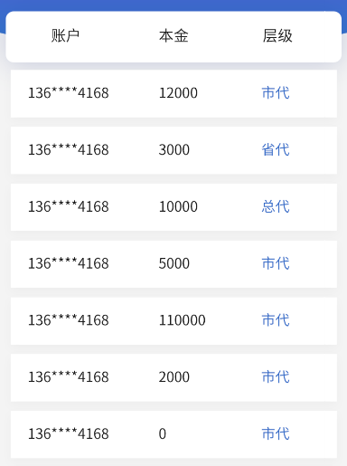
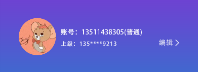
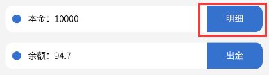

统一浏览器默认样式

- http://amazeui.shopxo.net/css/normalize/ - *CSS - Normalize | Amaze UI*
  1. https://meyerweb.com/eric/tools/css/reset/ - *rest.css*
     /blue)
  2. https://github.com/necolas/normalize.css - *normalize.css*
     


开发参考

1. Bootstrap  <i class="ri-fire-line light-red"></i>
2. Amazeui


视觉框架

- 字体 https://xiaomi.github.io/hiui/design/font/
  - 字号字阶：主字体大小为14px最佳
  - 字体行高：若字体为14，行高为22，相差为8；若字体为12，行高20；若字体为16，行高为24


## 开发思路

### 参考链接

> 参考大平台的 UI 设计

https://ant.design/index-cn - *Ant Design*

https://xiaomi.github.io/hiui/ - *HiUI*

↘️ :octocat: https://github.com/XiaoMi/hiui 

https://amazeui.shopxo.net/ - *AmazeUI*

https://v4.bootcss.com/ - *Bootstrap v4*

https://v5.bootcss.com - *Bootstrap v5*

http://www.hcoder.net/hui - *Hui*

https://element.eleme.io/#/zh-CN - *Element*

https://dev.dcloud.net.cn/mui/ - *MUI*


## 开发前看

### HTML/CSS 规范

http://amazeui.shopxo.net/getting-started/html-css/

 

模块状态：{命名空间}-{模块名}-{状态描述}

常用状态有：hover, current, selected, disabled, focus, blur, checked, success, error 等

 

子模块： {命名空间}-{模块名}-{子模块名}

常用模块名有：bd(body)，cnt(content)，hd(header)，text(txt)，img(images/pic)，title，item，cell，icon 等， 词义表达组件要实现的功能。

 

模块嵌套：

```html
<ul class="am-nav">
    <li class="am-nav-item">
        <a href="#">nav Triggle Link</a>
        <ul class="am-subnav">
            <li class="am-subnav-item">
                <a href="#">subNav Triggle Link</a>
                    <ul class="am-list">
```

需要特别注意的 Class

Amaze UI 中有两个表示状态的 class：

 

.am-active - 激活

.am-disabled - 禁用

不要单独使用、直接在里面编写样式！！！

 

```css
/* 可以嵌套用 */
.am-nav .am-active {
 ...
}
 
/* 可以堆叠用 */
.am-btn.am-active {
 ...
}

/* 绝不要单独用！！！ */
.am-active {
 color: red;
}
```

 

### class命名说明

[http://amazeui.shopxo.net/css/#class-ming-ming-shuo-ming](#class-ming-ming-shuo-ming)

```css
.am-post      {} /* Block */

.am-post-title   {} /* Element */

.am-post-meta    {} /* Element */

.am-post-sticky   {} /* Generic Modifier - status */

.am-post-active    {} /* Generic Modifier - status */

.am-post-title-highlight {}  /* Element Modifier */
```


## Layout布局  <i class="ri-fire-line light-red"></i>

### Container布局容器

<details>
<summary><span style="color:red">click to expand ~</span></summary>
<br>

- container
  - row
    - col-sm

 

- container *外层容器 固定宽度*
  - item

-container-fluid全屏宽度 --from bootstrap

-container-sm

-container-md

-container-lg

-container-xl

--header顶栏容器

--aside侧边栏容器

--main主要区域容器

--footer底栏容器

--item子元素

--topmenu顶部菜单

--sidemenu侧边菜单

-title 标题

-value 值

-content 内容

-header

-body

--content

-footer

-fl 左浮动

-fr 右浮动

-center 水平居中

-cf clearfix

```css
am-cf:after,.am-cf:before {
  content: " ";
  display: table;
}
```

-prev 前一个

-next 下一个

 

```css
.am-cf:after {
  clear: both
}
```

-active

-nav导航栏

-item子元素

-row 行 --from bootstrap

-col 列 --from bootstrap

-cell

-text 文本内容

-card --from element

-cell --form vant

-box 盒子

-wrap `表示块内元素会自动换行`

 

-from bootstrap

-wrapper

--content-main

--content-secondary

 

-footer-line --from hui

 

-list

-thumb / -thumbnail 缩略图

 

vertical 垂直

horizontal 水平

radial 径向

 

 

row >col

row >cell

 

group >item --from uViewUI

 

top right center bottom left

 

wrap 有独自占一行的意思 --from uViewUI radio组件

</details>

### Flex布局

<details>
<summary><span style="color:red">click to expand ~</span></summary>
<br>

参考

- Flex 布局教程：语法篇 http://www.ruanyifeng.com/blog/2015/07/flex-grammar.html
- Flex 布局教程：实例篇 https://www.ruanyifeng.com/blog/2015/07/flex-examples.html


`justify-content` 属性定义了项目在主轴上的对齐方式。

`align-items` 属性定义项目在交叉轴上如何对齐。

`align-content` 属性定义了多根轴线的对齐方式。如果项目只有一根轴线，该属性不起作用。


// 一条轴线排不下，换行

`flex-wrap`

 

// flex-direction属性和flex-wrap属性的简写形式，默认值为row nowrap

`flex-flow`

 

// 定义了项目在主轴(横轴)上的对齐方式

`justify-content`

 

```css
-flex-container {
    display: flex;
    display: -webkit-flex;
    align-items: center;
    -webkit-align-items: center;
    justify-content: space-between;
    -webkit-justify-content: space-between;
}

-flex-item {
    flex: 1;
    -webkit-flex: 1;
    -webkit-box-flex: 1;
}
```

 

--from hui

-flex

 

--from bootstrap

container

\>

row

row-cols-1

row-cols-2

row-cols-3

row-cols-4

row-cols-5

row-cols-6

align-items-start

align-items-center

align-items-end

justify-content-start

justify-content-center

justify-content-end

justify-content-around

justify-content-between

no-gutters

\>

col

col-auto

col-1

col-2

col-3

col-4

col-5

col-6

col-7

col-8

col-9

col-10

col-11

col-12

align-self-start

align-self-center

align-self-end

```css
container {
    width: 100%;
    padding-right: 15px;
    padding-left: 15px;
    margin-right: auto;
    margin-left: auto;
}
row {
    display: -ms-flexbox;
    display: flex;
    -ms-flex-wrap: wrap;
    flex-wrap: wrap;
    margin-right: -15px;
    margin-left: -15px;
}
row-cols-1>* {
    -ms-flex: 0 0 100%;
    flex: 0 0 100%;
    max-width: 100%;
}
row-cols-2>* {
    -ms-flex: 0 0 50%;
    flex: 0 0 50%;
    max-width: 50%;
}
row-cols-3>* {
    -ms-flex: 0 0 33.333333%;
    flex: 0 0 33.333333%;
    max-width: 33.333333%;
}
row-cols-4>* {
    -ms-flex: 0 0 25%;
    flex: 0 0 25%;
    max-width: 25%;
}
row-cols-5>* {
    -ms-flex: 0 0 20%;
    flex: 0 0 20%;
    max-width: 20%
}
row-cols-6>* {
    -ms-flex: 0 0 16.666667%;
    flex: 0 0 16.666667%;
    max-width: 16.666667%
}
.align-items-start {
    -ms-flex-align: start!important;
    align-items: flex-start!important;
}
.align-items-center {
    -ms-flex-align: center!important;
    align-items: center!important;
}
.align-items-end {
    -ms-flex-align: end!important;
    align-items: flex-end!important;
}
.justify-content-start {
    -ms-flex-pack: start!important;
    justify-content: flex-start!important;
}
.justify-content-center {
    -ms-flex-pack: center!important;
    justify-content: center!important;
}
.justify-content-end {
    -ms-flex-pack: end!important;
    justify-content: flex-end!important;
}
.justify-content-around {
    -ms-flex-pack: distribute!important;
    justify-content: space-around!important;
}
.justify-content-between {
    -ms-flex-pack: justify!important;
    justify-content: space-between!important;
}
.no-gutters {
    margin-right: 0;
    margin-left: 0;
}
```


```css
.col {
    position: relative;
    width: 100%;
    padding-right: 15px;
    padding-left: 15px;
    -ms-flex-preferred-size: 0;
    flex-basis: 0;
    -ms-flex-positive: 1;
    flex-grow: 1;
    min-width: 0;
    max-width: 100%;
}
col-auto {
    -ms-flex: 0 0 auto;
    flex: 0 0 auto;
    width: auto;
    max-width: 100%
}
.col-1 {
    -ms-flex: 0 0 8.333333%;
    flex: 0 0 8.333333%;
    max-width: 8.333333%
}
.col-2 {
    -ms-flex: 0 0 16.666667%;
    flex: 0 0 16.666667%;
    max-width: 16.666667%
}
.col-3 {
    -ms-flex: 0 0 25%;
    flex: 0 0 25%;
    max-width: 25%
}
.col-4 {
    -ms-flex: 0 0 33.333333%;
    flex: 0 0 33.333333%;
    max-width: 33.333333%
}
.col-5 {
    -ms-flex: 0 0 41.666667%;
    flex: 0 0 41.666667%;
    max-width: 41.666667%
}
.col-6 {
    -ms-flex: 0 0 50%;
    flex: 0 0 50%;
    max-width: 50%
}
.col-7 {
    -ms-flex: 0 0 58.333333%;
    flex: 0 0 58.333333%;
    max-width: 58.333333%
}
.col-8 {
    -ms-flex: 0 0 66.666667%;
    flex: 0 0 66.666667%;
    max-width: 66.666667%
}
.col-9 {
    -ms-flex: 0 0 75%;
    flex: 0 0 75%;
    max-width: 75%
}
.col-10 {
    -ms-flex: 0 0 83.333333%;
    flex: 0 0 83.333333%;
    max-width: 83.333333%
}
.col-11 {
    -ms-flex: 0 0 91.666667%;
    flex: 0 0 91.666667%;
    max-width: 91.666667%
}
.col-12 {
    -ms-flex: 0 0 100%;
    flex: 0 0 100%;
    max-width: 100%
}
```

#### 排序

order-first

order-last

order-1

order-2

order-3

order-4

order-5

order-6

order-7

order-8

order-9

order-10

order-11

order-12

```css
.order-first {
    -ms-flex-order: -1;
    order: -1
}
.order-last {
    -ms-flex-order: 13;
    order: 13
}
.order-0 {
    -ms-flex-order: 0;
    order: 0
}
.order-1 {
    -ms-flex-order: 1;
    order: 1
}
.order-2 {
    -ms-flex-order: 2;
    order: 2
}
.order-3 {
    -ms-flex-order: 3;
    order: 3
}
.order-4 {
    -ms-flex-order: 4;
    order: 4
}
.order-5 {
    -ms-flex-order: 5;
    order: 5
}
.order-6 {
    -ms-flex-order: 6;
    order: 6
}
.order-7 {
    -ms-flex-order: 7;
    order: 7
}
.order-8 {
    -ms-flex-order: 8;
    order: 8
}
.order-9 {
    -ms-flex-order: 9;
    order: 9
}
.order-10 {
    -ms-flex-order: 10;
    order: 10
}
.order-11 {
    -ms-flex-order: 11;
    order: 11
}
.order-12 {
    -ms-flex-order: 12;
    order: 12
}
```


```css
.align-self-start {
    -ms-flex-item-align: start!important;
    align-self: flex-start!important;
}
.align-self-center {
    -ms-flex-item-align: center!important;
    align-self: center!important;
}
.align-self-end {
    -ms-flex-item-align: end!important;
    align-self: flex-end!important;
}
```

</details>

### Grid栅格布局

http://amazeui.shopxo.net/css/grid/ *Amaze UI*

https://v3.bootcss.com/css/#grid *Bootstrap v3*


> From Bootstrap

- -container
  - -row
  - -col
    - -col-xs-
    - -col-sm-
    - -col-md-
    - -col-lg-
    - **列偏移**
    - -col-xs-offset-*
    - -col-sm-offset-*
    - -col-md-offset-*
    - -col-lg-offset-*


### Position布局

 

### Table布局


## 工具

### color 颜色

- 字体色

  <span style="background-color: #5eb95e">#5eb95e</span>


- 边框色

  <span style="background-color: #f0ececa8">#f0ececa8</span>


- bg-背景色

  <span style="background-color: #eaeaea">\#eaeaea</span>

  <span style="background-color: #a7a7a7">\#a7a7a7</span>

  <span style="background-color: #666666">\#666666</span>

  <span style="background-color: #999999">\#999999</span>

  <span style="background-color: #f72e36">\#f72e36</span>


> From uViewUI https://www.uviewui.com/components/color.html

 

- 颜色类型
  - -primary 蓝色 <span style="color: #3c9cff">#3c9cff</span>
  - -success 绿色 <span style="color: #5ac725">#5ac725</span>
  - -error 红色 <span style="color: #f56c6c">#f56c6c</span>
  - -warning 黄色 <span style="color: #f9ae3d">#f9ae3d</span>
  - -info 灰色 <span style="color: #909399">#909399</span>

 

- 颜色状态
  - -primary 常规颜色 <span style="color: #3c9cff">#3c9cff</span>
  - -primary-dark 加深颜色 <span style="color: #398ade">#398ade</span>
  - -primary-disabled 稍浅颜色 <span style="color: #9acafc">#9acafc</span>
  - -primary-light 变浅颜色 <span style="color: #ecf5ff">#ecf5ff</span>

 

### border 边框

> From bootstrap https://v5.bootcss.com/docs/5.1/utilities/borders/

- **Additive/ 加法**
  - -border
  - -border-top
  - -border-right
  - -border-bottom
  - -border-left


- **Subtractive/ 减法**
  - -border-0
  - -border-top-0
  - -border-right-0
  - -border-bottom-0
  - -border-left-0


- **Border-color**
  - -border-primary
  - -border-secondary
  - -border-success
  - -border-danger
  - -border-warning
  - -border-info
  - -border-light
  - -border-dark
  - -border-white


- **Border-radius**
  - -rounded
  - -rounded-top
  - -rounded-right
  - -rounded-bottom
  - -rounded-left
  - -rounded-circle
  - -rounded-pill
  - -rounded-0


- **Sizes**
  - -rounded-sm
  - -rounded-lg


> From amazeui http://amazeui.shopxo.net/css/

-border-vertical 垂直方向边框

 

```css
.border {
    border: 1px solid #dee2e6!important;
}
.border-top {
    border-top: 1px solid #dee2e6!important;
}
.border-right {
    border-right: 1px solid #dee2e6!important;
}
.border-bottom {
    border-bottom: 1px solid #dee2e6!important;
}
.border-left {
    border-left: 1px solid #dee2e6!important;
}
.border-0 {
    border: 0!important;
}
.border-top-0 {
    border-top: 0!important;
}
.border-right-0 {
    border-right: 0!important;
}
.border-bottom-0 {
    border-bottom: 0!important;
}
.border-left-0 {
    border-left: 0!important;
}
.border-primary {
    border-color: #007bff!important;
}
.border-secondary {
    border-color: #6c757d!important;
}
.border-success {
    border-color: #28a745!important;
}
.border-danger {
    border-color: #dc3545!important;
}
.border-warning {
    border-color: #ffc107!important;
}
.border-info {
    border-color: #17a2b8!important;
}
.border-light {
    border-color: #f8f9fa!important;
}
.border-dark {
    border-color: #343a40!important;
}
.border-white {
    border-color: #fff!important;
}
.am-square {
    border-radius: 0
}
.am-radius {
    border-radius: 2px
}
.am-round {
    border-radius: 1000px
}
.am-circle {
    border-radius: 50%
}
```


### text 文本

> From Bootstrap https://v5.bootcss.com/docs/utilities/text/

 

- 对齐方式
  - -text-left
  - -text-center
  - -text-right
  - -text-justify
  - -text-nowrap


- 文字颜色
  - -text-muted <span style="color:#777">#777</span>
  - -text-white <span style="background-color: #000;color:#fff">#fff</span>
  - -text-primary <span style="color:#337ab7">#337ab7</span>
  - -text-secondary
  - -text-success <span style="color:#3c763d">#3c763d</span>
  - -text-warning <span style="color:#8a6d3b">#8a6d3b</span>
  - -text-danger <span style="color:#31708f">#31708f</span>
  - -text-info <span style="color:#31708f">#31708f</span>
  - -text-reset inherit


- 改变大小写
  - -text-lowercase
  - -text-uppercase
  - -text-capitalize


- 单词中断

  ```css
  -text-break {
      word-break: break-word!important;
      word-wrap: break-word!important;
  }
  ```


- 字体粗细和斜体

  ```css
  -font-weight-bold {
      font-weight: 700!important;
  }
  -font-weight-bolder {
      font-weight: bolder!important;
  }
  -font-weight-normal {
      font-weight: 400!important;
  }
  -font-weight-light {
      font-weight: 300!important;
  }
  -font-weight-lighter {
      font-weight: lighter!important;
  }
  -font-italic {
      font-style: italic!important;
  }
  ```


> From amazeui http://amazeui.shopxo.net/css/utility/#wen-ben-gong-ju


- 文字大小
  - -text-xs 12px 1rem
  - -text-sm 14px 1.25rem
  - -text-default 16px 1.5rem
  - -text-lg 18px 1.75rem
  - -text-xl 24px 2rem
  - -text-xxl 32px 2.5rem
  - -text-xxxl 42px

 

- 文字换行及截断 --from amazeui

  ```css
  -text-truncate {
      overflow: hidden;
      text-overflow: ellipsis;
      white-space: nowrap;
  }
  ```

   

- 禁止文字换行
  - -text-nowrap


### typography 文字

> From MUI

```css
h1 {
    font-size: 36px;
    line-height: 1;
    margin-top: 5px;
    margin-bottom: 5px;
}
h2 {
    font-size: 30px;
    line-height: 1;
    margin-top: 5px;
    margin-bottom: 5px;
}
h3 {
    font-size: 24px;
    line-height: 1;
    margin-top: 5px;
    margin-bottom: 5px;
}
h4 {
    font-size: 18px;
    line-height: 1;
    margin-top: 5px;
    margin-bottom: 5px;
}
h5 {
    font-size: 14px;
    font-weight: 400;
    line-height: 1;
    margin-top: 5px;
    margin-bottom: 5px;
}
h6 {
    font-size: 12px;
    font-weight: 400;
    line-height: 1;
    margin-top: 5px;
    margin-bottom: 5px;
}
```


### background 背景

// 水平或垂直平铺(设置背景图像是否及如何重复)

`background-repeat: no-repeat;`


// 设置背景图像的起始位置

`background-position: center;`

`background-size: cover;`

 

// 背景图像是否固定或者随着页面的其余部分滚动

`background-attachment: fixed;`

 

// 简写属性（[可参考菜鸟教程](https://www.runoob.com/css/css-background.html)）（[可参考MDN Web Docs](https://developer.mozilla.org/zh-CN/docs/Web/CSS/background)）

`body {background:#ffffff url('img_tree.png') no-repeat right top;}`

 

#### 背景色

> From bootstrap https://v5.bootcss.com/docs/utilities/background/

- -bg-primary <span style="color: #fff;background-color: #337ab7;">color: #fff;background-color: #337ab7;</span>
- -bg-success <span style="background-color: #dff0d8;">background-color: #dff0d8;</span>
- -bg-info <span style="background-color: #d9edf7;">background-color: #d9edf7;</span>
- -bg-warning <span style="background-color: #fcf8e3;">background-color: #fcf8e3;</span>
- -bg-danger <span style="background-color: #f2dede;">background-color: #f2dede;</span>
- -bg-light <span style="background-color: #f8f9fa!important;">background-color: #f8f9fa!important;</span>
- -bg-white <span style="background-color: #fff!important;">background-color: #fff!important;</span>

 

#### 渐变背景色

- -bg-gradient-primary

- -bg-gradient-secondary

- -bg-gradient-success

- -bg-gradient-danger

- -bg-gradient-warning

- -bg-gradient-info

- -bg-gradient-light

- -bg-gradient-dark

  

#### 背景大小

- -bg-xxs
- -bg-xs
- -bg-sm
- -bg-default
- -bg-lg
- -bg-xl
- -bg-xxl
- -bg-xxxl


#### 背景图

- 页面背景容器（整个网页面的容器，防止页面滚动、不同设备打开出现的补白情况）

  ```css
  -bg-i-page-container {
      position: fixed;
      top: 0;
      right: 0;
      bottom: 0;
      left: 0;
      z-index: -1;
  }
  ```

  例子：

  ```css
  -bg-i-share {
      background: rgb(48, 118, 206) url("assets/i/background/bg-i-share.png") center/cover no-repeat;
  }
  ```

  

- 页面背景
  - -bg-i-page-primary {}

- 元素背景
  - -bg-i-box-primary {}


- 背景图命名
  - 圆形 /circle/round
  - 正方形 /square
  - 长方形 /rectangle


- 背景图色系命名
  - 深色 dark
  - 浅色 light


## 组件/模块

### jumbotron巨幕

> From Bootstrap

```css
-jumbotron {
    padding: 2rem 1rem;
    margin-bottom: 2rem;
    background-color: #e9ecef;
    border-radius: .3rem;
}
```


### cell 单元格

> --From vant https://vant-contrib.gitee.io/vant/#/zh-CN/cell

- -cell-group
- \----
- -cell
- -cell-clickable 单元格点击后的样式
- -cell-center 垂直居中
- \----
- -cell-title 标题
- -cell-value 值
- -cell-left-icon 左icon
- -cell-right-icon 右icon
- \----
- -cell-label 描述信息
- \---- 组合

- -cell-title
- -cell-label


```css
-cell-clickable {
    cursor: pointer
}
-cell-clickable:active {
    background-color: #f2f3f5
}
```


### icon图标

- 图片 icon
  - -img-icon

 

- 块状居中
  - -icon-center [标签：i]


- 尺寸大小
  - -icon-sm [标签：i]
  - -icon-md [标签：i]
  - -icon-lg [标签：i]


- 图片文件及样式命名
  - -icon-home 实心图标（选中）
  - -icon-home-o 空心图标（未选中）
  - 或
  - -icon-home-line 线性图标（未选中）
  - -icon-home-fill 填充图标（选中）

 

- 图片命名
  - icon-home-ingots 元宝
  - icon-home-upgrade 升级
  - icon-home-packet 红包
  - icon-home-oil 加油
  - icon-home-car 打车
  - icon-home-tour 旅游
  - icon-home-mall 商城
  - icon-ft-home 首页
  - icon-ft-home-checked 首页（选中）
  - icon-ft-task 任务
  - icon-ft-task-checked 任务（选中）
  - icon-ft-asset 理财
  - icon-ft-asset-checked 理财（选中）
  - icon-ft-trade 交易
  - icon-ft-trade-checked 交易（选中）
  - icon-ft-me 我的
  - icon-ft-me-checked 我的（选中）
  - icon-me-payment 支付方式
  - icon-me-message 消息中心
  - icon-me-share 分享
  - icon-me-team 团队
  - icon-me-integral 积分
  - icon-me-service 客服
  - icon-me-exit 退出
  - icon-me-realname 实名认证
  - icon-auth-processing 认证审核中
  - icon-auth-passed 认证审核通过
  - icon-me-bank-o 银行卡
  - icon-me-profile-o 个人信息
  - icon-me-setting-o 设置


```css
/*icon图标*/
[class*=ev-icon-]:before {
    content: "";
    display: inline-block;
    width: 1.4rem;
    height: 1.4rem;
    font: normal normal normal 1.6rem/1 FontAwesome,sans-serif;
    font-size: inherit;
    text-rendering: auto;
    -webkit-font-smoothing: antialiased;
    -moz-osx-font-smoothing: grayscale;
    -webkit-transform: translate(0,0);
    -ms-transform: translate(0,0);
    transform: translate(0,0);
    background-size: contain;
    background-position: center;
    background-repeat: no-repeat;
}
.ev-icon-user-o:before {
    background-image: url("../i/icon/icon-user-o.png");
}
.ev-icon-lock-o:before {
    background-image: url("../i/icon/icon-lock-o.png");
}
.ev-icon-home-o:before {
    background-image: url("../i/icon/icon-home-o.png");
}
.ev-icon-asset-o:before {
    background-image: url("../i/icon/icon-asset-o.png");
}
.ev-icon-me-o:before {
    background-image: url("../i/icon/icon-me-o.png");
}
/*选中状态图标*/
.ev-icon-home:before,
.am-active .ev-icon-home-o:before {
    background-image: url("../i/icon/icon-home.png");
}
.ev-icon-asset:before,
.am-active .ev-icon-asset-o:before {
    background-image: url("../i/icon/icon-asset.png");
}
.ev-icon-me:before,
.am-active .ev-icon-me-o:before {
    background-image: url("../i/icon/icon-me.png");
}
/*块状居中图标*/
.ev-icon-center:before {
    display: block;
    margin: 0 auto;
}
/*图标大小*/
/*普通字体的150%*/
.ev-icon-sm:before {
    width: 2.1rem;
    height: 2.1rem;
}
/*普通字体的200%*/
.ev-icon-md:before {
    width: 2.8rem;
    height: 2.8rem;
}
/*普通字体的250%*/
.ev-icon-lg:before {
    width: 3.5rem;
    height: 3.5rem;
}
```


### accordion折叠面板


### form表单

form form-horizontal>form-group>

 

--from bootstrap

form-inline

\>

form-row [标签：div]

\>

form-group

form-check

form-check-inline

\>

form-control [标签：input、select、textarea]

form-control-file [标签：input[type=file]]

form-control-lg [标签：input、select]

form-control-sm [标签：input、select]

form-control-plaintext [标签：input]

form-control-range [标签：input[type=range]]

form-check-label [标签：label]

form-check-input [标签：input[type=checkbox]、input[type=radio]]

col-form-label [标签：label]

col-form-label-sm [标签：label]

col-form-label-lg [标签：label]

form-text [标签：small]

 

--from amazeui

-form

-form-group

-form-select

 

-input-group [标签：div]

尺寸

-input-group-sm [标签：div]

-input-group-lg [标签：div]

颜色

-input-group-primary

-input-group-secondary

-input-group-success

-input-group-warning

-input-group-danger

\>

-input-group-label [标签：span]

-input-group-btn [标签：button]

 

 

--from hui

-form-items

-form-label

-form-input

-form-textarea

 

-checkbox

-radio

-link链接

-link-muted class 将链接颜色设置为灰色

 

用于 `<form>` 标签

am-form

am-form-horizontal -水平排列

 

用于 `<div>` 标签，包裹`<label>`、`<input>`标签

am-form-group

am-form-group-sm

am-form-group-lg

am-form-icon am-form-feedback 组合使用

 

用于 `<div>` 标签，包裹`<select>`标签

am-form-select

 

用于 `<label>` 标签

am-form-label

am-checkbox

am-checkbox-inline

am-radio

am-radio-inline

 

用于 `<input>` 标签

am-form-field

\- 表单域大小

am-form-lg -font-size: 1.8rem;

am-form-sm -font-size: 1.4rem;


### table表格

tabs选项卡

tips提示文本

 

-scrollable-horizontal [标签：div]

\>

-table [标签：table]

-table-centered [标签：table]

-table-bordered [标签：table]

-table-radius [标签：table]

-table-striped [标签：table]

-table-hover [标签：table]

-table-compact [标签：table]

-text-nowrap [标签：table]

\>

am-active 激活 [标签：tr、td]

am-disabled 禁用 [标签：tr、td]

am-primary 蓝色高亮 [标签：tr、td]

am-success 绿色高亮 [标签：tr、td]

am-warning 橙色高亮 [标签：tr、td]

am-danger 红色高亮 [标签：tr、td]

 

table>thead>tr>th 表头

table>tbody>tr>td 表内容





```html
<table class="am-table am-table-centered am-table-hover ev-table-team">
    <thead>
      <tr>
        <th>账户</th>
        <th>本金</th>
        <th>层级</th>
      </tr>
    </thead>
    <tbody>
      <tr>
        <td>136****4168</td>
        <td>12000</td>
        <td class="am-text-primary">市代</td>
      </tr>
      <tr>
        <td>136****4168</td>
        <td>12000</td>
        <td class="am-text-primary">市代</td>
      </tr>
      <tr>
        <td>136****4168</td>
        <td>12000</td>
        <td class="am-text-primary">市代</td>
      </tr>
    </tbody>
  </table>
```

```css
.ev-team-header {
    padding: 70px 20px;
    margin-left: -1rem;
    margin-right: -1rem;
    text-align: center;
    color: #fff;
    border-radius: 0 0 15px 15px;
}
.ev-table-team {
    border-spacing: 0 .5em;
    margin-top: -35px;
}
.ev-table-team.am-table>thead>tr {
    box-shadow: 0 4px 12px 0 rgba(219, 219, 219, .26);
}
.ev-table-team.am-table>thead>tr>th {
    padding: 1.1em;
    font-weight: normal;
    border-bottom: none;
    background-color: #fff;
}
.ev-table-team.am-table>thead>tr>th:first-child {
    border-radius: 10px 0 0 10px;
}
.ev-table-team.am-table>thead>tr>th:last-child {
    border-radius: 0 10px 10px 0;
}
.ev-table-team.am-table>tbody>tr>td {
    border-top: none;
    background-color: #fff;
}
```


### list列表

html标签

ul > li无序列表

ol > li有序列表

dl > dt > dd 

 

list-main列表主体内容

list-news内容列表

list-news-default内容列表样式

list-news-hd列表标题

list-news-bd列表内容

list-news-ft列表底部


### button按钮

普通按钮

-radius	按钮的弧度 默认：border-radius: 2px;

-round 椭圆形按钮 按钮的弧度 border-radius: 1000px;

-btn-default	默认样式

-btn-primary	主色样式

-btn-secondary	浅主色样式

-btn-success

-btn-warning

-btn-danger

-btn-link

-btn-info --from bootstrap

 

```css
-btn-xl {
    font-size: 20px;
}
-btn-lg {
    font-size: 18px;
}
-btn-default {
    font-size: 16px;
}
-btn-sm {
    font-size: 14px;
}
-btn-xs {
    font-size: 12px;
}
```

 

圆角按钮

-radius

```css
.ev-btn.ev-radius {
    border-radius: 2px;
}
```

 

椭圆形按钮

-round

```css
.ev-btn.ev-round {
    border-radius: 1000px;
}
```

-btn-block		块级显示

 

图标按钮

 

有底色按钮（实心按钮）

-btn

无底色按钮（空心按钮）

```css
-btn-outlined {
    background-color: transparent;
}
-btn-outlined.-btn-primary {
    color: #30d0a1;
}
```

 

图片按钮

// 正常尺寸

```css
-btn-i-primary {
    background: url(../Images/index_btn2.png) repeat center;
    background-size: 100% 100%;
}
```


// 最大尺寸(100%尺寸)

```css
-btn-i-primary-xl {
    
}
```

 

按钮组

-btn-toolbar

\>

-btn-group

按钮组大小

-btn-group-lg

-btn-group-sm

-btn-group-xs

垂直排列

-btn-group-stacked

自适应宽度

-btn-group-justify

\>

-btn etc

### avatar头像

#### shape 形状

```css
-avatar-circle {
    border-radius: 50%;
}

-avatar-square {
    border-radius: 4px;
}
```

 

#### size 大小

-avatar-xl 50px*50px

-avatar-large 40px*40px 默认

-avatar-medium 36px*36px

-avatar-small 28px*28px

 

```css
-avatar {
    width: 70px;
    height: 70px;
}
```


```html

```

 

### tag标签

> --from vant

-tag


## 内外边距

{size}

-xs 5px

-sm 10px

-default 16px

-lg 24px

-xl 32px

 

{size}可加可不加，不加默认为default 16px

-margin-top-{size}

-margin-bottom-{size}

-margin-left-{size}

-margin-right-{size}

-margin-horizontal-{size} --水平方向外边距

-margin-vertical-{size} --垂直方向外边距

-padding-top-{size}

-padding-bottom-{size}

-padding-left-{size}

-padding-right-{size}

-padding-horizontal-{size} --水平方向内边距

-padding-vertical-{size} --垂直方向内边距


## Utility辅助类

### 水平滚动

-scrollable-horizontal 内容超出容器宽度时显示水平滚动条

```css
-scrollable-horizontal {
    width: 100%;
    overflow-y: hidden;
    overflow-x: auto;
    -ms-overflow-style: -ms-autohiding-scrollbar;
    -webkit-overflow-scrolling: touch;
}
```

 

### 垂直滚动

-scrollable-vertical 内容超过设置的高度以后显示滚动条，默认设置的高度为 240px

```css
-scrollable-vertical {
    height: 240px;
    overflow-y: scroll;
    -webkit-overflow-scrolling: touch;
    resize: vertical;
}
```

 

### 宽高

> --from bootstrap

```css
-w-50 {
    width: 50%!important;
}
-w-75 {
    width: 75%!important;
}
-w-100 {
    width: 100%!important;
}
-h-100 {
    height: 100%!important;
}
```

 

### 定位

-position-static

-position-relative

-position-absolute

-position-fixed

-position-sticky

-fixed-top

-fixed-bottom

-sticky-top

```css
.position-static {
    position: static!important
}
.position-relative {
    position: relative!important
}
.position-absolute {
    position: absolute!important
}
.position-fixed {
    position: fixed!important
}
.position-sticky {
    position: -webkit-sticky!important;
    position: sticky!important
}
.fixed-top {
    position: fixed;
    top: 0;
    right: 0;
    left: 0;
    z-index: 1030
}
.fixed-bottom {
    position: fixed;
    right: 0;
    bottom: 0;
    left: 0;
    z-index: 1030
}
@supports ((position: -webkit-sticky) or (position:sticky)) {
    .sticky-top {
        position:-webkit-sticky;
        position: sticky;
        top: 0;
        z-index: 1020
    }
}
```

 

### 屏幕识读器

[bootstrap中sr-only是什么属性？用途是什么？](https://segmentfault.com/a/1190000008004996)


```css
.sr-only {
    position: absolute;
    width: 1px;
    height: 1px;
    padding: 0;
    margin: -1px;
    overflow: hidden;
    clip: rect(0, 0, 0, 0);
    white-space: nowrap;
    border: 0
}
.sr-only-focusable:active, .sr-only-focusable:focus {
    position: static;
    width: auto;
    height: auto;
    overflow: visible;
    clip: auto;
    white-space: normal
}
```


## CSS单位

英寸1in = 96px 	= 2.54cm

像素 1px = 0.0104166666666667in = 0.0264583333333333cm

em 它是描述相对于应用在当前元素的字体尺寸，所以它也是相对长度单位。一般浏览器字体大小默认为16px，则2em == 32px

rem 是根 em（root em）的缩写，rem作用于非根元素时，相对于根元素字体大小；rem作用于根元素字体大小时，相对于其出初始字体大小

vw viewpoint width，视窗宽度，1vw=视窗宽度的1%

vh viewpoint height，视窗高度，1vh=视窗高度的1%


## 重写规则

-{}-primary 主样式

-{}-secondary 次样式


## 模板

### 顶部导航栏

html标签

`<header></header>`

 

### 底部选项卡

html标签

`<footer></footer>`


```html
<footer class="ev-tabbar">
<ul class="am-avg-sm-3">
    <li>
      <a href="">
        <i class="ev-icon-home-o ev-icon-sm ev-icon-center"></i>
        <span>首页</span>
      </a>
    </li>
    <li>
      <a href="">
        <i class="ev-icon-asset-o ev-icon-sm ev-icon-center"></i>
        <span>理财</span>
      </a>
    </li>
    <li class="am-active">
      <a href="">
        <i class="ev-icon-me-o ev-icon-sm ev-icon-center"></i>
        <span>我的</span>
      </a>
    </li>
  </ul>
</footer>
```


```css
.ev-tabbar {
    position: fixed;
    right: 0;
    bottom: 0;
    left: 0;
    z-index: 999;
    /*height: 75px;*/
    margin-left: auto;
    margin-right: auto;
    text-align: center;
    background-color: #fff;
}
.ev-tabbar>ul>li>a {
    display: block;
    padding: .5em;
}
.ev-tabbar>ul>li>a>span {
    font-size: 1.4rem;
    color: #e7e7e7;
}
.ev-tabbar>ul>li.am-active>a>span {
    color: #3076ce;
}
```


### 底部标签栏 TabBar

```css
-tabbar {
    position: fixed;
    right: 0;
    bottom: 0;
    left: 0;
    z-index: 999;
    width: 100%;
    height: 75px;
    margin-left: auto;
    margin-right: auto;
    text-align: center;
    background-color: #fff;
}
```


### 菜单栏

html标签

`<nav></nav>`


### 个人信息

-profile

-profile-header

-profile-content

-profile-footer



-profile

\>

-profile-avatar

-profile-info

```html
<div class="ev-profile ev-bg-gradient-primary">
    <div class="ev-profile-avatar">
        
    </div>
    <div class="ev-profile-info">
        <span>账号：13511438305(普通)</span>
        <br>
        <small>上级：135****9213</small>
    </div>
</div>
```


```css
.ev-profile {
    display: flex;
    display: -webkit-flex;
    align-items: center;
    -webkit-align-items: center;
    padding: 40px 20px 70px;
    margin-left: -1rem;
    margin-right: -1rem;
    border-radius: 0 0 15px 15px;
}
.ev-avatar {
    width: 70px;
    height: 70px;
}
.ev-avatar-circle {
    border-radius: 50%;
}
.ev-profile-info {
    padding-left: 10px;
    color: #fff;
}
```


### 分段标签卡片

百度翻译搜：分段

-segment 暂选为样式名

-segment-line 分割线

-fragment 片段

-tabcard

-partition

-division


```html
<ul class="am-avg-sm-3 ev-grid ev-grid-segment-3">
    <li>
        <i class="ev-icon-card-o ev-icon-center ev-icon-md"></i>
        <p>出金申请</p>
    </li>
    <li>
        <i class="ev-icon-users-o ev-icon-center ev-icon-md"></i>
        <p>团队成员</p>
    </li>
    <li>
        <i class="ev-icon-invite-o ev-icon-center ev-icon-md"></i>
        <p>邀请好友</p>
    </li>
</ul>
```


```css
.ev-grid {
    padding: 0 12px;
    border-radius: 10px;
    background-color: #fff;
    -webkit-transform: translateY(-35%);
    transform: translateY(-35%);
}
.ev-grid li {
    position: relative;
    padding: 12px 0;
    text-align: center;
}
.ev-grid li>p {
    margin: 0;
    font-size: 14px;
}
.ev-grid li:active {
    background-color: #f2f3f5
}
.ev-grid.ev-grid-segment-3>li:after {
    content:'';
    background-color: #011321;
    width: 0;
    position: absolute;
    top: 25px;
    right: 0;
    bottom: 25px;
}
.ev-grid.ev-grid-segment-3>li:nth-of-type(3n+3):after {
    content: none;
}
```


### 卡片

card-group/card-deck>card>card-header

card-group/card-deck>card>card-body>card-title/card-subtitle/card-text/card-link

card-group/card-deck>card>card-img-overlay

-card-group/-card-deck

-card

-card-img

-card-img-top ``

-card-header

-card-content/-card-body/-card-img-overlay

 -card-title

 -card-subtitle 副标题

 -card-text

 -card-link

-card-footer

 

--from bootstrap

 

```css
.card-img-overlay {
    position: absolute;
    top: 0;
    right: 0;
    bottom: 0;
    left: 0;
    padding: 1.25rem;
}
```

 

### 下拉菜单

-dropdown

 

### 顶部导航栏 NavBar

-navbar

 

### 标签页

-tabs --from vant / amazeui

 

### 空状态

-empty --from vant

-empty-image

-empty-description 描述文字

-empty-bottom 底部内容，如返回、跳转按钮等

 

### 单元格列表


```html
<div class="ev-cell-group">
  <div class="ev-cell ev-cell-clickable">
    <i class="ev-icon-message-o ev-icon-sm ev-cell-left-icon"></i>
    <div class="ev-cell-title">消息中心</div>
    <div class="ev-cell-value"></div>
    <i class="am-icon-angle-right am-icon-sm ev-cell-right-icon"></i>
  </div>
  <div class="ev-cell ev-cell-clickable">
    <i class="ev-icon-bank-o ev-icon-sm ev-cell-left-icon"></i>
    <div class="ev-cell-title">绑定银行卡</div>
    <div class="ev-cell-value"></div>
    <i class="am-icon-angle-right am-icon-sm ev-cell-right-icon"></i>
  </div>
  <div class="ev-cell ev-cell-clickable">
    <i class="ev-icon-profile-o ev-icon-sm ev-cell-left-icon"></i>
    <div class="ev-cell-title">个人信息</div>
    <div class="ev-cell-value"></div>
    <i class="am-icon-angle-right am-icon-sm ev-cell-right-icon"></i>
  </div>
  <div class="ev-cell ev-cell-clickable">
    <i class="ev-icon-setting-o ev-icon-sm ev-cell-left-icon"></i>
    <div class="ev-cell-title">账号设置</div>
    <div class="ev-cell-value"></div>
    <i class="am-icon-angle-right am-icon-sm ev-cell-right-icon"></i>
  </div>
</div>
```


```css
.ev-cell-group {
    padding-top: 10px;
    padding-bottom: 10px;
    border-radius: 10px;
    background-color: #fff;
}
.ev-cell {
    position: relative;
    display: -webkit-box;
    display: -webkit-flex;
    display: flex;
    box-sizing: border-box;
    width: 100%;
    padding: 10px 16px;
    overflow: hidden;
    color: #323233;
    font-size: 14px;
    line-height: 24px;
    background-color: #fff;
}
.ev-cell::after {
    position: absolute;
    box-sizing: border-box;
    content:' ';
    pointer-events: none;
    right: 16px;
    bottom: 0;
    left: 16px;
    border-bottom: 1px solid #ebedf0;
    -webkit-transform: scaleY(0.5);
    transform: scaleY(0.5);
}
.ev-cell-title, .ev-cell-value {
    -webkit-box-flex: 1;
    -webkit-flex: 1;
    flex: 1;
}
.ev-cell-left-icon, .ev-cell-right-icon {
    /*min-width: 1em;*/
    height: 24px;
    font-size: 16px;
    line-height: 24px;
}
.ev-cell-left-icon {
    margin-right: 12px;
}
.ev-cell-right-icon {
    margin-left: 4px;
    color: #969799;
}
.ev-cell-clickable {
    cursor: pointer
}
.ev-cell-clickable:active {
    background-color: #f2f3f5
}
```


### 单元格按钮



```html
<div class="am-margin-top">
  <div class="ev-cell ev-cell-radius ev-cell-center">
    <i class="am-icon-circle ev-text-secondary am-margin-right-sm"></i>
    <div class="ev-cell-title">本金：10,000.00</div>
    <div class="ev-cell-value ev-cell-btn">
      <a href="#" class="am-btn ev-btn-info am-btn-xs">明细</a>
    </div>
  </div>
  <div class="ev-cell ev-cell-radius ev-cell-center am-margin-top-sm">
    <i class="am-icon-circle ev-text-secondary am-margin-right-sm"></i>
    <div class="ev-cell-title">余额：94.70</div>
    <div class="ev-cell-value ev-cell-btn">
      <a href="#" class="am-btn ev-btn-info am-btn-xs">出金</a>
    </div>
  </div>
</div>
```


```css
.ev-cell-btn {
    margin: -10px -16px -10px 0;
}
.ev-cell-btn .am-btn {
    padding: 16px 26px;
}
```


### 分享邀请好友

-share-card

\>

-share-card-profile

-share-card-logo

 

-share-content

\>

-share-content-hd

-share-content-bd

-share-content-ft


```html
<div class="am-text-center ev-logo">
  <h1 class="ev-logo-title">艾泰盟</h1>
</div>
<div class="ev-share-qrcode">
  
</div>
<p class="ev-text-white am-text-center">推荐人：138****8305</p>
<div class="am-form ev-form-primary am-margin">
  <div class="am-form-group am-input-group">
    <input type="text" name="" value="www.baidu.com" disabled class="am-form-field">
    <span class="am-input-group-btn">
      <button type="button" class="am-btn am-btn-sm ev-btn-primary">复制分享链接</button>
    </span>
  </div>
  <div class="am-form-group am-input-group">
    <input type="text" name="" value="www.baidu.com" disabled class="am-form-field">
    <span class="am-input-group-btn">
      <button type="button" class="am-btn am-btn-sm ev-btn-primary">复制下载链接</button>
    </span>
  </div>
</div>
```


```css
.ev-share-qrcode {
    padding: 10px;
    text-align: center;
    background: url("../i/background/bg-i-qrcode.png") center/contain no-repeat;
}
.ev-share-qrcode img {
    width: 151px;
    height: 151px;
}
```


### 轮播图


```html
<div class="ev-slider-container ev-bg-gradient-primary">
  <div class="am-slider am-slider-default" data-am-flexslider id="demo-slider-0">
    <ul class="am-slides">
      <li></li>
      <li></li>
      <li></li>
      <li></li>
    </ul>
  </div>
</div>
```


```css
.ev-slider-container {
    padding: 0 20px;
    margin-left: -1rem;
    margin-right: -1rem;
}
.ev-slider-container>.am-slider-default {
    -webkit-transform: translateY(15px);
    transform: translateY(15px);
}
.ev-slider-container>.am-slider-default .am-control-nav {
    bottom: 5px;
}
.ev-slider-container>.am-slider-default .am-control-nav li a {
    background-color: rgba(255, 255, 255, .4);
}
.ev-slider-container>.am-slider-default .am-control-nav li a.am-active {
    background-color: #fff;
}
.ev-slider-container>.am-slider-default, .ev-slider-container>.am-slider-default .am-viewport {
    background-color: transparent;
    border-radius: 10px;
}
```


### 通知栏 NoticeBar

-notice-bar

\>

-notice-bar-title


```html
<div class="ev-notice-bar am-margin-vertical-lg">
  <h3 class="ev-notice-bar-title">公告通知</h3>
  <van-notice-bar left-icon="volume-o" :scrollable="false">
    <van-swipe
        vertical
        class="notice-swipe"
        :autoplay="3000"
        :show-indicators="false"
    >
      <van-swipe-item>上海隍金资产管理有限公司</van-swipe-item>
      <van-swipe-item>上海隍金资产管理有限公司</van-swipe-item>
      <van-swipe-item>上海隍金资产管理有限公司</van-swipe-item>
    </van-swipe>
  </van-notice-bar>
</div>
```


```css
.ev-notice-bar-title {
    padding-left: 12px;
    margin-bottom: 10px;
    border-left: 3px solid #3076ce;
}
.ev-notice-bar .van-notice-bar {
    color: #000;
    border-radius: 10px;
    background-color: #fff;
}
.ev-notice-bar .van-swipe-item>a {
    color: inherit;
}
.notice-swipe {
    height: 40px;
    line-height: 40px;
}
```


### 商城

-cash 现金

-bonus 奖金

-voucher 提货券

-coupon 换货券

 

商品列表 -goods-list

商品详情 -goods-details

商品购买 -goods-purchase

 

商品基本信息 -goods-basic

商品名称 -goods-name

商品价格 -goods-price

商品库存 -goods-stock

商品描述 -goods-describe

商品描述 -goods-description [优先使用]

运费（快递） -goods-freight

商品操作 -goods-action

 

商品购买联系人 -contact

 

商品规格 -sku

 

订单列表 -order-list

 

分享 -share-container

-share-image

-share-link

-share-tips

-share-msg

 

记录 -record-list

收入 -record-inc

支出 -record-dec


## 词汇

### Charts图表

Meter	仪表

Stack	堆叠

Categories	类别

Series	系列


## FAQ

### 垂直居中

方式一

`writing-mode` 结合 `text-align:center;` 或者使用 `margin:auto;`

https://www.cnblogs.com/gja1026/p/9279818.html - *CSS3实现文本垂直排列 - 逆旅wy - 博客园*


方式二

1. position + transform

2. display:flex;

3. display:table + display:table-cell;

4. position:fixed + :after;

:thumbsup: https://www.cnblogs.com/yugege/p/5246652.html - *CSS实现垂直居中的常用方法 - ChessZhang - 博客园*


#### 文本垂直排列

属性：`writing-mode`、`-webkit-writing-mode`


#### 图片

```html
<div class="ev-share-content-bd" style="
    margin: 0 auto;
    width: 100px;
"></div>
```

`.ev-share-content-bd` width设置了以px为单位的宽度，`margin: 0 auto;`才会居中，设置为%无效

```html
<u-image width="239rpx" height="287rpx" src="@/static/images/logo/logo.png" style="display: block;margin: 0 auto;"></u-image>
```


#### 页面

下载页面

分享页面

 

#### 元素


### 水平居中

```css
margin: 0 auto;
```


### 占位符 placeholder 文本样式

Input placeholder 属性样式设置

```css
/* WebKit browsers */
::-webkit-input-placeholder {
  color: #30d0a1!important;
  font-size: 16px!important;
}
/* Mozilla Firefox 4 to 18 */
input:-moz-placeholder {
  color: #30d0a1!important;
  opacity: 1!important;
  font-size: 16px!important;
}
/* Mozilla Firefox 19+ */
input::-moz-placeholder {
  color: #30d0a1!important;
  opacity: 1!important;
  font-size: 16px!important;
}
/* Internet Explorer 10+ */
:-ms-input-placeholder {
  color: #30d0a1!important;
  font-size: 16px!important;
}
```


```css
/* WebKit browsers */
input::-webkit-input-placeholder,
textarea::-webkit-input-placeholder {
  color: #666;
  font-size: 16px;
}

/* Mozilla Firefox 19+ */
input:-moz-placeholder,
textarea:-moz-placeholder {
  color: #666;
  font-size: 16px;
}

/* Mozilla Firefox 19+ */
input::-moz-placeholder,
textarea::-moz-placeholder {
  color: #666;
  font-size: 16px;
}

/* Internet Explorer 10+ */
input:-ms-input-placeholder,
textarea:-ms-input-placeholder {
  color: #666;
  font-size: 16px;
}
```

参考：

https://www.cnblogs.com/hcxwd/p/9232936.html - *css3 placeholder字体颜色大小 - 清风晰心 - 博客园*


### 响应式设计

```css
// Extra small devices (portrait phones, less than 576px)
// No media query for `xs` since this is the default in Bootstrap

// Small devices (landscape phones, 576px and up)
@media (min-width: 576px) { ... }

// Medium devices (tablets, 768px and up)
@media (min-width: 768px) { ... }

// Large devices (desktops, 992px and up)
@media (min-width: 992px) { ... }

// Extra large devices (large desktops, 1200px and up)
@media (min-width: 1200px) { ... }
```


### 头像上移样式可用

```css
transform: translateY(-50%);
```

 


### p标签文本内容不自动换行解决方法

> 使用链接中的内容样式

<https://v4.bootcss.com/docs/utilities/text/#文字折行和溢出>

```css
/* 文字折行 */
.text-wrap {
    white-space: normal!important;
}
```

```css
/* 防止文字折行 */
.text-nowrap {
    white-space: nowrap!important;
}
```

<https://v4.bootcss.com/docs/utilities/text/#单词中断>

```css
.text-break {
    word-break: break-word!important;
    word-wrap: break-word!important;
}
```

### 禁止蒙版下的页面滚动


参考链接：

https://m.jb51.net/article/191900.htm - *vue 遮罩层阻止默认滚动事件操作_vue.js_脚本之家*

https://www.jb51.net/article/178246.htm - *javascript实现蒙版与禁止页面滚动_javascript技巧_脚本之家*

https://ask.dcloud.net.cn/question/64257 - *禁止遮罩下页面滑动 - 知乎*

https://www.cnblogs.com/lymconch/p/11454475.html - *遮罩层下禁止页面滚动 - 一只螺 - 博客园*

https://zhuanlan.zhihu.com/p/222584304 - *uni-app div蒙版，如何禁止蒙版下的页面滚动？ - DCloud问答*

 
