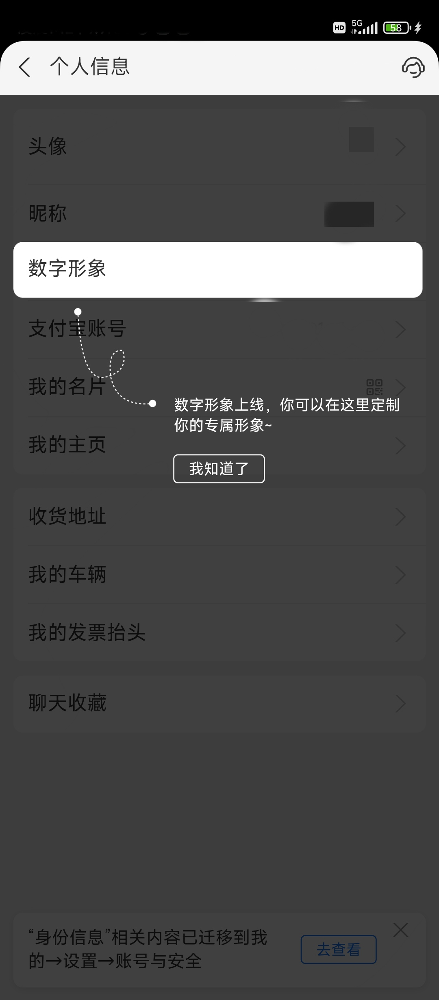

## html 教程

https://www.runoob.com/html/html-tutorial.html - *HTML 教程 | 菜鸟教程*

## html 使用规则

### 代码规范

有关详细信息，请参阅“[代码规范](front-end/README.md#代码规范)”

### 代码模板

https://v5.bootcss.com/docs/getting-started/introduction/ - *Get started with Bootstrap · Bootstrap v5 中文文档 v5.3 | Bootstrap 中文网*

文件名：_index. html_

```html
<!doctype html>
<html lang="en">
  <head>
    <meta charset="utf-8">
    <meta name="viewport" content="width=device-width, initial-scale=1">
    <title>Bootstrap demo</title>
    <link href="https://cdn.jsdelivr.net/npm/bootstrap@5.3.0-alpha1/dist/css/bootstrap.min.css" rel="stylesheet" integrity="sha384-GLhlTQ8iRABdZLl6O3oVMWSktQOp6b7In1Zl3/Jr59b6EGGoI1aFkw7cmDA6j6gD" crossorigin="anonymous">
  </head>
  <body>
    <h1>Hello, world!</h1>
    <script src="https://cdn.jsdelivr.net/npm/bootstrap@5.3.0-alpha1/dist/js/bootstrap.bundle.min.js" integrity="sha384-/mhDoLbDldZc3qpsJHpLogda//BVZbgYuw6kof4u2FrCedxOtgRZDTHgHUhOCVim" crossorigin="anonymous"></script>
  </body>
</html>
```


### 标签

header 元素

https://www.runoob.com/html/html-head.html - *HTML 头部 | 菜鸟教程*

```html
<meta>
<link>
<style></style>
<script></script>
<noscript></noscript>
```

#### \<meta>

- https://www.runoob.com/w3cnote/meta.html - *常用meta整理* 
- http://fex.baidu.com/blog/2014/10/html-head-tags/ - *HTML head 头标签*
- https://github.com/audreyfeldroy/favicon-cheat-sheet - *Obsessive cheat sheet to favicon sizes/types. Please contribute! (Note: this may be in flux as I learn new things about favicon best practices.)*

#### \<link>

https://www.runoob.com/tags/tag-link.html - *HTML <link>标签 | 菜鸟教程*

https://developer.mozilla.org/zh-CN/docs/Web/HTML/Element/link - *<link>：外部资源链接元素 - HTML（超文本标记语言） | MDN*

#### \<script>

##### integrity

```javascript
<script src="https://cdnjs.cloudflare.com/ajax/libs/hammer.js/2.0.8/hammer.min.js" integrity="sha512-UXumZrZNiOwnTcZSHLOfcTs0aos2MzBWHXOHOuB0J/R44QB0dwY5JgfbvljXcklVf65Gc4El6RjZ+lnwd2az2g==" crossorigin="anonymous" referrerpolicy="no-referrer"></script>
```


- https://cdnjs.com/libraries/hammer.js - *A javascript library for multi-touch gestures*
- https://blog.csdn.net/chenjiebin/article/details/121093528 - *script使用integrity属性进行安全验证*
- https://www.xftsoft.com/tool/integrity - *Integrity生成器（SRI Hash 生成器）*

##### async

```javascript
<script src="js/require.js" defer async="true" ></script>
```

`async`属性表明这个文件需要异步加载，避免网页失去响应。IE不支持这个属性，只支持`defer`，所以把`defer`也写上。[via](https://www.ruanyifeng.com/blog/2012/11/require_js.html)

##### type

https://mp.weixin.qq.com/s/KXpawK0d6ypnyrEDfNCaiQ - *type="module" 你了解，但 type="importmap" 你知道吗*

块元素

```html
<div></div>
<h1></h1>
<p></p>
<ul></ul>
<ol></ol>
<li></li>
<table></table>
```


内联元素

```html
<span></span>
<b></b>
<td></td>
<a></a>

```


内联文本元素

```html
<mark></mark>
<del></del>
<ins></ins>
<u></u>
<small></small>
<strong></strong>
<em></em>
<code></code>
<kbd></kbd>
```


样式/节

```html
<!--标签定义了文档的某个区域。比如章节、头部、底部或者文档的其他区域。-->
<section></section>
```

#### \<iframe>

https://www.runoob.com/html/html-iframes.html - *HTML 框架 | 菜鸟教程*

Question：

- 跨域


### 属性

#### data-*

https://developer.mozilla.org/zh-CN/docs/Learn/HTML/Howto/Use_data_attributes - *使用数据属性 - 学习 Web 开发 | MDN*


### 页面布局

```html
<!--头部-->
<header class="header"></header>

<!--侧边栏-->
<aside class="menu"></aside>

<!--内容-->
<div class="container"></div>
<div class="content"></div>
<section></section>
<main></main>

<!--尾部-->
<footer class="footer"></footer>
```


## html 页面

### 404 页面

参考页面：

- https://soft-hub.cn/article/ll2d7f50fa62eb45f0171c5321f9fc926f.zip

### 引导页面

按步骤引导用户操作的页面

> 这里放一张截图

  | 
---|---
