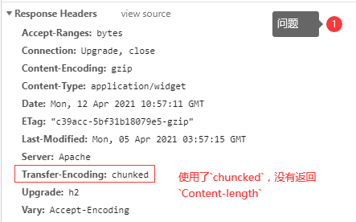
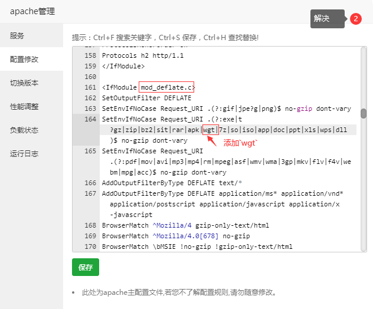

# uni-app

## Introduction

> `uni-app` 是一个使用 [Vue.js](https://vuejs.org/) 开发所有前端应用的框架，开发者编写一套代码，可发布到iOS、Android、Web（响应式）、以及各种小程序（微信/支付宝/百度/头条/飞书/QQ/快手/钉钉/淘宝）、快应用等多个平台。


## Official

官网：https://www.dcloud.io - *DCloud - HBuilder、HBuilderX、uni-app、uniapp、5+、5plus、mui、wap2app、流应用、HTML5、小程序开发、跨平台App、多端框架*

uni-app：https://uniapp.dcloud.io - *uni-app官网*

GitHub：https://github.com/dcloudio/uni-app - *dcloudio/uni-app: A cross-platform framework using Vue.js*

## Mini Program

### WeChat

暂无

## Tools

### Hello uni-app

官方下载：https://m3w.cn/uniapp - *Hello uni-app*

#### Web

H5：https://hellouniapp.dcloud.net.cn/ - *view*

#### Android

Google Play 商店下载：https://play.google.com/store/apps/details?id=io.dcloud.hellouniapp

#### iOS

https://itunes.apple.com/cn/app/hello-uni-app/id1417078253 - *App Store 上的“Hello uni-app”*

#### 小程序

https://m3w.cn/uniapp - *Hello uni-app*

### MUI

> MUI: 最接近原生APP体验的高性能前端框架


https://mui.dcloud.net.cn/ - *MUI-最接近原生APP体验的高性能前端框架*

https://github.com/dcloudio/mui - *GitHub - dcloudio/mui: 最接近原生APP体验的高性能框架*

#### Web

https://dcloud.io/hellomui/ - *Hello MUI*

### 电脑端

#### HBuilderX

https://www.dcloud.io/hbuilderx.html - *HBuilderX-高效极客技巧*

### 手机端

#### HelloH5

https://www.dcloud.io/runtime.html - *HTML5+ - DCloud*

直接下载：http://www.dcloud.io/helloh5/d

#### 流应用

https://www.dcloud.io/streamapp.html - *流应用 - DCloud*

## Marketplace

> DCloud 插件市场

https://ext.dcloud.net.cn/ - *DCloud 插件市场*

https://uniapp.dcloud.net.cn/plugin/ - *uni-app官网*

### 前端项目模板

#### hello-uniapp 示例工程

https://ext.dcloud.net.cn/plugin?id=4941 - *hello-uniapp 示例工程 - DCloud 插件市场*

https://github.com/dcloudio/hello-uniapp - *GitHub - dcloudio/hello-uniapp: uni-app框架演示示例*


#### ColorUI

https://ext.dcloud.net.cn/plugin?id=239 - *ColorUI-UniApp - DCloud 插件市场*

#### uView

官网：https://www.uviewui.com/ - *uView 2.0 - 全面兼容nvue的uni-app生态框架 - uni-app UI框架*

插件市场：https://ext.dcloud.net.cn/plugin?id=1593 - *uView2.0重磅发布，利剑出鞘，一统江湖 - DCloud 插件市场*

#### 模板组件对比

| html | uViewUI | ColorUI | uniapp |
| ---- | ------- | ------- | ------ |
| list | cell    |         |        |

### 通用组件

ID  | 插件名  | 插件市场链接
---|---|---
1  | 跑马灯  | [g_bro_marquee](https://ext.dcloud.net.cn/plugin?id=1805)
2  | 拦截器、网络请求  | [luch-request](https://ext.dcloud.net.cn/plugin?id=392)
3  | APP 版本更新  | [APP Update](https://ext.dcloud.net.cn/plugin?id=1643)
4  | 列表上下循环滚动  | [tony-scroll](https://ext.dcloud.net.cn/plugin?id=1179)
5  | 列表垂直方向拖拽drag组件  | [m-drag](https://ext.dcloud.net.cn/plugin?id=14571) [Via](https://juejin.cn/post/7277115202234974249)

### 水印相机

暂无

## FAQ

https://uniapp.dcloud.net.cn/faq.html - *FAQ | uni-app官网*

### uni-app wgt 热更新进度条异常

项目：`Nait`

时间：`2021/03/26`

问题：（问题解决耗时5小时）

uni-app wgt 热更新进度条异常

原因：

服务器没有响应 `Content-Length`



解决：

Apache 配置 `mod_deflate.c` 模块，添加 `wgt` 文件类型



### HBuilderX 原生 App 云打包应用版本不一致提示

项目：`LOH`

时间：`2021/04/24`

问题：（问题解决耗时2小时）

uni-app 运行环境版本和编译器版本不一致的问题

原因：

https://ask.dcloud.net.cn/article/35627 - *uni-app运行环境版本和编译器版本不一致的问题 - DCloud问答*

解决：

1. HBuilderX 编辑器版本升级（升级完重新启动编辑器）

2. 删除项目根目录 `unpackage` 文件夹（文件夹包含了旧版本的打包配置）

3. 卸载重装编辑器插件 `App 真机运行` 、`uni-app 编译`（完成后重新启动编辑器）

### webview 内嵌 H5 页面 底部导航栏 在 苹果 X xr xs 下 安全区的问题

参考：

1. https://ask.dcloud.net.cn/question/73055 - *uni -app webview 内嵌 H5 页面 底部导航栏 在 苹果 X xr xs 下 安全区的问题 - DCloud 问答*

### uni-app 中小程序样式穿透问题

参考：

1. https://www.kancloud.cn/uview/uview-ui_v2/2587980 - *uniapp中小程序样式穿透问题 · uView-UI v2.x常见问题整理 · 看云*

### uni-app 导航栏渐变透明

参考：

1. https://ask.dcloud.net.cn/article/35344 - *uni-app 利用uni-nav-bar组件设置导航栏透明渐变样式 - DCloud问答*
2. https://blog.csdn.net/weixin_45811256/article/details/121318564 - *uniapp实现顶部导航栏背景图片渐隐渐现效果_uniapp 渐显图片-CSDN博客*
3. https://github.com/dcloudio/mui/blob/master/js/mui.transparent.js - *mui/js/mui.transparent.js at master · dcloudio/mui · GitHub*

### uni-app 禁止蒙版下的页面滚动

```html
<view class="mask" @touchmove.stop.prevent="moveHandle"></view>
```

<https://uniapp.dcloud.net.cn/tutorial/vue3-basics.html#事件修饰符> - *介绍 | uni-app官网*

### tabBar 实现中间图标突出效果

参考：

1. https://www.cnblogs.com/zwh0910/p/17088559.html - *微信小程序：自定义tabBar实现中间图标突出效果 - 周文豪 - 博客园*
2. https://segmentfault.com/q/1010000044596534 - *css3 - 如何用CSS制作平滑的半圆形tabbar？ - SegmentFault 思否*
3. https://blog.csdn.net/weixin_56650035/article/details/118027317 - *uniapp自定义tabbar，中间凸起（支持H5、微信小程序）_uniapp底部导航栏中间凸起-CSDN博客*
4. https://blog.csdn.net/qq_52992456/article/details/140460733 - *uniapp实现自定义tabBar底部导航栏（中间凸起样式）-CSDN博客*
5. https://blog.csdn.net/xuanzhuan365/article/details/116304087 - *微信小程序底部tabbar自定义带弧度效果完整版案例_微信小程序定制底部菜单怎么做 中间是一个弧形-CSDN博客*
6. https://segmentfault.com/q/1010000042072131 - *前端 - 底部导航栏中间平滑的凸起怎样实现 - SegmentFault 思否*
7. https://segmentfault.com/q/1010000037479479/a-1020000037493426 - *css - 请问这种样式如何实现CSS - SegmentFault 思否*

### 微信小程序获取用户头像和昵称

1. https://developers.weixin.qq.com/community/develop/doc/00022c683e8a80b29bed2142b56c01 - *小程序用户头像昵称获取规则调整公告 | 微信开放社区*
2. https://developers.weixin.qq.com/miniprogram/dev/framework/open-ability/userProfile.html - *开放能力 / 用户信息 / 获取头像昵称*
3. https://developers.weixin.qq.com/miniprogram/dev/component/open-data.html - *开放能力 / open-data*
4. https://uniapp.dcloud.net.cn/api/plugins/login.html - *uni.login(OBJECT) | uni-app官网*
5. https://uniapp.dcloud.net.cn/component/open-data.html - *open-data | uni-app官网*

参考：

1. https://blog.csdn.net/weixin_38982591/article/details/128829493 - *最新uniapp 微信小程序获取头像操作指南_uniapp小程序获取用户头像和昵称-CSDN博客*
2. https://developer.baidu.com/article/detail.html?id=3237244 - *Uniapp微信小程序：轻松获取用户头像和昵称-百度开发者中心*
3. https://developers.weixin.qq.com/community/develop/article/doc/0008a494fd4f4097a70fd72785b013 - *小程序用户头像昵称获取（含部分常见问题） | 微信开放社区*
4. https://blog.csdn.net/LJM51200/article/details/128589119 - *uniapp之最新获取用户昵称以及头像_uniapp 获取头像-CSDN博客*
