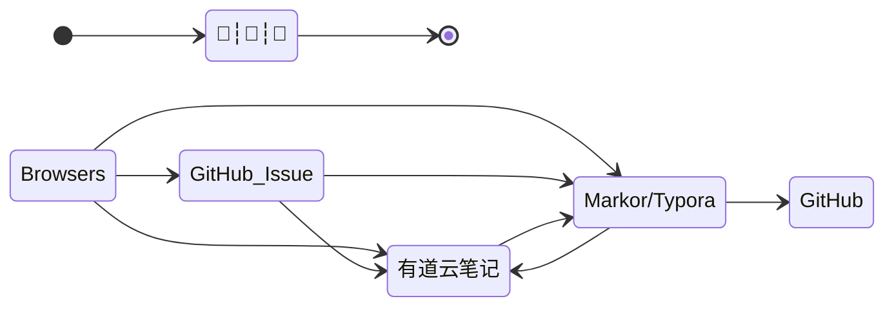

## TODO

- [x] 提交代码至远程仓库
- [ ] [markdown yaml front matter](os/tools/markdown)
- [ ] [github](os/tools/github)
  - [ ] [github awesome 系列](os/tools/github.md#awesome-lists)
- [ ] API
  - [ ] [YApi](os/tools/yapi)
  - [ ] 开放 API 授权
  - [ ] [身份认证](essential/identity.md)
- [ ] JavaScript
- [ ] [ThinkPHP](back-end/thinkphp/)
- [ ] [MySQL](database/mysql/)
- [ ] [开发框架](framework/)
- [ ] [BlockChain](blockchain/)
- [ ] [OS](os/README.md)
  - [ ] 电脑系统安装
  - [ ] [tools](os/tools/README.md)
      - [ ] [hosts.md](os/tools/hosts.md) > 修改 hosts 文件
      - [ ] [app-trial.md](os/tools/app-trial.md)

## Skill

### 知识管理

> 文档进阶之路：*记事本 > Word 文档 > Markdown > Docsify*

<div class="flash-messages"><div class="flash">


</div>

文件整理技巧：

1. https://sspai.com/post/73384 - *我的知识管理方式 - 少数派*

2. https://mp.weixin.qq.com/s/Kjzt2Xo3JE9CslPvauhCpA - *从收藏到永久保存，阿虚沉淀一年的独家稍后阅读姿势！*

### 搜索技巧

1. [搜索引擎](os/tools/browser.md#搜索引擎)

2. [自建 Web search 工具](os/tools/custom-search.md)
    
    - 知乎话题搜索
    
        ```url
    https://www.zhihu.com/search?type=content&q=%s
        ```
    
    - 百度关键词搜索
    
        ```url
        https://www.baidu.com/s?word=%s
        ```
    
    - GitHub 关键词搜索
    
        ```url
        https://github.com/search?q=%s
        ```
    
    - Stack Overflow 搜索
    
        ```url
        https://stackoverflow.com/
        ```
    
    _注：其中 %s 是关键字的占位符。_

3. https://www.chongbuluo.com/ - *虫部落 - 让搜索更简单*
