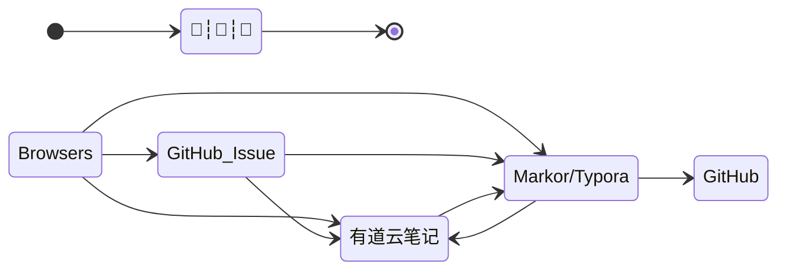

## TODO

- [x] 提交代码至远程仓库<small>优先处理-1</small>
- [ ] [markdown yaml front matter](os/tools/markdown)
- [ ] [github](os/tools/github)
  - [ ] [github awesome 系列](os/tools/github.md#awesome-lists)
- [ ] API
  - [ ] [YApi](os/tools/yapi)
  - [ ] 开放 API 授权
  - [ ] [身份认证](essential/identity.md)
- [ ] JavaScript
- [ ] [ThinkPHP](back-end/thinkphp/)
- [ ] [MySQL](database/mysql/)
- [ ] [开发框架](framework/)
- [ ] [BlockChain](blockchain/)
- [ ] [OS](os/README.md)
  - [ ] 电脑系统安装
  - [ ] [tools](os/tools/README.md)
      - [ ] [hosts#修改 hosts 文件](os/tools/hosts.md#修改-hosts-文件)
      - [ ] [multimedia#功能](os/tools/multimedia.md#功能)<small>优先处理-2</small>

## Skill

### 知识管理

> 文档进阶之路：*记事本 > Word 文档 > Markdown > Docsify*

文件整理技巧：

1. https://sspai.com/post/73384 - *我的知识管理方式 - 少数派*

2. https://mp.weixin.qq.com/s/Kjzt2Xo3JE9CslPvauhCpA - *从收藏到永久保存，阿虚沉淀一年的独家稍后阅读姿势！*
