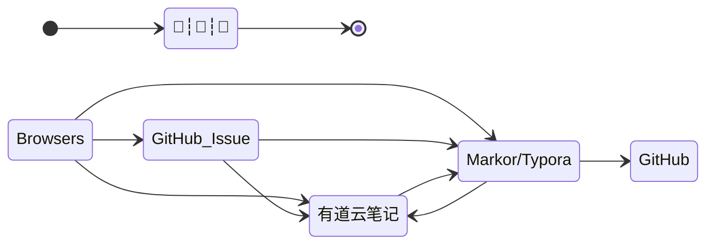

# Getting started

## Skill

### 知识管理

> 文档进阶之路：*记事本 > Word 文档 > Markdown > Docsify*

文件整理技巧：

1. https://sspai.com/post/73384 - *我的知识管理方式 - 少数派*

2. https://mp.weixin.qq.com/s/Kjzt2Xo3JE9CslPvauhCpA - *从收藏到永久保存，阿虚沉淀一年的独家稍后阅读姿势！*

工具：

1. https://www.huluer.com/ - *π-Disk 派盘 ® – 知识管理专家*
