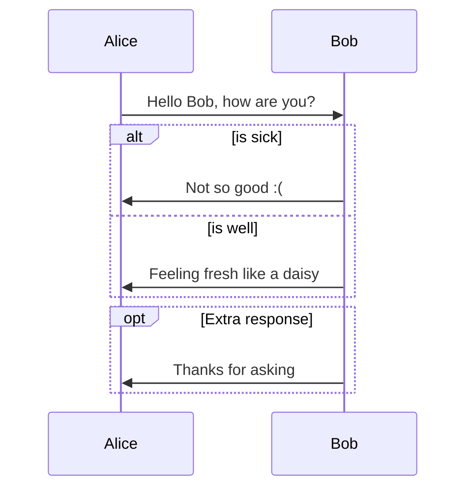
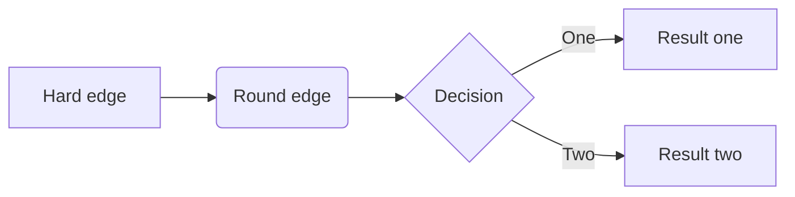
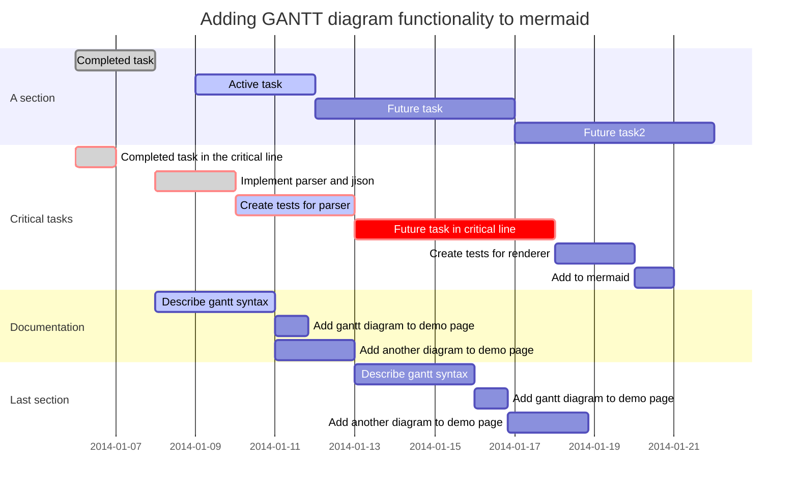
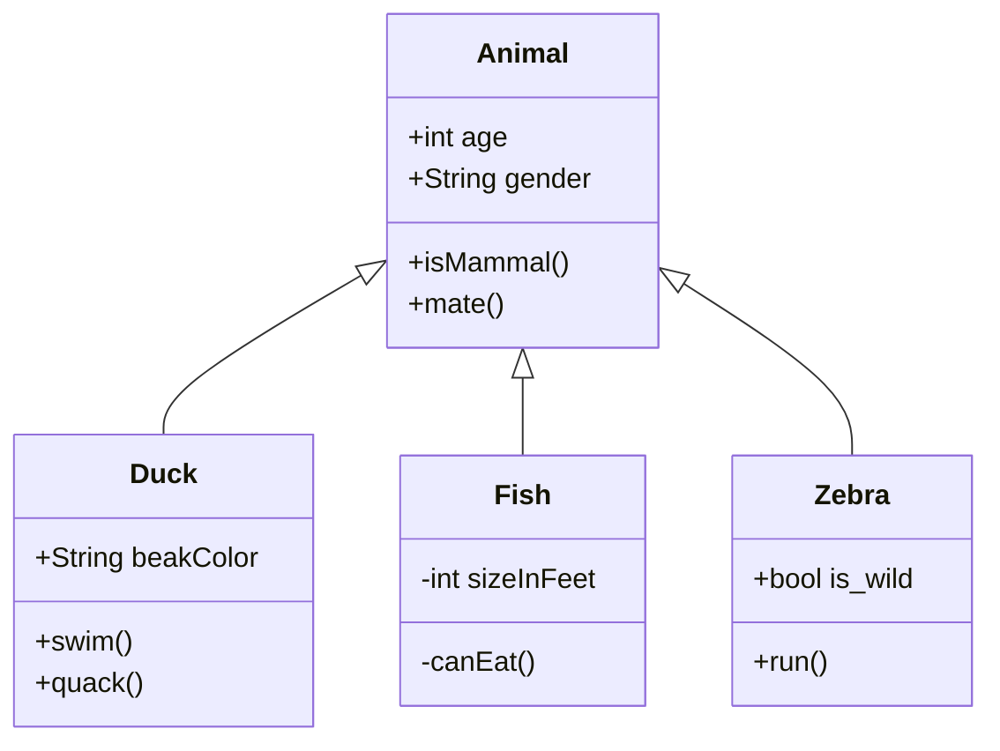
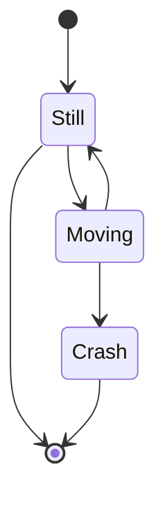

# Markdown

## 简介

>  Markdown 是一种轻量级标记语言，它允许人们使用易读易写的纯文本格式编写文档。  
Markdown 语言在 2004 由约翰·格鲁伯（英语：[John Gruber](https://daringfireball.net/projects/markdown/syntax)）创建。  
Markdown 编写的文档可以导出 HTML 、Word、图像、PDF、Epub 等多种格式的文档。  
Markdown 编写的文档后缀为 `.md`, `.markdown`。

## 使用场景

**Markdown** 是做笔记、为网站创建内容以及生成可打印文档的快速、简便的方法。

- 静态网站
- 文件资料
- 笔记
- 书籍
- 演示文稿
- 邮件
- 协作
- 文档

## 工具

> 📢 软件功能优先查看官方文档。

1. https://www.markdownguide.org/tools/ - *Tools | Markdown Guide*
    1. https://www.markdownguide.org/tools/docsify/ - *Docsify Markdown Reference | Markdown Guide*
    2. https://www.markdownguide.org/tools/github-pages/ - *GitHub Pages Markdown Reference | Markdown Guide*
    3. https://www.markdownguide.org/tools/obsidian/ - *Obsidian Markdown Reference | Markdown Guide*
    4. https://www.markdownguide.org/tools/todoist/ - *Todoist Markdown Reference | Markdown Guide*
    5. https://www.markdownguide.org/tools/typora/ - *Typora Markdown Reference | Markdown Guide*
    6. https://www.markdownguide.org/tools/vscode/ - *VS Code Markdown Reference | Markdown Guide*

2. https://github.com/topics/markdown-editor - *markdown-editor · GitHub Topics · GitHub*

在线编辑器：

1. [Dillinger](https://dillinger.io/) - *Online Markdown Editor - Dillinger, the Last Markdown Editor ever.*

2. [StackEdit](https://stackedit.io/app) - *StackEdit* [GitHub Repo](https://github.com/benweet/stackedit)

    

3. [markdown-it demo](https://markdown-it.github.io/) - *markdown-it demo* [GitHub Repo](https://github.com/markdown-it/markdown-it)

    

4. [Editor.md](http://editor.md.ipandao.com/) - *Editor.md - 开源在线 Markdown 编辑器* [GitHub Repo](https://github.com/pandao/editor.md)

    

5. https://github.com/Tencent/cherry-markdown - *GitHub - Tencent/cherry-markdown: ✨ A Markdown Editor*

    

应用编辑器：

1. [Typora](os/tools/app-list.md#markdown-Typora) （桌面客户端）

2. [Markor](os/mobile/android/app/README.md#markor) （移动客户端）

3. 有关更多工具详细信息，请参阅“[应用列表 > Markdown 工具](os/tools/app-list.md#markdown)”。

站点生成器：

1. [docsify](project/framework/docsify.md)

转换器：

1. [Markdownr](os/mobile/android/app/README.md#markdownr) （移动客户端）

2. [MarkDownload - Markdown Web Clipper](os/tools/browser/extensions/README.md#markdown) （浏览器扩展）

Markdown Support：

GitHub Pages provides support for the following Markdown elements.

| Element | Support | Notes |
| --- | --- | --- |
| [Headings](https://www.markdownguide.org/basic-syntax/#headings) | Yes |  |
| [Paragraphs](https://www.markdownguide.org/basic-syntax/#paragraphs-1) | Yes |  |
| [Line Breaks](https://www.markdownguide.org/basic-syntax/#line-breaks) | Yes |  |
| [Bold](https://www.markdownguide.org/basic-syntax/#bold) | Yes |  |
| [Italic](https://www.markdownguide.org/basic-syntax/#italic) | Yes |  |
| [Blockquotes](https://www.markdownguide.org/basic-syntax/#blockquotes-1) | Yes |  |
| [Ordered Lists](https://www.markdownguide.org/basic-syntax/#ordered-lists) | Yes |  |
| [Unordered Lists](https://www.markdownguide.org/basic-syntax/#unordered-lists) | Yes |  |
| [Code](https://www.markdownguide.org/basic-syntax/#code) | Yes |  |
| [Horizontal Rules](https://www.markdownguide.org/basic-syntax/#horizontal-rules) | Yes |  |
| [Links](https://www.markdownguide.org/basic-syntax/#links) | Yes |  |
| [Images](https://www.markdownguide.org/basic-syntax/#images-1) | Yes |  |
| [Tables](https://www.markdownguide.org/extended-syntax/#tables) | Yes |  |
| [Fenced Code Blocks](https://www.markdownguide.org/extended-syntax/#fenced-code-blocks) | Yes |  |
| [Syntax Highlighting](https://www.markdownguide.org/extended-syntax/#syntax-highlighting) | Yes | Make sure that `syntax_highlighter: rouge` is in the `kramdown` section of the `_config.yml` file. |
| [Footnotes](https://www.markdownguide.org/extended-syntax/#footnotes) | Yes |  |
| [Heading IDs](https://www.markdownguide.org/extended-syntax/#heading-ids) | Yes |  |
| [Definition Lists](https://www.markdownguide.org/extended-syntax/#definition-lists) | Yes |  |
| [Strikethrough](https://www.markdownguide.org/extended-syntax/#strikethrough) | Yes | You can use two tildes (`~~word~~`) or one tilde (`~word~`) — both work. |
| [Task Lists](https://www.markdownguide.org/extended-syntax/#task-lists) | Yes |  |
| [Emoji (copy and paste)](https://www.markdownguide.org/extended-syntax/#copying-and-pasting-emoji) | Unknown |  |
| [Emoji (shortcodes)](https://www.markdownguide.org/extended-syntax/#using-emoji-shortcodes) | Unknown |  |
| [Highlight](https://www.markdownguide.org/extended-syntax/#highlight) | No |  |
| [Subscript](https://www.markdownguide.org/extended-syntax/#subscript) | No |  |
| [Superscript](https://www.markdownguide.org/extended-syntax/#superscript) | No |  |
| [Automatic URL Linking](https://www.markdownguide.org/extended-syntax/#automatic-url-linking) | Yes |  |
| [Disabling Automatic URL Linking](https://www.markdownguide.org/extended-syntax/#disabling-automatic-url-linking) | Yes |  |
| [HTML](https://www.markdownguide.org/basic-syntax/#html) | Yes |  |

### 主题

1. https://sspai.com/post/43873 - *简单又好看，你的 Markdown 文稿也能加上个性化主题 - 少数派*

2. https://theme.typora.io/ - *Themes Gallery — Typora* [中文](https://theme.typoraio.cn/)

3. https://sspai.com/post/59450 - *如何自定义你的 typora 主题，以少数派为例 - 少数派*

    - https://github.com/sheilaCat/typora-theme-css - *GitHub - sheilaCat/typora-theme-css*

        

4. https://zhuanlan.zhihu.com/p/361486179 - *Typora打造最适合编程笔记的精美主题（浅色版和修改后的深色版），可自行修改喜欢的样式。 - 知乎*

5. https://zhuanlan.zhihu.com/p/133863913 - *一份精美的Typora主题 - 知乎*

## 教程

官方：

1. https://daringfireball.net/projects/markdown/ - *Daring Fireball: Markdown*

速查表：

1. https://wangchujiang.com/reference/docs/markdown.html - *Markdown 备忘清单 & markdown cheatsheet & Quick Reference*

指南：

1. https://www.markdownguide.org/ - *Markdown Guide* [GitHub Repo](https://github.com/mattcone/markdown-guide)
    
    
    - https://www.markdown.xyz/ - *Markdown 指南中文版*
2. https://github.com/mundimark/awesome-markdown - *GitHub - mundimark/awesome-markdown: A collection of awesome markdown goodies (libraries, services, editors, tools, cheatsheets, etc.)*
    
3. https://www.runoob.com/markdown/md-tutorial.html - *Markdown 教程 | 菜鸟教程*
4. https://developer.mozilla.org/zh-CN/docs/MDN/Writing_guidelines/Howto/Markdown_in_MDN - *如何使用 Markdown 来撰写文档 - MDN Web 文档项目 | MDN*
5. https://markdown.com.cn/ - *Markdown 官方教程*
6. https://www.markdowntutorial.com/zh-cn/ - *Markdown Tutorial*

博文：

1. https://sspai.com/post/54912 - *Typora 完全使用详解*
2. https://www.jianshu.com/p/49dd84559d3b - *Markdown 语法 with Typora*
3. https://www.jianshu.com/p/b30955885e6d - *Typora Markdown 手册*
4. https://docs.github.com/zh/get-started/writing-on-github/getting-started-with-writing-and-formatting-on-github/basic-writing-and-formatting-syntax - *基本撰写和格式语法 - GitHub Docs*

### 规范

1. https://commonmark.org/ - *CommonMark* [GitHub Org](https://github.com/commonmark)

    
    
    
    

2. https://github.github.com/gfm/ - *GitHub Flavored Markdown Spec*

## 基础语法

These are the elements outlined in John Gruber’s original design document. All Markdown applications support these elements.

https://www.markdownguide.org/cheat-sheet/#basic-syntax - *Markdown Cheat Sheet | Markdown Guide*

https://www.markdownguide.org/basic-syntax/ - *Basic Syntax | Markdown Guide*

Element

- [标题 Heading](#标题)
- [粗体 Bold](#段落元素)
- [斜体 Italic](#段落元素)
- [块引用 Blockquote](#块引用)
- [有序列表 Ordered List](#列表)
- [无序列表 Unordered List](#列表)
- [代码 Code](#代码和代码块)
- [代码块 Code Block](#代码块)
- [水平线 Horizontal Rule](#水平分隔线)
- [链接 Link](#链接)
- [图像 Image](#图片)
- [换行 Line Break](#换行)
- [段落 Paragraph](#换段)

### 标题

```markdown
# Heading level 1
## Heading level 2
### Heading level 3
#### Heading level 4
##### Heading level 5
###### Heading level 6
```

```markdown
Heading level 1
==

Heading level2
--
```

### 空格

在输入连续的空格后，Typora 会在编辑器视图里为你保留这些空格，但当你打印或导出时，这些空格会被省略成一个。

你可以在源代码模式下，为每个空格前加一个 `\` 转义符，或者直接使用 HTML 风格的 `&nbsp;` 来保持连续的空格。

### 换行

https://www.markdownguide.org/basic-syntax/#line-breaks - *Basic Syntax | Markdown Guide*

#### 软换行

用法：使用键盘快捷键 <kbd>Shift</kbd> + <kbd>Enter</kbd>

需要说明的是，在 Markdown 语法中，换行（line break）与换段是不同的。且换行分为软换行和硬换行。

在 Typora 中，你可以通过 <kbd>Shift</kbd> + <kbd>Enter</kbd> 完成一次软换行。软换行只在编辑界面可见，当文档被导出时换行会被省略。

```markdown
This is the first line.
And this is the second line.
```

#### 硬换行

用法：使用键盘快捷键 <kbd>空格</kbd> + <kbd>空格</kbd> + <kbd>Shift</kbd> + <kbd>Enter</kbd>

你可以通过 <kbd>空格</kbd> + <kbd>空格</kbd> + <kbd>Shift</kbd> + <kbd>Enter</kbd> 完成一次硬换行，而这也是许多 Markdown 编辑器所原生支持的。硬换行在文档被导出时将被保留，且没有换段的段后距。

```markdown
First line with two spaces after.  
And the next line.

First line with the HTML tag after.<br>
And the next line.
```

### 换段

https://www.markdownguide.org/basic-syntax/#paragraphs-1 - *Basic Syntax | Markdown Guide*

- <kbd>Enter</kbd>

  你可以通过 <kbd>Enter</kbd> 完成一次换段。Typora 会自动帮你完成两次 <kbd>Shift</kbd> + <kbd>Enter</kbd> 的软换行，从而完成一次换段。这也意味着在 Markdown 语法下，换段是通过在段与段之间加入空行来实现的。

- 换段

  连续两次 <kbd>Shift</kbd> + <kbd>Enter</kbd>

```markdown
I really like using Markdown.

I think I'll use it to format all of my documents from now on.
```

**Windows 风格（CR+LF）与 Unix 风格（CR）的换行符：**

因为 CR 表示回车 `\r` ，即回到一行的开头，而 LF 表示换行 `\n` ，即另起一行，所以 Windows 风格的换行符本质是「回车 + 换行」，而 Unix 风格的换行符是「换行」。这也是为什么 Unix / Mac 系统下的文件，在 Windows 系统直接打开会全部在同一行内。 你可以在 Typora 的 `文件 > 偏好设置 > 编辑器 > 默认换行符` 设置中对此进行切换。

### 链接

<!-- tabs:start -->

#### **Rendered**

My favorite search engine is *[Duck Duck Go](https://duckduckgo.com)*.

#### 添加标题

[Duck Duck Go](https://duckduckgo.com  "The best search engine for privacy")

#### 网址和电子邮件地址

<https://www.markdownguide.org>

<fake@example.com>

#### 引用式链接

[John Gruber][df1]

[JavaScript Location 对象][JavaScript Location 对象]

[JavaScript Location 对象]: https://www.runoob.com/jsref/met-loc-reload.html "Location reload()方法"
[df1]: http://daringfireball.net/projects/markdown "Hobbit lifestyles"

#### **Markdown**

```markdown
My favorite search engine is *[Duck Duck Go](https://duckduckgo.com)*.

#### 添加标题
[Duck Duck Go](https://duckduckgo.com "The best search engine for privacy")

#### 网址和电子邮件地址
<https://www.markdownguide.org>
<fake@example.com>

#### 引用式链接
[John Gruber][df1]
[JavaScript Location 对象][JavaScript Location 对象]

[JavaScript Location 对象]: https://www.runoob.com/jsref/met-loc-reload.html "Location reload()方法"
[df1]: http://daringfireball.net/projects/markdown "Hobbit lifestyles"
```

<!-- tabs:end -->

### 图片

<!-- tabs:start -->

#### **Rendered**


> `Typora` 编辑器中图片默认居中对齐，如需左对齐，可在图片后加一个空格。

#### 带链接（尺寸缩小）的图片

[](http://liqucn.com/bz/1154169.wml)

#### 图片说明

<figure>
    
    <figcaption>A single track trail outside of Albuquerque, New Mexico.</figcaption>
</figure>

图片说明参考：https://www.markdownguide.org/hacks/#image-captions

#### 引用式图片

目前已知 3 种引用方式：

- 方式 1、本地路径：`**/*.jpeg`
- 方式 2、URL：`https://*`
- 方式 3、图片 Base64 编码：`data:URL`

方式 1：

![引用式图片-1][quote-image-1]

方式 2：

![引用式图片-2][quote-image-2]

方式 3：

![引用式图片-3][quote-image-3]

[quote-image-1]: ../../../_media/images.liqucn.jpeg

[quote-image-2]: https://images.liqucn.com/img/h23/h09/img_localize_f78a645ac5fea528e1ca6dc4c87b1167_400x400.png

[quote-image-3]: data:image/svg+xml;base64,PHN2ZyB3aWR0aD0iMjUwMCIgaGVpZ2h0PSIzMjciIHZpZXdCb3g9IjAgMCA1MTIgNjciIHhtbG5zPSJodHRwOi8vd3d3LnczLm9yZy8yMDAwL3N2ZyIgcHJlc2VydmVBc3BlY3RSYXRpbz0ieE1pZFlNaWQiPjxwYXRoIGQ9Ik0yMjEuMDM0IDQzLjMwM2gzMy44MzJsLTE3Ljg4OS0yOC43ODEtMzIuODMzIDUyLjAzN2gtMTQuOTQybDM5LjkzNS02Mi41MDhjMS43MzYtMi41MjUgNC42My00LjA1MSA3Ljg0LTQuMDUxIDMuMTA0IDAgNS45OTggMS40NzMgNy42ODIgMy45NDZsNDAuMDkzIDYyLjYxM0gyNjkuODFsLTcuMDUtMTEuNjI4aC0zNC4yNTNsLTcuNDcyLTExLjYyOHpNMzc2LjI1MSA1NC45M1YuNjMxaC0xMi42OHY1OS42MTRjMCAxLjYzMS42MzEgMy4yMSAxLjg0MSA0LjQyczIuODQxIDEuODk0IDQuNjMgMS44OTRoNTcuODI1bDcuNDcyLTExLjYyOEgzNzYuMjV6bS0yMDkuNzgtOS43MzRjMTIuMzEzIDAgMjIuMzEtOS45NDQgMjIuMzEtMjIuMjU2IDAtMTIuMzEzLTkuOTk3LTIyLjMxLTIyLjMxLTIyLjMxaC01NS40NzNWNjYuNTZoMTIuNjc2di01NC4zaDQxLjk1NmM1Ljg5MyAwIDEwLjYyOCA0Ljc4OSAxMC42MjggMTAuNjgyIDAgNS44OTItNC43MzUgMTAuNjgtMTAuNjI4IDEwLjY4bC0zNS43NDctLjA1MiAzNy44NTEgMzIuOTloMTguNDE2bC0yNS40NjYtMjEuMzYyaDUuNzg4ek0zMi45NyA2Ni41NTlDMTQuNzcgNjYuNTYgMCA1MS44MjcgMCAzMy42MjIgMCAxNS40MTYgMTQuNzcuNjMyIDMyLjk3LjYzMmgzOC4zMmMxOC4yMDQgMCAzMi45NjMgMTQuNzg0IDMyLjk2MyAzMi45OSAwIDE4LjIwNS0xNC43NTkgMzIuOTM3LTMyLjk2NCAzMi45MzdIMzIuOTd6bTM3LjQ2OC0xMS42MjhjMTEuNzkxIDAgMjEuMzQxLTkuNTI0IDIxLjM0MS0yMS4zMSAwLTExLjc4NS05LjU1LTIxLjM2MS0yMS4zNDEtMjEuMzYxaC0zNi42MmMtMTEuNzg3IDAtMjEuMzQyIDkuNTc2LTIxLjM0MiAyMS4zNjIgMCAxMS43ODUgOS41NTUgMjEuMzA5IDIxLjM0MSAyMS4zMDloMzYuNjJ6bTI0MC43OCAxMS42MjhjLTE4LjIwNCAwLTMyLjk5LTE0LjczMi0zMi45OS0zMi45MzcgMC0xOC4yMDYgMTQuNzg2LTMyLjk5IDMyLjk5LTMyLjk5aDQ1LjUxNGwtNy40MiAxMS42MjhIMzEyLjA2Yy0xMS43ODYgMC0yMS4zNjIgOS41NzYtMjEuMzYyIDIxLjM2MiAwIDExLjc4NSA5LjU3NiAyMS4zMDkgMjEuMzYyIDIxLjMwOWg0NS43MjNsLTcuNDcyIDExLjYyOGgtMzkuMDkzem0xNTUuMDYtMTEuNjI4Yy05LjczNCAwLTE3Ljk5NS02LjUyNC0yMC41Mi0xNS41MjJoNTQuMTk0bDcuNDcxLTExLjYyOGgtNjEuNjY1YzIuNTI1LTguOTQ1IDEwLjc4Ni0xNS41MjEgMjAuNTItMTUuNTIxaDM3LjJMNTExIC42M2gtNDUuNTY1Yy0xOC4yMDUgMC0zMi45OSAxNC43ODUtMzIuOTkgMzIuOTkgMCAxOC4yMDYgMTQuNzg1IDMyLjkzOCAzMi45OSAzMi45MzhoMzkuMDk0TDUxMiA1NC45MzFoLTQ1LjcyM3oiIGZpbGw9IiNFQTFCMjIiLz48L3N2Zz4=

#### **Markdown**

```markdown


> `Typora` 编辑器中图片默认居中对齐，如需左对齐，在图片后加一个空格

#### 带链接（尺寸缩小）的图片

[](http://liqucn.com/bz/1154169.wml)

#### 图片说明

<figure>
    
    <figcaption>A single track trail outside of Albuquerque, New Mexico.</figcaption>
</figure>

#### 引用式图片

方式 1：

![引用式图片-1][quote-image-1]

方式 2：

![引用式图片-2][quote-image-2]

方式 3：

![引用式图片-3][quote-image-3]

[quote-image-1]: ../../../_media/images.liqucn.jpeg

[quote-image-2]: https://images.liqucn.com/img/h23/h09/img_localize_f78a645ac5fea528e1ca6dc4c87b1167_400x400.png

[quote-image-3]: data:image/svg+xml;base64,PHN2ZyB3aWR0aD0iMjUwMCIgaGVpZ2h0PSIzMjciIHZpZXdCb3g9IjAgMCA1MTIgNjciIHhtbG5zPSJodHRwOi8vd3d3LnczLm9yZy8yMDAwL3N2ZyIgcHJlc2VydmVBc3BlY3RSYXRpbz0ieE1pZFlNaWQiPjxwYXRoIGQ9Ik0yMjEuMDM0IDQzLjMwM2gzMy44MzJsLTE3Ljg4OS0yOC43ODEtMzIuODMzIDUyLjAzN2gtMTQuOTQybDM5LjkzNS02Mi41MDhjMS43MzYtMi41MjUgNC42My00LjA1MSA3Ljg0LTQuMDUxIDMuMTA0IDAgNS45OTggMS40NzMgNy42ODIgMy45NDZsNDAuMDkzIDYyLjYxM0gyNjkuODFsLTcuMDUtMTEuNjI4aC0zNC4yNTNsLTcuNDcyLTExLjYyOHpNMzc2LjI1MSA1NC45M1YuNjMxaC0xMi42OHY1OS42MTRjMCAxLjYzMS42MzEgMy4yMSAxLjg0MSA0LjQyczIuODQxIDEuODk0IDQuNjMgMS44OTRoNTcuODI1bDcuNDcyLTExLjYyOEgzNzYuMjV6bS0yMDkuNzgtOS43MzRjMTIuMzEzIDAgMjIuMzEtOS45NDQgMjIuMzEtMjIuMjU2IDAtMTIuMzEzLTkuOTk3LTIyLjMxLTIyLjMxLTIyLjMxaC01NS40NzNWNjYuNTZoMTIuNjc2di01NC4zaDQxLjk1NmM1Ljg5MyAwIDEwLjYyOCA0Ljc4OSAxMC42MjggMTAuNjgyIDAgNS44OTItNC43MzUgMTAuNjgtMTAuNjI4IDEwLjY4bC0zNS43NDctLjA1MiAzNy44NTEgMzIuOTloMTguNDE2bC0yNS40NjYtMjEuMzYyaDUuNzg4ek0zMi45NyA2Ni41NTlDMTQuNzcgNjYuNTYgMCA1MS44MjcgMCAzMy42MjIgMCAxNS40MTYgMTQuNzcuNjMyIDMyLjk3LjYzMmgzOC4zMmMxOC4yMDQgMCAzMi45NjMgMTQuNzg0IDMyLjk2MyAzMi45OSAwIDE4LjIwNS0xNC43NTkgMzIuOTM3LTMyLjk2NCAzMi45MzdIMzIuOTd6bTM3LjQ2OC0xMS42MjhjMTEuNzkxIDAgMjEuMzQxLTkuNTI0IDIxLjM0MS0yMS4zMSAwLTExLjc4NS05LjU1LTIxLjM2MS0yMS4zNDEtMjEuMzYxaC0zNi42MmMtMTEuNzg3IDAtMjEuMzQyIDkuNTc2LTIxLjM0MiAyMS4zNjIgMCAxMS43ODUgOS41NTUgMjEuMzA5IDIxLjM0MSAyMS4zMDloMzYuNjJ6bTI0MC43OCAxMS42MjhjLTE4LjIwNCAwLTMyLjk5LTE0LjczMi0zMi45OS0zMi45MzcgMC0xOC4yMDYgMTQuNzg2LTMyLjk5IDMyLjk5LTMyLjk5aDQ1LjUxNGwtNy40MiAxMS42MjhIMzEyLjA2Yy0xMS43ODYgMC0yMS4zNjIgOS41NzYtMjEuMzYyIDIxLjM2MiAwIDExLjc4NSA5LjU3NiAyMS4zMDkgMjEuMzYyIDIxLjMwOWg0NS43MjNsLTcuNDcyIDExLjYyOGgtMzkuMDkzem0xNTUuMDYtMTEuNjI4Yy05LjczNCAwLTE3Ljk5NS02LjUyNC0yMC41Mi0xNS41MjJoNTQuMTk0bDcuNDcxLTExLjYyOGgtNjEuNjY1YzIuNTI1LTguOTQ1IDEwLjc4Ni0xNS41MjEgMjAuNTItMTUuNTIxaDM3LjJMNTExIC42M2gtNDUuNTY1Yy0xOC4yMDUgMC0zMi45OSAxNC43ODUtMzIuOTkgMzIuOTkgMCAxOC4yMDYgMTQuNzg1IDMyLjkzOCAzMi45OSAzMi45MzhoMzkuMDk0TDUxMiA1NC45MzFoLTQ1LjcyM3oiIGZpbGw9IiNFQTFCMjIiLz48L3N2Zz4=
```

<!-- tabs:end -->

### 块引用

To create a blockquote, add a > in front of a paragraph.

```markdown
> Dorothy followed her through many of the beautiful rooms in her castle.
```

The rendered output looks like this:

> Dorothy followed her through many of the beautiful rooms in her castle.

<!-- tabs:start -->

#### **Rendered**

> Dorothy followed her through many of the beautiful rooms in her castle.

#### **Markdown**

```markdown
> Dorothy followed her through many of the beautiful rooms in her castle.
```

<!-- tabs:end -->

### 段落元素

<!-- tabs:start -->

#### **Rendered**

**加粗**

<strong>标签</strong>

*斜体*

_this text is surrounded by literal asterisks_

~~删除线~~

<u>下划线</u>

#### **Markdown**

```markdown
**加粗**

<strong>标签</strong>

*斜体*

_this text is surrounded by literal asterisks_

~~删除线~~

<u>下划线</u>
```

<!-- tabs:end -->

#### 代码和代码块

<!-- tabs:start -->

##### **Rendered**

*代码：*

Use the `printf()` function.

*代码块：*

```
{
"firstName": "John",
"lastName": "Smith",
"age": 25
}
```

*语法高亮：*

```json
{
"firstName": "John",
"lastName": "Smith",
"age": 25
}
```

```javascript
function test() {
 console.log("notice the blank line before this function?");
}
```

```php
Indent paragraphs to include them in the footnote.

`{ my code }`

Add as many paragraphs as you like.
```

```diff
- https://clients2.google.com/service/update2/crx?response=redirect&x=id%3D<这里是扩展ID>%26uc&prodversion=32
+ https://clients2.google.com/service/update2/crx?response=redirect&x=id%3Diheapfheanfjcemgneblljhaebonakbg%26uc&prodversion=32
```

扩展：*可在工具 Typora 或者 [GitHub](https://github.com/jaywcjlove/oscnews/blob/e06905d5e134c5665ab76f866eba3abccc2029ce/README.md?plain=1#L81C1-L84C4) 中查看上面代码块（diff）不一样的渲染效果*。

##### **Markdown**

*代码：*

```markdown
Use the `printf()` function.
```

*代码块：*

````markdown
```
{
"firstName": "John",
"lastName": "Smith",
"age": 25
}
```
````

*语法高亮：*

> [语法语言](project/framework/prism.md#支持的语言)：  
> 1. 命令行语言：`sh`、`shell`、`bash`、`powershell`

~~~markdown
```json
{
"firstName": "John",
"lastName": "Smith",
"age": 25
}
```
~~~

<!-- tabs:end -->

#### HTML 标签

<!-- tabs:start -->

##### **Rendered**

<code style="color: #c7254e;">`underline`</code>

<span style="color:red">This text is red.</span>

<ruby> 漢 <rt> ㄏㄢˋ </rt> </ruby>

*键盘：*

<kbd>Ctrl</kbd> + <kbd>F9</kbd>

HTML entities like &reg; &#182;

<details>
 <summary>I have keys but no locks. I have space but no room. You can enter but can't leave. What am I?</summary>
 A keyboard.
</details>

<details>
<summary><span style="color:red">Click to Expand ~</span></summary>
Color is red.
</details>

*iframe：*

<iframe height='265' scrolling='no' title='Fancy Animated SVG Menu' src='https://codepen.io/jeangontijo/embed/OxVywj/?height=265&theme-id=0&default-tab=css,result&embed-version=2' frameborder='no' allowtransparency='true' allowfullscreen='true' style='width: 100%;'></iframe>

<blockquote class="twitter-tweet"><p lang="en" dir="ltr">Sunsets don&#39;t get much better than this one over <a href="https://twitter.com/GrandTetonNPS?ref_src=twsrc%5Etfw">@GrandTetonNPS</a>. <a href="https://twitter.com/hashtag/nature?src=hash&amp;ref_src=twsrc%5Etfw">#nature</a> <a href="https://twitter.com/hashtag/sunset?src=hash&amp;ref_src=twsrc%5Etfw">#sunset</a> <a href="http://t.co/YuKy2rcjyU">pic.twitter.com/YuKy2rcjyU</a></p>&mdash; US Department of the Interior (@Interior) <a href="https://twitter.com/Interior/status/463440424141459456?ref_src=twsrc%5Etfw">May 5, 2014</a></blockquote>
<script async src="https://platform.twitter.com/widgets.js" charset="utf-8"></script>

##### **Markdown**

```markdown
<code style="color: #c7254e;">`underline`</code>
```

```markdown
<span style="color:red">This text is red.</span>
```

```html
<style>
    .text-danger {
        color: #c7254e;
    }
</style>
```

```markdown
<ruby> 漢 <rt> ㄏㄢˋ </rt> </ruby>
```

*键盘：*

```markdown
<kbd>Ctrl</kbd> + <kbd>F9</kbd>
```

```markdown
HTML entities like &reg; &#182;
```

```html
<details>
 <summary>I have keys but no locks. I have space but no room. You can enter but can't leave. What am I?</summary>
 A keyboard.
</details>
```

*iframe：*

```html
<iframe height='265' scrolling='no' title='Fancy Animated SVG Menu' src='https://codepen.io/jeangontijo/embed/OxVywj/?height=265&theme-id=0&default-tab=css,result&embed-version=2' frameborder='no' allowtransparency='true' allowfullscreen='true' style='width: 100%;'></iframe>
```

```html
<blockquote class="twitter-tweet"><p lang="en" dir="ltr">Sunsets don&#39;t get much better than this one over <a href="https://twitter.com/GrandTetonNPS?ref_src=twsrc%5Etfw">@GrandTetonNPS</a>. <a href="https://twitter.com/hashtag/nature?src=hash&amp;ref_src=twsrc%5Etfw">#nature</a> <a href="https://twitter.com/hashtag/sunset?src=hash&amp;ref_src=twsrc%5Etfw">#sunset</a> <a href="http://t.co/YuKy2rcjyU">pic.twitter.com/YuKy2rcjyU</a></p>&mdash; US Department of the Interior (@Interior) <a href="https://twitter.com/Interior/status/463440424141459456?ref_src=twsrc%5Etfw">May 5, 2014</a></blockquote>
<script async src="https://platform.twitter.com/widgets.js" charset="utf-8"></script>
```

<!-- tabs:end -->

### 列表

<!-- tabs:start -->

#### **Rendered**

*有序列表：*

1. 序号1
2. 序号2
3. 序号3

*无序列表：*

- 序号1
- 序号2
- 序号3

*任务列表：*

- [x] 任务1
- [ ] 任务2
- [ ] 任务3

#### **Markdown**

*有序列表：*

```markdown
1. 序号1
2. 序号2
3. 序号3
```

*无序列表：*

```markdown
- 序号1
- 序号2
- 序号3
```

*任务列表：*

```markdown
- [x] 任务1
- [ ] 任务2
- [ ] 任务3
```

<!-- tabs:end -->

### 水平分隔线

<!-- tabs:start -->

#### **Rendered**

***

---

___

#### **Markdown**

```markdown
***

---

___
```

<!-- tabs:end -->

### 转义字符

要显示原本用于格式化 Markdown 文档的字符，请在字符前面添加反斜杠字符 (`\`) 。

https://www.markdownguide.org/basic-syntax/#characters-you-can-escape - *Basic Syntax | Markdown Guide*

You can use a backslash to escape the following characters.

| Character | Name |
| --- | --- |
| \ | backslash |
| ` | backtick (see also [escaping backticks in code](https://www.markdownguide.org/extended-syntax/#escaping-backticks)) |
| * | asterisk |
| _ | underscore |
| { } | curly braces |
| \[ \] | brackets |
| < > | angle brackets |
| ( ) | parentheses |
| # | pound sign |
| + | plus sign |
| - | minus sign (hyphen) |
| . | dot |
| ! | exclamation mark |
| \| | pipe (see also [escaping pipe in tables](https://www.markdownguide.org/extended-syntax/#escaping-pipe-characters-in-tables)) |

<!-- tabs:start -->

#### **Rendered**

\* 如果没有开头的反斜杠字符的话，这一行将显示为无序列表。

#### **Markdown**

```markdown
\* 如果没有开头的反斜杠字符的话，这一行将显示为无序列表。
```

<!-- tabs:end -->

## 扩展语法

These elements extend the basic syntax by adding additional features. Not all Markdown applications support these elements.

https://www.markdownguide.org/cheat-sheet/#extended-syntax - *Markdown Cheat Sheet | Markdown Guide*

https://www.markdownguide.org/extended-syntax/ - *Extended Syntax | Markdown Guide*

Element：

- [表格 Table](#表格)
- [围栏代码块 Fenced Code Block](#代码和代码块)
- [语法高亮 Syntax Highlighting](#代码和代码块)
- [脚注 Footnote](#脚注)
- [标题 ID Heading ID](#自定义标题的-id)
- [定义列表 Definition List](#定义列表)
- [删除线 Strikethrough](#段落元素)
- [任务列表 Task List](#列表)
- [Emoji](#emoji-表情)
- [高亮 Highlight](#高亮)
- [上标 Subscript](#上标)
- [下标 Superscript](#下标)
- [自动 URL 链接 Automatic URL Linking](#自动将-url-转换为链接)
- [禁用自动 URL 链接 Disabling Automatic URL Linking](#禁止自动将-url-转换为链接)

### 目录

> *TOC* 是 *Table of Contents* 的缩写

<!-- tabs:start -->

#### **Rendered**

下列的 *渲染效果* 在 `Typora` 编辑器可见（注：去掉中括号 `[]` 内的反引号 ` 查看效果）。

[`TOC]

#### **Markdown**

```markdown
[`TOC]
```

<!-- tabs:end -->

### 表格

<!-- tabs:start -->

#### **Rendered**

| Syntax    | Description |
| --------- | ----------- |
| Header    | Title       |
| Paragraph | Text        |

*对齐：*

| Syntax    | Description |   Test Text |
| :-------- | :---------: | ----------: |
| Header    |    Title    | Here's this |
| Paragraph |    Text     |    And more |

#### **Markdown**

```markdown
| Syntax      | Description |
| ----------- | ----------- |
| Header      | Title       |
| Paragraph   | Text        |
```

*对齐：*

```markdown
| Syntax      | Description | Test Text     |
| :---        |    :----:   |          ---: |
| Header      | Title       | Here's this   |
| Paragraph   | Text        | And more      |
```

<!-- tabs:end -->

### Emoji 表情

<!-- tabs:start -->

#### **Rendered**

*复制并粘贴表情符号：*

[emojipedia](https://emojipedia.org/ "简单地从 Emojipedia 等来源复制表情符号，然后将其粘贴到文档中。")

[emojikeyboard](https://emojikeyboard.org/ "可安装google扩展程序")

🎅🐶

*使用表情符号的简码：*

[表情符号简码列表](https://gist.github.com/rxaviers/7360908 "请记住，表情符号的简码随着 Markdown 应用程序的不同而不同。")

Gone camping! :tent: Be back soon.

That is so funny! :joy:

:smirk::smile::cold_sweat::tent::game_die:

#### **Markdown**

*复制并粘贴表情符号：*

```markdown
🎅🐶
```

*使用表情符号的简码：*

```markdown
Gone camping! :tent: Be back soon.

That is so funny! :joy:

:smirk::smile::cold_sweat::tent::game_die:
```

<!-- tabs:end -->

### 高亮

<!-- tabs:start -->

#### **Rendered**

==highlight==

I need to highlight these <mark>very important words</mark>.

#### **Markdown**

```markdown
==highlight==

I need to highlight these <mark>very important words</mark>.
```

<!-- tabs:end -->

### 脚注

<!-- tabs:start -->

#### **Rendered**

Here's a simple footnote,[^1] and here's a longer one.[^bignote]

[^1]: This is the first footnote.

[^bignote]: Here's one with multiple paragraphs and code.

#### **Markdown**

```markdown
Here's a simple footnote,[^1] and here's a longer one.[^bignote]

[^1]: This is the first footnote.
[^bignote]: Here's one with multiple paragraphs and code.
```

<!-- tabs:end -->

https://www.markdownguide.org/extended-syntax/#footnotes - *Extended Syntax | Markdown Guide*

### 上标

> 需开启 `Typora` 工具的「上标」设置 *文件 > 偏好设置 > Markdown > Markdown扩展语法*，设置完后重启工具

<!-- tabs:start -->

#### **Rendered**

X^2^

X<sup>2</sup>

#### **Markdown**

```markdown
X^2^

X<sup>2</sup>
```

<!-- tabs:end -->

### 下标

> 需开启 `Typora` 工具的「下标」设置 *文件 > 偏好设置 > Markdown > Markdown扩展语法*，设置完后重启工具

<!-- tabs:start -->

#### **Rendered**

H~2~O, X~long\ text~

H<sub>2</sub>O

#### **Markdown**

```markdown
H~2~O, X~long\ text~

H<sub>2</sub>O
```

<!-- tabs:end -->

### 图表

> Diagrams

🪜 http://support.Typora.io/Draw-Diagrams-With-Markdown/ - *Draw Diagrams With Markdown - Typora Support*

- Sequence Diagrams - *序列图*
- Flowcharts - *流程图*
- Gantt Charts - *甘特图*
- Class Diagrams - *类图*
- State Diagrams - *状态图*
- Pie Charts - *饼图*
- Requirement Diagram - *需求图*
- 更多查阅上述链接

JS 插件：

1. https://github.com/mermaid-js/mermaid - *GitHub - mermaid-js/mermaid: Generation of diagrams like flowcharts or sequence diagrams from text in a similar manner as markdown*
2. https://github.com/Leward/mermaid-docsify - *GitHub - Leward/mermaid-docsify: A plugin to render mermaid diagrams in docsify*

<!-- tabs:start -->

#### **Rendered**

*序列图* （依赖 [js-sequence-diagrams](framework/javascript-plugins.md#流程图) 插件）

```sequence
Alice->Bob: Hello Bob, how are you?
Note right of Bob: Bob thinks
Bob-->Alice: I am good thanks!
```

<details class="details-reset"><summary class="btn">依赖 Mermaid 插件 <span class="dropdown-caret"></span></summary>
<div class="border p-3 mt-2">

*序列图：*



*流程图：*



*甘特图：*



*类图：*



*状态图：*



</div>
</details>

#### **Markdown**

*时序图*

~~~markdown
```sequence
Alice->Bob: Hello Bob, how are you?
Note right of Bob: Bob thinks
Bob-->Alice: I am good thanks!
```
~~~

<!-- tabs:end -->

### 数学公式

> LaTex 语法

🪜 https://support.typora.io/Math/ - *Math and Academic Functions - Typora Support*

JS 插件：

1. https://github.com/scruel/docsify-latex - *GitHub - scruel/docsify-latex: A docsify.js plugin for typesetting LaTeX with display engines from markdown.*

<!-- tabs:start -->

#### **Rendered**

$$
E=mc^2
$$

#### **Markdown**

``` markdown
$$
E=mc^2
$$
```

<!-- tabs:end -->

内联公式：

🪜 https://support.typora.io/Math/#inline-math - *Math and Academic Functions - Typora Support*

### 链接

#### 自动将 URL 转换为链接

许多 Markdown 解析器会自动将 URL 转换为链接。这意味着，即使你没有 [使用中括号](https://www.markdown.xyz/basic-syntax/#links)，如果你输入 <http://www.example.com/>，你的 Markdown 解析器也会自动将其转换为链接。

#### 禁止自动将 URL 转换为链接

如果你不希望自动将 URL 转换为链接，则可以通过反引号 将 URL 表示为代码 。

<!-- tabs:start -->

##### **Rendered**

`http://www.example.com`

##### **Markdown**

```markdown
`http://www.example.com`
```

<!-- tabs:end -->

### 自定义标题的 ID

<!-- tabs:start -->

#### **Rendered**

*链接到标题的ID*

[Heading IDs](#使用场景)

[Heading IDs](https://www.markdown.xyz/extended-syntax#heading-ids)

#### **Markdown**

```markdown
### My Great Heading {#custom-id}
<h3 id="custom-id">My Great Heading</h3>
```

*链接到标题的ID*

```markdown
[Heading IDs](#使用场景)
[Heading IDs](https://www.markdown.xyz/extended-syntax#heading-ids)
```

<!-- tabs:end -->

### 定义列表

> `Typora` 不支持

<!-- tabs:start -->

#### **Rendered**

First Term  
: This is the definition of the first term.

Second Term  
: This is one definition of the second term.
: This is another definition of the second term.

---

<dl>
<dt>First Term</dt>
<dd>This is the definition of the first term.</dd>
<dt>Second Term</dt>
<dd>This is one definition of the second term. </dd>
<dd>This is another definition of the second term.</dd>
</dl>

#### **Markdown**

```markdown
First Term  
: This is the definition of the first term.

Second Term  
: This is one definition of the second term.
: This is another definition of the second term.
---
<dl>
<dt>First Term</dt>
<dd>This is the definition of the first term.</dd>
<dt>Second Term</dt>
<dd>This is one definition of the second term. </dd>
<dd>This is another definition of the second term.</dd>
</dl>
```

<!-- tabs:end -->

### YAML Front Matter

YAML Front Matter is a section of a document, typically found at the top of Markdown files, that contains metadata about the document. This metadata is written in YAML (YAML Ain't Markup Language) format and is enclosed by triple dashes (`---`) at the beginning and end of the section. Here is an example:

```yaml
---
title: "My Document Title"
author: "Author Name"
date: "2024-06-29"
tags: ["tag1", "tag2", "tag3"]
---
```

This metadata can include various types of information, such as the document title, author, date, tags, and more. It is commonly used in static site generators like Jekyll, Hugo, and others to provide additional context and information about the content.

<!-- tabs:start -->

#### **Rendered**

---

title: Markdown in Typora
author: John Snow
creator: Typora inc.
subject: Tutorial

---

#### **Markdown**

> YAML Front Matter 的用法与 Hexo 、Jekyll 有关？

```yaml
---
title: Markdown in Typora
author: John Snow
creator: Typora inc.
subject: Tutorial
keywords: [Pandoc, Tutorial, Export]
---
```

<!-- tabs:end -->

🪜 [*YAML Front Matter* 用法](https://support.Typora.io/YAML/)

```yaml
title: Typora
```

```yaml
Typora-root-url: image
```

🪜 [*Typora-root-url* 用法](https://support.Typora.io/Markdown-Reference/#images)

## Hacks

https://www.markdownguide.org/hacks/ - *Hacks | Markdown Guide*

Element：

- [下划线 Underline](#underline)
- [缩进（制表符）Indent (Tab)](#indent-tab)
- [居中 Center](#center)
- [颜色 Color](#color)

### Underline

https://www.markdownguide.org/hacks/#underline - *Hacks | Markdown Guide - Hacks | Markdown Guide*

### Indent (Tab)

https://www.markdownguide.org/hacks/#indent-tab - *Hacks | Markdown Guide - Hacks | Markdown Guide*

### Center

https://www.markdownguide.org/hacks/#center - *Hacks | Markdown Guide - Hacks | Markdown Guide*

### Color

https://www.markdownguide.org/hacks/#color - *Hacks | Markdown Guide - Hacks | Markdown Guide*
