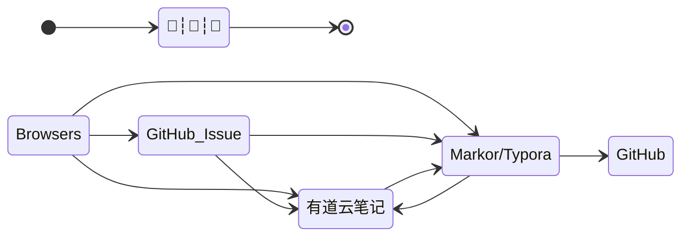

> 文档进阶之路：*记事本 > Word 文档 > Markdown > Docsify*

1. *学习* > [书籍](home/book.md) + [站长](home/good-share.md) + [前端](front-end/#学习资源)
2. _Shell_ >
    - [Windows cmd /*.bat](os/windows/README.md#windows-bat-脚本)
    - [Windows powershell /*.ps1](os/windows/README.md#windows-powershell)
    -  [Linux Shell /Bash-*.sh](os/linux/linux-shell.md)（[*Bash 脚本教程*](https://wangdoc.com/bash/)）
    - [Git Bash](https://git-scm.com/book/en/v2/Appendix-A:-Git-in-Other-Environments-Git-in-Bash)（*命令行工具*）
    - _命令_ >>
        - [Windows](os/windows/windows-cli.md)
        - [Linux](os/linux/linux%20指令.md)
3. _模板_ > [文档模板](home/document-template.md) + [官网模板](开发框架/official-website.md) + [后台管理模板](开发框架/后台模板/README.md)
4. _文档网站生成_ >  [Docsify](os/tools/docsify.md) + [文档网站生成器](开发框架/README.md#文档网站生成器)
5. _大厂_ > [Microsoft]() + [Apple Inc.]() + [Google Inc.](os/tools/google.md)
6. _站点搭建、部署_ > 
    1. [服务器](essential/hosting.md) - *可购买服务器*
    2. [部署](project/README.md#部署) - *可购买服务器*
    3. Docsify + GitHub Pages
    4. VitePress + Algolia (Demo: https://ruanyf-weekly.vercel.app/)
7. _专题文章_ >
    - [x] [广告过滤](topic/ad-filter.md) 
    - [ ] [Google 翻译]()
    - [x] [视频](topic/video.md)
    - [x] [体育](topic/sport.md)
