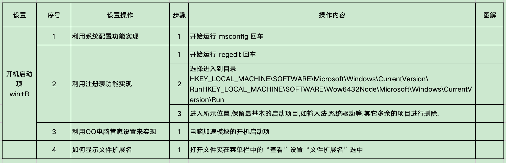
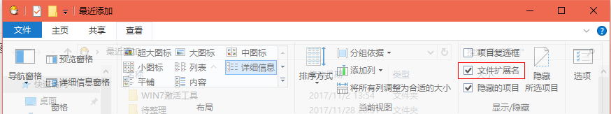

# Windows

<small>*插图来源于：[Microsoft - 云、计算机、应用和游戏](https://www.microsoft.com/zh-cn/)*</small>

## 简介

> 浏览适用于家庭或企业的 Microsoft 产品和服务。购买 Surface、Microsoft 365、Xbox、Windows、Azure 等产品/服务。查找下载内容并获取支持。

## 官方

Website：https://www.microsoft.com/zh-cn/

Support：https://support.microsoft.com/zh-cn

Docs：https://learn.microsoft.com/zh-cn/docs/ - *技术文档 | Microsoft Learn*

Download：https://www.microsoft.com/zh-cn/download

微软官方商城：https://www.microsoftstore.com.cn/

GitHub：https://github.com/microsoft - *Microsoft · GitHub*

## 安装

https://www.microsoft.com/zh-cn/software-download - *软件下载*

https://support.microsoft.com/zh-cn/windows - *Windows 帮助和学习*

- 家庭版 Home
- 专业版 Professional
- 企业版 Enterprise

安装工具：

https://www.laomaotao.net/ - *老毛桃 winpe,u 盘启动盘制作工具，u 盘重装系统，老毛桃 winpe 下载*

参考：

1. https://zhidao.baidu.com/question/81707976.html - *bios 有什么作用？_百度知道*

### 更新

更新工具：

1. 微软 Windows 10 易升（*Windows10UpgraderApp.exe*）

文档：

1. <https://support.microsoft.com/zh-cn/topic/windows-10-更新助手-3550dfb2-a015-7765-12ea-fba2ac36fb3f> - *Windows 10 更新助手*

2. https://docs.microsoft.com/zh-cn/windows/deployment/ - *部署和更新 Windows 客户端*

### 升级

> 注册表原信息：`HKEY_LOCAL_MACHINE\SOFTWARE\Microsoft\Windows NT\CurrentVersion`
>
> EditionID ：EnterpriseS
>
> ProductName ：Windows 10 Enterprise 2016 LTSB

Windows10 Enterprise LTSB(LTSC)

参考：

1. https://www.xitongtang.com/class/win10/17128.html - *您可以将Windows 7升级到Windows10 LTSB吗?_系统堂官网*

2. https://www.xitongbuluo.com/jiaocheng/58592.html - *Win10易升需要联系管理员要？Win10易升需要联系管理员解决方法-系统部落*

3. https://www.bilibili.com/video/av549495977 - *【更5】若要升级Windows Server 或企业版，请联系系统管理员ltsb ltsc2018 2019 win10系统更新升级失败哔哩哔哩bilibili*

### 修复

参考：

1. http://www.360doc.com/content/17/0417/19/31544578_646359055.shtml - *不重装，使用命令行启动修复系统*

2. https://jingyan.baidu.com/article/72ee561a5f6051e16138df33.html - *Win10 如何用文件检查器检查修复系统的受损文件 - 百度经验*

3. https://jingyan.baidu.com/article/359911f5b2ce5957fe03063d.html - *Win10 如何修复系统 - 百度经验*

### 下载加速

https://www.maxiaobang.com/12017.html - *教你在微软官网不限速下载Windows原版系统镜像文件！ | 马小帮*

- 复制下载链接，打开迅雷下载即可加速

## 设置

### 字体

打开本机（电脑） `控制面板\所有控制面板项\字体` 查看字体

参考：

1. <https://support.microsoft.com/zh-cn/windows/如何在-windows-中安装或删除字体-f12d0657-2fc8-7613-c76f-88d043b334b8/> - *如何在Windows中安装或删除字体*

2. https://jingyan.baidu.com/article/22fe7ced0085677103617f01.html - *Win10中怎么添加泰语补充字体*

### 开发环境

https://docs.microsoft.com/zh-cn/windows/dev-environment/ - *在 Windows 上设置开发环境 | Microsoft Docs*

## 用法

### 快捷键

- 快速显示桌面

  <kbd>windows</kbd> + <kbd>D</kbd>

- 锁屏

  <kbd>windows</kbd> + <kbd>L</kbd>

- 表情符号(E) & 符号

  <kbd>windows</kbd> + <kbd>.</kbd>

- 在指定目录下打开 `cmd` 程序

  <kbd>shift</kbd> + <kbd>鼠标右键</kbd> + <kbd>选择“在此处打开命令窗口”</kbd>

- 鼠标拖动任意一个窗口快速`左右左` / `右左右`移动，即可将本窗口以外的窗口最小化，再次按原步骤操作即可还原被最小化的窗口

- 打开任务管理器

  <kbd>Ctrl</kbd> + <kbd>Shift</kbd> + <kbd>Esc</kbd>

  [win10打开任务管理器的4种快捷方式-百度经验 (baidu.com)](https://jingyan.baidu.com/article/e5c39bf5e1d52939d76033a1.html)

- 打开系统菜单

  <kbd>windows</kbd> + <kbd>X</kbd>

  [教你使用windows10系统windows+x快捷键-百度经验 (baidu.com)](https://jingyan.baidu.com/article/eb9f7b6d77e3be869264e849.html)

### 开机启动项

3 种方式：

1. 利用系统配置功能实现
   1. 开始 <kbd>win</kbd> + <kbd>R</kbd> 运行 `msconfig` 回车

2. 利用注册表功能实现

   1. 开始 <kbd>win</kbd> + <kbd>R</kbd> 运行 `regedit` 回车

   2. 选择进入到目录 `HKEY_LOCAL_MACHINE\SOFTWARE\Microsoft\Windows\CurrentVersion\RunHKEY_LOCAL_MACHINE\SOFTWARE\Wow6432Node\Microsoft\Windows\CurrentVersion\Run`

   3. 进入所示位置，保留最基本的启动项目，如输入法，系统驱动等；其它多余的项目进行删除。

3. 利用 QQ 电脑管家设置来实现

   1. 电脑加速模块的开机启动项

### 模拟 Linux 环境

#### WSL(Windows Subsystem for Linux)

https://docs.microsoft.com/zh-cn/windows/wsl/ - *适用于 Linux 的 Windows 子系统文档 | Microsoft Docs*

#### Cygwin

http://www.cygwin.com/ - *Cygwin*

参考：

1. https://www.jb51.net/softs/102136.html - *Cygwin(模拟Linux环境) v3.1.4 中文官方安装版(附Cygwin安装教程)*

2. https://www.cnblogs.com/jingchi/p/15912206.html - *Cygwin软件安装及C环境配置*

参考（2019/03/15）：

1. https://blog.csdn.net/kingboung/article/details/61429388 - *Cygwin，让你拥有Windows下的Linux环境*

2. https://www.oschina.net/question/96889_51688 - *Cygwin中怎么用命令安装软件？*

3. https://www.cnblogs.com/hchacha/p/7147603.html - *win10下安装Cygwin配置gcc编译环境*

4. https://blog.csdn.net/u014207604/article/details/49926207 - *Windows 下安装 swoole 具体步骤*

5. https://www.cnblogs.com/toughhou/p/4113685.html - *Cygwin下软件安装 - apt-cyg*

### UWP

> 借助通用 Windows 平台 (UWP)，可以生成适用于任何 Windows 设备（电脑、Xbox One、HoloLens 等等）的应用，然后将这些应用发布到 Store。
> 
> UWP stands for Universal Windows Platform.

https://learn.microsoft.com/zh-cn/windows/uwp/ - *UWP 文档 - UWP 应用开发人员 | Microsoft Learn*

## 工具

### 运行

https://baike.baidu.com/item/%E8%BF%90%E8%A1%8C/13132909 - *运行（Windows组成部分）_百度百科*

#### 命令符

1. `msinfo32` - 查看 Microsoft 系统信息

2. `msconfig` - 查看系统配置

3. `winver` - 查看系统版本

4. `regedit` - 打开注册表编辑器

5. `shell:startup` - 打开系统启动文件夹

    1. `shell:<指定文件夹名称>` - 打开指定文件夹（ps：无法打开系统 Windows 下的任何文件夹）

#### 系统文件夹

1. 命令：`%windir%` 或者 `%SystemRoot%`

    说明：系统所在目录

    对应路径：`C:\WINDOWS`

2. 命令：`%systemroot%\system32`

    说明：打开 system32 系统文件夹

    对应路径：`C:\WINDOWS\system32`

### Hyper-v 虚拟机

https://baijiahao.baidu.com/s?id=1682327494844437724/ - *Windows虚拟机Hyper-v的安装及使用教程*

## 常见问题解答

1. https://www.winhelponline.com/ - *Winhelponline » Windows Help, How-Tos, and Tech Reviews*

2. https://www.thewindowsclub.com/ - *Windows 11/10 Tips, Tricks, Help, Support, Downloads, Features*

### 如何显示文件扩展名？

打开文件夹在菜单栏中的「查看」设置「文件扩展名」选中。

