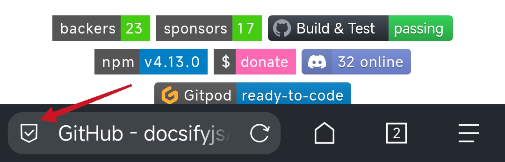
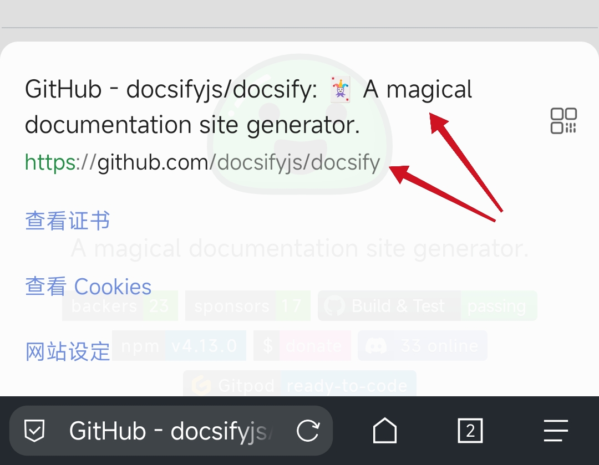

## 模板

> Open-Source

Website：

GitHub：

- [ ] 屏蔽广告
- [ ] 扩展程序
- [ ] 翻译
- [ ] 🪜 - _科学上网_
- [ ] 同步 - _登录账户后使用此功能_
- [ ] 隐私保护
- [ ] 资源嗅探
- [ ] 夜间模式
- [ ] 页内查找
- [ ] 添加到主屏幕
- [ ] 设置 - 应用布局
- [ ] 设置 - 语言
- [ ] 全屏浏览

_注：屏幕截图教程用 https://github.com/docsifyjs/docsify 页面操作、录制。_


----

_📋复制模板_

``` markdown
> Open-Source

Website：

GitHub：

- [ ] 屏蔽广告
- [ ] 扩展程序
- [ ] 翻译
- [ ] 🪜 - _科学上网_
- [ ] 同步 - _登录账户后使用此功能_
- [ ] 隐私保护
- [ ] 资源嗅探
- [ ] 夜间模式
- [ ] 页内查找
- [ ] 添加到主屏幕
- [ ] 设置 - 应用布局
- [ ] 设置 - 语言
- [ ] 全屏浏览
```


## Kiwi Browser 


> Open-Source

https://kiwibrowser.com/ - *Home - Kiwi Browser*

https://github.com/kiwibrowser - *kiwibrowser (Kiwi Browser) · GitHub*

- [x] 屏蔽广告
- [x] 扩展程序
- [x] 翻译
- [x] 多语言

## Yander Browser


https://browser.yandex.com/ - *Download Yandex Browser*

- [x] 屏蔽广告
- [x] 扩展程序
- [x] 翻译
- [x] 科学上网
- [x] 同步

## Via ✅


> Open-Source

https://viayoo.com/zh-cn/ - *Via浏览器官网 - 崇尚速度与简约的手机浏览器，Via唯一官方网站*

https://github.com/tuyafeng/Via - *Via is a simple browser, and this repository is set for localization.*

- [x] 屏蔽广告
    - 可自定义规则
- [ ] 扩展程序
- [x] 多语言
- [ ] 🪜
- [x] 同步
- 工具
  - [x] 资源嗅探
  - [x] 自定脚本
  - [x] 翻译网页
  - [x] 源码
  - [x] 页内查找
- [x] 夜间模式
- [ ] 添加到主屏幕
- [x] 设置 - 应用布局

## Opera ✅


https://www.opera.com/zh-cn - *Opera Web Browser | Faster, Safer, Smarter | Opera*

- [x] 屏蔽广告
- [ ] 扩展程序
- [x] 多语言
- [x] 翻译
- [x] 🪜
- [x] 同步
- [ ] 隐私保护
- [ ] 资源嗅探
- [x] 夜间模式
- [x] 页内查找
- [x] 添加到主屏幕
- [x] 设置 - 应用布局

----

搭建🪜，请参阅“[浏览器配置 DNS](essential/dns.md#浏览器配置-dns)”

## DuckDuckGo


🧱 https://duckduckgo.com/ - *DuckDuckGo — 隐私保护，化繁为简。*

- [x] 隐私保护
    - [x] 无历史记录
- [x] 🪜

## Firefox

https://www.firefox.com.cn/ - *Firefox 火狐浏览器 - 全新、安全、快速 | 官方最新下载*

- [x] 扩展程序
  - [x] 屏蔽广告
  - [x] 隐私保护
- [x] 同步
- [x] 隐私保护

## Chrome


https://www.google.com/chrome/ - *Google Chrome 网络浏览器*

- [x] 同步
- [x] 🪜

## QQ浏览器 ✅

https://browser.qq.com/ - *QQ浏览器官网_手机浏览器_电脑浏览器_*

- 工具
  - [x] 资源嗅探
  - [x] 网页翻译

## 小米浏览器

http://app.xiaomi.com/detail/105559 - *小米浏览器-保护隐私安全上网*

- [x] 资源嗅探


## 自由浏览


🧱 https://freebrowser.org/ - *免费下载自由浏览 app，了解墙外最新资讯*

https://github.com/greatfire/wiki

## 狐猴浏览器 ✅

https://lemurbrowser.com/app/zh/ - *狐猴浏览器*

- [ ] 屏蔽广告
- [x] 扩展程序
- [x] 多语言
- [x] 翻译
- [ ] 🪜
- [ ] 同步
- [ ] 隐私保护
- [ ] 资源嗅探
- [x] 夜间模式
- [x] 页内查找
- [x] 添加到主屏幕
- [ ] 设置 - 应用布局

----

新版特性（狐猴浏览器 2.4.0.002）

- SuperVideo 视频增强、投屏

- 自定义底部工具栏

- 升级内核到110

- 支持Bitwarden密码管理插件

- 本地新标签下滑搜索

- 软件使用引导教程 _> “设置”-“关于狐猴浏览器”-“使用教程”_

- 扩展插件内存优化

- 优化插件popup界面

- 修复新标签页闪烁问题

- 支持插件点击授权模式

- 修复页面滑动导致进度条错误出现的问题

- 解决特定情况下视频导致的崩溃

- Yandex、Yahoo搜索引擎全球化

- 新增Qwant、Brave、StartPage、Fsou搜索引擎


## FAQ

### 如何清除浏览器“自动填充表单数据”？

> Opera

`清除全部` *设置 > 隐私 > 清除数据… > 自动填充表单数据*

`清除单个` *选中表单中一条数据，长按2秒后弹出确认框清除*  
实践网站：
1. https://github.com/
2. https://www.ruanyifeng.com/blog/ - 实践前设置为“桌面模式”

参考：

https://jingyan.baidu.com/article/642c9d34c281a2254a46f7d9.html - *手机浏览器怎么清除表单数据-百度经验*

### 如何复制标签页标题文字？

> Opera

将当前标签页“添加到书签”，进入“创建新书签”表单页面，页面中“名称”输入框内容（即页面标题），然后在输入框内点击“全选”-“复制”。

> Via

1. 点击
    
2. 长按复制
    

