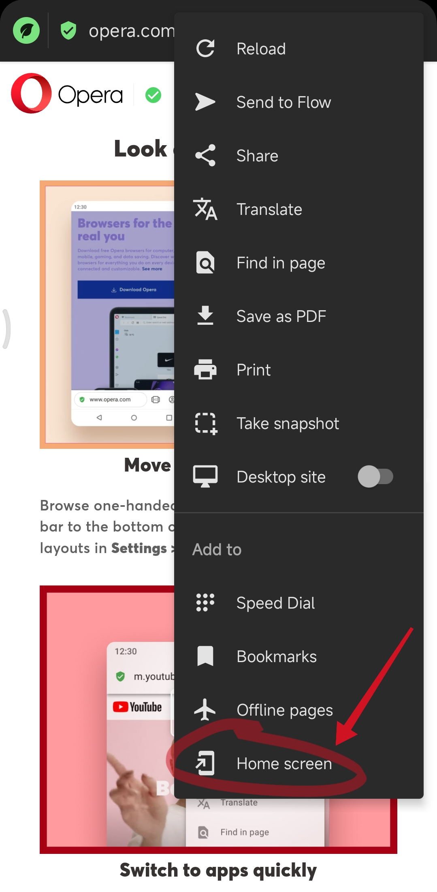

>  玩转小米手机；尝试着长按有惊喜！

## 官方网址

https://www.mi.com/ - *小米官网 - Xiaomi 13系列，Xiaomi Mix Fold 2，MIUI14，小米徕卡影像大赛*

https://dev.mi.com/ - *小米开放平台*

## 小米笔记

https://s.xiaomi.cn/c/8qK7lYlC - *🏷️ 小米社区*
- https://s.xiaomi.cn/c/H3wMf2jB - *【必看公告】笔记（便签）使用指南&常见问题合集*

## 提取文字

百度关键字搜索：[小米截图识别文字](https://www.baidu.com/s?word=小米截图识别文字)

1. 小爱翻译

    如何打开：
    _应用 > 小爱语音 > 技能 > 小爱翻译_
    
    添加桌面图标：
    _应用 > 设置 > 小爱同学 > 小爱翻译 > （打开方式）桌面图标_

2. 小爱视觉

    操作步骤：_打开应用 > 选择“识文字” > 拍一张照片或从相册选择一张图片_
   
3. 百度翻译

    操作步骤：_打开应用 > 翻译浮球 > 截屏翻译_

4. 系统相册

    操作步骤：_打开一张图片 > 底部选项“更多ⵈ”  > 提取文字_
   
5. 传送门 ✅

    <u>MIUI 13</u> 功能位置：_应用 > 设置 > 特色功能 > 传送门_

    <u>MIUI 14</u> 功能位置：_应用 > 设置 > 更多设置 > （特色功能）传送门_
   
    _注：_  
    1. _✅ 可区域截屏进行文字识别、图片识别、翻译；_
    2. _⚠️ ️如果正在运行的应用无法使用传送门功能时，查看应用是否加入了黑名单。_

6. 区域截屏 + 文字识别应用 ✅

    操作步骤：*使用 [区域截屏](#区域截屏) 功能截取需要提取的文字 > 点击底部“分享”按钮 > 选择可文字识别的应用 > 在文字识别应用中提取文字*
    
    可选文字识别应用：*百度翻译、[Yander Browser](os/mobile/browser.md#yander-browser) - 智能摄像头（推荐）*

## 屏幕录制

> 系统自带“屏幕录制”工具

功能设置：_应用 > 设置 > 更多设置 > （辅助功能）屏幕录制_

http://m.shezhan88.com/electr/1268228.html - *小米手机录屏怎么录-设栈网*

1. 打开方式一：_拉下“控制中心” > 屏幕录制_
2. 打开方式二：_全局侧边栏 > 视频工具箱 > 录屏（需“自定义设置”中的应用）_
3. 打开方式三：_小爱语音 > 屏幕录制_

## 应用分类管理

> MIUI 14

操作步骤：_应用 > 设置 > 屏幕时间管理 > 看板 > 下滑-“查看更多应用数据” > 右上角 ![分类管理图标][image-category-list] > 分类管理_

## 设置默认应用

操作步骤：_应用 > 设置 > 应用设置 > 应用管理 > 右上角 ⋮ > 默认应用设置_

## 悬浮球

设置操作：*应用 > 设置 > 更多设置 > 悬浮球*

## 区域截屏

设置操作：_应用 > 设置 > 更多设置 > 快捷手势 > 区域截屏_

使用操作：_“三指长按”手机屏幕_

## 全局侧边栏

> MIUI 13

设置操作：_应用 > 设置 > 特色功能 > 自由窗口 > 全局侧边栏_

> MIUI 14

设置操作：_应用 > 设置 > 更多设置 > 特色功能-自由窗口_

## 添加到主屏幕

各 APP、小程序、浏览器等，如果支持此功能均可操作。

以 Opera 浏览器标签页操作为例：

参考：https://mip.680.com/jingxuangl/info-337716.html - *小米手机微信创建桌面快捷方式的权限在哪里-时间财富网*

## 隐私空间

> MIUI 14

设置操作：_应用 > 设置 > 隐私保护 > 保护隐私 > 保险箱_
- 私密相册
    - 打开操作：打开 *系统应用 > 小米相册*，切换到“相册”标签页，在屏幕上方 1/3 处长按屏幕往下拉动，直至出现“松开进入隐私空间”提示，松开后输入隐私密码进入私密相册。
- 私密文件夹
    - 打开操作：打开 *系统应用 > 文件管理*，切换到“最近”或“手机”标签页，在屏幕上方 1/3 处长按屏幕往下拉动，直至出现“松开进入隐私空间”提示，松开后输入隐私密码进入私密文件夹。

## 专注模式

> MIUI 14

设置操作：_应用 > 设置 > 屏幕时间管理 > 专注模式_

## 网络助手

> MIUI 14

设置操作：_应用 > 手机管家 > 网络助手_

**如何关闭单个应用的网络？**

设置操作：_网络助手 > 联网控制 > 应用列表找到要关闭网络的应用 > 联网控制中可选择关闭“数据”或“WLAN”网络_

**搜索帮助**

1. [断开某个应用的网络 - 百度](https://m.baidu.com/s?ie=UTF-8&wd=%E6%96%AD%E5%BC%80%E6%9F%90%E4%B8%AA%E5%BA%94%E7%94%A8%E7%9A%84%E7%BD%91%E7%BB%9C)
2. https://wen.baidu.com/question/529138871019976405.html - *怎么关闭单个应用的网络_百度问一问*

## 蓝牙耳机

> MIUI 14

使用操作：*应用 > 小爱语音 > 右上角“我的” > 蓝牙设备 > 连接指定设备后可查看电池电量、产品说明书*

## 小米相机

- 动态图片

## 文件管理

使用操作：*应用 > QQ浏览器 > 底部导航栏-“文件”*

## 查看图片

在 *系统应用 > 小米相册（版本：3.5.2.9）* 中查看图片比 *系统应用 > 文件管理（版本：4.4.7.6）* 中查看更清晰，图片放大后也更高清。

## 视频播放

- 使用操作方式一：*系统应用 > 小米相册 > 找到视频文件点击播放*

- 使用操作方式二：*系统应用 > 文件管理 > 找到视频文件点击播放*

## 更换手机

使用操作：*应用 > 小米换机*

## 清理存储空间

> MIUI 14

使用操作：*系统应用 > 文件管理 > 右上角 ⋮ > 存储空间*

## 常见问题解答

https://kf.qq.com/touch/sappfaq/180705A3IB3Y1807056fMr6V.html - *为什么将小程序添加到桌面后桌面上找不到小程序图标 - 腾讯客服*

> **来源**：任意微信小程序“添加到桌面”操作弹窗提示。

如何将微信公众号文章链接复制成自定义格式？

- 将链接 「https://mp.weixin.qq.com/s/bQt8ht5yfuSP2Va3r5BjqA 」 复制成 「https://mp.weixin.qq.com/s/bQt8ht5yfuSP2Va3r5BjqA - *明黄的 iPhone 14 亮出来，接春天。*」 的格式。
1. 打开应用 *[微信](http://app.xiaomi.com/detail/1122) > 复制链接*；
2. 使用（小米手机）系统悬浮窗工具打开应用 *[Simple Clipboard Editor](https://play.google.com/store/apps/details?id=com.trianguloy.clipboardeditor) > 点击分享图标（Share：在 Yandex Browser 浏览器中打开）*；
3. 分享成功后会自动跳转至浏览器，并新建新标签页打开链接 *[Yandex Browser](https://play.google.com/store/apps/details?id=com.yandex.browser) > 扩展插件：[CopyTabTitleUrl](https://chrome.google.com/webstore/detail/copytabtitleurl/lmgbdjfoaihhgdphombpgjpaohjfeapp) > format*。
   > https://www.cccitu.com/982.html - *手机浏览器 Yandex 安装 Chrome 扩展插件 - CCCiTU - 玩机大学*

如何将微信公众号文章长链接转换成短链接再复制？

- 将链接¹ https://mp.weixin.qq.com/s?__biz=MzIwOTA2MzYwNA==&mid=2247514218&idx=1&sn=0f3a174deb53be7b962facbfda66fedd 转换成链接² https://mp.weixin.qq.com/s/bQt8ht5yfuSP2Va3r5BjqA 。

1. 使用 QQ 浏览器 *打开链接¹ > 分享至微信“朋友圈”*；
2. 跳转至 *微信“朋友圈”编辑页面后，点击链接¹*（通过微信内置浏览器访问链接）；
3. 微信内置浏览器打开网页后，点击页面右上角 *“ⵈ” > 复制链接* （复制的链接即链接²）。

如何将微信好友发的“支付宝收款码图片”在支付宝中打开？

1. 打开二维码图片，点击屏幕右下角 *“ⵈ” > 识别图中二维码*；
2. 复制识别的二维码链接，在浏览器地址栏粘贴进行访问；
3. 浏览器访问成功后，会提示是否跳转至支付宝 App，选择跳转即可操作转账。

### 如何关闭后台运行中的应用

操作步骤：*应用 > 设置 > 省电与电池 > 省电 - “发现 ? 个耗电问题，立即优化” > “检测完耗电问题”点击进入 > 点击底部“一键延长 ? 分钟”按钮*

添加桌面快捷方式：*应用 > 设置 > 安全 > 下滑至底部 - “手机管家” > 右上角图标 ![设置图标][image-settings] > 常用功能快捷方式 > 开启“省电优化”*

### 如何查看“深圳地铁”各站点首班以及末班发车时间

操作步骤：_应用 > 微信 > 小程序-“乘车码” > 选择“地铁”标签页-“地铁图” > 点击查询的“站点” - 弹出的菜单中选择“站点详情”（即可查看此站点的首班车及末班车到站时间）_

### 如何播放 m3u8 格式视频文件

打开方式一：

1. 下载应用“[质感文件](os/mobile/mobile-app-list.md#质感文件（Material-Files）)”；
2. 打开“质感文件” > 找到 m3u8 格式视频文件的存放位置；
3. 点击文件右侧 ⋮ > 在弹出的菜单栏选项中选择“打开方式”-第 2 个“质感文件”；
4. 弹窗中选择将文件作为视频打开；
5. “打开方式”弹窗中可选择“其他方式”-“小米视频”；
6. 或者“其他方式”-“播霸（QQ浏览器）”（注：此方式需要提前安装“QQ浏览器”）。

打开方式二（推荐）：

1. 下载应用“[QQ浏览器](os/mobile/browser.md#QQ浏览器-✅)”；
2. 打开“QQ浏览器” > 底部导航栏-“文件” > 顶部“文件管理”-“视频” > 在“本地视频”中找到 m3u8 格式视频文件 > 点击文件播放。

打开方式三：

1. 下载应用“[VLC](os/tools/app-list.md#vlc)”、“[恒星播放器](os/tools/app-list.md#stellarplayer)”；
2. 打开系统应用“文件管理” > 找到 m3u8 格式视频文件 > 点击文件-弹出“打开方式”窗口 > 选择“VLC”。

有关更多详细信息，请参阅“[应用列表 > 音/视频工具](os/tools/app-list.md#音视频工具)”。

### 如何正确使用手机电池

> MIUI 14

操作步骤：_应用 > 设置 > 省电与电池 > 顶部标签页-“电池”_
- 点击卡片“电池状况”，查看文章“如何延长电池使用时间，延缓电池老化”
- 点击卡片“当前温度”，查看文章“如果设备温度过高或过低”
- 点击卡片“今日充电”，查看文章“关于给设备充电”

### 如何在手机上打开HTML文件

操作步骤：
1. 新建 [HTML 格式](os/mobile/_files/mi/test.html) 文件（可使用手机应用 [Markor](os/mobile/mobile-app-list.md#markor) 新建）；
2. 打开“系统文件管理器”；
3. 找到新建的 HTML 文件 *> 长按文件 > 更多 > 用其他应用打开 > 选择自己常用的手机浏览器*。

[image-category-list]: data:image/svg+xml;charset=utf-8;base64,PHN2ZyB2aWV3Qm94PScwIDAgMTAyNCAxMDI0JyB2ZXJzaW9uPScxLjEnIHhtbG5zPSdodHRwOi8vd3d3LnczLm9yZy8yMDAwL3N2Zycgd2lkdGg9JzE2JyBoZWlnaHQ9JzE2Jz48cGF0aCBkPSdNMzgxLjI0MjgyODE5IDQ2MS4yNzUyMzUwN0gxNTguMDUzODYyNUMxMTQuMDkyMzk5NTYgNDYxLjI3NTIzNTA3IDc4LjAyMTQ1NTYxIDQyNS4yMDQyOTExMyA3OC4wMjE0NTU2MSAzODEuMjQyODI4MTlWMTU4LjA1Mzg2MjVDNzguMDIxNDU1NjEgMTE0LjA5MjM5OTU2IDExNC4wOTIzOTk1NiA3OC4wMjE0NTU2MSAxNTguMDUzODYyNSA3OC4wMjE0NTU2MWgyMjMuMTg4OTY1NjlDNDI1LjIwNDI5MTEzIDc4LjAyMTQ1NTYxIDQ2MS4yNzUyMzUwNyAxMTQuMDkyMzk5NTYgNDYxLjI3NTIzNTA3IDE1OC4wNTM4NjI1djIyMy4xODg5NjU2OUM0NjEuMjc1MjM1MDcgNDI1LjIwNDI5MTEzIDQyNS4yMDQyOTExMyA0NjEuMjc1MjM1MDcgMzgxLjI0MjgyODE5IDQ2MS4yNzUyMzUwN3pNMTU4LjA1Mzg2MjUgMTQ1LjY1NDQ3NTUyQzE1MS4yOTA1NjA1MiAxNDUuNjU0NDc1NTIgMTQ1LjY1NDQ3NTUyIDE1MS4yOTA1NjA1MiAxNDUuNjU0NDc1NTIgMTU4LjA1Mzg2MjV2MjIzLjE4ODk2NTY5YzAgNi43NjMzMDE5OSA1LjYzNjA4NDk5IDEyLjM5OTM4Njk4IDEyLjM5OTM4Njk4IDEyLjM5OTM4Njk4aDIyMy4xODg5NjU2OWM2Ljc2MzMwMTk5IDAgMTIuMzk5Mzg2OTgtNS42MzYwODQ5OSAxMi4zOTkzODY5OC0xMi4zOTkzODY5OFYxNTguMDUzODYyNWMwLTYuNzYzMzAxOTktNS42MzYwODQ5OS0xMi4zOTkzODY5OC0xMi4zOTkzODY5OC0xMi4zOTkzODY5OEgxNTguMDUzODYyNXpNMzg5LjEzMzM0NzE3IDk0Mi41OTY4OTMzOUgxNjUuOTQ0MzgxNDljLTQzLjk2MTQ2Mjk0IDAtODAuMDMyNDA2ODktMzYuMDcwOTQzOTUtODAuMDMyNDA2ODktODAuMDMyNDA2ODl2LTIyMy4xODg5NjU2OWMwLTQzLjk2MTQ2Mjk0IDM2LjA3MDk0Mzk1LTgwLjAzMjQwNjg5IDgwLjAzMjQwNjg5LTgwLjAzMjQwNjg3aDIyMy4xODg5NjU2OGM0My45NjE0NjI5NCAwIDgwLjAzMjQwNjg5IDM2LjA3MDk0Mzk1IDgwLjAzMjQwNjkgODAuMDMyNDA2ODd2MjIzLjE4ODk2NTY5YzAgNDMuOTYxNDYyOTQtMzYuMDcwOTQzOTUgODAuMDMyNDA2ODktODAuMDMyNDA2OSA4MC4wMzI0MDY4OXogbS0yMjMuMTg4OTY1NjgtMzE1LjYyMDc1OTU1Yy02Ljc2MzMwMTk5IDAtMTIuMzk5Mzg2OTggNS42MzYwODQ5OS0xMi4zOTkzODY5OCAxMi4zOTkzODY5N3YyMjMuMTg4OTY1NjljMCA2Ljc2MzMwMTk5IDUuNjM2MDg0OTkgMTIuMzk5Mzg2OTggMTIuMzk5Mzg2OTggMTIuMzk5Mzg2OTloMjIzLjE4ODk2NTY4YzYuNzYzMzAxOTkgMCAxMi4zOTkzODY5OC01LjYzNjA4NDk5IDEyLjM5OTM4Njk5LTEyLjM5OTM4Njk5di0yMjMuMTg4OTY1NjljMC02Ljc2MzMwMTk5LTUuNjM2MDg0OTktMTIuMzk5Mzg2OTgtMTIuMzk5Mzg2OTktMTIuMzk5Mzg2OTdIMTY1Ljk0NDM4MTQ5ek05MTIuNzI1NjQyOTMgMTk0LjY4ODQxNDk0aC0zMjEuMjU2ODQ0NTVjLTE4LjU5OTA4MDQ3IDAtMzMuODE2NTA5OTUtMTUuMjE3NDI5NDgtMzMuODE2NTA5OTQtMzMuODE2NTA5OTRzMTUuMjE3NDI5NDgtMzMuODE2NTA5OTUgMzMuODE2NTA5OTQtMzMuODE2NTA5OTZoMzIxLjI1Njg0NDU1YzE4LjU5OTA4MDQ3IDAgMzMuODE2NTA5OTUgMTUuMjE3NDI5NDggMzMuODE2NTA5OTYgMzMuODE2NTA5OTZzLTE1LjIxNzQyOTQ4IDMzLjgxNjUwOTk1LTMzLjgxNjUwOTk2IDMzLjgxNjUwOTk0ek05MTIuNzI1NjQyOTMgNDEyLjI0MTI5NTY0aC0zMjEuMjU2ODQ0NTVjLTE4LjU5OTA4MDQ3IDAtMzMuODE2NTA5OTUtMTUuMjE3NDI5NDgtMzMuODE2NTA5OTQtMzMuODE2NTA5OTVzMTUuMjE3NDI5NDgtMzMuODE2NTA5OTUgMzMuODE2NTA5OTQtMzMuODE2NTA5OTVoMzIxLjI1Njg0NDU1YzE4LjU5OTA4MDQ3IDAgMzMuODE2NTA5OTUgMTUuMjE3NDI5NDggMzMuODE2NTA5OTYgMzMuODE2NTA5OTVzLTE1LjIxNzQyOTQ4IDMzLjgxNjUwOTk1LTMzLjgxNjUwOTk2IDMzLjgxNjUwOTk1ek05MTIuNzI1NjQyOTMgNjc4LjgyODExNTc3aC0zMjEuMjU2ODQ0NTVjLTE4LjU5OTA4MDQ3IDAtMzMuODE2NTA5OTUtMTUuMjE3NDI5NDgtMzMuODE2NTA5OTQtMzMuODE2NTA5OTZzMTUuMjE3NDI5NDgtMzMuODE2NTA5OTUgMzMuODE2NTA5OTQtMzMuODE2NTA5OTVoMzIxLjI1Njg0NDU1YzE4LjU5OTA4MDQ3IDAgMzMuODE2NTA5OTUgMTUuMjE3NDI5NDggMzMuODE2NTA5OTYgMzMuODE2NTA5OTVzLTE1LjIxNzQyOTQ4IDMzLjgxNjUwOTk1LTMzLjgxNjUwOTk2IDMzLjgxNjUwOTk2ek05MTIuNzI1NjQyOTMgODk2Ljk0NDYwNDk2aC0zMjEuMjU2ODQ0NTVjLTE4LjU5OTA4MDQ3IDAtMzMuODE2NTA5OTUtMTUuMjE3NDI5NDgtMzMuODE2NTA5OTQtMzMuODE2NTA5OTZzMTUuMjE3NDI5NDgtMzMuODE2NTA5OTUgMzMuODE2NTA5OTQtMzMuODE2NTA5OTRoMzIxLjI1Njg0NDU1YzE4LjU5OTA4MDQ3IDAgMzMuODE2NTA5OTUgMTUuMjE3NDI5NDggMzMuODE2NTA5OTYgMzMuODE2NTA5OTRzLTE1LjIxNzQyOTQ4IDMzLjgxNjUwOTk1LTMzLjgxNjUwOTk2IDMzLjgxNjUwOTk2eic+PC9wYXRoPjwvc3ZnPg==

[image-settings]: data:image/svg+xml;charset=utf-8;base64,PHN2ZyB4bWxucz0naHR0cDovL3d3dy53My5vcmcvMjAwMC9zdmcnIHZpZXdCb3g9JzAgMCAyNCAyNCcgd2lkdGg9JzE2JyBoZWlnaHQ9JzE2Jz48cGF0aCBkPSdNMTIgMUwyMS41IDYuNVYxNy41TDEyIDIzTDIuNSAxNy41VjYuNUwxMiAxWk0xMiAzLjMxMUw0LjUgNy42NTMxMVYxNi4zNDY5TDEyIDIwLjY4OUwxOS41IDE2LjM0NjlWNy42NTMxMUwxMiAzLjMxMVpNMTIgMTZDOS43OTA4NiAxNiA4IDE0LjIwOTEgOCAxMkM4IDkuNzkwODYgOS43OTA4NiA4IDEyIDhDMTQuMjA5MSA4IDE2IDkuNzkwODYgMTYgMTJDMTYgMTQuMjA5MSAxNC4yMDkxIDE2IDEyIDE2Wk0xMiAxNEMxMy4xMDQ2IDE0IDE0IDEzLjEwNDYgMTQgMTJDMTQgMTAuODk1NCAxMy4xMDQ2IDEwIDEyIDEwQzEwLjg5NTQgMTAgMTAgMTAuODk1NCAxMCAxMkMxMCAxMy4xMDQ2IDEwLjg5NTQgMTQgMTIgMTRaJz48L3BhdGg+PC9zdmc+