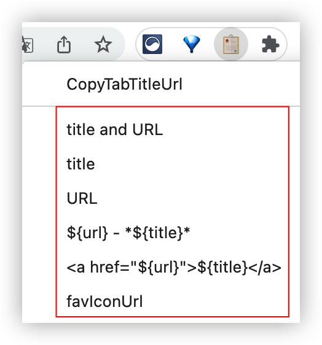
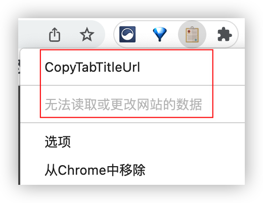

## 搜索

https://www.runningcheese.com/extensions - *浏览器必备，2022 年度最喜欢浏览器扩展 - 奔跑中的奶酪*
- 支持注册登录

https://ldqk.xyz/1775 - *高效上网——Chrome/Edge浏览器优秀扩展插件推荐*

----

https://mp.weixin.qq.com/s/74mW44aBySJ9VW1_A7j5mg - *前端请装上这个 Chrome 插件*  
https://mp.weixin.qq.com/s/KS-fh60zqfR-6GCD5eGFaQ - *Chrome 超强生产力工具 - Omni*


### GitHub Topics

https://github.com/topics/chrome-extension

https://github.com/topics/browser-extension


## 下载安装

### 扩展商店

https://addons.mozilla.org/zh-CN/firefox/extensions/ - _扩展 – Firefox 附加组件（zh-CN）_

https://microsoftedge.microsoft.com/addons/Microsoft-Edge-Extensions-Home?hl=zh-CN - _Microsoft Edge 加载项_

https://chrome.google.com/webstore/ - *Chrome 应用商店*


### 下载 CRX 🔥

1. https://www.crxsoso.com/ - *Crx搜搜 - 浏览器扩展商店 Chrome,Edge,Firefox,Opera*
    - 支持注册登录

2. https://www.baiduyun.wiki/zh-cn/crx.html - *如何安装浏览器扩展？ | 油小猴*

3. https://crxdl.com/ - *CrxDL - Chrome浏览器扩展插件CRX下载网*

4. https://www.crx4chrome.com/ - *Crx4Chrome - Download CRX for Chrome Apps & Extensions*


## 推荐使用

1. [OneTab](#onetab)
2. [Bitwarden - 免费密码管理器](#bitwarden)
3. [Extensity](#extensity)
4. [Gooreplacer](#gooreplacer)
5. [crxMouse Chrome™ 手势](#crxmouse)
6. [CopyTabTitleUrl](#copy-tab-title-url)
7. [Wappalyzer](#wappalyzer)
8. [FeHelper(前端助手)](#fehelper)
9. [MetaMask](#metamask)
10. [Tampermonkey](#tampermonkey)
11. [uBlock Origin](#ublock-origin)
12. [Jisū](#jisu)
13. [Google 翻译](#google-translate)
14. [Proxy SwitchyOmega](#proxy-switchyomega)
15. [Clipboard Helper](#clipboard-helper)


## 使用场景

在手机上写作：

1. [CopyTabTitleUrl](#copy-tab-title-url)
2. [Copy Image URL](#copy-image-url)
3. [拷贝猫](#copycat)


## 扩展列表


### 标签页管理

1. ✔️[OneTab](https://chrome.google.com/webstore/detail/onetab/chphlpgkkbolifaimnlloiipkdnihall ':id=onetab') - *节省高达95％的内存，并减轻标签页混乱现象*

     
2. ✔️[TABLERONE tab manager](https://www.crxsoso.com/webstore/detail/andpjllgocabfacjlelkfpdemfklpfpo) - *打开太多标签会降低您的工作效率。您的计算机变慢，您需要更长时间才能找到正确的选项卡，而且您经常会在此过程中分心。*
3. ✔️[ Toast - Save Tabs for Later](https://www.crxsoso.com/webstore/detail/pejhbjnfifdecpkgcjhgmcaphdobmiie) - *您肯定有一些打开或固定的选项卡非常有用，但现在不需要。它们不应该被添加到书签中，尽管它们太重要了，不会丢失在浏览器的阅读列表中。*


### 历史记录

1. [浏览器历史加](https://www.crxsoso.com/webstore/detail/adjifobelhoemalljgnjdlockheiacmc) - *浏览器历史加替换默认浏览器历史记录，并提供额外的控件，以便轻松管理和浏览历史记录。*


### 密码管理

- ✔️[Bitwarden - 免费密码管理器](https://chrome.google.com/webstore/detail/bitwarden-free-password-m/nngceckbapebfimnlniiiahkandclblb ':id=bitwarden') - *Bitwarden 是一个安全且免费的跨平台密码管理器。*

     

### 广告拦截

1. ✔️[uBlock Origin](https://chrome.google.com/webstore/detail/ublock-origin/cjpalhdlnbpafiamejdnhcphjbkeiagm ':id=ublock-origin') - *一款高效的网络请求过滤工具，占用极低的内存和 CPU。*

     
    - https://www.crxsoso.com/webstore/detail/cjpalhdlnbpafiamejdnhcphjbkeiagm - *uBlock Origin | Chrome扩展 - Crx搜搜*

2. [AdGuard 广告拦截器](https://www.crxsoso.com/webstore/detail/bgnkhhnnamicmpeenaelnjfhikgbkllg) - *一款无与伦比的广告拦截扩展，用以对抗各式广告与弹窗。可以拦截 Facebook、YouTube 和其它所有网站的广告。*

3. [Adblock Plus - 免费的广告拦截器](https://www.crxsoso.com/webstore/detail/cfhdojbkjhnklbpkdaibdccddilifddb) - *阻止 YouTube™ 广告、弹出窗口并抵御恶意软件！*


### 扩展管理

- ✔️[Extensity](https://chrome.google.com/webstore/detail/extensity/jjmflmamggggndanpgfnpelongoepncg ':id=extensity') - *Quickly enable/disable Google Chrome extensions*

     
    - https://www.crxsoso.com/webstore/detail/jjmflmamggggndanpgfnpelongoepncg - *Extensity | Chrome扩展 - Crx搜搜*

### 二维码

1. [草料二维码-快速生码和解码工具](https://chrome.google.com/webstore/detail/%E8%8D%89%E6%96%99%E4%BA%8C%E7%BB%B4%E7%A0%81-%E5%BF%AB%E9%80%9F%E7%94%9F%E7%A0%81%E5%92%8C%E8%A7%A3%E7%A0%81%E5%B7%A5%E5%85%B7/moombeodfomdpjnpocobemoiaemednkg) - *草料二维码官方开发的免费工具插件，提供简单、专业、快捷的二维码生成和解码功能。*
    - https://www.crxsoso.com/webstore/detail/moombeodfomdpjnpocobemoiaemednkg - *草料二维码-快速生码和解码工具 | Chrome扩展 - Crx搜搜*

2. [二维码（生成及识别）](https://www.crxsoso.com/webstore/detail/hkojjajclkgeijhcmfjcjkddfjpaimek) - *将当前页面地址、选中的文本或链接等生成二维码，也可以识别网页中的二维码图片（支持识别中文）。*


### 标签页定时刷新

- ✔️[ChromeReloadPlus](https://chrome.google.com/webstore/detail/chromereloadplus/nbbpjdmdkcmpimmhloehkojhbhjlboog) - *Automatically reload a page. Configure interval between page refreshes and see a count-down until the next refresh.*

  - https://www.crxsoso.com/webstore/detail/nbbpjdmdkcmpimmhloehkojhbhjlboog - *ChromeReloadPlus | Chrome扩展 - Crx搜搜*


### 鼠标手势

- ✔️[crxMouse Chrome™ 手势](https://www.crxsoso.com/webstore/detail/jlgkpaicikihijadgifklkbpdajbkhjo ':id=crxmouse') - *原名:Gestures for Chrome(TM)汉化版.方便,快捷,充分发掘鼠标的所有操作.功能包括:鼠标手势,超级拖曳,滚轮手势,摇杆手势,平滑滚动,标签页列表等.*

  - https://chrome.google.com/webstore/detail/jlgkpaicikihijadgifklkbpdajbkhjo


### 搜索引擎

- https://post.smzdm.com/p/az595ge5/ - *Chrome扩展推荐：比地址栏更高效，多个搜索引擎快速切换*
- [大术专搜](https://github.com/garywill/BigSearch) - *以 灵活又顺手 的方式 在(切换) 任意一个 或 (连续)多个 搜索引擎（或任意网站）进行搜索。跨浏览器工具。具有高度自定义性。*
- [All in one web searcher](https://www.crxsoso.com/webstore/detail/enofjgiadilpmldfknojklfjbeaooiap) - *多合一网络搜索器是一个简单而强大的扩展，可以通过零点击搜索多个站点。添加站点以进行搜索，自定义顺序并在任何地方快速搜索。*
- [SearchBar](https://www.crxsoso.com/webstore/detail/fjefgkhmchopegjeicnblodnidbammed) - *The most efficient way to use your favourite search engines. Search selected text, use customizable hotkeys and much more.*


### 工具箱

- [Ctool 程序开发常用工具](https://www.crxsoso.com/webstore/detail/ipfcebkfhpkjeikaammlkcnalknjahmh) - *程序开发常用工具,哈希/加解密/编码转换/时间戳/二维码/拼音/IP查询/代码优化/Unicode/正则等...*

    - https://github.com/baiy/Ctool

- [即时工具](https://www.crxsoso.com/webstore/detail/fnlomhffjgaiejopfbacfjjpnegclmfb) - *一款在线高效办公工具，拥有近300款工具包括视频工具、音频工具、图片工具、文档处理、文档转换、办公辅助、设计工具等等*


### 计算字数

- ✔️[Jisū](https://www.crxsoso.com/webstore/detail/dgnmohofbgnaacababkedheeannmdohi ':id=jisu') - *Count words and characters in selected text.*

  - https://microsoftedge.microsoft.com/addons/detail/jis%C5%AB/bbclbgdgnkggbgnknlppkkgghfemliap
  - https://github.com/ikamonster/jisu


### 复制链接

1. ✔️[复制链接/标签名称和地址](https://www.crxsoso.com/webstore/detail/noakklbbencpgcahamhocalnepfjeeok) - *在链接上右键菜单中加入命令以纯文本格式同时拷贝该链接的文本和链接地址，也可在标签栏上右键复制该标签页面的标题和链接。极大方便了在即时聊天工具、电子邮件、博客等网络工具中分享互联网链接。*

2. ✔️[CopyTabTitleUrl](https://www.crxsoso.com/webstore/detail/lmgbdjfoaihhgdphombpgjpaohjfeapp ':id=copy-tab-title-url') - *Copy the title and URL to the clipboard.*

    - https://github.com/k08045kk/CopyTabTitleUrl

    - 手机浏览器可用

    - 设置
        - 关闭“Othter”-“Enable multiple selection tabs”（开启此功能会复制多个标签的内容）（默认开启）
        - Markdown 格式
          
          ```markdown
          [${title}](${url})
          ```
          
        - 自定义格式“format”
          
            ```markdown
            ${url} - *${title}*
            ```
        - “Other”-“Decode the URL”（开启此功能会复制解码的网址）（默认关闭）（类似扩展：https://www.crxsoso.com/webstore/detail/fnbbfiapefhkicjhecnoepbijhanpkjp - *Copy Unicode URLs | Chrome扩展 - Crx搜搜*）
            - 开启：https://www.baidu.com/s?word=复制链接标题
            - 关闭： https://www.baidu.com/s?word=%E5%A4%8D%E5%88%B6%E9%93%BE%E6%8E%A5%E6%A0%87%E9%A2%98
        - 复制当前标签的图标网址
            1. 勾选“Other”-“Extended mode”；
            2. 勾选“Other”-“Enable format2”；
            3. 勾选“Other”-“Enable extended context menu”；
            4. 在“Format”-“format3:”中输入：`${favIconUrl}`；
            5. 勾选“Context menu”-“All context menus”；
            6. 勾选“Other”-“Edit the context menu title”，然后将“Context menu”-“Menu item”中的`format3`改成`favIconUrl`并勾选（更改后方便识别）；
            7. 打开一个页面 https://developer.mozilla.org/zh-CN/docs/Mozilla/Add-ons/WebExtensions/API/tabs/Tab ，鼠标单击右键：*打开上下文菜单 > CopyTabTitleUrl > 单击“favIconUrl”*；
            8. 复制成功。
        - 复制图片的 URL（类似扩展：[Copy Image URL](#copy-image-url)）
            1. 勾选“Other”-“Extended mode”；
            2. 勾选“Other”-“Enable format2”；
            3. 勾选“Other”-“Enable extended context menu”；
            4. 在“Format”-“format4:”中输入：`${src}`；
            5. 勾选“Context menu”-“All context menus”；
            6. 勾选“Other”-“Edit the context menu title”，然后将“Context menu”-“Menu item”中的`format4`改成`ImageSrc`并勾选（更改后方便识别）；
            7. 打开一个页面 https://docs.github.com/zh/pages/getting-started-with-github-pages/creating-a-custom-404-page-for-your-github-pages-site ，在页面中找到一张图片并在图片上鼠标单击右键：*打开上下文菜单 > CopyTabTitleUrl > 单击“ImageSrc”*；
            8. 复制成功。
        - 设置“Context menu”-“Browser action context menu”
          
            | ✅ 已勾选                                                      | ❌ 未勾选                                                      |
            | ------------------------------------------------------------ | ------------------------------------------------------------ |
            | - *电脑端浏览器：鼠标右键图标* *手机端狐猴浏览器：长按图标* 这下面放一张图 | - *电脑端浏览器：鼠标右键图标* *手机端狐猴浏览器：长按图标* 这下面放一张图 |


3. [Copy Title and Url as Markdown Style](https://www.crxsoso.com/webstore/detail/fpmbiocnfbjpajgeaicmnjnnokmkehil) - *Copy the title and url of the page as Markdown style*

    - 手机浏览器可用

    - 自定义格式

        ```markdown
        ${url} - *${title}*
        ```


4. [复制链接到剪贴板 ](https://www.crxsoso.com/webstore/detail/miancenhdlkbmjmhlginhaaepbdnlllc) - *复制 URL 到剪贴板，支持 HTML, Markdown, 纯文本等多种格式。*
    - _**via** https://www.zhihu.com/tardis/landing/m/360/art/342236056 - *效率工具：如何快速复制页面标题和链接？*_

5. <mark>[拷贝猫](https://www.crxsoso.com/webstore/detail/jdjbiojkklnaeoanimopafmnmhldejbg ":id=copycat")</mark> - *为网页提供前所未有的强大复制功能。*
    - https://github.com/BlackGlory/copycat - *GitHub - BlackGlory/copycat: 🌳 Copy content from web powerful than ever before.*
    -  复制图片为 Data URL


### 复制图片链接

- <mark>[Copy Image URL](https://www.crxsoso.com/webstore/detail/okellkdngnddldceghgglinloadinfgg ":id=copy-image-url")</mark> - *此扩展程序允许您从 Google 图片搜索结果中复制图片源 URL*


### 剪贴板

- ✔️[Clipboard Helper](https://www.crxsoso.com/webstore/detail/meljmedplehjlnnaempfdoecookjenph ':id=clipboard-helper') - *Clipboard helper tool tracks clipboard history + keyboard shortcuts*

- [Clipboard History Pro: best productivity tool](https://www.crxsoso.com/webstore/detail/ajiejmhbejpdgkkigpddefnjmgcbkenk) - *Clipboard manager extension for your browser: history of copied text, favorite items, instant paste*


### TOC

- [Smart TOC](https://www.crxsoso.com/webstore/detail/lifgeihcfpkmmlfjbailfpfhbahhibba) - _显示任何网站的目录，使阅读和浏览长篇文章、文档和在线书籍更加容易。_
    > 狐猴手机浏览器需要开启“桌面模式”，否则提示“Can not locate article/headings”。

### 翻译

- ✔️[Google 翻译](https://chrome.google.com/webstore/detail/google-translate/aapbdbdomjkkjkaonfhkkikfgjllcleb ":id=google-translate") - *浏览网页时可轻松查看翻译版本。由Google翻译小组提供。*

     

    - 官网：https://translate.google.com/ - *Google 翻译*

    - 百度搜索：*谷歌翻译加速，谷歌翻译扩展无法使用*
    - https://blog.csdn.net/m0_67402096/article/details/123323867 - *谷歌浏览器 无法翻译此网页的解决方法*
    - https://zhuanlan.zhihu.com/p/286815739 - *「技巧」解决「Google 翻译」改版后，访问及翻译 速度很慢很迟钝的问题！ - 知乎*
    - 👏 https://hcfy.app/blog/2022/09/28/ggg - *谷歌翻译不能用的解决方案 | 划词翻译 (hcfy.app)*
        - 修改 hosts 文件（分 3 步操作）
            - [第一步：复制可用 IP](https://hcfy.app/blog/2022/09/28/ggg#%E7%AC%AC%E4%B8%80%E6%AD%A5%E5%A4%8D%E5%88%B6%E5%8F%AF%E7%94%A8-ip)
            - [第二步：将 IP 写入 hosts 文件中](https://hcfy.app/blog/2022/09/28/ggg#%E7%AC%AC%E4%BA%8C%E6%AD%A5%E5%B0%86-ip-%E5%86%99%E5%85%A5-hosts-%E6%96%87%E4%BB%B6%E4%B8%AD)
            - [第三步：测试 IP 是否可用](https://hcfy.app/blog/2022/09/28/ggg#%E7%AC%AC%E4%B8%89%E6%AD%A5%E6%B5%8B%E8%AF%95-ip-%E6%98%AF%E5%90%A6%E5%8F%AF%E7%94%A8)


- [~~百度翻译：网页翻译、海淘神器~~](https://chrome.google.com/webstore/detail/edhchknefojhifoiebpcbkhcjlkkklci "百度翻译官方出品。支持27种语言的翻译，浏览外文网页时可一键网页翻译、双语对照查看、查询单词结果等。特别针对20+家海淘网站进行过翻译优化，让你的海淘过程更加得心应手。")
    - 各扩展商店均已下架
        - 仍可使用；*如何安装？👉可查看“阿虚同学”这篇微信公众号文章《[谷歌带走了我最爱的全文翻译，连夜找来1个复活方法和6个替代神器！](https://mp.weixin.qq.com/s/6pU3et5V7xUc2_ZlHO186w)》 的第 4.1 节*。
    - https://fanyi.baidu.com/ - *百度翻译官网*
- [划词翻译](https://chrome.google.com/webstore/detail/%E5%88%92%E8%AF%8D%E7%BF%BB%E8%AF%91/ikhdkkncnoglghljlkmcimlnlhkeamad) - *一站式划词 / 截图 / 网页全文 / 音视频翻译扩展，支持谷歌、DeepL、百度、腾讯等 9 个国内外主流翻译源，且均可用于网页翻译。能在 PDF 里使用。*

  - GitHub：https://github.com/hcfyapp - *一站式划词 / 截图 / 全文 / 音视频翻译软件。*
  - FAQ：https://hcfy.app/blog/2022/09/28/ggg - *谷歌翻译不能用的解决方案 | 划词翻译 (hcfy.app)*

- [沙拉查词-聚合词典划词翻译](https://www.crxsoso.com/webstore/detail/cdonnmffkdaoajfknoeeecmchibpmkmg) - *Saladict 沙拉查词是一款专业划词翻译扩展，为交叉阅读而生。大量权威词典涵盖中英日韩法德西语，支持复杂的划词操作、网页翻译、生词本与 PDF 浏览。*


### 开发

- ✔️[Wappalyzer](https://chrome.google.com/webstore/detail/wappalyzer/gppongmhjkpfnbhagpmjfkannfbllamg ':id=wappalyzer') - *Identify web technologies*

  
  

- ✔️[FeHelper(前端助手)](https://www.crxsoso.com/webstore/detail/pkgccpejnmalmdinmhkkfafefagiiiad ':id=fehelper') - *JSON自动格式化、手动格式化，支持排序、解码、下载等，更多功能可在配置页按需安装！*

  
  

- ✔️[EditThisCookie](https://chrome.google.com/webstore/detail/editthiscookie/fngmhnnpilhplaeedifhccceomclgfbg) - *EditThisCookie是一个cookie管理器。您可以添加，删除，编辑，搜索，锁定和屏蔽cookies！*

  
  
  
  - https://www.crxsoso.com/webstore/detail/fngmhnnpilhplaeedifhccceomclgfbg - *EditThisCookie | Chrome扩展 - Crx搜搜*

- ✔️[时间戳转化](https://www.crxsoso.com/webstore/detail/ahkgjgnlldlkagonpndejcbhipkealgo) - *鼠标右键格式化时间戳*

  

- ✔️[SingleFile](https://www.crxsoso.com/webstore/detail/mpiodijhokgodhhofbcjdecpffjipkle) - *SingleFile 是一个扩展程序，可帮助您将完整的页面（包含 CSS、图像、字体、框架等）保存为单个 HTML 文件。*

- 页面取色

    - [TabColor color picker](https://www.crxsoso.com/webstore/detail/kcebljecdacbgcoiajdooincchocggha) - *Extract color codes from opened tabs with TabColor color picker tool*

        - 手机浏览器可用

    - [颜色选择器 - Geco](https://www.crxsoso.com/webstore/detail/eokjikchkppnkdipbiggnmlkahcdkikp) - *从网页抓取颜色，颜色选择器，颜色历史。与颜色选择器，颜色选择，滴管，colorzilla相比，这个更好。*

- 查看页面源代码

    - [View Page Source](https://www.crxsoso.com/webstore/detail/lcdkhcclmhdepcmfjmdjehekfdldpbje) - *Get access to the page source with the click of a button*
    - [View link source](https://www.crxsoso.com/webstore/detail/kmpjbdkdnehfenbgchigbbmnahcfeidc) - *Add &quot;View link source&quot; to the context menu.*

- [User-Agent Switcher](https://www.crxsoso.com/webstore/detail/kchfmpdcejfkipopnolndinkeoipnoia) - *Simplest way to switch between user-agents in your browser!*


### GitHub

https://github.com/stefanbuck/awesome-browser-extensions-for-github - *A collection of awesome browser extensions for GitHub.*

------

1. [Refined GitHub](https://github.com/refined-github/refined-github) - *:octocat: Browser extension that simplifies the GitHub interface and adds useful features*
    - https://www.crxsoso.com/webstore/detail/hlepfoohegkhhmjieoechaddaejaokhf - *Refined GitHub | Chrome扩展 - Crx搜搜*

2. [OctoLinker](https://github.com/OctoLinker/OctoLinker) - *GitHub - OctoLinker/OctoLinker: OctoLinker — Links together, what belongs together*
    - https://www.crxsoso.com/webstore/detail/jlmafbaeoofdegohdhinkhilhclaklkp - *OctoLinker | Chrome扩展 - Crx搜搜*

3. [GitZip for github](http://gitzip.org/) - _It can make the sub-directories and files of github repository as zip and download it_
    - https://www.crxsoso.com/webstore/detail/ffabmkklhbepgcgfonabamgnfafbdlkn - *GitZip for github | Chrome扩展 - Crx搜搜*

4. [Octotree - GitHub code tree](https://www.octotree.io/) - _GitHub on steroids_
    - https://www.crxsoso.com/webstore/detail/bkhaagjahfmjljalopjnoealnfndnagc - *Octotree - GitHub code tree | Chrome扩展 - Crx搜搜*

5. [File Icons for GitHub and GitLab](https://github.com/homerchen19/github-file-icons) - _A Chrome Extension which gives different filetypes different icons to GitHub, GitLab, gitea and gogs._
    - https://www.crxsoso.com/webstore/detail/ficfmibkjjnpogdcfhfokmihanoldbfe - *File Icons for GitHub and GitLab | Chrome扩展 - Crx搜搜*

6. [github-vscode-icons](https://github.com/dderevjanik/github-vscode-icons) - _This extension shows a VS Code icons in Github Repositories_
    - https://www.crxsoso.com/webstore/detail/hoccpcefjcgnabbmojbfoflggkecmpgd - *github-vscode-icons | Chrome扩展 - Crx搜搜*

7. [GitHub加速](https://github.com/fhefh2015/Fast-GitHub) - _Github download speeds are generally slow in Asia, and with this plugin the download speeds will be insane!_
    - https://www.crxsoso.com/webstore/detail/ffjjnphohkfckeplcjflmgneebafggej - *GitHub加速 | Chrome扩展 - Crx搜搜*
    - 仅支持下载、克隆源码加速，不支持页面、图片加速

8. https://github.com/conwnet/github1s - *GitHub - conwnet/github1s: One second to read GitHub code with VS Code.* ( _**via** https://zhuanlan.zhihu.com/p/350615234 - *人生第一个扩展——Github1s - 知乎*_ )

9. [GitHub File Icons](https://github.com/homerchen19/github-file-icons) - *🌈 🗂 A browser extension which gives different filetypes different icons to GitHub, GitLab, gitea and gogs.*

    
    
    - https://www.crxsoso.com/webstore/detail/kkokonbjllgdmblmbichgkkikhlcnekp - *GitHub File Icons | Chrome扩展 - Crx搜搜*
    
    🏷️ _安装谷歌扩展程序_ 、 _图标 icon_
    
    _**via** [简单三步，让GitHub依照不同文档类型显示不同的图标](https://baijiahao.baidu.com/s?id=1590369276833636579)_

10. [Sourcegraph](https://github.com/sourcegraph/sourcegraph) - *GitHub - sourcegraph/sourcegraph: Code Intelligence Platform*

    - https://www.crxsoso.com/webstore/detail/dgjhfomjieaadpoljlnidmbgkdffpack - *Sourcegraph | Chrome扩展 - Crx搜搜*


### 钱包

1. ✔️[MetaMask](https://chrome.google.com/webstore/detail/metamask/nkbihfbeogaeaoehlefnkodbefgpgknn ':id=metamask') - *以太坊浏览器插件*
    - https://microsoftedge.microsoft.com/addons/detail/metamask/ejbalbakoplchlghecdalmeeeajnimhm

2. ✔️[TronLink（波宝钱包）](https://chrome.google.com/webstore/detail/tronlink%EF%BC%88%E6%B3%A2%E5%AE%9D%E9%92%B1%E5%8C%85%EF%BC%89/ibnejdfjmmkpcnlpebklmnkoeoihofec) - *The first and most popular TRON wallet. Recommended by TRON Foundation.*


### 脚本管理器

- ✔️[暴力猴](https://chrome.google.com/webstore/detail/jinjaccalgkegednnccohejagnlnfdag) - *一个开源的用户脚本管理器，支持很多浏览器*

     
  - https://github.com/violentmonkey/violentmonkey - *GitHub - violentmonkey/violentmonkey: Violentmonkey provides userscripts support for browsers. It works on browsers with WebExtensions support.*
  - https://violentmonkey.github.io/ - *Violentmonkey*

#### Tampermonkey

*The world's most popular userscript manager.*

>    
<i class="fa fa-laptop"></i> https://www.tampermonkey.net/ - *首页 | Tampermonkey*  
<i class="fa fa-github fa-lg"></i> https://github.com/derjanb - *derjanb (Jan Biniok) · GitHub*  

- 安装

    - https://www.crxsoso.com/webstore/detail/dhdgffkkebhmkfjojejmpbldmpobfkfo - *Tampermonkey | Chrome扩展 - Crx搜搜*

    - https://chrome.google.com/webstore/detail/dhdgffkkebhmkfjojejmpbldmpobfkfo

- 脚本下载
    - https://greasyfork.org/zh-CN - _Greasy Fork - 安全、实用的用户脚本大全_
    - https://www.baiduyun.wiki/ - _油小猴_

- 好用的脚本列表
  
    - [GitHub](#tampermonkey-github ':id=tampermonkey-github')

        > 仅支持打开网页后，下载资源加速。

        1. [Github 增强 - 高速下载](https://greasyfork.org/zh-CN/scripts/412245-github-%E5%A2%9E%E5%BC%BA-%E9%AB%98%E9%80%9F%E4%B8%8B%E8%BD%BD)

        2. [github release 加速下载](https://greasyfork.org/da/scripts/405033-github-release-%E5%8A%A0%E9%80%9F%E4%B8%8B%E8%BD%BD)

        3. [GitHub汉化插件](https://greasyfork.org/zh-CN/scripts/407485-github-internationalization)

        4. [FastGithub 镜像加速访问、克隆和下载](https://greasyfork.org/zh-CN/scripts/397419-fastgithub-%E9%95%9C%E5%83%8F%E5%8A%A0%E9%80%9F%E8%AE%BF%E9%97%AE-%E5%85%8B%E9%9A%86%E5%92%8C%E4%B8%8B%E8%BD%BD)

    - [下载器](#tampermonkey-download ':id=tampermonkey-download')
        - https://www.baiduyun.wiki/ - *油小猴*

    - [网页限制解除](https://greasyfork.org/zh-CN/scripts/14146-%E7%BD%91%E9%A1%B5%E9%99%90%E5%88%B6%E8%A7%A3%E9%99%A4 "通杀大部分网站，可以解除禁止复制、剪切、选择文本、右键菜单的限制。")

    - [文库下载器,VIP文档免费下载 | 全文阅读| 开启右键复制](https://greasyfork.org/zh-CN/scripts/437043-%E6%96%87%E5%BA%93%E4%B8%8B%E8%BD%BD%E5%99%A8-vip%E6%96%87%E6%A1%A3%E5%85%8D%E8%B4%B9%E4%B8%8B%E8%BD%BD-%E5%85%A8%E6%96%87%E9%98%85%E8%AF%BB-%E5%BC%80%E5%90%AF%E5%8F%B3%E9%94%AE%E5%A4%8D%E5%88%B6 "保持源文件排版导出 PDF 文件，解除继续阅读限制，净化弹窗、广告，开启文库本地 VIP，淘宝、天猫、京东商品优惠券查询")

    - [auto-toc](https://greasyfork.org/zh-CN/scripts/458022-auto-toc "可以为任何网站生成TOC网站目录大纲, 默认是不打开的, 需要去插件菜单里为想要打开 toc 的网站开启开关, 插件会记住这个开关, 下回再打开这个网站会自动根据开关来生成 toc 与否. 高级技巧: 单击TOC拖动栏可以自动折叠 TOC, 双击TOC拖动栏可以关闭 TOC .")
        > 狐猴手机浏览器需要开启“桌面模式”。


- 如何编写用户脚本

    ``` js
    // ==UserScript==
    // @name         Eruda
    // @namespace    http://tampermonkey.net/
    // @version      0.1
    // @description  try to take over the world!
    // @author       You
    // @run-at       document-start
    // @match        *://*/*
    // @icon         https://www.google.com/s2/favicons?sz=64&domain=undefined.localhost
    // @grant        none
    // ==/UserScript==
    
    (function() {
        'use strict';
    
        // Your code here...
    
        var script = document.createElement('script');
    
        script.src = "https://cdn.bootcdn.net/ajax/libs/eruda/2.11.3/eruda.min.js";
    
        document.body.appendChild(script);
    
        script.onload = function () {
    
            // alert(111)
    
            eruda.init()
    
        };
    })();
    ```


### 下载工具

1. 🧪[M3U8 Downloader](https://www.crxsoso.com/webstore/detail/pibnhedpldjakfpnfkabbnifhmokakfb) - *You can download m3u8 live stream video.*

2. ✔️[Chrono下载管理器](https://chrome.google.com/webstore/detail/chrono-download-manager/mciiogijehkdemklbdcbfkefimifhecn) - *最好用的 Chrome 下载管理（支持资源嗅探）*

     
  
3. ✔️[视频下载器 - CoCoCut](https://www.crxsoso.com/webstore/detail/gddbgllpilhpnjpkdbopahnpealaklle) - _Chrome专业视频下载器和音乐下载器,可以 在线下载视频、音乐。免费、安全、简单易 用。_

### 书签同步

1. ✔️[EverSync - Sync bookmarks, backup favorites](https://chrome.google.com/webstore/detail/eversync-sync-bookmarks-b/iohcojnlgnfbmjfjfkbhahhmppcggdog) - *Synchronize your bookmarks, FVD Speed Dials. Secure online access. Backup, restore your bookmarks. Sync favorites between computers*

     
    
    - https://www.crxsoso.com/webstore/detail/iohcojnlgnfbmjfjfkbhahhmppcggdog - *EverSync - Sync bookmarks, backup favorites | Chrome扩展 - Crx搜搜*

2. [xBrowserSync](https://github.com/xbrowsersync) - *xBrowserSync - Browser syncing as it should be: secure, anonymous and free!*
    - https://www.crxsoso.com/webstore/detail/lcbjdhceifofjlpecfpeimnnphbcjgnc - *xBrowserSync | Chrome扩展 - Crx搜搜*

### 网络管理

- ✔️[Proxy SwitchyOmega](https://chrome.google.com/webstore/detail/proxy-switchyomega/padekgcemlokbadohgkifijomclgjgif ":id=proxy-switchyomega") - *轻松快捷地管理和切换多个代理设置。*

     

  - https://www.crxsoso.com/webstore/detail/padekgcemlokbadohgkifijomclgjgif - *Proxy SwitchyOmega | Chrome扩展 - Crx搜搜*

  - 有关详细信息，请参阅“[Tools >> VPN >> Proxy SwitchyOmega](os/tools/vpn#proxy-switchyomega-🔥)”。

#### HTTP

1. ✔️[Replace Google CDN](https://www.crxsoso.com/webstore/detail/kpampjmfiopfpkkepbllemkibefkiice) - *♋ 一个 Chrome 插件：将 Google CDN 替换为国内的。*

  >    
  <i class="fa fa-chrome"></i> https://chrome.google.com/webstore/detail/replace-google-cdn/kpampjmfiopfpkkepbllemkibefkiice  
  <i class="fa fa-github fa-lg"></i> https://github.com/justjavac/ReplaceGoogleCDN

2. ✔️[Gooreplacer](https://github.com/jiacai2050/gooreplacer ':id=gooreplacer') *⚡️⚡️A browser extension to modify HTTP requests :-)*

     
    
    下载链接：
    
    https://www.crxsoso.com/webstore/detail/jnlkjeecojckkigmchmfoigphmgkgbip - *Gooreplacer | Chrome扩展 - Crx搜搜*
    
    实践：
    
    设置重定向：
    
    ```md
    匹配模式：^[http|https]+://[\w-]+\.+[\w-]+/([\w-]*)(@[.0-9]*)(/[\w-./?%&=]*)?$

    目标地址：http://localhost:3000/node_modules/$1/$3

    匹配类型：正则表达式
    
    测试链接：https://unpkg.com/docsify-mermaid@2.0.0/dist/docsify-mermaid.js
    
    测试说明：设置好上面的配置；当成功匹配到测试链接时，匹配模式第一个括号内（`([\w-]*)`）的值对应测试链接的 `docsify-mermaid`，第二个括号内（`(@[.0-9]*)`）的值对应 `@2.0.0`，第三个括号内（`(/[\w-./?%&=]*)`）的值对应 `dist/docsify-mermaid.js`，这时链接被重定向目标地址：*http://localhost:3000/node_modules/docsify-mermaid/$dist/docsify-mermaid.js*。
    ```
    正则在线测试工具：https://c.runoob.com/front-end/854/
    
    官方帮助文档 - https://github.com/jiacai2050/gooreplacer/blob/master/doc/guides.md

3. [LocalCDN](https://www.crxsoso.com/webstore/detail/njdfdhgcmkocbgbhcioffdbicglldapd) - *将请求重定向到本地资源，保护你免于 CDN（内容分发网络）的跟踪。*


#### 科学上网

1. [~~skyZIP™ Proxy~~](https://chrome.google.com/webstore/detail/skyzip-proxy/hbgknjagaclofapkgkeapamhmglnbphi)

2. [ZenMate Free VPN–Best VPN for Chrome](https://chrome.google.com/webstore/detail/zenmate-free-vpn%E2%80%93best-vpn/fdcgdnkidjaadafnichfpabhfomcebme) - *ZenMate Free VPN 是一款用于 Chrome 的免费 vpn，用于隐藏您的 IP 地址*
    - https://www.crxsoso.com/webstore/detail/fdcgdnkidjaadafnichfpabhfomcebme - *免费 VPN ZenMate - Free VPN Chrome | Chrome扩展 - Crx搜搜*


#### IP/DNS

[DNS Checker - SEO and Domain Analysis](https://www.crxsoso.com/webstore/detail/gegfpbhjnhegdnjdkghhnneaocdbbhjp) - *SEO and Domain Analysis Tool by DNS Checker. Provides SEO Report, Meta Redirects and 404s, Client IP, Domain IP & Geo Location, etc*


### 其他

- [Hack-Tools](https://chrome.google.com/webstore/detail/hack-tools/cmbndhnoonmghfofefkcccljbkdpamhi)

- [Markdown Here](https://chrome.google.com/webstore/detail/markdown-here/elifhakcjgalahccnjkneoccemfahfoa)

- [Chrome版Todoist](https://chrome.google.com/webstore/detail/todoist-for-chrome/jldhpllghnbhlbpcmnajkpdmadaolakh)

- [DuckDuckGo Privacy Essentials](https://chrome.google.com/webstore/detail/duckduckgo-privacy-essent/bkdgflcldnnnapblkhphbgpggdiikppg)

- [MultiLogin](https://www.crxsoso.com/webstore/detail/ijfgglilaeakmoilplpcjcgjaoleopfi) - *Using websites with multiple accounts at the same time is made easy. Create an independent tab with a click of a button.*

------

*注：`${url} - *${title}*`，这里 title 内容提取的是网页 description 内容。*

✔️*表示使用中*

🧪*表示待实践*
