## 简介

> 宝塔，让运维简单高效。面板支持Linux与Windows系统。一键配置：LAMP/LNMP、网站、数据库、FTP、SSL，通过Web端轻松管理服务器。

## 官方

GitHub：https://github.com/aaPanel

### 中文版

主页：https://www.bt.cn/

安装：
1. https://www.bt.cn/new/download.html - *宝塔面板下载，免费全能的服务器运维软件*
2. https://www.bt.cn/bbs/thread-19376-1-1.html - *宝塔Linux面板安装教程 - 2022年7月14日更新 - 7.9.3正式版 - Linux面板 - 宝塔面板论坛*

### 国际版

主页：  
<i class="bi bi-ladder"></i> https://www.aapanel.com/ *国内网络无法访问*  
https://www.aapanel.com/feature.html

文档：https://doc.aapanel.com/web/

论坛：https://forum.aapanel.com/

演示：http://demo.aapanel.com/fdgi87jbn/

安装：https://www.aapanel.com/new/download.html

## 终端命令

https://www.bt.cn/btcode.html - *宝塔linux面板命令大全 - 宝塔面板*

## 部署🔥

### 域名

1. https://docs.youhaosuda.com/menu/s/547c2cba71ea1e109f000008 - *域名设置 - 友好速搭 -- 使用手册*

2. http://www.gzidc.com/diysite.php?m=FrontCms&a=getHelpArticleShow&cat_id=66&art_id=727 - *常用域名解析的设置教程 - 新一代数据中心*

3. https://www.likecs.com/show-303489.html - *教你四招快速学会设置域名解析 - 爱码网*

4. https://www.xinnet.com/knowledge/1614224510.html - *网站服务器域名怎么配置？分享服务器配置域名操作方法 - 新网数码*

### 基础环境

#### Nginx

v1.21

#### MySQL

> 需放行 3306 端口

v5.7

#### PHP

v7.3

v7.4（有 Bug）

PHP 安装 `redis` 扩展（如有需要，注意：安装完成后重启 PHP）

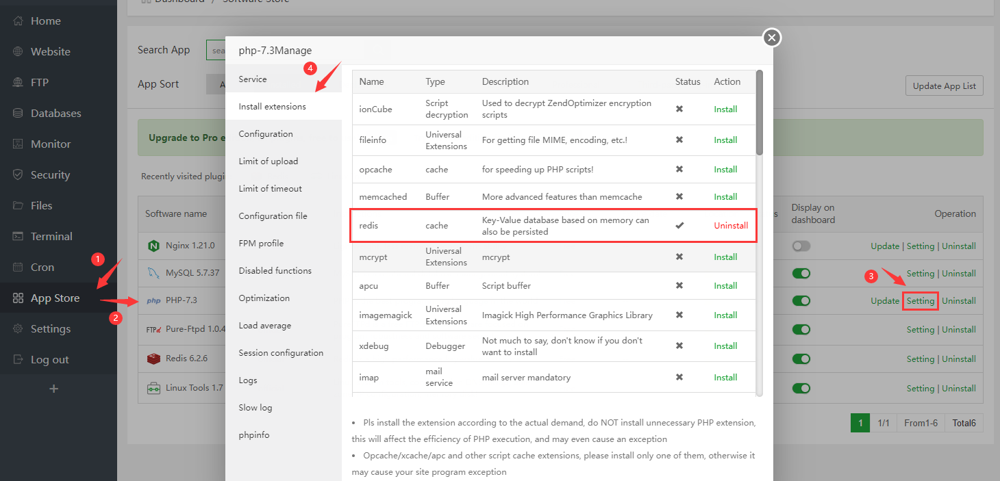

#### Redis（可安装最新版）

v7.0

v6.2

#### phpMyAdmin（如有需要）

宝塔面板推荐使用 `phpmyadmin` 4.4 版本，4.4 版本可直接访问（无需登录）

配置问题可参考[[√ 开发中遇到的问题（20210425）](")第 18 条]

#### Pure-Ftpd（FTP工具，如有需要）

v1.0

#### Linux Tools（如有需要）

v1.7

##### 设置时区

国际版宝塔，设置时区为 `Asia/Shanghai`

> **添加定点计划任务需特别注意，比如凌晨 00:00:00 执行的任务**

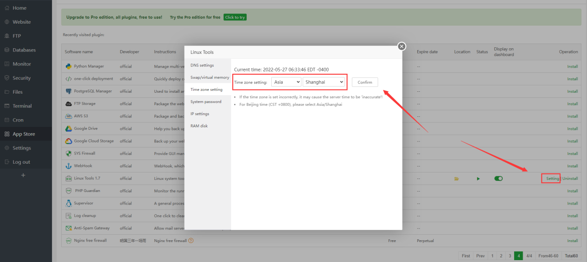

##### 修改 SSH 登录密码

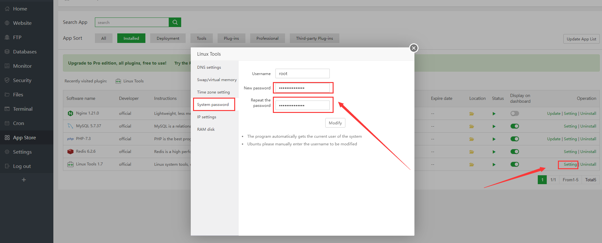

参考：

http://www.tdaidc.com/help/article/704.html - *宝塔LINUX控制面板如何修改服务器的root的密码？*

http://xkzzz.com/post/40375.html - *宝塔面板如何修改root密码,ssh端口号,封ip,开放端口_侠客网*

#### 放行端口，组策略问题

当无法修改远程服务器组策略的情况下，可尝试下图组红框端口区间内的端口是否可用

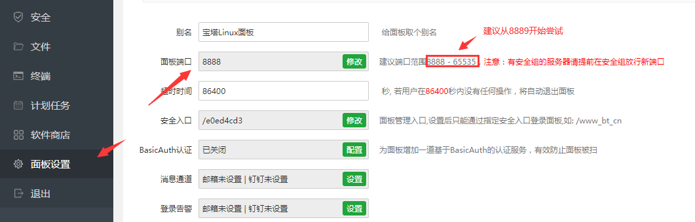

#### 安全配置

1. 修改 SSH 默认端口 22

   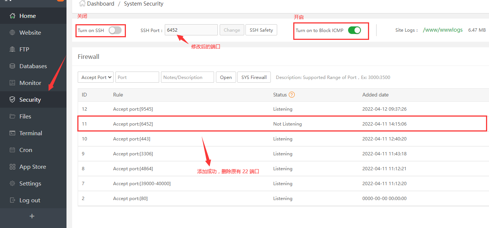

2. 修改面板别名

   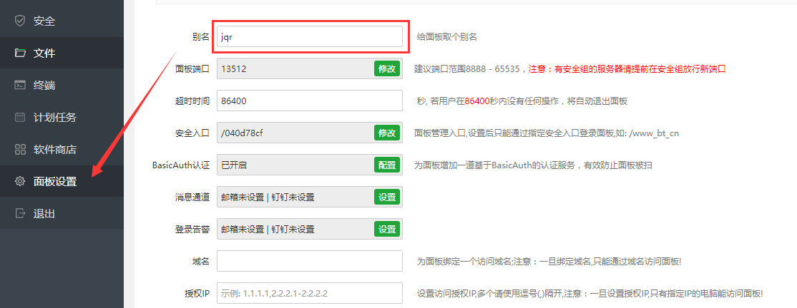

3. 修改面板端口号

   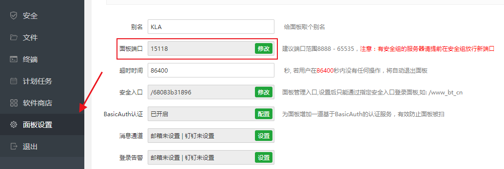

4. 修改安全入口

   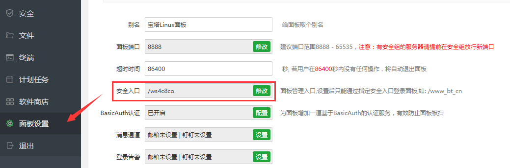

5. 开启 BasicAuth 认证

   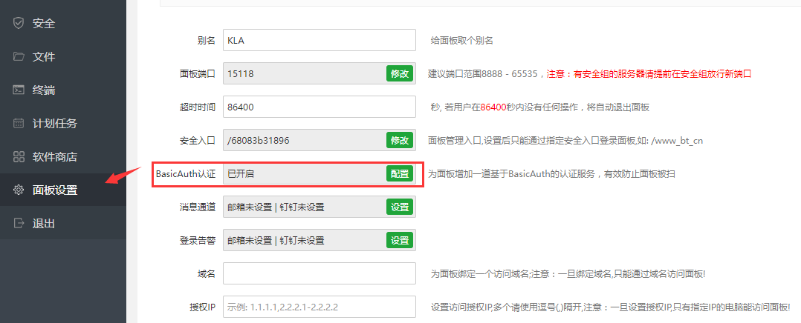

   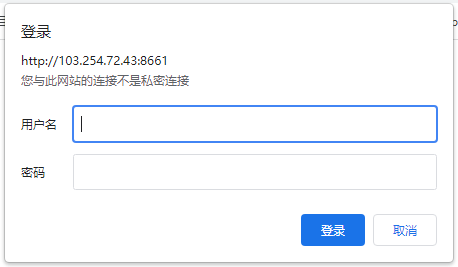

6. 设置域名、IP 访问（如有需要）

   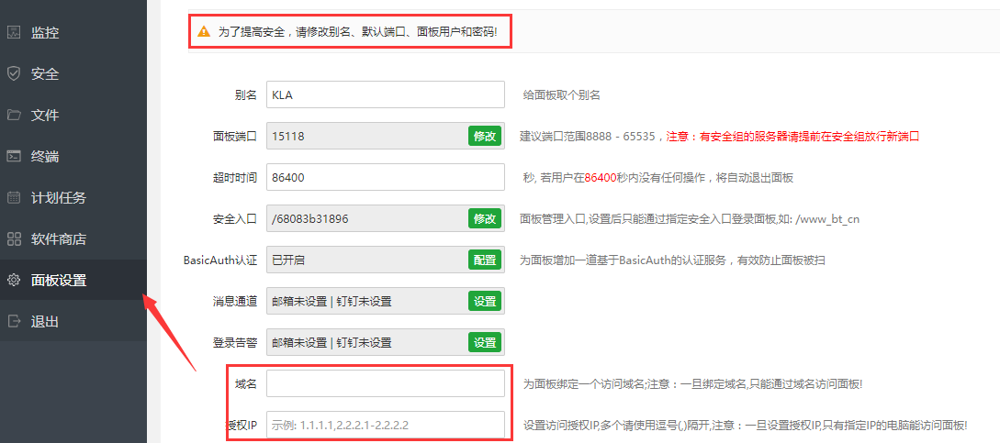

   例如：设置访问域名 `www.lukswapd.test` ，然后在电脑 `hosts` 文件中添加 `45.115.243.144 www.lukswapd.test`

7. 修改面板登录账户、密码

#### 清空操作日志

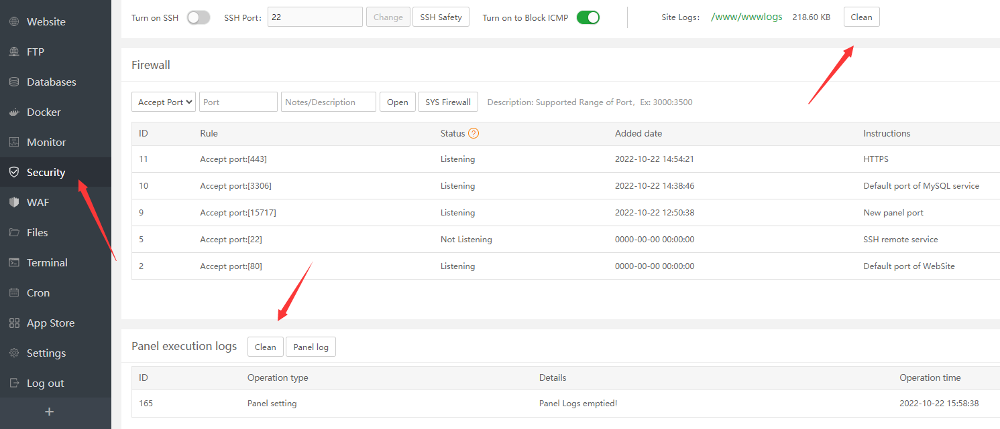

### 网站站点

#### 添加站点（ThinkPHP）

1. [《应用根目录》]()删除无用文件

2. 目录直接指向根目录，不指向 `/public` 目录

3. 站点修改设置运行目录为 `/public` 目录

   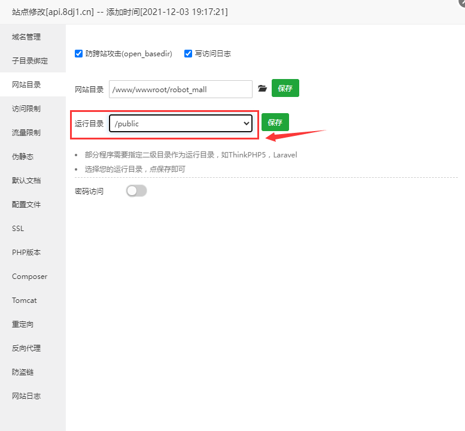

4. 设置伪静态

   

5. 申请 SSL

   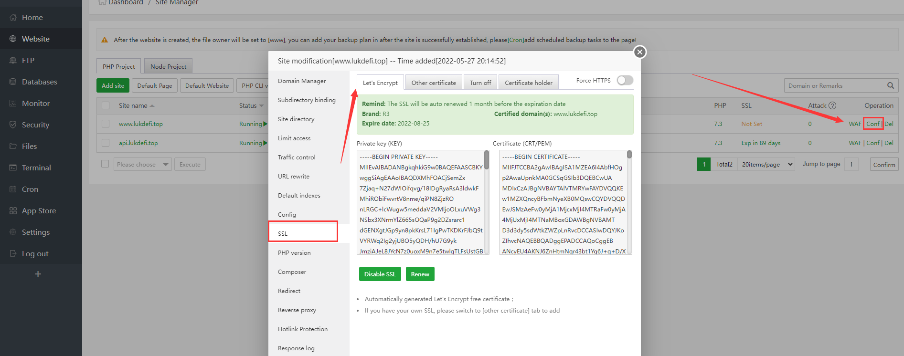

   `api 域名`申请 SSL

   `www 域名`申请 SSL

6. 应用根目录

   > 即 WEB 根目录

   - ThinkPHP6 目录中可删除无用文件

     1. /.git
     2. /.idea
     3. /view/README.md
     4. /runtime
     5. /.env.develop
     6. /.env.produce
     7. /.example.env
     8. /.gitignore（没有使用git可删）
     9. /.htaccess
     10. /.travis.yml
     11. /404.html
     12. /LICENSE.txt
     13. /README.md
     14. /index.html

   - ThinkPHP6 关闭调试模式

     文件名：`.env`

     修改内容：`APP_DEBUG = false`

7. 修改 Redis 配置

     文件名：`/extend/service/Redis.php`

     修改内容：`$this->project = 'sky'; // sky修改为（在同服务器下唯一的）项目名称`

#### 移除站点

- 切换至根目录，搜索文件（输入完整域名（例如：`adesf.com`）搜索，防止模糊误删非删除文件）

  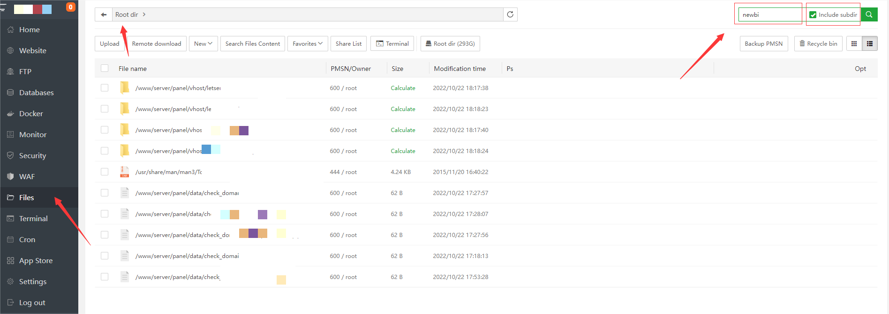

- 清空回收站

  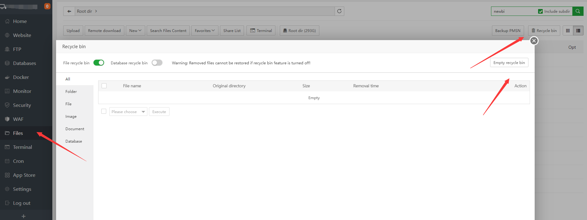

### 站点备份（计划任务）

#### 备份网站

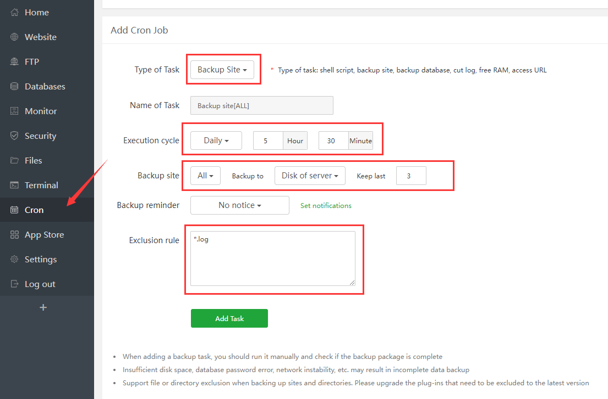

#### 备份数据库

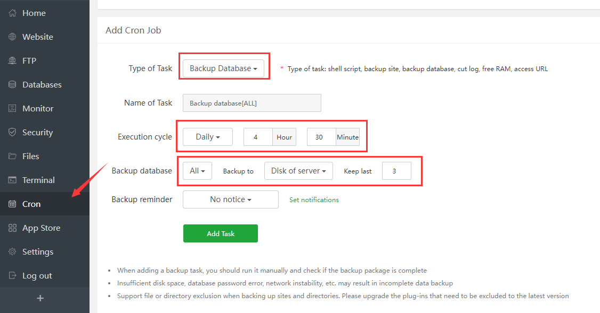

#### 项目所需定时任务

[挂载磁盘](https://www.bt.cn/bbs/thread-50002-1-1.html)

[宝塔目录结构](https://www.bt.cn/bbs/forum.php?mod=viewthread&tid=38655&extra=page%3D11%26filter%3Dtypeid%26typeid%3D10)

[负载均衡教程](https://www.bt.cn/bbs/forum.php?mod=viewthread&tid=34116&extra=page%3D10%26filter%3Dtypeid%26typeid%3D10)

[宝塔负载均衡使用教程](https://www.bt.cn/bbs/forum.php?mod=viewthread&tid=13074&extra=page%3D2%26filter%3Dtypeid%26typeid%3D10)

[Thinkphp项目 安全配置加固](https://www.bt.cn/bbs/forum.php?mod=viewthread&tid=52183&extra=page%3D9%26filter%3Dtypeid%26typeid%3D10)

[家用电脑虚拟机安装centos8使用宝塔面板](https://www.bt.cn/bbs/forum.php?mod=viewthread&tid=61891&extra=page%3D8%26filter%3Dtypeid%26typeid%3D10)

[【系统防火墙】使用教程](https://www.bt.cn/bbs/forum.php?mod=viewthread&tid=50150&extra=page%3D7%26filter%3Dtypeid%26typeid%3D10)

[面板设置消息通道配置之邮箱配置教程](https://www.bt.cn/bbs/forum.php?mod=viewthread&tid=66183&extra=page%3D7%26filter%3Dtypeid%26typeid%3D10)

[宝塔系统加固之三个常见问题教程](https://www.bt.cn/bbs/forum.php?mod=viewthread&tid=64723&extra=page%3D7%26filter%3Dtypeid%26typeid%3D10)

[通过Nginx配置一个简单的下载站](https://www.bt.cn/bbs/forum.php?mod=viewthread&tid=69797&extra=page%3D6%26filter%3Dtypeid%26typeid%3D10)

[宝塔安全建站指南 - 你不得不看的面板安全设置](https://www.bt.cn/bbs/forum.php?mod=viewthread&tid=48577&extra=page%3D6%26filter%3Dtypeid%26typeid%3D10)

[Liunx面板如何设置能充分利用服务器性能](https://www.bt.cn/bbs/forum.php?mod=viewthread&tid=3117&extra=page%3D6%26filter%3Dtypeid%26typeid%3D10)

[nginx环境下禁止ip访问（防恶意解析）教程](https://www.bt.cn/bbs/forum.php?mod=viewthread&tid=4693&extra=page%3D6%26filter%3Dtypeid%26typeid%3D10)

[宝塔面板放行端口](https://www.bt.cn/bbs/forum.php?mod=viewthread&tid=40037&extra=page%3D5%26filter%3Dtypeid%26typeid%3D10)

[反向代理（Nginx版本）](https://www.bt.cn/bbs/forum.php?mod=viewthread&tid=43588&extra=page%3D4%26filter%3Dtypeid%26typeid%3D10)

[阿里云ECS无法打开面板的解决方法—阿里云安全组放行教程](https://www.bt.cn/bbs/forum.php?mod=viewthread&tid=2897&extra=page%3D4%26filter%3Dtypeid%26typeid%3D10)

[大炮分享不可不学的网络命令](https://www.bt.cn/bbs/forum.php?mod=viewthread&tid=63199&extra=page%3D2%26filter%3Dtypeid%26typeid%3D10)

## 面板API

官方：https://www.bt.cn/bbs/thread-20376-1-1.html - *API接口使用教程 - 第三方应用 - 宝塔面板论坛*

参考：

1. https://www.daniao.org/4296.html - *宝塔面板API接口抓取教程-宝塔接口配置文件 - 大鸟博客*

2. https://blog.szhcloud.cn/blog/2020/10/23/%E5%AE%9D%E5%A1%94%E9%9D%A2%E6%9D%BFapi-%E4%BD%BF%E7%94%A8%E6%8C%87%E5%8D%97/ - *宝塔面板API 使用指南 - 寰智博客*

3. https://blog.alipay168.cn/index/detail/item/680.html - *宝塔定时任务批量导入新服务器的宝塔-杂草猿工记-个人博客-韦炳生博客-技术分享*

## SSL

> 免费

1. 宝塔官网注册账号
2. 指定域名申请 SSL
3. 部署
4. 开启强制 HTTPS
5. 防火墙或者安全组放行 443 端口

**参考链接**

<https://developer.aliyun.com/article/705391>

## FTP

> 宝塔 Linux，FTP 端口：21，主动模式可连接；修改 FTP 端口为非 21，主动模式无法连接，被动模式需放行 FTP 被动端口 39000-40000 才可连接。

1️⃣ 宝塔面板FTP端口设置教程 (图文) https://www.idcnote.com/bt/14.html

2️⃣ 宝塔 pure-ftpd 如何开启被动模式(PASV)连接 https://vpsvt.com/reed/443.html

五、宝塔面板 FTP 安装与使用教程（图文步骤） https://www.php.cn/topic/bt/482698.html

宝塔面板的ftp无法使用解决 https://www.cnblogs.com/pxjbk/articles/10046960.html

被动模式下ftp设置端口范围有哪些？花生壳搭建ftp的步骤有哪些？ https://hsk.oray.com/news/8547.html

VsFtpd指定被动端口范围教程 https://blog.csdn.net/qq_22656871/article/details/109356147

### 「tool」pure-ftpd

<i class="fa fa-github fa-lg"></i> https://github.com/jedisct1/pure-ftpd/

参考链接 👇

Linux安装配置FTP(pure-ftpd) https://blog.csdn.net/renfeigui0/article/details/100163336

## Link

https://www.php.cn/blog/detail/23119.html - *宝塔面板 – 修改默认端口以及一些常用端口的安全设置*

https://yangmao.info/225285.html - *新版宝塔面板降级并解除强制绑定手机号码-羊毛之家*

### 站长教程

https://www.daniao.org/btpanel/ - *宝塔linux面板使用教程，以及一些宝塔技术分享！*

## FAQ

### Linux 宝塔面板无法连接phpmyadmin

推荐使用 `phpmyadmin` 4.4版本，4.4 版本可直接访问（无需登录）

解决方式：

1. 检查防火墙（可在面板安全中查看）

    

2. 检查安全组（需在服务器供应商中查看，比如阿里云、腾讯云）

3. 如果使用的默认 888 端口在防火墙中已放行，仍无法连接到，可能是安全组中没有放行导致，在无法修改安全组的情况下，可通过修改`phpmyadmin`访问端口的方式放行

   1. 设置

      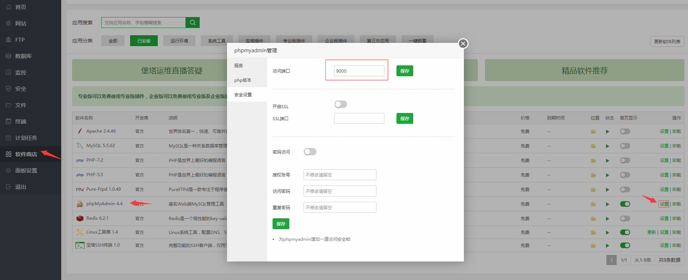

   2. 访问的端口应该为安全组中已放行的端口范围

       

### composer update topthink/framework报错

项目：`swarm`

时间：`2021/06/10`

问题：（问题解决耗时1小时）

执行命令时出现`“Failed to extract topthink/framework: (9) unzip -qq  '/www/wwwroot/tron_service/vendor/composer/tmp-2fc59eeea62afa8f0bc5ab230da84e14' -d '/www/wwwroot/tron_service/vendor/composer/c156dae7'”`错误

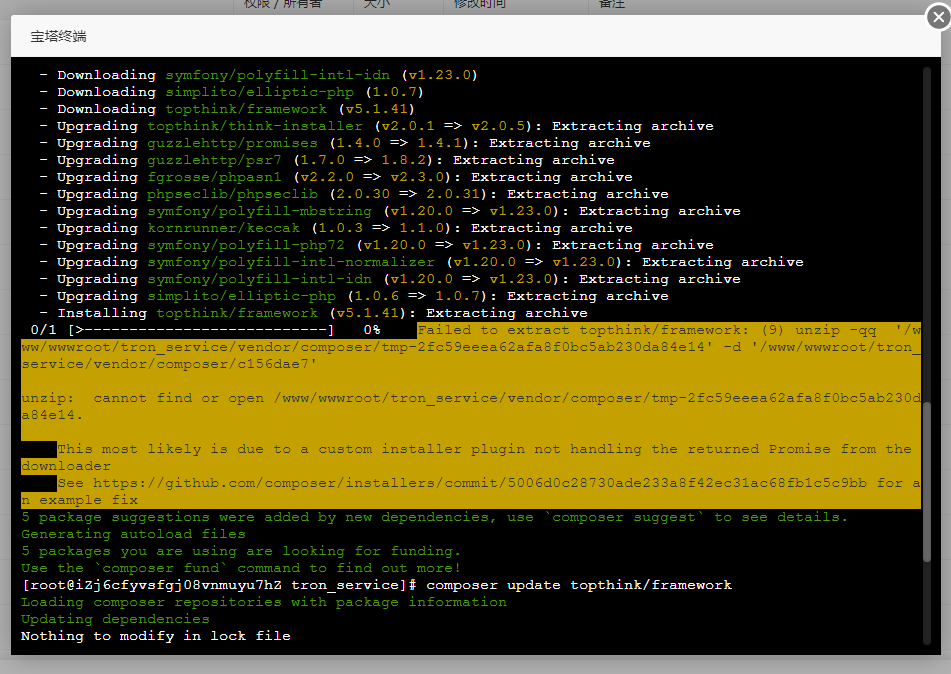 

原因：

/根目录的`composer.lock`版本有冲突

解决：

删除`composer.lock`文件，重新执行`composer update`和`composer update topthink/framework`命令即可成功

 

另一种网上解决方式：<https://ask.fastadmin.net/question/26538.html> *（未尝试）*

### 国内宝塔面板降级

> Q：为什么要降级
> 
> A：屏蔽宝塔强制绑定手机号

https://www.zouht.com/2906.html - *宝塔面板 7.9.2 降级 7.7.0 方法 – 颢天*（亲测有效）
https://www.bilibili.com/read/mobile?id=17006523

https://www.huhexian.com/47380.html - *宝塔面板降级7.7低版本关闭强制绑定手机账号 | 青山绿水*

1. 打开系统终端
2. `wget https://github.com/wei/baota/releases/download/7.7.0/LinuxPanel-7.7.0.zip` - *下载 7.7.0 版本*
3. `unzip LinuxPanel-7.7.0.zip`
4. `cd panel/`
5. `bash update.sh` - *运行更新脚本降级*
6. `sed -i "s|bind_user == 'True'|bind_user == 'XXXX'|" /www/server/panel/BTPanel/static/js/index.js` - *屏蔽强制绑定手机号*
7. `rm -f /www/server/panel/data/bind.pl` - *删除强制绑定手机 js 文件*

### 宝塔远程下载功能 解决服务器下载文件的繁琐步骤

https://www.zhujibiji.com/2018/06/bt-panel-remote-download-function/