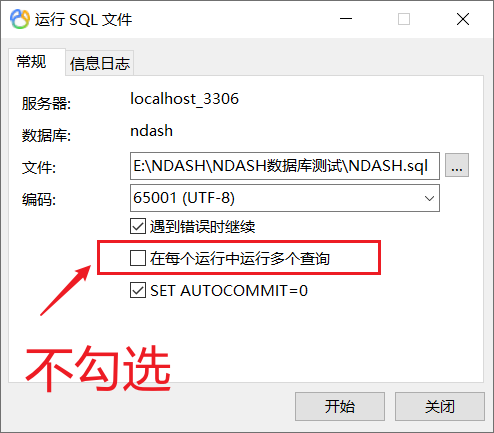

# Navicat

## 简介

> 强大的数据库管理和设计工具，支持 Win、macOS 和 linux。直观的 GUI 让用户简单地管理 MySQL、Redis、MariaDB、MongoDB、SQL Server、SQLite、Oracle 和 PostgreSQL 的数据库。
>
> <cite>—— [Navicat 中国 | 支持 MySQL、Redis、MariaDB、MongoDB、SQL Server、SQLite、Oracle 和 PostgreSQL 的数据库管理](https://www.navicat.com.cn/)</cite>

## 官网

https://www.navicat.com.cn/ - *Navicat 中国 | 支持 MySQL、Redis、MariaDB、MongoDB、SQL Server、SQLite、Oracle 和 PostgreSQL 的数据库管理*

https://www.navicat.com/ - *Navicat GUI | DB Admin Tool for MySQL, Redis, PostgreSQL, MongoDB, MariaDB, SQL Server, Oracle & SQLite client*

https://www.navicat.com/en/support/online-manual - *Navicat Online and PDF Manual | Tips and tutorials | Navicat*

## 安装

https://www.navicat.com/en/download/navicat-premium - *Navicat | Download Navicat Premium 14-day trial versions for Windows, macOS and Linux*

## 快速入门

### 新建链接命名

格式：

`<开始年月日>_<项目名>[ -<环境 正式|测试>]`

例子：

1. `20210607_panda -正式环境`

2. `20210607_panda -测试环境`

### MySQL 指定用户访问指定数据库

用户：

1. develop /用于存放开发的项目

   链接名：`localhost - develop`

   用户名：`develop`

   密码：`root`

2. demo /用于存放演示的项目

   链接名：`localhost - demo`

   用户名：`demo`

   密码：`root`

参考：

1. https://www.cnblogs.com/wenxinphp/p/9876949.html - *MYSQL指定用户访问指定数据库 - (BACH) - 博客园*

### 导入 SQL 大文件

不勾选“在每个运行中运行多重查询”**（验证可用）**

参考链接：

1. https://www.cnblogs.com/ndash/p/14082008.html - *【MySQL篇】Navicat导入SQL大文件报错终极解决方案*
