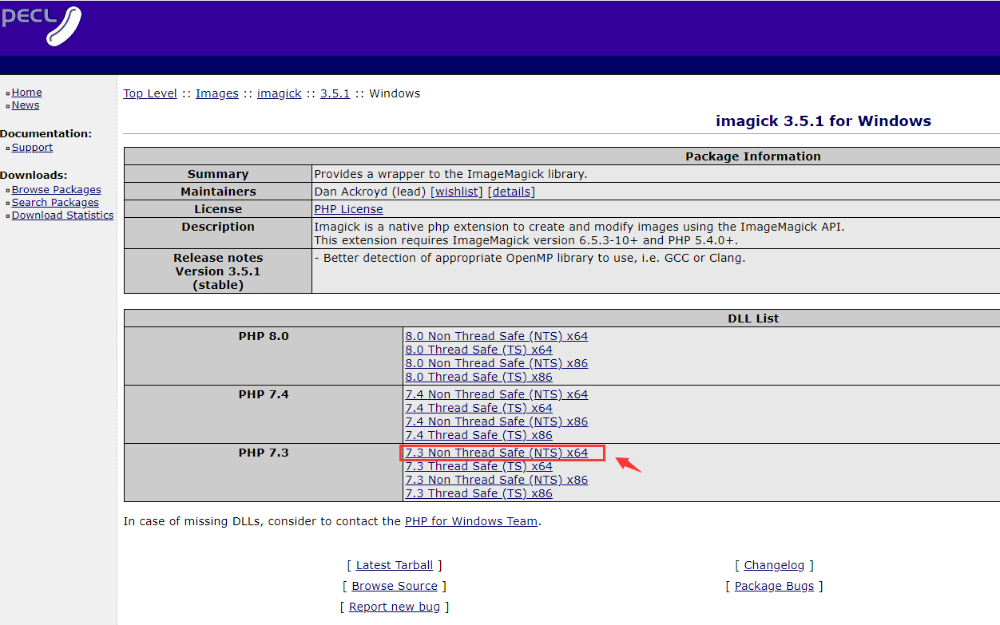
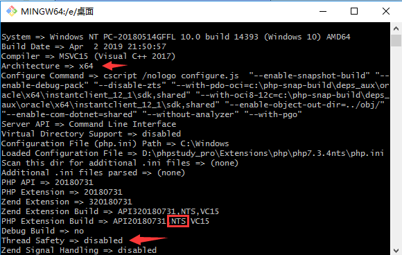

# PhpStudy

## 简介

> phpStudy官网2019正式推出phpStudy V8.0版本PHP集成环境，支持Windows与Linux系统，支持WEB面板操作管理，一键网站开发环境搭建配置，另经典版本phpStudy2016/2018/JspStudy环境套件同步更新中，欢迎网站开发者或运维下载使用！
>
> <cite>—— [phpStudy(小皮面板) - 让天下没有难配的服务器环境！](https://m.xp.cn/)</cite>


## 官方

1. https://www.xp.cn/ - *小皮面板(phpstudy) - 让天下没有难配的服务器环境！*

2. https://www.xp.cn/phpstudy-v8/ - *phpStudy V8 使用手册 - phpStudy官网*

3. https://beta.xp.cn/ - *小皮面板-好用、安全、稳定的Linux服务器面板！*

## 安装

### Windows

https://www.xp.cn/download.html - *Windows版phpstudy下载 - phpStudy*

https://beta.xp.cn/php-study - *小皮面板-好用、安全、稳定的Linux服务器面板！*

### macOS

https://www.xp.cn/using-mac.html - *phpstudy_MAC版本-使用交流 - phpStudy*

https://public.xp.cn/upgrades/phpstudy_install.dmg

### Linux

https://www.xp.cn/linux.html - *phpStudy Linux 面板（小皮面板）- 小皮面板(phpstudy)*

## 用法

### 伪静态

- Apache

  `.htaccess` 文件名；重写规则

  `.htaccess` 文件代码在线生成工具

  URL 重写：开启模块 `mod_rewrite`

  ```nginx
  <IfModule mod_rewrite.c>
    Options +FollowSymlinks -Multiviews
    RewriteEngine On
  
    RewriteCond %{REQUEST_FILENAME} !-d
    RewriteCond %{REQUEST_FILENAME} !-f
    RewriteRule ^(.*)$ index.php?/$1 [QSA,PT,L]
    RewriteRule .* - [env=HTTP_AUTHORIZATION:%{HTTP:Authorization},last]
  </IfModule>
  ```

- Nginx

  `nginx.htaccess` 文件名

  ```nginx
  location / {
      # URL重写
      if (!-e $request_filename) {
          rewrite ^(.*)$ /index.php?s=/$1 last;
      }
  }
  ```

### 反向代理

- 在 nginx 服务器中使用

  ```nginx
  location /api {
      # 设置反向代理
      proxy_pass http://localhost:3000/api;
  }
  ```

  参考：https://www.csdn.net/tags/NtTaggysMzA0NDEtYmxvZwO0O0OO0O0O.html - *phpstudy 反向代理 - CSDN*

### Redis

1. php 添加 redis 扩展

2. 打开 redis 程序服务

   程序位置：`D:\phpstudy_pro\Extensions\redis3.0.504\redis-server.exe`

### 安装 php 扩展

1. 前往 <http://pecl.php.net> 下载需要的扩展（版本可选择最新 stable 稳定版）

2. 选择对应 php 版本的扩展包

   

   **如何选取扩展包**

   - 输入命令 `php -i` 或者 `php -r "phpinfo();"`

     

     参考：[使用 php 命令行工具查看架构及是否支持线程安全](https://blog.csdn.net/hfut_wowo/article/details/88169634)


### 安装多个 PHP 版本

1. https://www.cnblogs.com/hefeng2014/p/16992076.html - *mac m1 phpstudy 升级php版本方法 - Lafite-1820 - 博客园*
2. https://www.tpxhm.com/adetail/1056.html - *MacBook版本如何phpstudy安装多版本PHP，例如PHP8.2 - 简忆博客*

## 参考

1. https://www.php.cn/xiazai/gongju/1480 - *VC10 64位_phpstudy集成安装环境运行库-php中文网工具下载*

2. http://www.lovestu.com/phpconfig01.html - *PHPStudy 加载64位PHP环境 - Lovestu*

3. https://blog.csdn.net/xgocn/article/details/95754790 - *如何使用phpstudy安装PHP7的64位运行环境？*

4. https://blog.csdn.net/weixin_36185028/article/details/76144941 - *phpstudy安装64位PHP*
