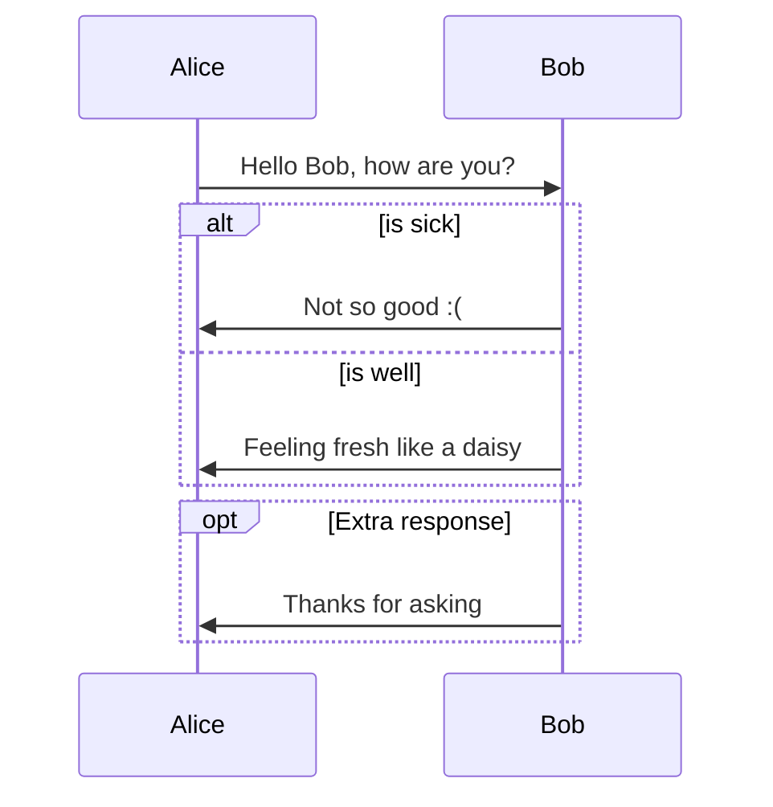
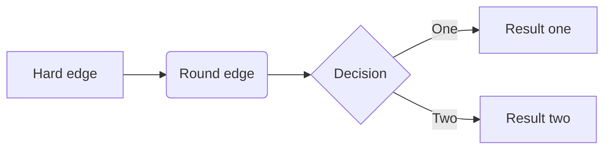
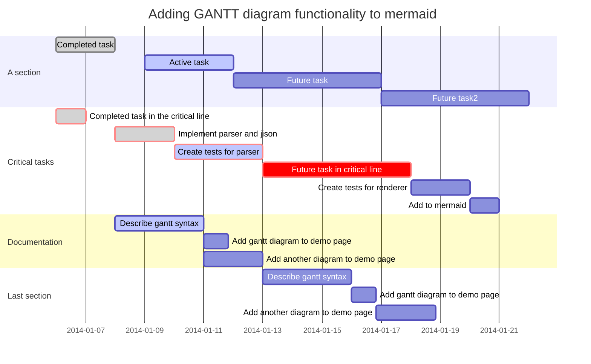
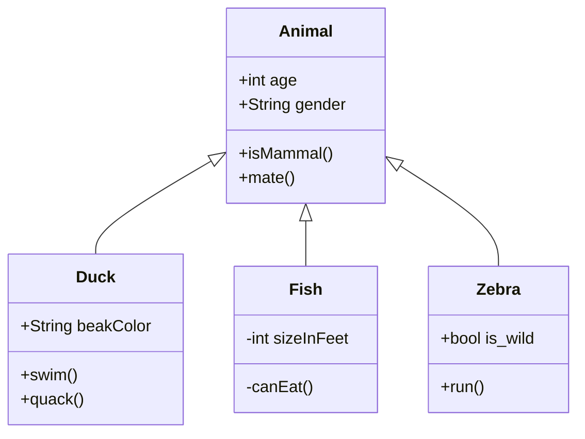
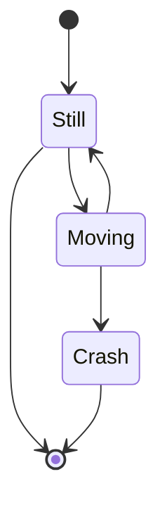

## 简介

>  Markdown 是一种轻量级标记语言，它允许人们使用易读易写的纯文本格式编写文档。  
Markdown 语言在 2004 由约翰·格鲁伯（英语：[John Gruber](https://daringfireball.net/projects/markdown/syntax)）创建。  
Markdown 编写的文档可以导出 HTML 、Word、图像、PDF、Epub 等多种格式的文档。  
Markdown 编写的文档后缀为 `.md`, `.markdown`。


## 使用场景

*Markdown* 是做笔记、为网站创建内容以及生成可打印文档的快速、简便的方法。

- 静态网站
- 文件资料
- 笔记
- 书籍
- 演示文稿
- 邮件
- 协作
- 文档


## 工具

!> 📢 软件功能优先查看官方文档。

https://www.markdownguide.org/tools/ - *Tools | Markdown Guide*

在线编辑器：

1. ~~[MdEditor](http://www.mdeditor.com/)~~

2. [Dillinger](https://dillinger.io/) - *Online Markdown Editor - Dillinger, the Last Markdown Editor ever.*

3. [StackEdit](https://stackedit.io/app) - *StackEdit*


应用编辑器：

1. [Typora](os/tools/app-list#markdown-Typora)

2. [Markor](os/mobile/README.md#markor)

有关更多工具详细信息，请参阅“[应用列表 > Markdown 工具](os/tools/app-list.md#markdown-工具)”。


## 教程

指南：

1. https://www.markdownguide.org/ - *Markdown 指南*
2. https://www.markdown.xyz/ - *Markdown 指南中文版*
3. https://github.com/mundimark/awesome-markdown - *GitHub - mundimark/awesome-markdown: A collection of awesome markdown goodies (libraries, services, editors, tools, cheatsheets, etc.)*
4. https://www.runoob.com/markdown/md-tutorial.html - *Markdown 教程 | 菜鸟教程*

----

博文：

1. https://sspai.com/post/54912 - *Typora 完全使用详解*
2. https://www.jianshu.com/p/49dd84559d3b - *Markdown 语法 with Typora*
3. https://www.jianshu.com/p/b30955885e6d - *Typora Markdown 手册*
4. https://docs.github.com/zh/get-started/writing-on-github/getting-started-with-writing-and-formatting-on-github/basic-writing-and-formatting-syntax - *基本撰写和格式语法 - GitHub Docs*


## 基本语法

### 空格与换行

<!-- tabs:start -->

#### **空格**

在输入连续的空格后，Typora 会在编辑器视图里为你保留这些空格，但当你打印或导出时，这些空格会被省略成一个。 
你可以在源代码模式下，为每个空格前加一个 `\` 转义符，或者直接使用 HTML 风格的 `&nbsp;` 来保持连续的空格。


#### **软换行**

<kbd>Shift</kbd> + <kbd>Enter</kbd>

需要说明的是，在 Markdown 语法中，换行（line break）与换段是不同的。且换行分为软换行和硬换行。在 Typora 中，你可以通过 `Shift + Enter` 完成一次软换行。软换行只在编辑界面可见，当文档被导出时换行会被省略。


#### **硬换行**

<kbd>空格</kbd> + <kbd>空格</kbd> + <kbd>Shift</kbd> + <kbd>Enter</kbd>

你可以通过 `空格 + 空格 + Shift + Enter` 完成一次硬换行，而这也是许多 Markdown 编辑器所原生支持的。硬换行在文档被导出时将被保留，且没有换段的段后距。


#### **换段**

- <kbd>Enter</kbd>

  你可以通过 `Enter` 完成一次换段。Typora 会自动帮你完成两次 `Shift + Enter` 的软换行，从而完成一次换段。这也意味着在 Markdown 语法下，换段是通过在段与段之间加入空行来实现的。

- 换段 连续两次 <kbd>Shift</kbd> + <kbd>Enter</kbd> 

<!-- tabs:end -->

**Windows 风格（CR+LF）与 Unix 风格（CR）的换行符：**CR 表示回车 `\r` ，即回到一行的开头，而 LF 表示换行 `\n` ，即另起一行。 
所以 Windows 风格的换行符本质是「回车 + 换行」，而 Unix 风格的换行符是「换行」。这也是为什么 Unix / Mac 系统下的文件，如果在 Windows 系统直接打开会全部在同一行内。 你可以在 `文件 - 偏好设置 - 编辑器 - 默认换行符` 中对此进行切换。


### 链接

<!-- tabs:start -->

#### **Rendered**

My favorite search engine is *[Duck Duck Go](https://duckduckgo.com)*.


#### 添加标题

[Duck Duck Go](https://duckduckgo.com  "The best search engine for privacy")


#### 网址和电子邮件地址

<https://www.markdownguide.org>

<fake@example.com>


#### 引用式链接

[John Gruber][df1]

[JavaScript Location 对象][JavaScript Location 对象]

[JavaScript Location 对象]: https://www.runoob.com/jsref/met-loc-reload.html	"Location reload()方法"
[df1]: http://daringfireball.net/projects/markdown	"Hobbit lifestyles"


#### **Markdown**

```markdown
My favorite search engine is *[Duck Duck Go](https://duckduckgo.com)*.

#### 添加标题
[Duck Duck Go](https://duckduckgo.com "The best search engine for privacy")

#### 网址和电子邮件地址
<https://www.markdownguide.org>
<fake@example.com>

#### 引用式链接
[John Gruber][df1]
[JavaScript Location 对象][JavaScript Location 对象]

[JavaScript Location 对象]: https://www.runoob.com/jsref/met-loc-reload.html "Location reload()方法"
[df1]: http://daringfireball.net/projects/markdown "Hobbit lifestyles"
```

<!-- tabs:end -->


### 图片

<!-- tabs:start -->

#### **Rendered**


> `Typora` 编辑器中图片默认居中对齐，如需左对齐，可在图片后加一个空格。


#### 带链接（尺寸缩小）的图片

[](http://liqucn.com/bz/1154169.wml)


#### 图片说明

<figure>
    
    <figcaption>A single track trail outside of Albuquerque, New Mexico.</figcaption>
</figure>


图片说明参考：https://www.markdownguide.org/hacks/#image-captions


#### 引用式图片

目前已知 3 种引用方式：
- 本地路径 _*.jpeg_
- URL *https://\**
- 图片 Base64 编码 *data:URL*

![引用式图片-1][quote-image-3]

[quote-image-1]: ../../../_media/images.liqucn.jpeg

[quote-image-2]: https://gimg2.baidu.com/image_search/src=http%3A%2F%2Fimages.liqucn.com%2Fimg%2Fh23%2Fh09%2Fimg_localize_f78a645ac5fea528e1ca6dc4c87b1167_400x400.png&refer=http%3A%2F%2Fimages.liqucn.com&app=2002&size=f9999,10000&q=a80&n=0&g=0n&fmt=jpeg

[quote-image-3]: data:image/jpeg;base64,/9j/4AAQSkZJRgABAQEASABIAAD/2wBDAA0JCgsKCA0LCgsODg0PEyAVExISEyccHhcgLikxMC4pLSwzOko+MzZGNywtQFdBRkxOUlNSMj5aYVpQYEpRUk//2wBDAQ4ODhMREyYVFSZPNS01T09PT09PT09PT09PT09PT09PT09PT09PT09PT09PT09PT09PT09PT09PT09PT09PT0//wAARCAGQAZADASIAAhEBAxEB/8QAGwABAAIDAQEAAAAAAAAAAAAAAAYHAwQFAQL/xABEEAABAwMCAwYEAwYEBQIHAAABAAIDBAURBiExQVESYXGBkaEHE7HBFCLRFSMyQlLwM2Jy4RYkQ1OCY7ImNFSSk6Lx/8QAGQEBAAMBAQAAAAAAAAAAAAAAAAECAwQF/8QAJREBAQACAwACAwACAwEAAAAAAAECEQMhMRJBBBNRImEUMnEj/9oADAMBAAIRAxEAPwCzkREBERAREQEREBERAREQEREBERAREQEREBERAREQEREBERAREQEREBERAREQEREBERAREQEREBERAREQEREBERAREQEREBERAREQEREBERAREQEREBERAREQEREBERAREQEREBERAREQEREBERAREQEREBERAREQEREBERAREQEREBERAREQEREBERBxtR36GxUbZZGGWSQlscYOMkcSTyAXBseuxW18dLXUrYfmuDWPY4kAngCD9VxfiJVmov7aUcKaMDGebtz7ELiXKifbpaZ7MjtxtcD0cMZ98HzWWWestN8eKXHa7EXNsVyZdbTBVsc3tOaBIAf4XAbj1XSWsYWaEREBERAREQEXiIPUXhcG8SB5r5+bH/3GeoQfaL5a9ruDgfA5XqD1F4vUBERAREQFhq6mKkpZamd3ZjiaXOPQBZlDfiJdRTW5lvid+8qTl4HEMB+5+hUW6iZN3TQPxGf+L2t7fw+cbvPbx1zjHl7qcUNXDX0UVVTu7UUre00/bxyqcNvIsf40jcyAAf5eGfX6KefDisM1llpXYzTynA54dv8AXKzwz3dNeTjmMlTBERasRERAREQEREBERAREQEREBERAREQEREBERAXy4gAknAAX0ubqCpFJYq2fm2F2PEjA9yEJ3VTzz/tDUE1RI4kSTF2T0BOB6ABSevoDcbYIntayUAGM5zg44E9/NRmxRh1U+QjPYbt3E/7ZU1Y5oYwEgEgYGdzsuDlysy3HqcOM+Oqi+mL7Np65PiqWv/DvPZmZzaRzA6j3CtWlqYKynZUU0rZInjLXNOQVALzZo7i0SRkRzgYDjwI6H9VwrfdLrpqrcxhLWkgvifu1/eP1C34+aWac3NwWXcXGiilq1za60Njqy6jlO3592k9xHDzwt666qtNrb+eoE0hGRHCQ4nz4DzK23Nbcvxu9O6taqraWjj7dVURQtxxe8D0zxVcXPXV0rHGOha2ljOQOyO08jxPA+AWlSaavl3cJpmvY1x/xKl5BPkcn2UXOfS84/wC1M67XVmpj2YHS1LgP+m3A9ThcGs+IdbI3FFRxQk/zPJeR4DYLcotA0rAHV1XJK4cWxgNHqcn6Lu0Wn7TRDMFDF2v6njtn1OcKlztTrGIE/Umpa8YiqJyDygix7gZ914KPVdY3JbcXA8e29zc+RIVoMa1gwxoaByAwF9KN1Pyk8iqxpXUEhyaR5J4l0zQfcr7/AODr/wD/AE7f/wAzf1Vooh81WHSeoGHIpCccxMw/dfX7O1TSNyxle0DlHIT7AlWiiHz/ALFXMv2p7eCJJ6toHETx593DK6FF8QrjEMVlNDUDq3LD9x7KwCA4EEAg8QQtCssdrrWkVFFC7va3sn1GCpls+zeN9jm0Wv7VPhtUyamceJI7bR5jf2Uho7lQ17Q6jqoZts4a8EjxHEKJ1ugqCXLqOolgONmu/O3P191Ha3SN5txM1OBM1m/bgcQ4eWx9MqZnftHwxvlW0iqm3azvNtcIao/iGN2LZgQ8efH1yuvX/ETtUwFBRubORu6Ughh7gOPnhWmcV/XUqvl6pLLSGapcC8g/LjB/M893d3qrv+c1JeXzzEkuIL3DgxvIDy4BIaa46grHTzyPdk5dK/gO4D7DZSugoYbfTCKEbcXOPFx6lYcvNrqOrh4PutW7whlsMDWAQhvZGDu3A28lq/Dmq+RfpKc5xPEQB3g5HtldStLXU2QQ4E8jkFRW0zG26pppBsGVAaf9JOD7FU4L20/Ix3FyogRdrzhERAREQEREBERAREQEREBERAREQEREBEXy5waMuIAHMnCD6Ub19P8AK0vO0cZXsYPUE+wK6s95tdO7E1wpWHoZR+qimur3b6yxtp6Oqhne6YZDTkgAE5+3mq5WaWxl3ERtU5hhe2JgfPK8BregA4nuGVK7dAI4BI95kmePzvPHwHQDoo3Yoo2xulLmmRxwBncALuRVD4mEAgjjvyXByd26epxdSbdMkAZJAA5lca811H8oxztY8cgRknw6eK5tzvhJMcDu27m7kPAc182bTlxvj/nuJigJ3mkBJPgOf0U4cV9qvLzSTTjlvz6jsU0L/wA5wxgy4+HepRZ9EVVSBLcnGmj4iMYLyPoPr3KZWix0FoiApogZMYdK4AvPnyHcF0l0acNzt8c622O22xoFLTMDwN5HDtPJ65PDywuiiKVLdviaWOCF00zwyNgJc4nAAHNcGLWlmkqhD8yRoJwJHMwwnxzkeYXO+ItY+OkpaRhIbK4ufg4yBjA9TnyCgCL44Sza8AQ5oIIIIyCDsQvVGtB1r6qxmKUkmmkLAScktIBHpkjyUlRWzV0IiIh4opddb01FWOp6WnNSGHD3h/ZGeYGxz4rt3+ofS2KtmZntCIgEcids+WVT6L4Yy91b9kvNLeaT51PlrmnEkbuLD9x3rpKsNC1MkGoo4muIZOxzXDkcAkfRWeiMpq6EREVaVfaaC5MLa2mjkPJxGHDwI3UOu+hZYw6W1S/MA3+VIQHeR4Hzwp8iLTKzxUdNcbjZ5jTzMeGtODDKCMeHMfRSe3XaluDQGODJMbxuO48OqlFztVFdIDFWQh+xDXAYc09QeSr++aTrbU41FIXVFO3ftNGHs8QPqPZZZ8cy7+3Rx8+uq6F2ifABUUue0Tl8Wdngc8cj381F6+Zr64VEJ2IDh1BG32W9SXx7sMrSXYGA/ifMfdcytkhkqnPpwQw74IxvzUYY2XtpyZSzpeFNJ86mhl/rYHeoysiqY6vv0rGxU8gjaxoaGxRA7AYHHJXyNQ6nae0amqwOsYx9F1fOOL9dW2vVVcGub7TnszGGXHKSPB9sLq0nxGOwrLfz3dE/7EfdJlEXjyifouBQ6wslacCrELj/ACzjse/D3XaZUQyMDmSxub1DgQrSyq6sZV4uBftU0FpgcGTMnqf5YmOzv3kcAoTBrm9MrPnSyRyRE7xdgAY6AjceOSouUiZhbNrWRYKSoZV0kNTHnsSsDhnoRlZ1ZUREQEREBERBBte3+toKiGgoZXQlzPmPkacO3JAAPLgVxbHrK4W6oLLk+WqgJwQ85ew9QTx8Cs3xJZi+QO5OgHsSuFdadrZKaqIPyZ2NJI4ggDPmsbbK6MMJcfFnQassc8QkFfGzIz2X5aR4haNx11aKQFtMX1b8bfLGG57yfsCuDFoRtTDHPS3VjoZGhzSYTkg+a3aPQNJHIHVlXJMB/KxoYD4nJKn5VT44xyK/Xd3q3FlI2OmadgGDtP8AU/YLS/Zmpb25rpoquUHcOnJDR3jOB6KyKG10FvaBR0kcZAx2gMuPiTutzdRbb6n5SeRXUWgbm4AyVFKwnlkn7LMfh9V4yK+AnoWEBT9Y5546eB807wyNgJc4nAAUI+dVpcdHXS307qguhljYMuLX4IHXfC4oq6qSP8OJHva4gAcSe7qu1qK/VF+rG0lE2QUwdhkYG8h6kD2HJSrS+l4rZG2qrGtkrCMjO4i7h39/ooslaTO4ztzdOaMADau7tySAW054D/V+imzWhrQ1oAaBgADAAXqKWVtvoiIiBERBDfiLRvkpKWrYCWxOLX4HAHGD6jHmoArtnhjqIXwzMD43ghzSMggqOM0PaW1fzi6d0YOREXDs+GcZx5ovjnJNV5oCkfBZHzPBHz5C5oIxsABn1BUoXyxjY2NZG0Na0AAAYAA4AL6RW3d2IiIhq3SkFdbKmlPGWMtBPI42PrhU3NFJBM+GZhZIwkOBGCCFdy5txsVsuUolrKVr5Bt2gS0kd5BGfNFsMtIToG3yT3g1pBEVM07kcXEYAHkSVZCw0lLT0UDYKWJkUbeDWjA8e896zIjK7uxERECIiAiIgiWo9HQ1YfVWwCKo3Jj4Nee7ofZQy2Tw2y54udAJ2tPZfHICC09QOGe4q4Fw9R6dp71AXtxHVMH5JMce49R9EXmX1XTt09JUUMclB8v5DhloYAAO7A4EdFtZPVVVbLlcNL3R0E7HCMOxNCeBHUHr0I4qzKGtp7hSMqaWQPjeMgjiD0I5EdE2jLHTJPBDUM7FRDHK3o9oI91yKvSdkqhvSCE9YiW+3D2XWnqaenANRPHEDwL3ho91zpdTWSIkOuMRI49nLvoCiJv6Rut+H5BLqCtBGdmzNxjzH6LlSaKvjX9kQRPH9TZBj3wVMJNY2JgJFU556Njd9wAtGp17bmMP4ennkdyDgGjzOSfZFpcnBk0hJb6OStu9VHFFGM9iM5c88mgnABPmoyRzxgHgpHVS3TUtSJKvMNKwktbjAA7geJ71zXQtuF5ipKNo7Dntijx0zjP1OVH/AI1ksm6tqwNLbDQNPEU7PoF0VjijbFEyNgAawBo7gNlkXQ5L6IiICIiAiIggnxNpS6noqwN2Y50bj4gEfQri0ETLnYGwPwHRktB6EcD6FWBqK2i62WopQAZC3tR55OG4/vvVX2Cr/CVrqebLWynskEYw4cM9Oix5J3t1cGU1qu3pK/OtdQbTcz2Iu1iNx4MJPAnoevLwU+BBAIIIO4I5qB3O1w3BmThkoGzwPY9QtGkueoLEPlAGeAcGuBe0DuI3Hgqy7OTiu9xZaKCx/ECUACa2tJ5lshHsR910aLXVrnOKmOanPUjtD1G/spZXCz6SgkNaSSAAMkk4ACrXVOoJLzVChogTStdhoA3ldwB8Og81v6x1PHUQtobXOHxyNzLI3mDwaPv6dVtaK06KeNl0rWZmeMwsI/gB5nvPLoETJqbre0pptlphFTVAPrHjfmIweQ7+p8lJERFLbbuiIiAiIgIiICIiAsUtTTwnE08UZ/zPA+pUa15cKuioIGUkj4hM8h72nBwBsAeWc+yrl7nyPL5HFzjxJOSUXxw3NrifebXH/HcaUeEoP0K136lsjDg3GE+BJ+gVSIi365/Vuwais07wyO4w5OwDj2frhdNrmuaHNIIIyCDkFUerH+HxqDZZDMXGL5pEWTtjAzjuz75RXLCSbiVIiIoIiwVtVFQ0ctVOSI4mlzsDJwOiDOi5VivtLfIZH07XxvjOHMfjIB4HbkuqhZrqiIiAiIg4uo7BDeqXkypYD8uT7HqPoq/obpc9O1FTTx/u3nLXscMhrhwIHX2KtpRvV+n23SkNVTMH4yIZGBvIOh7+noi+N+qiNNaKi5tFXX1b3GQZG/aJB7zw8Fus09QNADhI89S7H0XMsNz/AA0v4WodiJx2J/kP6FSB9wo2gl1VEP8AzCpdurCY6a7bHbmnP4fJ73n9VsxUNJDj5dPE0jn2QT6rSnv9DE0/Lc6V3INBA9SuTU3qtrXCGnaYw84DYwS455Z4+iatWuWMb99uzI43UtO4GRww9w/lHTxXZ+HtiLM3eqZgkdmAEb45u+w81g01omSSRtXeWFkYILYCd3c8u6Du49cKwWMaxgaxoa0DAAGMeS1ww13XJy8vy6j7REWrAREQEREBERAVc6908+GoddqNhMTzmZrR/A7+rwPPv8VYy+HsZIxzHtDmuBBB3BB4qLNzSccrLtV1mvLJ2Np6k4mAw1xOz/8Af6rtLW1Hod8ZfV2YFzc5NPzH+k8/D6qN093r6B5hqGF/YOCyQEOHdnj6rDLCyu7DllnaVljHfxNB8Rlce+xUFPSOe6nj+c84Z2Rg567dF9QaipH4ErJIyeO2QPMfouTUSTXy8RwwAntv7EY6DPE/Uqsl2tnlNdOho6xftSt/E1Df+Vp3AkEbPdxA8OZ8uqswAAADYBatrt8Nst8VJTj8rBuSMFx5k95W2ruLK7oiIiBERAUa1fqCazMgjowwzS5JLhkBo7upP0UlVd/EYH9r0xPA04x49o5+yJxkt7Ti0VU1baqaqqIxHJLGHlo4b8x4jfzW4ta3OY620xjILTCzGOmAtlEX0REQad0t1PdKJ1LVMyx24I4tI4EHqoBcdFXOlc40gbVRci0gOx3g/Yqy0RMys8U1VWu4UUZkqqKaJgOC5zCBnx4L2gtNwuQJoqV8rQcFwwAD3kqxtax/M0zU/wCQtd6EfquR8OJB+GrmEgYewgE9Qf0Rp8rrbBadCSmRsl1ma1gOTFGck9xPAeWVOIIY6eFsMLGsjYMNa0YACyIjO230RERAsVTAypppaeUAslYWkEZ2Iwshc1vEgeJXLvd6gtVDJM4gyYIjaTu53Lbp1UbJLb0heiJH0uqHUwOQ9r43d+NwfZWSq50JTumvUtfLnsxNO+Ni53L0yrFBBGQchSvn69RERQREQEREFe66sf4ef9p0zMRSnEoA/hd18D9fFcnTtgN9kljjq44XxAEtc0kkHmMf3wVpVVPFV00lPO0OjkaWuB6FVcx1TpbUoIJJgdvyEjD+o9/BJrfbTG2zU9Suk+HdIzesrZZe5jQwe+VJ7dZrdbGgUVLHGcYL8ZcfE8VtUtRHVU0dRC4OjkaHNPUFZltJJ4yuVvoiIpVEREBERAREQEREBERAWjcLVQXJnZraWObbAJG48DxC3l4ShLpWOtbHabMyE0ZmbPMTiPtgtDRxO4zxwOPVbvw+tJa2S6TM3OY4cjlzI+nquJqCpk1Bqt0cJy0yCCLoADjPgTk+asyjpo6OjhpoRhkTA0eACxut9NrbMZKzIiKFBERARF4SACScAIBIAyVEdfQU9Rbo5zIxk0Dvydo4LweIHsfJdDUOoILXBv8AnmcD2Iwdz3noFW9wuFTcakz1Uhc47ADYNHQDki+GN3t39Nap/Z8LaOt7ZhB/JI3csHQjmFNqS70tWwGnqIpc8muGfMcQqgQOLSCCQRwIOFVe4S9rqFQObT6p+IH9JVU0BvdQHGgkrHtZxLXnA91t/K1TJ+U/jt+ryPfKK/rqyXVQaCSAAOJJ2C5ddqS3UgIlq4y4D+GM9o+G2ceahY07qCqIE4fg85ZwfuV0KTQ7yQa2rAH9MQyfU/oiZxz7al81RNdozR0cLmxPOCTu945AAcPdaVBW3LTlQ7tU5Y2XBeyRhAcBwweu5U8ttloLYM0sADzxe45cfM8PLC3JYYp2Fk0bJGHk4Aj3RbUk0jdJraicAKiGaF3Mtw4fY+y6LNU2lwyK8DuLXD6hYanSVonJLYXwk75jeQB5HIWg/Q1KT+7rZgO9oP6Ii4R2Dqa1Ab3Fnlk/Za1Rq+1Rj8s8sx6NYfqcBc4aFhzvXyEd0YH3WZuh6EMINVUFxGAdgAeuMIfCNCv1rK9rmUFMI87B8hyR3gDb3KjFXV1FbMZqqV8jzzceHcOgXQvGn621Eve35sBO0jBsPEcvouSiZJPGxRV1VQTCWkmdG7ng7HuI4FTuwatgqy2GrIgnOBufyPPceR7ioJR0c1bI+OnAdI1heG5wXAccd/PC1yC1xa4EEHBBGCChZKu5kjXjIO/ML7Vb6c1VJSuZS3B5fCMBkvEs7j1HurDgnZMwEEHIyCDkEdQrMrjYyoiIqIiICimvLV+Ktza6JmZaf+LA3LDx9OPqpWviaNk0L4ngFrwQQeYKJl1dol8OLt24ZbVM7ePMkIJ5E7j138yp0qdJm01qcOb/ANCTI/zMPEeYJHirehlZNCyWM5Y9oc09QRstMLuHJNXbKiIrsxERAREQEREBERAREQFx9VXE2ywVNQwj5hHy2b43O2fIZPkuwq/+JtYe1R0DTsAZnb+Q+6jK6i2E3Wl8PreJ7hLXvBIgHZYeRceJ8hn1VhLhaNovwenafIIfPmV2e/h7YXdWK+V3RERFRERB4SAMk4AUf1Lf47XT7YfO8ERs+57gt293SG20T55SS1uwaDu93IBVVX1s1wrJKqodl7zwzsByA7gi+GO+6+Kmomq53T1Dy+R5ySV0hZZILJLc60FgOGwxnYvJPE9ABk9+F1tIab/EuZca5g+QDmKMj+M9T3fVbGv53Pko7fE0ucSZOyOJJ2Ax6qNNN/SFKR2LTT6kCquWYacDIaTgvHU9Aty3WOms1IbleSC9gy2LAIB5DvPsFxLxfKq6SEOJjgB/LE07eJ6lQsmDr7ZLcwU8MreywYDYWkgeY2z5r5i1daHOw58rO90e3tlV61pc4NaCSTgADJJWaakqqdodPTyxNPAvYQD6hNG1q0ddSVrO3SVEcoAyQ07jxHELZwqehmlp5RJBK+OQHIc0kEeinemtTCuLKOtIbU4wxw2EmPofqmkJOiIgLWra6lt8Bmq5WxsGwzxJ6AcSUuFbFb6KSqnOGRjOBxJ5Ad5KrC63OoulW6oqHHHBjAdmDoEHfr9bVDnltBAxjASA6QZJ78cB7rlnVN6Jz+MOeny24+ix2fT9xvJJo4QIxs6V5w0HpnmfBSVvw4mLMuubA/oIiR65+ytMbfpW5ydbc2k1nVt/JXQRVEZGCQOySPofRZKmz268wuqrFIGTAZfAdt+mOX0WneNI3S1MdMWNqIGgkyRZOAOZHEe641JVTUVSyop3lkjDkEc+49QVFli0svcZqaSotN1jkkY+KSJ4LmuGDjgR5jKm170/TXenFXS4ZUuYHNcNhICMjP6pEyg1Vamyyxhkzfyktx2mO7jzB4roWinmoaBlLO8PMRLWPH8zeWRyI4Y7lW/0VhPDJTzOhmYWSMOC0jBBXf0xqJ9ukbS1TyaVx2cTvEeo7u5SLUlkZdab5sIAqox+U/1jofsq8e1zHljwQ4EggjBB6JLuFm+quuCZsrAQQcjIIOQR1CyqvdG350cjLdVP/KTiFxPA/wBJ7jy9FYDHB7QR5hXYZTVfSIiIEREEF+IdAAYK9g3/AMN5A8wfr6rvaBr/AMZp5kLzmSlcYzvnbiPY48lsajohX2WohI37OW+I3HuAof8ADquNPe5KR38NSwgdzm7j2ypxuqte8VnoiLZkIiICIiAiIgIiICIiAqj1TP8AtTV8scZJHzGwN8sA++VbE0gjhfI7gxpcfAKptKsFdq6GSQZHbfMc9cEj3IVM604+t1Z8MbYYY4mbNY0NHgBgL7RFmgREQFinkEbCc4JHHoOqy8AojrW7/haI00TsTVAIGDuGcz58PVEybukV1Nd3XSvIjP8Ay8JLYwDx6u8/ovdL2U3e4fvARTQ4dIccejR4/RcZjXPeGMBc4kAADJJ6K2bBbG2q1RU+B8wjtSEc3Hj6cPJRI2vU1G+1rI4wyNoa1oAAAwAByWh+z6cXKSvc3tzvAaHO37AAxgdM7+q3nFatdN+HoZ5s4+XG52e8AlLSRX2rbm6uuroWO/cU5LWgHYnmfXbyWLTdhlvtYWBxjp4/8STGcdAO8rkOcXOLnEkk5JPMr0OkicCC9hGCCCQe4hJqepu7Ol1Wu0UFqhEdFTtZtu7GXO8TxK3nNa5pa4Ag8QRxUM0JqKWu7VurpC+aNvajkdxc3mD1I/vgpot5ZZ05cpZe0R1HoykronT25jaeqG/ZaMNf3Ecj3hVsRLTVBBDo5on4I4FpB+oKvV/BVn8Qre2nucdbGAG1IIfj+sY38xj0Kzzk9a8eV8qTWG4i6WqKoJHzAOzIBycOPrx810lB9AVXZqamkJOHsEjRyyDg/UeinCzaoPru4F9TDQMJ7MY7bx1J4DyH1UYpDTiqjNZ8wwA5eIwO0R0GevDK3NRzGe/1jzykLR4AY+y8istVLYpru3s/IikDCDnJ4DI7gSFMhbJ6svTd8tNwgbS29v4cxDAgdgHA6b79/upAqJo6mWjqoqmBxbJG4OafBXdR1DKujhqY92yxh48CAVrhluOfPHVZXgYII2Vaa40/HQyC4UTOxDK7EjANmOPAjoD9VZjhsuPfaUVtpqqYjJfGS3xAyPcBTlNwwuqrzRtcaW8CBzsR1ILTk7AjcH7ean7wqkgkMFRHKMgseHDxByrcDhLE2QcHAEeBGVhY6Yxg4KiWs7QARcqdmxOJgBz5O+x8lLHDBXj42VED4ZQHMe0tcDzBWVuqmxUzXFrg5pIIOQRxBVm6UvX7SoR84j58WGyDr0Pn9cqurjSPoK+alk4xuIB6jiD5jC2bDcnWu5xz5JjP5ZBni0/px8ltKplNxb69WGmlbLCC0gggEEcweBWZSwEREHy9odG5p5ghVV2v2Rq8PyWtiqQ4kcmk5I9CrXVYa4g+TfS8DHzGAk9SCR9AFH2vh/FsjfgvVpWio/F2ijqOckLHHxIGfdbq6IxoiIgIiICIiAiIgIiIObqCYU9gr5TxEDwPEgge5UC+HUQdd6mQjPYhwD0JI/QqZazd2dK1x6taPVwCjHw2j3r5ccmN+pWebTD/AK2pyiIqIEREGKd3ZjO+M8+5VLf683G7zzA5jB7Ef+kbD13PmrA1bXmitE72EB7gI2eJ4nyGfRVajXCdbSLRFAKu9iZ4zHTDtn/VwH3PkrJJwFGNBUnyLO+oLcOnkJB5lo2HvlSVxTyJvdfBK5Op3FmnawjiWAepA+66pXJ1SC7TlYB/SD6OBVVorAY7Qzwzupl8Q2U/btksHZ7T4SDj+kY7P1Khq+nySSBoke94YA1oJJwOg6BWl1EWbsdLTExg1Jb3g4zM1h8CcH6q51R9ryLrR4zn5zMY8QrwHBX4/GfNNV8v4KJ69gbLp58hGXQyNcD0ycH6qWScFHdXtD9N1w6MB9HA/ZWy8Ux9iB6Pl+VqKAcnhzfUE/ZWUqs02SNQURH/AHAPYq01hXQqa7km8VhP/ed9SunQ36On0lW2l7HGWV+YyBtgkZz4YPqubex2b3WjpM/6laSmXRZL6BXFpGT5ml6Ak5xH2fQkfZU8Arg0dH2NLUIPEsLvUkq+HqnNNYx2XcFqS8VtuOy05j+ZaVhFMVzBHX1EY4MlePQkK0bU75loo39YGE+OBlVneMC81uOHz3/+4qx9P5Ngos/9oLCuqeNp4Xw04KzPGQsBGCs8otEU1zRAGCuYACf3byOfMH6+yiKsnUdP+KsFS0DLmN+YO4g5PtlVspwu5pFWNom4mptjYXuzJTnsHJ3LTwP28lK1Vej600l6ZGXYjqB2HA8M8QfXbzVpRO7UYPPgVoxymq+kREUFAfiJHiemkxvlwz5AqfKGfEOMGihkA3bKB5EH9Aoq2Hrv6JqPn6WpDzYHMPkT9sLvqI/Dh2dPSNP8s7vLYKXLfHxTKatERFKoiIgIiICIiAiIgj2uj/8ACdZ/4f8AvauD8Nx/ylcesjB7Fd/XIzpSsHTsH/8AcKP/AA2I/DV7efbYfYrLP1pj/wBamqIiqgXhOAT0Xq+JTiNx7sIIDr+qJkpaUdDIfPYfdQ9dvWE3zdQzgHIjDWj0BPuSuI0ZcB1IRvjNRbtjhNPZKKIjBbC3I7yMn3K23FIm9iFjOjQPQLxyXxE9fK0b3F82y1jOsLiPIE/Zby+JYxJE+M8HtIPgRhVWU6g4rJPEYKiSF38Uby0+IOPspfbdJUV8tlPW0dYYHlobMzs9sB42ONwRnjjfirSW+Fyk7rjaTon1uoqRrG5bFIJXnkA0g7+eB5q4VxrBYKOxwObAXSSvx25XYycch0HcuuXADitcZqMOTL5Xp8ynAKjmrZA3TdaerQB5uAXbnlHAFQ/XlaIrZFSDHanfk78Gjf6keijK9IwnaJ6aBOoaID/uA+gJVpKudFQfNv7HkEiJjnZ6HGB9VYyxroVjquL5WoqoAYDiHDzAz75XLEUhgMwYTGHdkuxsDjOPRSrXtH2amnrWtOHtMbiOGRuPYn0Wroq5w0VzdS1nZNNVgNd2xlocOBIPmPNTJtFtk3HJtduqbrWx0tKwuc4jJxswcyTyCuejp2UlJDTRbMiYGN8AML4poKWkYWU0EcLSckRsAB9FmMoA4rXGSMc87k9kdgFaMjh2iScAbkr7mmzsCuHqW4C32aeTIEkoMcY5knbPkMnyS1EitK2QS108gOz5HOHmSVadoj+VaKNmMEQsz44GVVtBTvq66CnYCTI8NwOmdz6ZKtxjQxgY0YAAAHQBZV0PHDZa7xutk8FgkCrVoxvYJYJIjwewtPmMKqXtLJHNPFpIPkrWa7BXHdpe0ySukkbKS8lxHzMDJOeSpjZLdliBQyuhnjlYcOY4OB7wcq5LfMJ6dsjSC17Q4HuIyoBqiyUdBb4p6KMtIk7L8uJyCDg79491KdIVAnsdKc7tYYz5HH0AWku5uMuSdJAi8L2h3ZLgCeAJ3WjLd6SKoMLnEkHBdjIB8VO1McMsvI3JpBDE6R3BgJPkodcpzci4VQDoychnIdPPvUvqIxPSyMBBD2kA+I2UMe0seWuBBBIIPIqK7/wMMbvc7dfSX4W026dkkzWsfMXNDjvwG3epLBURVEYfBI17eoKgS7OmHPFe9gz2Cw9ocs5GPur4Z3ch+T+FjjjeSVK0RFs8sREQEREBERAREQcXV8fzNL17RuRH2vQg/ZRH4byYqq6PPFjHY8CR91PLrF8601kPHtwPb6tIVbfD+f5V/dGeEsLm+YIP2Kyz9jTDvGxZSIiqgWKoOI8dSsqw1P8AAPFCequgohetUz075CwSSSEuAyQBnG3kFJYtDUDSDJV1DiDnbsj7FcXSW+rJCeOJD7qwcqNt32TsvgleZRLSQREUJV7rS2upboatjT8mp3yBsHgbjz4+ZWLSl/Nlq3MmLjSzYDwNy08nAfXr5KfV9FDcKOSlqG5Y8cRxB5Ed4Va3my1Von7MwL4XE9iQDYjv6HuUy6RZLNVbEFZFUwtmp5GyxvGQ5pyCj5idlUNvulbbZC+iqHx54t4g+IOy6h1leCzAfCD/AFCMZ/RX+TO8d+k+rq2noYHVFXKI4x1O5PQDmVWN7ub7tcn1LgQz+GNp/laOHnz81r1tdVV8xlq53yu5ZOw8BwHkuvp3Tk1zkbUVAMdIDkk7F/cO7vVbdr4467d7Q9ufTUElXK0h1QR2Af6BwPmT7BShYZp6ehp+3NIyGFgABJwABwA/RcZ+r7Q12BJK8dRGce+FVZ0bvb2XO3S0r8AuGWOI4OHA/wB8lVtXTTUdS+nqGFkjDggj3HcrRt14oLlkUlQ17hxaQQ4eR4+SwXyxU14iBeflzsH5JAN/A9Qg4WndZfh4WUl17bmtwGTAZIHIEcTjrxUriu9vqIw+GvpyD1kAI8QTkKtLnY6+2PImhL4+UjBlpH281zVeZVS4S9xZtx1La6FpzUNnkA2ZCQ7J7yNh6qA3i7VF3qzNOcNG0cYOzB0Hf1K04oZZ3hkMb5HHgGgk+yldk0fI57Z7rhjBuIQck+JHAdwUW7WmMjJoe0vD3XKdhAwWwgjc54n7eqma8Y1rGBjAA0DAAGAAiqkPBYZBxX0+ZrduKwuna5RVpL6wvOCVj7ZHNfcm+4WE8VnWkjm6lzJY5874LT7hZdASE2x7c/wzH3AXl7b2rPVD/wBMn03WH4fO/wCVqW9JWn1H+y0x8ZcrJUOmFS8zEiUOOTncFYwHSPAALnOOAOJJKltXb6erwZWfnAwHA4P+60Cy02QmeqqmtcBt8wgkeAAyfRTquzH83D4edurSxmKmijccua0AnvwopqyphoKlsrmOJlJBDccgN1sz65s8RxGKib/SzH1IUR1Ne4bzJCYI5GNYXEh+MknGOBPRTY4ePPPHP5RKrHbXXiibWMf8uJ5IAIydjg7cPdSq30ENBEWRDJP8TjxJUe0ferS2zUtAKuNlQxn52Py3ckk4J2PHkVLAQRkHitcMZO4rzfkcnJ1lenqIiu5xERAREQEREBERB4RkYKqCgcbRrNocMCKpdGQehJH0OVb6qzX9M6l1KahuwnY2QEdQMH6D1VM51tpx3vSyUWrbKoVttpqoHPzY2uJ78bj1ytpZgsVT/APFZViqBmPPQoieq30p+XVkjTxxIPf/AGVgqv7UPwmuyx+wM0jfUHH1CsBVroFjfK1u2V7Iey0lcirnIJ3UW6aceHyrpCpaTjZZmuDhkFR1lQ4OGV1qOUnCiXbTk4fjNt5fEsUc8Zjmja9h2LXAEHyK+0VnOjdbo23VDi+nfJTuPJp7TQfA7+60BoX829w27ot/qpmiDg0Gk7ZSOD3sdUPG4MpyAfAbeuV3CWRxk7NawZ6AAL6WCtiM9FPC04c+NzQe8ghBBAarVt8LDIWU0eSAODGZwNuZP98FKYtL2eKIMNIHkDBc5xJPfx+ijuhZ2QXOpppT2ZJGANB5kE5Hjv7KdoIJqKwfsgNuNskkYxjxkZJLCTsQeOOW6k+nrmbpao6h4AlBLZAOGRz8xg+a1tY1UUFhmjkI7c5DWDmTkEnyAWvoWB8dlkkdsJZSW+AAH1B9EEkIBGCNlrvt9DIcyUVO49TE0n6LZRBiighgGIYmRg8Q1oA9llREBYp3dlhwsqw1LSWbKKnH3tyKmoIOAVgZUEnBK+6qJ3ayAtdkbi7JCpdvQxmPxdGN5cMFDxXxE0gbrm3y7PtghMcTZDITkEkYAx+qjVtc2WpWe9u7Nnqjniwj12WvoN8cFvq55ntZGJAXOccAAD/dcS4aifXUMlMaUM7eMuD84wQeGO5a9pgrboWWilPZje8yPO+AMAZPcOQ6laYyydsOSypJctUXC61ZodOxv7JODKB+Yjrvs0d538FmoNDiQie81cksrsFzGnn0LjufLCklotNLaKQU9KwZ4ukIHaeepP2Wrqi5z2u2Nmp3NY58gYXFvaLQc7gZGTsrsZe9YskGnLNT47FuhJHN47f1yssljtMrOy620uP8sQB9QAoczVdW3jdu1/qogPoVmZrCo4G4Uh/1Urx9Cmk3DP8A26tfom01DSacPpX42LXEjPeD9iFxi7UWkJAQ81VBnnlzcfVp9vFbI1dU42rbafGOQfqpDYribzbHSzwsGHmM9nJY8DG4yM4Ocb9FOrO0dz1tWK+0d7pvmU7uzI0D5kTj+Zh+4711lW18tNRpuvbebQ4iAOBfGODMngerTw7lOLLdILxbmVcGQHbOaeLXDiCr45bZ5Y67jooiK6oiIgIiICIiAoX8SaH51rgrWtBdTydlx/yu2+uPVTRalzo2V9unpJAC2VhbvyPI+RwVFm4nG6u0V0BXfPszqVxy6meQBz7J3HvlSpVfpSrktGpBTzksbI4wSA8Ac4HoR7lWgsWmU7F8SjMbh3ZX2vCMgjqiFZamJodWNqgCATHKMc8YB+hXZi1rBNWQwxUbw2R4aXveBjJxnAB+q1tf0pApaoA7Exu28x91DASCCOIOQqtp3FyStywhcWshJJ2XYt9QKu3U9SNxLGHeZG49V5NAHbgJZ004+T41HWQvLxkLr0cZGNllFKAc4CzsYGjAVZNNeTm+U1H2iIrOcREQEREEXv8Apd1VUGutjhFUk9pzScBx6g8j/ey5zK3V1O0QmnleRsHGEOPqOKnKIIRSacul2qW1V7mcxgO7ScvI6ADYD+8KaQxRwQtiiYGMYAGgcAAvpeoCIiAiIgLwgEYK9XiDVmpg7cDK1zTBp4LoOOAteUqtaTO+NVwDQeQHEqF6prIaqsibTyCRsbCCWnIyTw9gpdXxOqKOaGN3Zc9haD0JCjWkau3UFzfBc6eP5hfhk7twwjbHQDPNRhO9oztka9n0pcrniQs/DwHB+ZICCR3DifYd6n9isFJZInCAvfJJjtyOxk45Ach3LqAggEEEEbEL1aua5WihXxBncJKGAn93+aQjqRgDPqfVTVQL4hEOudJGeAhJ9Xf7I2/Em+bGRH7jW01VUCSlpW0rQwDsNOQT14D+wvikpKmuLhR08kxYMuDGk4HetRzGsBJJ3xttyW3a7tJbJHPhDXdtpBDmgjJBAO4OMZ8+CTVvb3M+bPhx+E1uf17HQ1crJHx0sz2xEh5DCeyRxB6EKafD6dz7VUQEbRTEtPcQDj1B9VFqS+T00BjbG0l0xmLh+XcgZGBsBkDbyUn+HjcWyqf1nx6NH6qbJ9OL87Lky4//AKYyf+JTUwR1VPJTzMD45GlrgeYKhWlpJLDqueyzu/czkhhJwM4y0+JG3ipwoPr2M0t0t1yjADgcEjjlpBH19lEurt5OPe4sRFjhkEsLJG8HtDh4ELIt2YiIgIiICIiAiIgq/wCIFtNFem10QIjqh2sjk8YB9dj6qY6dubbtZ4ajOZAOzIOjgN/Xj5rZ1Lam3ezTU2B80DtRE8nDh68PNV9oq6Otl4NHUEsiqD2HB23ZeOB7uYKyymq1l+WP+4sxERVVcPU9Aa61VELdnFvbZ4jfHnjHmqqV2Tt7UecbjdVRqWg/Z95mY0YjkPzGeB4jyOQjXC/SW6Crvn2qSke7Lqd+wP8ASdx7gqTOCq/StxFtvUb3v7MMv7uQk4AB4E+Bx7q0juE+lr1WIovSF4qpEREBeE4GSvVzr9Tz1dlqYaUkSubkYOCcEEjzAI80HQBBAIIIPMFequ9N6gdaJXUtaHmnLtxzjPA7dOoU9paunrIhJSzMlaebTnHiOSDOiIgIiIILqG9V9LqYxw1DmRwloDBwIIBORzzkqdKvNbwGK/CUDaWNrs9SNvsFO6CobVUMFQw5EkYd6hBsIiIC8K9XySg+HnAWrKckrNI5arzkqlq+MalfUClopqgn+BhI8eQ9cKuHEucXE5JOSe9S3WNWI4IqJjh2nntPAPADgD4n6KJK2E1Noyu7pN9GaleHw2qtJcCezDJxI6NPd0KnSqYUklmqbTWzAgSESkdMOzj0IPmrYBDmgg5BGQeoV2Gcku49Vd69f2tQRjOzKZoPiXOP6KxFWutXE6mlGf4YmAehP3R0/gS38jHTDZtPi5MMtQ58YMrYmdoEAkkEk9RjYdSVvVNJRT2WpIoGxGiyC4RkPcS8tB49xJJytiz19RdaCohnqe1UxAljC0YeBgjIxyIxkbjOeK+bdXm4VsVNHSiMu3kcZCQ1o3O22cnbfIz1Kr8pOmnPhnlnllUcutuNruD6YvLmkB7CeJaeGe/iPJTj4fjFhlPWocfZoUevtZPcppKKmjbUMpyC6cMHaJGc4I5b48lJNBDGnR3zOP0H2VpvS35OV/4+ONSRQ74j4/Z9H1+afopioNr2Q1Vzt1ujOXE5IHHLiAPoUedj6nNqz+yaPPH5DM//AGhbaxwxiKFkbeDGho8gsi3jOiIiAiIgIiICIiDxVt8QLJ+ErBdKZpEU7sSY/lf18/qO9WUtW4UUNwopaSobmOVvZPUd48FFm4tjlqo/pG9C7W0MmfmqgAbJk7uHJ3nz7wu+qpd+N0lqIjJJjO+2BLGT9/YhWdQVkNwooqqncHRyDI33B5g944LFfKfc8bHFRbWFoNdQF8bSZoMuZjmOY/vopSsc0fbbtxHBES6u1JKzdJXYXK1Nje7M9OAx+TuRyPn9lEdWWb9nVv4iEH8POSQANmO4keHMf7Ln2W6S2m4MqY8lvCRv9TeY8VEbeza2CF8kLymqIqumjqIHh8cgBaR0X2QlhK+URFCReOcGsL3EBoBJJOwHVeqN6urntiitkDgJKneQg/wsHH1wfQoi2Sbrg3X5d9uck9LG2GFg7IkDd5SOZ/vguXLSVtvJmjeWBp/xI3kEdO9dGKoBe2joAOywfmkxkAc8dSvK3NTWw0QJLWgOkPUDhn++aru7cX7+T59+MMGo73S4zUPeMcJWA58yMrbGtboBvHTk9ewR91u5AIbkA42HctR7Zq6tFBQRtdIf8SQjIjHUqZlv6W4/ysuS6mLG/Wd2cMNbTtJ5hhJ9ysJvWoaxwEctQSeAijx9ApraLHR2pgMTA+cj80rhueuOg7l1FLsVlNaL9Vh09TT1MnYaSTK7JwN8AE58l0NK6ijt7DRV5IhJyx+57BPEEdOfcp6o7d9J0lwkdNTvNNM4kuwMtcepHI+CDt01XTVbC+lnjlaOJa4HHj0WdRzTWnZ7RVyzz1DH9pnZDWA4O+cnPgpEUAlYnuwF9OdgLBI9RamR8SOysEsjIIXzzENjYC4nuC+8FxUR1bdRLJ+zqd2Y2HMhB4u6eX18FWTdXt1HCuNW+urpamTILzkDoOQ9FvabtZulzax4PyYsPkPUDgPM+2Vy443yyNjjaXOeQAAMkk8ArR01Z22yhbCSDI780rhzPTwHBXZZXUYNV2j8dYXPjbmanPzGAcSANx6b+QX3oy7NuNpbBIf39MAxwJySMbH2x5KQ42wq/u9LNpa+i5W4dqmeT22cm5OSw9x5H9FZlO5pYKrDWLx/xRVZIGGsG5/yhWDabpS3akFRSvyOD2kjLD0IXNuWmhV3GWthqY2OlAD2ywCUbDAxkgjZGv4/NeHP567Re3Q2+ntoqHzsfVyZILXnMeNwARuCds9Bnz2aZ1E6chskvZmGJAZCC8kjmACdididzhdF+k6o7h9sf/qpCPoVhOlK3nT2h3hG8fdUvHvvfaeTnyzzuVvrl04pbJX1kUk5LHx5gcwg5BzjO3kVJ9DNI01CTze8+5XLdpOpc0g0FtyRjIkkGO9SSy0P7Js8NLLI1xiaS93AZJJPHlutLepDm5v2Y6+27PNHT08k0zg2ONpc4nkAMqFaYjk1Bq2e8zN/cwHLQRkZxho8QN/FfGoLxPqGuZZbOC6JzgHvHB+Dx7mjjnnhTWx2qGzW1lHDvjd7jxe48Sf74AKcJu7YX/Gf7dJERasxERAREQEREBERAREQcDVVgZe6DEeG1UWTE48+rT3FQTTV6msFxfS1ge2Bz+zKwjdjhtkD69QrZUR1npcXKJ1fQsArGD8zf+6B9xy68OipljvuNMMvqpFFIyWNskTw9jwCHA5BB5r6Va6V1K+0yfgq7tGlJIBI3iPPbp1CsiORksbZI3BzXAEEHIIPNZlllaF1t8NdSyQzMzG8YOOIPIjvVV3W3T2usdTzjON2OA2eORCuQgEYO4K4t+ssNzpTFKMOGTHIOLD9x3IthlrqoXpTUBtk4pqp5NJIeJ3+Weo7uqsUObIwPYQ5pGQQcgjqFUFfQ1FvqnU9SzsvadiOBHIg8wu3prUz7YRS1fakpSdiNzGe7qO70RpZ9xYZC8XkM0VRCyaB7XxvGWuByCF9EKLCV4oZrO2FspuQqSDIBGIsEknoD05qZ4UJ1XWsdfI4pP8ADpI+3j+px4fb3UGV1K5zDHaaEdoAzP3IHM/oF82+QQ0s1fUnLpDseZA5DzWzUUE0NinutaCJ5gGQsP8A02EjJx1IyPPqvuxWj9tEOmyyigb2GAbF7sbnyO/9lRpy/otnft9c+mqKmoe4wgvqql3YiaP5QOfvx7lO7Jao7TRCIYdK7eWTm4/oOS07Bpxlonknkm+dKR2WHs4DBz58Su8mtN8OOYeCIiloIvCvCUHpK+HOwvHOwsL5FFqZNj3rCSXHZe7uK4F91FHRB1LREPqODn8Qz9T9FXu1fqR9ajvTKGE0tK8GpeMEg/4Y/VQckk5O5Xr3Oe8vkcXOJySTkk9VK9LabNQ5ldXMPywQY4yP4yOZHTu5+CvJpnlfutvR1gdEW3CrZiRw/csI3aDzPeeSnDGhjQB596+YohGMnifZfFRUCIYGC76eKsxt3SpnETSAR2seneq41PezcJfwVIS6EO/MRv8AMdnbHUfVZ9T6iMrpKKiflpJEsgPE8wO7qV1dE6WMbo7rcWYdjtQRHln+Yjr09UktqZJjN1zINM6htVNFcaFxExGZIWH8zRxwQdj4LqW/XEYIhu9K+CVuA5zQSM8yQdx7qd4WjcbPb7kwtraSOXP8xGHDwI3V7h/Ffnv1oU+oLPUDMdxpx3PcGH3wsz7xa42lz7jSgD/1mk+mVyajQFoldmKSph7mvBHuCsTPh3bAQX1dU4dMtH2UfCm8WWu1paKZhEL31L98CNpA8yce2VwnP1Dq+TsQxmloCeJJDcdSeLj3DZS6g0lZaB4kjoxJIODpSXY8jt7LttaGgBoAA4ABTMP6fOTxybBp+jslN2IG9uZw/eSuG7v0HcuwiK8mmdtoiIpBERAREQEREBERAREQEREEN1fpJtwD662sDasbvYNhKP1+qjGntSVVlm/CVYe6mDsOY4HtRHO+P0VsqM6n0pT3lpqIC2GsA2djZ/QO/VUyx340xy+q6tLVQVkDZqeRskbhkEHKykAggjIKqmkrLppa4ujkjezB/NE4nsvHUcvMKwLLqGiu8Q+W8MmA/NG44I/ULNNxvs8fN7stPcqYxzt4bskA3Yf07lW13tFVaagsqGZjJ/JIODh9j3K4SMjB4LUrKGGphdFLEyWN3FrhkInHPSrLRfK20SZp39qInLonbtP6HvCn9o1BQXVobG8RzkbxPODnuPPyUYvOkJoHOmtpMsfExH+Mdw6/XxUXc18Uha4OY9pwQRggo0ll8XIQuZV2K31dwZXTxF0zMZGdnY4ZHPChdr1ZcKECOYiqiBG0hPaA6A/rlSih1da6oASvdTvI3Eg2z4jb1wqpdmeCGohdDPGySNwwWuGQUgghpoWw08bY42jAa0YAX1FNFO0PhkZI08C0gj2X2gIi8JQMoSvguwsZeVFqZGQuwsb5O9fDnYBJOAOJK5lXe7bSZEtUxzh/LGe0fZRvfiZJPXRc4k7LWq6qno4jLVytjaOGTue4DiVF6/V8jgWUEIjByPmSbnxA4D3UcqKiapkMlRK+R54lxyUmNvpvXjuXfU81UHQ0QMEJ2Ls/ncPHkPBcABz3ANBc4nAAGSSt62Wetuj8U0R7AODI7Zo8/sFPbDpqmtoD8Cao5yuGw7gOX1V5NeKXKRx9OaUIc2quceXbFkJ3x3u/T1U4iiEYyQM/RP3cDMkgHrzK5V2vVPRQl9RII2kHDRu5/gFLK22t+rrGRMcQ8ANBLnE4ACr/AFDqV9U51LQPcIicPkGxf3DmB9VqXG7V1+qW0tNG8MccMhZklx6nr9AphpbR8duLay5BktV/KzGWx9/ee/l7pJbU9Yzd9aOkNIYEdxusRzkOigd7Fw+g9VPgML1FtJJNRlcrb2IiKUCIiAiIgIiICIiAiIgIiICIiAiIgIiICIiAiIg593s9FeKb5NbF2gMlrgcOYeoPJVte9L3GxTCppi+aBpy2aMEFmOoHDx4K2V4QCq3GVbHKxWtl1tLF2Ybkztt4fMbxHiPuPRTajuFLWxCSnmY9p4EEFcq+aKoLiHS0YFJUHfLR+Rx7xy8QoRV2m+acmMvZkYwH/GiJLCO/9CFncbGn+OXnVWm+NrxuN+oXIutho7i3NTCHOAwJG7PA8f8A+qMWvXEsTWx18ZeBsXs5+IP2KllBqC3VwAhqGFx/lzg+h3UI1YhVx0bVwdp9DIKhg37J2f8AofZR2opqileWVEMkbhyc0j6q6OzHK0OABB4ELBPQxzMLHsZI08WvAIRaZ/1TkM0sEgfDI+Nw4FpIPqF1INS3iAjFY94HKQB31GVNqvSdrnJJpTG484nEe3D2XGn0KzJ+TWvaOQfGD7ghVWmcrms1pdm8W07/ABYR9CFl/wCN6/G9PTk9wP6o/RNeCexU07hyySD9FjOjLpnZ9Of/ADP6KdJ3B+srk7+GKmb/AOJP3WrNqi7SjAnZH/oYB9crbbou5E7y04/8ifstmHQ8x/xq2NvcxhPuSE1D5RGqmuq6v/5molkHRziR6cFrjc4HFT+k0TQx7zvmnPQnsj23913KOx0VGAaekhjI/mIyfU5KhFziuLfYLncCDFTuZGf+pIOyMd2dz5KVWvRlLCWvq3mpkG/ZAwwH6n+9lKC6CPYuLyOQ4LTrb1S0bD86aOEDkSCfIcfZFblb43YqeKCNrT2WMaMBoGAB0WOor44Iy7LWMaN3OOAAodcdZM3bRROkdwEkmwHgOJ9lxoaa+aknBYyWZuf4j+WNvnwH1U93xEx+67V41e0OdHQD5r+Bld/CPAc1ybXZLrqWqM7y4Rn+KolBx4Dqe4eyltj0JS0ZE1zcKqUbiMDDGn6nz27lL2MbGwNY0NaBgADAC0mH9Rc5OsXKsenqGyQ4pmdqYjD5nbud+g7guwiK8mmdtvoiIpQIiICIiAiIgIiICIiAiIgIiICIiAiIgIiICIiAiIgIiIC+S0OBDgCCNwRsvpEEbuujLTcHOkZGaaZ25dFsCe9vD0wonX6DutMS+ifHUtBJAaew4eR29CrQRVuMq0zsVdpTUU1vrfwFxe8wSP7ILycxOzjfPAdeisVQn4gWDsSftakjPZccVAaOB5O8+B8uq3NFX/8AHUwoKp3/ADMI/KSd5Gj7j6LKzV00slm4la8wDxXqIo8LWni0ei8+Wz+kei+kQfPYYODR6L0ADgAPJeog8Ow3XDvl6ht9OZJiS0nDGDi8rr1b+zAd8E7KrrlNUX/UAp4D2g6T5UIOwAzxP1Kj3pOM/r2qvt2ukpipvmMaeEcAJPmRuVuUOiLzWu+ZVBtM1wyXSuy4+Qyc+OFYVls1JZqRsFNGO1gduQj8zz1J+3JdJaTCfZeTXURa16GtVERJUh1XIDkfM2aD4Dj55UmjjZEwMjY1jQNmtGAPJZEV5JFLbfRERSgREQEREBERAREQEREBERAREQEREBERAREQEREBERAREQEREBERAREQEREGOWNk0To5GhzHgtc07gg8Qqo1BZqrTV1bUUznCAv7UEo4g8cHvHuFba07jQU9zopKSqYHRvGD1B5Ed6rlNxbDLVcbTmoIL1TgHEdUwfvI88e8d30XaVWXiz3DS9xZNE95jzmKdowD3Hoe7mpXp7VsFwa2CtLYanYZJwHnu7+5Y3rqr3H7niUIvAQQCCCDzC9UquXPeqWkrG01VI2N0mSwk4BwcceC6DJ4ngEPG/U4Ve6/jLblA/kWEehz91yKWsvFugjkhdUMgeMsJYSwjPLIxx6IvMdzayb7N8q2zSMcMsjcQQeBA2UN+HUAl1E6UgERQucD0JIH0JXNn1Pcp6aSCQwlr2lpIZg4Ix1Ui+GtDO2eqrXsc2EsEbSRgPOcnHXGPdTjN0s1jVgoiLZiIiICIiAiIgIiICIiAiIgIiICIiAiIgIiICIiAiIgIiICIiAiIgIiICIiAiIgIiICIiDDVU0FXA6CpjbJG8YLXDIKrzUGhqine+otGZoc5+ST+dncOo9/FWSvFFkvq2OVipLXqe5WqQw1AfKxuxZJkOb3ZP0KmFu1dbawAPkEUh/lk/KfXgfVdi62K3XdmKymBeOEjfyuHmOPgchQ+4/DydhLrbVtkbjIZMMHwyBg+yzuFni+8b6a+ZHUUlPVxHtBr8EjoR/sF2vh7Utn04IDuaeRzSD0J7Q+qgtVYb9SD8PLR1RY4gAR5ew9OGR6qe6HstTaLbL+MHYmneHGPY9kAYGcc+KYSypy1MfXfNFSOd2nU0JdxyYwT9FnAAAAAAHIL1FqxEREBERAREQEREBERAREQEREBERAREQEREBERAREQEREBERAREQEREBERAREQEREBERAREQEREBERB4vURAREQEREBERAREQEREBERAREQEREBERAREQEREH/9k=

#### **Markdown**

```markdown


> `Typora` 编辑器中图片默认居中对齐，如需左对齐，在图片后加一个空格

#### 带链接（尺寸缩小）的图片

[](http://liqucn.com/bz/1154169.wml)

#### 图片说明

<figure>
    
    <figcaption>A single track trail outside of Albuquerque, New Mexico.</figcaption>
</figure>
```

<!-- tabs:end -->


### 段落元素

<!-- tabs:start -->

#### **Rendered**

**加粗**

<strong>标签</strong>


*斜体*

_this text is surrounded by literal asterisks_


~~删除线~~


<u>下划线</u>


#### **Markdown**

```markdown
**加粗**

<strong>标签</strong>

*斜体*

_this text is surrounded by literal asterisks_

~~删除线~~

<u>下划线</u>
```

<!-- tabs:end -->


#### 代码 / 代码块

<!-- tabs:start -->

##### **Rendered**

*代码*

Use the `printf()` function.

*代码块*

```
{
"firstName": "John",
"lastName": "Smith",
"age": 25
}
```


*语法高亮*

```json
{
"firstName": "John",
"lastName": "Smith",
"age": 25
}
```

```javascript
function test() {
 console.log("notice the blank line before this function?");
}
```

```php
Indent paragraphs to include them in the footnote.

`{ my code }`

Add as many paragraphs as you like.
```

```diff
- https://clients2.google.com/service/update2/crx?response=redirect&x=id%3D<这里是扩展ID>%26uc&prodversion=32
+ https://clients2.google.com/service/update2/crx?response=redirect&x=id%3Diheapfheanfjcemgneblljhaebonakbg%26uc&prodversion=32
```

注：*可在工具 Typora 或者 [GitHub](https://github.com/jaywcjlove/oscnews/blob/e06905d5e134c5665ab76f866eba3abccc2029ce/README.md?plain=1#L81C1-L84C4) 中查看上面代码块不一样的渲染效果*。

##### **Markdown**

*代码*

```markdown
Use the `printf()` function.
```

*代码块*

````markdown
```
{
"firstName": "John",
"lastName": "Smith",
"age": 25
}
```
````


*语法高亮*

> - 语法语言  
>   命令行语言：`sh`、`shell`、`bash`、`powershell`

~~~markdown
```json
{
"firstName": "John",
"lastName": "Smith",
"age": 25
}
```
~~~


<!-- tabs:end -->


#### HTML 标签

<!-- tabs:start -->

##### **Rendered**

<code style="color: #c7254e;">`underline`</code>


<span style="color:red">This text is red.</span>


<ruby> 漢 <rt> ㄏㄢˋ </rt> </ruby>


*键盘*

<kbd>Ctrl</kbd> + <kbd>F9</kbd>


HTML entities like &reg; &#182;


<details>
 <summary>I have keys but no locks. I have space but no room. You can enter but can't leave. What am I?</summary>
 A keyboard.
</details>


<details>
<summary><span style="color:red">Click to Expand ~</span></summary>
Color is red.
</details>


*iframe*

<iframe height='265' scrolling='no' title='Fancy Animated SVG Menu' src='http://codepen.io/jeangontijo/embed/OxVywj/?height=265&theme-id=0&default-tab=css,result&embed-version=2' frameborder='no' allowtransparency='true' allowfullscreen='true' style='width: 100%;'></iframe>


<blockquote class="twitter-tweet"><p lang="en" dir="ltr">Sunsets don&#39;t get much better than this one over <a href="https://twitter.com/GrandTetonNPS?ref_src=twsrc%5Etfw">@GrandTetonNPS</a>. <a href="https://twitter.com/hashtag/nature?src=hash&amp;ref_src=twsrc%5Etfw">#nature</a> <a href="https://twitter.com/hashtag/sunset?src=hash&amp;ref_src=twsrc%5Etfw">#sunset</a> <a href="http://t.co/YuKy2rcjyU">pic.twitter.com/YuKy2rcjyU</a></p>&mdash; US Department of the Interior (@Interior) <a href="https://twitter.com/Interior/status/463440424141459456?ref_src=twsrc%5Etfw">May 5, 2014</a></blockquote>
<script async src="https://platform.twitter.com/widgets.js" charset="utf-8"></script>


##### **Markdown**

```markdown
<code style="color: #c7254e;">`underline`</code>
```


```markdown
<span style="color:red">This text is red.</span>
```


```html
<style>
    .text-danger {
        color: #c7254e;
    }
</style>
```


```markdown
<ruby> 漢 <rt> ㄏㄢˋ </rt> </ruby>
```


*键盘*

```markdown
<kbd>Ctrl</kbd> + <kbd>F9</kbd>
```


```markdown
HTML entities like &reg; &#182;
```


```html
<details>
 <summary>I have keys but no locks. I have space but no room. You can enter but can't leave. What am I?</summary>
 A keyboard.
</details>
```


*iframe*

```html
<iframe height='265' scrolling='no' title='Fancy Animated SVG Menu' src='http://codepen.io/jeangontijo/embed/OxVywj/?height=265&theme-id=0&default-tab=css,result&embed-version=2' frameborder='no' allowtransparency='true' allowfullscreen='true' style='width: 100%;'></iframe>
```


```html
<blockquote class="twitter-tweet"><p lang="en" dir="ltr">Sunsets don&#39;t get much better than this one over <a href="https://twitter.com/GrandTetonNPS?ref_src=twsrc%5Etfw">@GrandTetonNPS</a>. <a href="https://twitter.com/hashtag/nature?src=hash&amp;ref_src=twsrc%5Etfw">#nature</a> <a href="https://twitter.com/hashtag/sunset?src=hash&amp;ref_src=twsrc%5Etfw">#sunset</a> <a href="http://t.co/YuKy2rcjyU">pic.twitter.com/YuKy2rcjyU</a></p>&mdash; US Department of the Interior (@Interior) <a href="https://twitter.com/Interior/status/463440424141459456?ref_src=twsrc%5Etfw">May 5, 2014</a></blockquote>
<script async src="https://platform.twitter.com/widgets.js" charset="utf-8"></script>
```

<!-- tabs:end -->


### 列表

<!-- tabs:start -->

#### **Rendered**

*有序列表*

1. 序号1
2. 序号2
3. 序号3


*无序列表*

- 序号1
- 序号2
- 序号3


*任务列表*

- [x] 任务1
- [ ] 任务2
- [ ] 任务3


#### **Markdown**

*有序列表*

```markdown
1. 序号1
2. 序号2
3. 序号3
```


*无序列表*

```markdown
- 序号1
- 序号2
- 序号3
```


*任务列表*

```markdown
- [x] 任务1
- [ ] 任务2
- [ ] 任务3
```


<!-- tabs:end -->


### 水平分隔线

<!-- tabs:start -->

#### **Rendered**

***

---

___


#### **Markdown**

```markdown
***

---

___
```


<!-- tabs:end -->


### 转义字符

要显示原本用于格式化 Markdown 文档的字符，请在字符前面添加反斜杠字符 (`\`) 。

<!-- tabs:start -->

#### **Rendered**

\* 如果没有开头的反斜杠字符的话，这一行将显示为无序列表。

#### **Markdown**

```markdown
\* 如果没有开头的反斜杠字符的话，这一行将显示为无序列表。
```

<!-- tabs:end -->

## 扩展语法

### 目录

> *TOC* 是 *Table of Contents* 的缩写


<!-- tabs:start -->

#### **Rendered**

下列的*渲染效果*仅在`Typora`编辑器可见

[TOC]

#### **Markdown**

```markdown
[TOC]
```

<!-- tabs:end -->

### 表格

<!-- tabs:start -->

#### **Rendered**

| Syntax    | Description |
| --------- | ----------- |
| Header    | Title       |
| Paragraph | Text        |

*对齐*

| Syntax    | Description |   Test Text |
| :-------- | :---------: | ----------: |
| Header    |    Title    | Here's this |
| Paragraph |    Text     |    And more |


#### **Markdown**

```markdown
| Syntax      | Description |
| ----------- | ----------- |
| Header      | Title       |
| Paragraph   | Text        |
```

*对齐*

```markdown
| Syntax      | Description | Test Text     |
| :---        |    :----:   |          ---: |
| Header      | Title       | Here's this   |
| Paragraph   | Text        | And more      |
```

<!-- tabs:end -->

### Emoji 表情

<!-- tabs:start -->

#### **Rendered**

*复制并粘贴表情符号*

[emojipedia](https://emojipedia.org/ "简单地从 Emojipedia 等来源复制表情符号，然后将其粘贴到文档中。")

[emojikeyboard](https://emojikeyboard.org/ "可安装google扩展程序")

🎅🐶

*使用表情符号的简码*

[表情符号简码列表](https://gist.github.com/rxaviers/7360908 "请记住，表情符号的简码随着 Markdown 应用程序的不同而不同。")

Gone camping! :tent: Be back soon.

That is so funny! :joy:

:smirk::smile::cold_sweat::tent::game_die:

#### **Markdown**

*复制并粘贴表情符号*

```markdown
🎅🐶
```

*使用表情符号的简码*

```markdown
Gone camping! :tent: Be back soon.

That is so funny! :joy:

:smirk::smile::cold_sweat::tent::game_die:
```

<!-- tabs:end -->


### 高亮

<!-- tabs:start -->

#### **Rendered**

==highlight==

I need to highlight these <mark>very important words</mark>.


#### **Markdown**

```markdown
==highlight==

I need to highlight these <mark>very important words</mark>.
```

<!-- tabs:end -->

### 脚注

<!-- tabs:start -->

#### **Rendered**

Here's a simple footnote,[^1] and here's a longer one.[^bignote]


[^1]: This is the first footnote.

[^bignote]: Here's one with multiple paragraphs and code.

#### **Markdown**

```markdown
Here's a simple footnote,[^1] and here's a longer one.[^bignote]

[^1]: This is the first footnote.
[^bignote]: Here's one with multiple paragraphs and code.
```

<!-- tabs:end -->

https://www.markdownguide.org/extended-syntax/#footnotes - *Extended Syntax | Markdown Guide*

### 上标

> 需开启 `Typora` 工具的「上标」设置 *文件 > 偏好设置 > Markdown > Markdown扩展语法*，设置完后重启工具

<!-- tabs:start -->

#### **Rendered**

X^2^

X<sup>2</sup>

#### **Markdown**

```markdown
X^2^

X<sup>2</sup>
```

<!-- tabs:end -->

### 下标

> 需开启`Typora`工具的「下标」设置 *文件 > 偏好设置 > Markdown > Markdown扩展语法*，设置完后重启工具

<!-- tabs:start -->

#### **Rendered**

H~2~O, X~long\ text~

H<sub>2</sub>O

#### **Markdown**

```markdown
H~2~O, X~long\ text~

H<sub>2</sub>O
```


<!-- tabs:end -->


### 图表

> Diagrams

🪜 http://support.Typora.io/Draw-Diagrams-With-Markdown/ - *Draw Diagrams With Markdown - Typora Support*
- Sequence Diagrams - _序列图_
- Flowcharts - _流程图_
- Gantt Charts - _甘特图_
- Class Diagrams - _类图_
- State Diagrams - _状态图_
- Pie Charts - _饼图_
- Requirement Diagram - _需求图_
- 更多查阅上述链接

JS 插件：
1. https://github.com/mermaid-js/mermaid - *GitHub - mermaid-js/mermaid: Generation of diagrams like flowcharts or sequence diagrams from text in a similar manner as markdown*
2. https://github.com/Leward/mermaid-docsify - *GitHub - Leward/mermaid-docsify: A plugin to render mermaid diagrams in docsify*

<!-- tabs:start -->

#### **Rendered**

_序列图_ （依赖 [js-sequence-diagrams](开发框架/javascript-plugins.md#流程图) 插件）

```sequence
Alice->Bob: Hello Bob, how are you?
Note right of Bob: Bob thinks
Bob-->Alice: I am good thanks!
```

<details class="details-reset"><summary class="btn">依赖 Mermaid 插件 <span class="dropdown-caret"></summary>
<div class="border p-3 mt-2">


_序列图_



_流程图_



_甘特图_



_类图_



_状态图_



</div>
</details>

#### **Markdown**

_时序图_

~~~markdown
```sequence
Alice->Bob: Hello Bob, how are you?
Note right of Bob: Bob thinks
Bob-->Alice: I am good thanks!
```
~~~


<!-- tabs:end -->


### 数学公式

> LaTex 语法

🪜 https://support.typora.io/Math/ - *Math and Academic Functions - Typora Support*

JS 插件：
1. https://github.com/scruel/docsify-latex - *GitHub - scruel/docsify-latex: A docsify.js plugin for typesetting LaTeX with display engines from markdown.*


<!-- tabs:start -->

#### **Rendered**

$$
E=mc^2
$$

#### **Markdown**

``` markdown
$$
E=mc^2
$$
```

<!-- tabs:end -->


内联公式：

🪜 https://support.typora.io/Math/#inline-math - *Math and Academic Functions - Typora Support*


### 自动将 URL 转换为链接

许多 Markdown 解析器会自动将 URL 转换为链接。这意味着，即使你没有 [使用中括号](https://www.markdown.xyz/basic-syntax/#links)，如果你输入 <http://www.example.com/>，你的 Markdown 解析器也会自动将其转换为链接。

### 禁止自动将 URL 转换为链接

如果你不希望自动将 URL 转换为链接，则可以通过反引号 将 URL 表示为代码 。

<!-- tabs:start -->

#### **Rendered**

`http://www.example.com`

#### **Markdown**

```
`http://www.example.com`
```


<!-- tabs:end -->


### 自定义标题的 ID

<!-- tabs:start -->

#### **Rendered**

*链接到标题的ID*

[Heading IDs](#使用场景)

[Heading IDs](https://www.markdown.xyz/extended-syntax#heading-ids)


#### **Markdown**

```markdown
### My Great Heading {#custom-id}
<h3 id="custom-id">My Great Heading</h3>
```

*链接到标题的ID*

```markdown
[Heading IDs](#使用场景)
[Heading IDs](https://www.markdown.xyz/extended-syntax#heading-ids)
```

<!-- tabs:end -->


### 定义列表

> `Typora` 不支持

<!-- tabs:start -->

#### **Rendered**

First Term  
: This is the definition of the first term.

Second Term  
: This is one definition of the second term.
: This is another definition of the second term.

---

<dl>
<dt>First Term</dt>
<dd>This is the definition of the first term.</dd>
<dt>Second Term</dt>
<dd>This is one definition of the second term. </dd>
<dd>This is another definition of the second term.</dd>
</dl>


#### **Markdown**

```markdown
First Term  
: This is the definition of the first term.

Second Term  
: This is one definition of the second term.
: This is another definition of the second term.
---
<dl>
<dt>First Term</dt>
<dd>This is the definition of the first term.</dd>
<dt>Second Term</dt>
<dd>This is one definition of the second term. </dd>
<dd>This is another definition of the second term.</dd>
</dl>
```

<!-- tabs:end -->


### YAML Front Matter

<!-- tabs:start -->

#### **Rendered**

---

title: Markdown in Typora
author: John Snow
creator: Typora inc.
subject: Tutorial

---

#### **Markdown**


> YAML Front Matter 的用法与 Hexo 、Jekyll 有关？


```yaml
---
title: Markdown in Typora
author: John Snow
creator: Typora inc.
subject: Tutorial
keywords: [Pandoc, Tutorial, Export]
---
```


<!-- tabs:end -->

🪜 [_YAML Front Matter_ 用法](https://support.Typora.io/YAML/)

```yaml
title: Typora
```

```yaml
Typora-root-url: image
```

🪜 [_Typora-root-url_ 用法](https://support.Typora.io/Markdown-Reference/#images)
