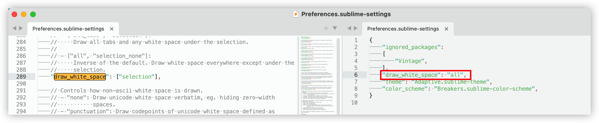
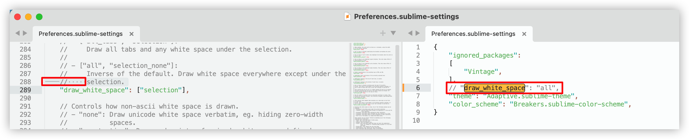

## Introduction

>  Sublime Text is a sophisticated text editor for code, markup and prose. You'll love the slick user interface, extraordinary features and amazing performance.

## Official website

Website: https://www.sublimetext.com/ - *Sublime Text - Text Editing, Done Right*

Docs: https://www.sublimetext.com/support - *Support - Sublime Text*

## Installation

https://www.sublimetext.com/download - *Download - Sublime Text*

### macOS

使用在线包管理器 - [Homebrew](os/mac/homebrew.md#安装软件) 安装：

https://formulae.brew.sh/cask/sublime-text - *sublime-text — Homebrew Formulae*

```sh
brew install --cask sublime-text
```

## Configuration

### 自动换行

中文：*菜单栏 > 视图 > 选择 - 自动换行*

英文：*Menu > View > Select - Word Wrap*


### 显示空格与Tab

1. 打开 *菜单栏 > 设置*；
2. 选中编辑器左侧文件，打开 *菜单栏 > 查找...* ，查找 “draw_white_space”；
3. 将查找到的整行文字内容 `"draw_white_space": ["selection"],` 修改成 `"draw_white_space": "all",`，复制到右侧的文件中（下图是设置成`"draw_white_space": "all",`的效果）；

   

4. 修改后，保存右侧文件；此时发现每一行文字前的空格（符号 · 显示）和缩进（符号 — 显示）会通过标识符填充（下图是没有设置 `"draw_white_space": "all",` 的效果，即编辑器默认效果）。

   

参考：
1. https://www.zhihu.com/question/37372260 - *sublime Text 选中一段文字之后空格符显示点是什么情况? - 知乎*
2. https://www.cnblogs.com/sea-stream/p/10732909.html - *sublime text 3 显示空格和Tab - anobscureretreat - 博客园*
3. https://blog.csdn.net/sinat_34719507/article/details/53585594 - *Sublime Text 3打开界面如何设置缩进形式？设置缩进为直线而非小圆点！空格space改为标签Tab缩进?_sublime缩进线_唐娜玛丽的博客-CSDN博客*
4. https://www.jianshu.com/p/a1f7e14905d7 - *2019-09-02 Sublime Text永久设置使用4个空格缩进和显示换行符等 - 简书*
5. https://blog.csdn.net/Calvin790704/article/details/127652377 - *sublime text 显示空格_sublime 显示空格_江鸟的坚持的博客-CSDN博客*


### 搜索插件

1. *菜单栏 > 首选项 > Package Control*；
2. 选择 **Package Control:** Discover Packages；
3. 跳转至网页浏览器，同时在网页浏览器上打开网址：https://packagecontrol.io/ - *Package Control - the Sublime Text package manager*。


### 安装插件

1. *菜单栏 > 首选项 > Package Control*；
2. 选择 **Package Control:** Install Package；
3. 等待当前窗口左下角“Loading repositories”进程加载完毕后，会在当前窗口的中上方弹出输入框；
4. 在输入框中输入：`JSON Reindent`（这里以 [JSON Reindent](#Json-Reindent（JSON-格式化）) 实例操作，注意：当已安装列表中存在此插件时，输入框是搜索不到当前插件的）；
5. 上下方向键选择搜索到的 `JSON Reindent` 插件，并按回车键安装；
6. 等待当前窗口左下角“Installing package JSON Reindent”进程加载完毕；
7. 安装成功。


### 卸载插件

1. *菜单栏 > 首选项 > Package Control*；
2. 选择 **Package Control:** Remove Package；
3. 在当前窗口中上方会弹出的已安装插件列表，选择需卸载的插件（这里以 [JSON Reindent](#Json-Reindent（JSON-格式化）) 实例操作）；
4. 等待当前窗口左下角“Removing package JSON Reindent”进程加载完毕；
5. 卸载成功。


### 升级指定插件

1. *菜单栏 > 首选项 > Package Control*；
2. 选择 **Package Control:** Upgrade Package；
3. 升级成功。

### 升级全部插件

1. *菜单栏 > 首选项 > Package Control*；
2. 选择 **Package Control:** Upgrade/Overview All Packages；
3. 等待当前窗口左下角提示进程加载完毕；
4. 升级成功。


### 查看已安装插件

1. *菜单栏 > 首选项 > Package Control*；
2. 选择 **Package Control:** List Packages；
3. 当前窗口中上方会弹出已安装插件列表。


## Package

### 常用插件列表

https://github.com/jaywcjlove/awesome-mac/blob/master/editor-plugin-zh.md#sublime-text-plugin - *awesome-mac/editor-plugin-zh.md at master · jaywcjlove/awesome-mac · GitHub*


### ChineseLocalizations（汉化）

https://github.com/rexdf/ChineseLocalization - *Localization for Sublime Text, support 简体中文 繁体中文 日本語 Chinese Japanese German Russian Spanish Armenian Swedish and French*

https://jingyan.baidu.com/article/647f0115dacea63e2148a8ea.html - *【Sublime Text】怎样进行汉化-百度经验*


### Sublime-HTMLPrettify（代码格式化）

https://github.com/victorporof/Sublime-HTMLPrettify - *HTML, CSS, JavaScript, JSON, React/JSX and Vue code formatter for Sublime Text 2 and 3 via node.js*

https://jingyan.baidu.com/article/154b46312e3d3f28ca8f41e0.html - *sublime中如何格式化代码-百度经验*

### Json Reindent（JSON 格式化）

https://packagecontrol.io/packages/JSON%20Reindent - *JSON Reindent - Packages - Package Control*

### CSS

#### Autoprefixer（CSS自动完成前缀）

https://github.com/sindresorhus/sublime-autoprefixer - *GitHub - sindresorhus/sublime-autoprefixer: Sublime plugin to prefix your CSS*

https://blog.csdn.net/weixin_30832351/article/details/98560819 - *Sublime Text 插件 autoprefixer_weixin_30832351的博客-CSDN博客*

有关详细信息，请参阅“[Node.js > Autoprefixer](front-end/node.js/README.md#autoprefixer)”。

----

安装和使用步骤：

1. 下载 Node.js 版本：15.14.0（最新版无法在 Autoprefixer v1.1.0 中使用，[参考自](https://github.com/sindresorhus/sublime-autoprefixer/issues/88)）；

2. 下载 Autoprefixer 版本：v1.1.0（最新版）；

3. On macOS you need to make sure it's in `/usr/local/bin` or symlink it there.

   1. 打开「访达」目录 */Users/caiyongwen/Library/Application Support/Sublime Text/Packages/Autoprefixer* ，打开「终端」查找 node 二进制文件的安装位置

       ```sh
       whereis node
       ```

       安装位置：`/Users/caiyongwen/.nvm/versions/node/v15.14.0/bin/node`

   2. 创建软链接

       ```sh
       ln -s /Users/caiyongwen/.nvm/versions/node/v15.14.0/bin/node /usr/local/bin
       ```

       \* 参考：https://www.php.cn/faq/463244.html - *介绍sublime autoprefix css mac配置方法-sublime-PHP中文网*

       - 如果文件路径包含空格或者其他特殊字符，就需要用双引号括起来

         ```sh
         ln -s "/Users/caiyongwen/.nvm/versions/node/v15.14.0/bin/node" "/usr/local/bin"
         ```

         \* 参考：https://blog.csdn.net/qq_34037455/article/details/120249841 - *macOS上的符号链接Symlink是什么，以及该怎么使用_symlink是什么文件_qq_34037455的博客-CSDN博客*

4. 安装完成发现 Autoprefixer 无法使用？

   1. 配置 Autoprefixer ；前往 *Preferences > package setting > AutoPrefixer > Setting-User*

   2. 输入配置项

      ```json
      {
          "browsers": ["last 7 versions"],
          "cascade": true,
          "remove": true
      }
      ```

   3. 参考：
      - https://www.cnblogs.com/weizaiyes/p/6064569.html - *Sublime Text3中Autoprefixer失效解决方法 - WWSASUKE - 博客园*
      - http://www.zlprogram.com/Show/14/14203.shtml - *sublime安装插件autoprefixer--Java,.Net,Python,Javascript,Vue,数据库程序教程*

#### CSScomb（CSS样式格式化）

https://packagecontrol.io/packages/CSScomb - *CSScomb - Packages - Package Control*

https://github.com/csscomb/csscomb.js/ - *GitHub - csscomb/csscomb.js: CSS coding style formatter*

### Terminal（终端）

#### Terminus

Homepage: https://packagecontrol.io/packages/Terminus - *Terminus - Packages - Package Control*

GitHub: https://github.com/randy3k/Terminus - *randy3k/Terminus: Bring a real terminal to Sublime Text*

#### Terminal

Homepage: https://packagecontrol.io/packages/Terminal - *Terminal - Packages - Package Control*

GitHub: https://github.com/SublimeText/Terminal - *SublimeText/Terminal: Launch terminals from the current file or the root project folder*

### Git

#### GitGutter

Homepage: https://packagecontrol.io/packages/GitGutter - *GitGutter - Packages - Package Control*

GitHub: https://github.com/jisaacks/GitGutter - *jisaacks/GitGutter: A Sublime Text 2/3 plugin to see git diff in gutter*
