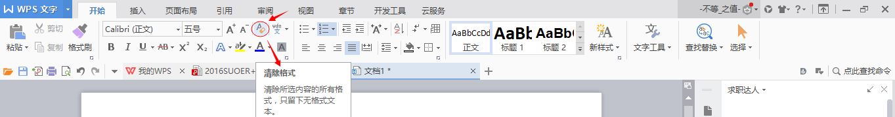

# WPS

## 简介

> 金山文档,全新一代云Office办公软件,支持多人在线协同办公,实时协作，并设置文档访问、编辑权限。独有内容级安全，全程留痕可追溯.PC/移动双端覆盖,随时随地在线协同办公,在线文档即写即存统一管理,高效共享文档、表格。
>
> <cite>—— [WPS - 支持多人在线协作编辑 Word、Excel 和 PPT 文档_WPS 官方网站](https://www.wps.cn/)</cite>

## 官方

https://www.wps.cn/ - *WPS - 支持多人在线协作编辑 Word、Excel 和 PPT 文档_WPS 官方网站*

https://www.wps.cn/learning - *WPS 学堂*

https://www.kdocs.cn/tips.html - *使用技巧 - 金山文档*

https://www.kdocs.cn/help - *金山文档・一起办公才高效*

https://plus.wps.cn/blog/digitalworkskill - *金山数字办公技巧 – WPS + 博客*

## 安装

https://platform.wps.cn/ - *WPS Office - 支持多人在线编辑多种文档格式_WPS 官方网站*

## 用法

### Word 文字

格式：`<序号>. <[项目](网址)> - [核心]`

1. [WPS/Word自动生成目录列表的操作方法](https://jingyan.baidu.com/album/925f8cb817a249c0dde0568e.html) - 目录级别对应的标题字体格式，统一各级目录的字体和大小

2. [WPS自动生成目录](http://jingyan.baidu.com/article/ff42efa960a9b3c19e22029d.html)

3. [WPS中前五页是封面和目录,怎么去掉前5页的页码](https://zhidao.baidu.com/question/267356360.html) - 插入 > 分隔符 > 下一页分节符，点击“同前节”按钮

4. [WPS怎么自动生成页码以及设置页码从第几页开始](http://jingyan.baidu.com/article/5553fa82eee2c265a2393408.html)

5. [WPS如何在不是第一页的某一页插入或去掉页眉](https://jingyan.baidu.com/album/a3f121e4f9383cfc9052bba3.html) - 插入 > 分隔符 > 下一页分节符，把[页眉同前节]前面的勾去掉

6. [Word中如何设置前几页不要页眉？](http://jingyan.baidu.com/article/47a29f2432d813c0142399b9.html) - 插入 > 分隔符 > 下一页分节符，把[页眉同前节]前面的勾去掉

7. [Word如何删除首页页码且正文页码从1开始](https://jingyan.baidu.com/album/d169e186493849436711d84f.html)

8. [怎样将网页上复制的文字去掉格式变成纯文字](https://jingyan.baidu.com/album/219f4bf7d7b79ede442d38e8.html) - 在粘贴复制好的文字时，不要直接 Ctrl + V 这样粘贴。Word 的左上角有一个“贴上”选项。点击“贴上”选项下拉选项，有一项是“选择性贴上”,在“选择性贴上”选项中选择贴上“未格式化文字”。

    

9. [Word2010中插入多级列表编号的三种方法](https://jingyan.baidu.com/album/3ea5148901919752e61bbafe.html) - 在菜单中选择“更改列表级别”选项，并在下一级菜单中选择需要设置的列表级别。

### Excel 表格

1. [Excel 表设置的文本格式如何取消](https://zhidao.baidu.com/question/262932969.html) - 把文本格式改为数字格式

### PPT 演示

1. [WPS文档在保存时不小心点了否能不能恢复](https://zhidao.baidu.com/question/1576302337980958420.html) - 通过“主菜单” > “备份管理”来找到

2. [wps ppt每张都显示页码和总页数](https://www.kafan.cn/edu/2541084.html) - 在幻灯片母版上动动手脚就可以实现这一功能
