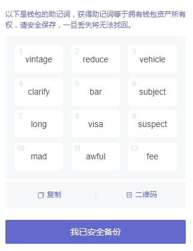
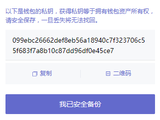
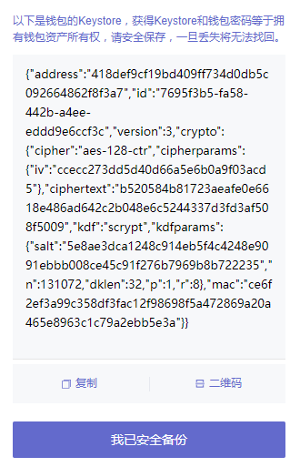

# Wallet

## Overview

账户类型

> 以下三种账户类型作为账号密码均可登录

- 助记词

  

- 私钥

  

- Keystore

  

## imToken 🇨🇳

 

主页：https://www.token.im/

帮助中心：https://support.token.im/hc/zh-cn

## MetaMask

主页：https://metamask.io/

GitHub：https://github.com/MetaMask

文档：https://docs.metamask.io/

## TokenPocket 🇨🇳

 

主页：https://www.tokenpocket.pro/

## TronLink

主页：https://www.tronlink.org/

## TrustWallet

 

主页：https://trustwallet.com/

