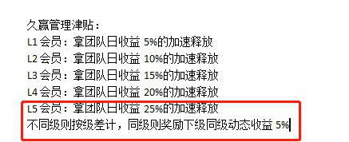

# 奖励制度

## 级差奖励

### 逻辑条件

| 初级代理商  | 高级代理商  | 尊享代理商  |
| ----------- | ----------- | ----------- |
| 团队返佣 30% | 团队返佣 50% | 团队返佣 80% |

*返佣 100% 意思为返佣金的 100%

*级差计算，同级奖返佣 10%

例：

上面的初级代理商获得 3 元，高级代理商获得 2 元，尊享代理商获得 3 元，再上面的尊享代理商获得同级奖 1 元

级差：

上级是初级获得 `10*30%=3元`

再上级是初级获得同级奖 `10*10%=1元`

再上级是初级不获得奖励

再上级是高级获得 `10*(50%-30%)=2元`

再上级是高级获得同级奖 `10*10%=1元`

再上级是初级或高级不获得奖励

再上级是尊享获得 `10*(80%-50%)=3元`

再上级是尊享获得同级奖 `10*10%=1元`

再上级是初级、高级、尊享不获得奖励

最多拨出为：`3+1+2+1+3+1=11元`

------

级差的理解（LGC）



如果我是 L5，我拿 25%，我推荐你，你是 L4，你拿 20%，实际我只拿你的体系的（25%-20%=5%）

你是 L1，你下级有 L2，则你不享受该体系的管理津贴了

你是 L3，你拿你 L1 下级的（15%-5%=10%）

你是 L3，你拿你 L2 下级的（15%-10%=5%）

你是 L3，你拿你 L3 下级的（15%-15%=0 + 同级5%=5%）

### 代码实现

> 级差理解参考开发文档：云商联盟
>
> 代码参考艾泰盟：文件目录：`application/common/controller/Reward.php` 方法：`investTeamReward`

```php
// 是否同级标识
$count = 1;
// 需新建数组，否则 `$prev_agency_level = $parents_list[$key-1]['member_team_grade'];` 会出现异常
$parents_list_new = [];
foreach ($parents_list as $key => $val) {
    $parents_list_new[$key] = [
        'member_id' => $val['member_id'],
        'member_team_grade' => $val['member_team_grade']
    ];
    if ($key == 0) {
        // 第1个会员的奖励
        $award_amount = $amount * $reward_ratio[$val['member_team_grade']]['diff'];
        $parents_list_new[$key]['award_amount'] = $award_amount;
    } else {
        $parents_list_new[$key] = [];
        $prev_agency_level = $parents_list[$key-1]['member_team_grade'];
        if ($val['member_team_grade'] == $prev_agency_level && $count < 2) {
            // 同级奖
            $award_amount = $amount * $reward_ratio[$val['member_team_grade']]['peer'];
            $parents_list_new[$key]['award_amount'] = $award_amount;
            $count++;
        }
        if ($val['member_team_grade'] > $prev_agency_level) {
            // 级差奖
            $award_amount = $amount * ($reward_ratio[$val['member_team_grade']]['diff'] - $reward_ratio[$prev_agency_level]['diff']);
            $parents_list_new[$key]['award_amount'] = $award_amount;
            $count = 1;
        }
    }

    if (!isset($parents_list_new[$key]['award_amount'])) {
        unset($parents_list_new[$key]);
    }
}
```

### 测试

!> 下例为测试用例，优先使用下例方式

```php
/*
 * 级差
 */
public function gradeDiff()
{
    // 等级团队奖(级差)
    $fee = [
        1 => 5, // 5%
        2 => 10, // 10%
    ];
    // 平级奖
    $peer_ratio = 1; // 1%

    // 查找有VIP等级的
    $puser_lists = [
        1 => ['vip'=>1], // id=1的vip等级
        2 => ['vip'=>1], // id=2的vip等级
        3 => ['vip'=>2],
        4 => ['vip'=>2],
        5 => ['vip'=>1],
    ];

    // 判断是否拿过平级
    $peer = [
        1 => 0,
        2 => 0,
    ];

    foreach ($puser_lists as $id=>$u) {
        // 如果拿过这个等级的平级奖那就跳过
        if ($peer[$puser_lists[$id]['vip']] == 1) {
            continue;
        }
        //  设置领取的比例
        if (isset($oldratio)) {
            // 获取极差
            $ratio = $fee[$puser_lists[$id]['vip']] - $oldratio;
            // 如果是负数跳过，在固定等级   1 3 1 情况下固定等级为负跳过
            if ($ratio < 0) {
                continue;
            }
        } else {
            $ratio = $fee[$puser_lists[$id]['vip']];
        }
        $oldratio = $fee[$puser_lists[$id]['vip']];
        if ($ratio > 0) {

            // 团队奖励  极差
//                $teamAward = bcdiv($ratio * $ge_money, 100, 6);
            $in_data = [
                'userid' => $id,
//                    'send_userid' => $vo['userid'],
//                    'money' => $teamAward,
//                    'old_money' => $vo['num'],
                'vip' => $puser_lists[$id]['vip'],
                'create_time' => time(),
                'type' => 1,
                'ratio' => $ratio,
//                    'ge_price' => $system_config['neb_price'],
            ];
            dump('--级差--');
            dump($in_data);
        } else if ($ratio == 0) {
            dump($puser_lists[$id]['vip']);
            if ($puser_lists[$id]['vip'] == 1) {
                $peer[$puser_lists[$id]['vip']] = 1;
//                    continue;
            }
            // 平级奖
//                $peerAward = bcdiv($peer_ratio * $ge_money, 100, 6);
            $in_data = [
                'userid' => $id,
//                    'send_userid' => $vo['userid'],
//                    'money' => $peerAward,
//                    'old_money' => $vo['money'],
                'vip' => $puser_lists[$id]['vip'],
                'create_time' => time(),
                'type' => 2,
                'ratio' => $peer_ratio,
//                    'ge_price' => $system_config['neb_price'],
            ];
            dump('--平级--');
            dump($in_data);
            $peer[$puser_lists[$id]['vip']] = 1;
        }
//            Db::name('stats_team_log')->insert($in_data);
    }
}
```

## 代数奖励

### 代码实现

> 级差理解参考开发文档：云商联盟
>
> 代码参考艾泰盟：文件目录：`application/common/controller/Reward.php` 方法：`investTeamReward`

```php
/**
 * 给上三级发放奖励
 */
private static function reward($data = [])
{
    try {
        $diff = [
            'userid',
            'money',
            'currency_id',
            'wallet_type',
            'log_id',
        ];
        if (array_diff($diff, array_keys($data)) ||
            array_diff(array_keys($data), $diff)) {
            exception('缺少必要参数');
        }

        $rates = [
            0.3,
            0.1,
            0.1,
        ];
        $pid = \think\facade\Db::name('user')
            ->where('id', $data['userid'])
            ->where('status', 1)
            ->value('pid');
        $i = 0;
        while ($i < count($rates)) {
            if ($pid > 0) {
                $count = \think\facade\Db::name('user_invest')
                    ->where('userid', $pid)
                    ->where('status', 1)
                    ->count();
                // 正在参与才有奖励
                if ($count > 0) {
                    // SKY收益钱包加
                    $money = bcmul($data['money'], $rates[$i], 8);
                    $money_change = WalletModel::moneyChange($pid, $money, $data['currency_id'], $data['wallet_type']);
                    setUserWalletLog(
                        $pid,
                        $data['userid'],
                        $money,
                        $data['currency_id'],
                        0,
                        60,
                        '代数奖励',
                        $data['log_id'],
                        $money_change['money'],
                        bcadd($money_change['money'], $money, 8),
                        $data['wallet_type']
                    );
                }

                $pid = \think\facade\Db::name('user')
                    ->where('id', $pid)
                    ->where('status', 1)
                    ->value('pid');
            }
            $i++;
        }

    } catch (\Exception $e) {
        throw $e;
    }
}
```
