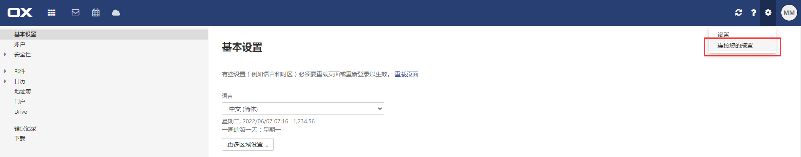
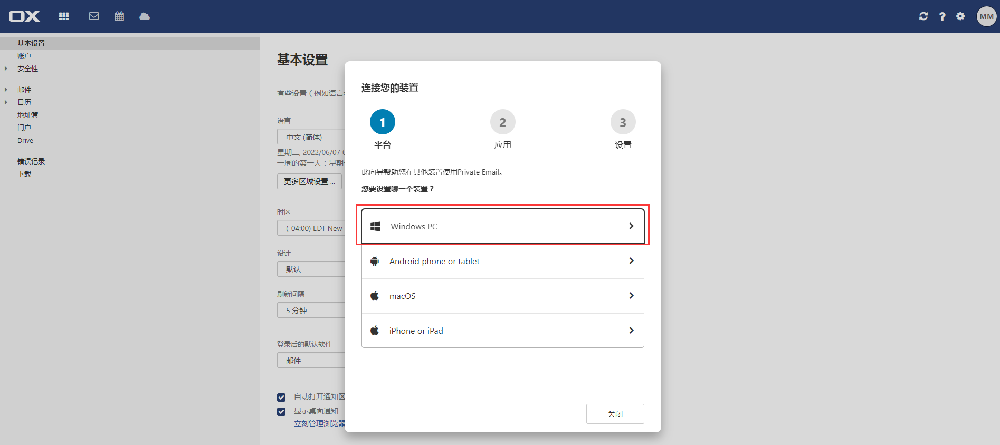
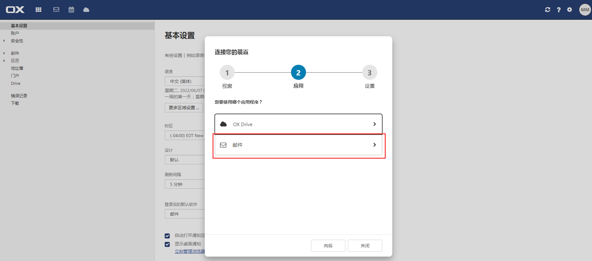
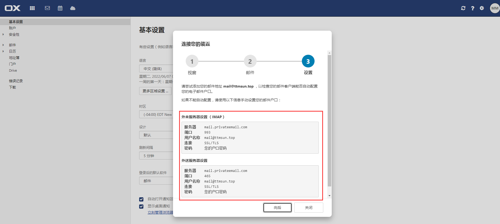

# 电子邮件

## 简介

> 电子邮件是一种用电子手段提供信息交换的通信方式，是互联网应用最广的服务。通过网络的电子邮件系统，用户可以以非常低廉的价格（不管发送到哪里，都只需负担网费）、非常快速的方式（几秒钟之内可以发送到世界上任何指定的目的地），与世界上任何一个角落的网络用户联系。电子邮件可以是文字、图像、声音等多种形式。同时，用户可以得到大量免费的新闻、专题邮件，并轻松实现轻松的信息搜索。电子邮件的存在极大地方便了人与人之间的沟通与交流，促进了社会的发展。
>
> <cite>—— [电子邮件_百度百科](https://baike.baidu.com/item/%E7%94%B5%E5%AD%90%E9%82%AE%E4%BB%B6/111106)</cite>

## 配置

### 获取授权码

👍 https://www.yuque.com/changyou/cysysm/lylh0p - *邮箱添加 · 语雀*

- 包含教程：腾讯邮箱（QQ）、网易邮箱（126/163）、谷歌邮箱（Gmail）、雅虎邮箱（yahoo）、微软邮箱（hotmail/outlook）、移动邮箱（139）

#### Gmail
  
1. 👍 https://zhuanlan.zhihu.com/p/339174361 - *Gmail邮箱如何授权码和添加到第三方客户端？*

2. <https://www.yuque.com/changyou/cysysm#一、基础设置> - *谷歌邮箱（Gmail）：代理设置+两部验证+访问权限*

    - http://www.360doc.com/content/20/0513/08/3046928_912010153.shtml - *如何设置收件邮箱和授权码*
      - 包含教程：QQ邮箱、网易邮箱、新浪邮箱、Gmail邮箱、hotmail/outlook邮箱、Yahoo邮箱

3. https://www.bt.cn/bbs/forum.php?mod=viewthread&tid=66183 - *面板设置消息通道配置之邮箱配置教程*（宝塔面板）

### 邮件服务器

网易邮箱配置如下图：

 

👍 http://help.163.com/09/1223/14/5R7P6CJ600753VB8.html - *什么是POP3、SMTP和IMAP?*

https://support.google.com/mail/answer/7126229 - *通过其他电子邮件平台查看 Gmail*

https://support.google.com/mail/answer/7104828  - *在使用 POP 的其他电子邮件客户端上查阅 Gmail 邮件*

#### Gmail

> 个人邮箱；有发送数量限制，一天内发送不能超过 500 封电子邮件 - https://support.google.com/mail/answer/22839
>
> 企业邮箱；标准版，可以最多创建100个账户，新申请的应该只能开50个账户，每个账户每天可以发500封邮件 - https://zhidao.baidu.com/question/159662849.html

如何使用 phpmailer 发送 Gmail 邮件?

- ~~方式一、使用邮箱密码授权~~

    1. ~~注册 Google 账号~~

    2. ~~登录 Gmail https://mail.google.com/~~

    3. ~~登录后进入设置页面~~

    4. ~~设置项 “ IMAP 访问 ”，启用 IMAP（**重要**）~~

    5. ~~谷歌账号要开启低安全性应用登陆认证（**重要**）~~

       ~~开启地址：https://myaccount.google.com/lesssecureapps *⚠️谷歌官方 2022-05-30 开始，此方式不可用，详见[官方发文](https://support.google.com/accounts/answer/6010255)*~~

    - ~~参考链接~~

      1. ~~👍 <https://www.cnblogs.com/zongsir/p/10063856.html> - *使用 php+gmail 发送邮件*（文末三行信息重要）~~
      2. ~~https://blog.csdn.net/zdgdq/article/details/78518508 - *怎样开通gmail邮箱smtp服务*~~

- 方式二、使用应用专用密码授权

    1. 注册 Google 账号

    2. 登录 Gmail ：https://mail.google.com/

    3. 登录后进入设置页面

    4. 设置项 “ IMAP 访问 ”，启用 IMAP（**重要**）

    5. 谷歌账号开启两步验证（**重要**）

       开启地址：https://myaccount.google.com/signinoptions/two-step-verification

       *⚠️开启两步验证需要收取三次短信进行验证*

    6. 谷歌账号设置 “ 应用专用密码 ”

       设置地址：https://myaccount.google.com/apppasswords

    - 参考链接
    
      1. 👍 https://www.cnblogs.com/niuben/p/13613635.html - *php 配置 Gmail 发送邮件 PHPMailer*
      2. https://sspai.com/post/28545 - *手把手教你设置 Google 两步验证*

- 在 `phpmailer/phpmailer` 中测试

    - Google Gmail 测试结果：✅通过

#### PrivateEmail

> 邮件服务提供商，企业邮箱、域名邮箱。

通过 https://privateemail.com/ 可以免费体验 60 天的 https://www.namecheap.com/hosting/email/ 企业邮箱。

- 注册账号 https://www.namecheap.com/myaccount/signup/

  - *需要 1 个已注册的邮箱账号，登录时通过这个邮箱收取验证码*

- 开始试用

  1. 绑定域名 - *直接到 namecheap 购买一个新域名或者使用已购买的域名*

  2. 填写地址信息，填写内容可以参照 https://www.zhihu.com/question/497506591

  3. 按照提示解析域名

  4. 创建邮箱账号，例如：`mail@域名`

  5. 登录已创建的邮箱账号 https://privateemail.com/

  6. 查看授权 “ IMAP " 访问信息

     

     

     

     

- 在 `phpmailer/phpmailer` 中测试

  ```markdown
  privateemail.com
   
  Incoming Server Settings (IMAP)
  
  Server：mail.privateemail.com
  
  Port：993
  
  Username：mail@88618.xyz
  
  Connection：SSL/TLS
  
  Password：S2asSQ21 (Your account password)
  
  Outgoing Server Settings
  
  Server：mail.privateemail.com
  
  Port：465
  
  Username：mail@88618.xyz
  
  Connection：SSL/TLS
  
  Password：S2asSQ21 (Your account password)
  ```
  
  - PrivateEmail 测试结果：✅通过

### 邮件模板

> 文案参考个人邮箱（`caiyongwen@yeah.net`）中的文件夹分类 > 邮箱验证

邮箱验证码文案：

- 邮件标题：`欢迎注册<项目名>`
- 邮件内容：`你本次注册的验证码为：194559，请在5分钟之内使用它！`

验证邮箱文案：

- 邮件标题：`<项目名>新用户激活`
- 邮件内容：`感谢您注册EasyWeb网站，请点击此激活链接激活您的账户：https://eleadmin.com/account/active/ea04fc42e4b843e899d3d242f0285fad，如果无法验证，请复制链接使用浏览器打开。`

验证邮箱网址：

- https://eleadmin.com/account/active/ea04fc42e4b843e899d3d242f0285fad - *账户激活成功 - EleAdmin*

#### 多语言

```php
'email_validation_subject' => 'DST新用户激活',

'email_validation_message' => '感谢您注册DST，请点击此激活链接激活您的账户：%s，如果无法验证，请复制链接使用浏览器打开。',

'email_validation_success_message' => '验证成功，返回APP或浏览器激活页面进行下一步操作!',

'email_validation_failure_message' => '邮箱账户已验证成功，返回APP或浏览器激活页面进行下一步操作!',

'邮件标题' => '欢迎注册%s',

'邮件内容' => '你本次注册的验证码为：%d，请在5分钟之内使用它！',
```

## 用法

### PHP 发送邮件

> 在网络上我们经常看到一些网站使用自己的域名邮箱，那么需要怎么做呢？

有两种方案：

- 方案一：使用企业邮箱可以实现（但企业邮箱有诸多限制，例如：磁盘大小限制，用户账号限制，发送内容限制，发送频率限制等等）。
- 因此我们推荐方案二：使用自己的域名搭建邮箱服务器。

Composer：

[phpmailer/phpmailer 6.5.1](back-end/composer/composer-pkgs.md#phpmailerphpmailer-651)

参考项目：

- 20211009_covid19
- 20211125_dsta
- 20220224_nimtech

参考：

1. 👍 https://blog.csdn.net/wx145/article/details/82686413 - *PHP使用PHPMailer发送邮件*（网易邮箱）
2. https://www.runoob.com/w3cnote/php-phpmailer.html - *PHP 使用 phpmailer 发送电子邮件*（网易邮箱）
3. https://www.cnblogs.com/ql-smile/p/10938680.html - *php使用邮箱发送验证码*（QQ企业邮箱）
4. https://www.jb51.net/article/198402.htm - *基于PHP实现邮箱验证激活过程详解*

### 宝塔邮局管理器

> 未尝试

参考：

1. https://www.bt.cn/bbs/thread-87496-1-1.html - *【宝塔邮局管理器】使用教程 - Linux面板 - 宝塔面板论坛*
2. https://www.daniao.org/9208.html - *宝塔邮局管理器安装与设置 – 多域/多用户/支持SMTP/IMAP/POP3/HTTP接口*
3. https://www.xujiahua.com/8844.html - *宝塔邮局，让你瞬间拥有无限个域名邮箱! vps上搭建你的私人邮件服务器*

Windows 系统

-  https://blog.csdn.net/weixin_45127815/article/details/123805307 - *怎么搭建自己邮箱服务器，详细教程*
    - https://www.hmailserver.com/download - *Download - hMailServer - Free open source email server for Microsoft Windows*

## 常见问题

### 发送数量限制

百度搜索：`google邮箱有发送限制吗`

1. https://blog.csdn.net/dengjia1139/article/details/102426785 - *全球各大邮件SMTP服务限制*
2. https://blog.csdn.net/gary8918/article/details/108002716 - *全球各大邮件提供商（Gmail, Office365等）的发送限制概况*
3. https://blog.csdn.net/dfyong/article/details/8047105 - *各大企业邮箱发件限制*
4. https://blog.csdn.net/lianchao668/article/details/8938531 - *各家大牛免费邮箱的每天发信数量限制*
5. https://blog.csdn.net/qq_35787254/article/details/119703953 - *免费临时邮箱大全，专注个人隐私保护*
6. https://blog.csdn.net/weixin_39707597/article/details/118205135 - *html 发送邮件人数限制,用个人邮箱群发大量邮件的限制*
7. https://blog.csdn.net/u011127019/article/details/117920577 - *各大邮箱发送数量限制整理*
8. https://www.likecs.com/show-160479.html - *各大免费邮箱邮件群发账户SMTP服务器配置及SMTP发送量限制情况*
