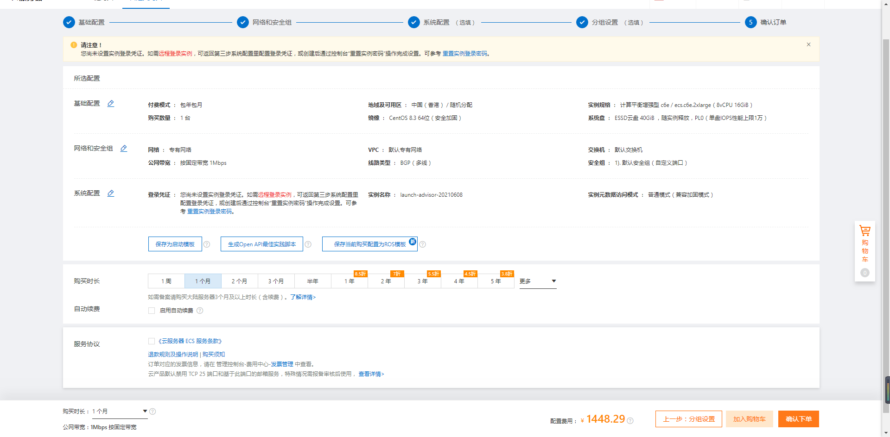

# 阿里云

## 简介

> 阿里云——阿里巴巴集团旗下公司，是全球领先的云计算及人工智能科技公司之一。提供免费试用、云服务器、云数据库、云安全、云企业应用等云计算服务，以及大数据、人工智能服务、精准定制基于场景的行业解决方案。免费备案，7x24小时售后支持，助企业无忧上云。

## 官方

https://www.aliyun.com/ - *阿里云-为了无法计算的价值* 🏷️ _国内版_

https://www.alibabacloud.com/ - *Alibaba Cloud: Cloud Computing Services*🏷️  _国际版_

https://codeup.aliyun.com/

https://code.aliyun.com/

## 云服务器ECS

> ECS（Elastic Compute Service，云服务器）

官方链接：https://www.aliyun.com/product/ecs

### 服务器选购



基础配置

- 地域及可用区：

  - 中国（香港）

- 实例规格：

  - 8vCPU

  - 16GiB 内存

  - 计算平衡增强型 c6e / ecs.c6e.2xlarge

- 镜像：

  - CentOS 8.3 64位

- 系统盘：

  - ESSD云盘 40GiB

网络和安全组

- ~~公网带宽：按固定带宽1Mbps~~

- 弹性带宽

- 弹性公网 IP

购买时长：

- 按月购买

密钥对名称：`d2PgdYk7e7SQdi`

密钥对文件：`d2PgdYk7e7SQdi.pem`

如何选购服务器？

- 选购阿里云服务器

  1. 弹性带宽
  2. 弹性公网 IP

#### 带宽

### 常见问题

https://developer.aliyun.com/article/708815 - *如何远程连接阿里云服务器Linux实例？*

## 对象存储OSS

> OSS（Object Storage Service，对象存储服务）

官方链接：

1. https://www.aliyun.com/product/oss

2. https://help.aliyun.com/product/31815.html - *对象存储 OSS*

参考：

1. https://blog.csdn.net/qq_41570658/article/details/106492447 - *阿里云OSS设置跨域访问*

2. https://blog.csdn.net/niaoer2010/article/details/89100017 - *阿里云OSS域名配置及简单上传*

3. https://help.aliyun.com/document_detail/31834.html - *OSS访问域名使用规则*

4. https://newsn.net/say/aliyun-oss-bucket-endpoint.html - *如何获取阿里云oss所需的bucket和endpoint?*

### 工具

#### 图形化管理工具ossbrowser

> OSS Browser 提供类似windows资源管理器功能。用户可以很方便的浏览文件，上传下载文件，支持断点续传等。


GitHub：https://github.com/aliyun/oss-browser - *GitHub - aliyun/oss-browser: OSS Browser 提供类似windows资源管理器功能。用户可以很方便的浏览文件，上传下载文件，支持断点续传等。*

使用手册：https://help.aliyun.com/document_detail/92268.html - *图形化管理工具ossbrowser*

### Endpoint 访问域名

使用手册：https://help.aliyun.com/document_detail/98985.html - *访问域名（Endpoint）*

外网 Endpoint：`oss-cn-shenzhen.aliyuncs.com`

内网 Endpoint：`oss-cn-shenzhen-internal.aliyuncs.com`

传输加速全球加速 Endpoint：`oss-accelerate.aliyuncs.com`

#### Bucket 存储空间

使用手册：https://help.aliyun.com/document_detail/31841.html - *存储空间（Bucket）* 

Bucket：`mackeaqxh4ytqk`（我的阿里云OSS Bucket）

##### 常见问题

问：在浏览器访问 Bucket 中的文件报错：`You have no right to access this object because of bucket acl.`

答1：将 Bucket 权限访问控制设置成公共读，私有写

https://help.aliyun.com/document_detail/31843.html - *Bucket ACL*

答2：

```js
// 上传时可以设置相关的 headers，例如设置访问权限为 private|public-read|public-read-write、自定义元信息等。
$options = array(
  OssClient::OSS_HEADERS => array(
    'x-oss-object-acl' => 'private',
    'x-oss-meta-info' => 'your info'
  ),
);
```

https://help.aliyun.com/document_detail/88473.html - *Bucket ACL*

---

问：阿里云 OSS 上传报错: `You have no right to access this object because of bucket acl`

答：

1. https://blog.csdn.net/weixin_38106322/article/details/106873104 - *You have no right to access this object because of bucket acl._anonymous user has no right to access this bucket_绅士jiejie的博客-CSDN博客*

OSS 跨域资源共享（CORS）出现报错的排查方法

https://help.aliyun.com/document_detail/44199.html - *OSS跨域资源共享（CORS）错误排除*

### SDK 软件开发工具

#### PHP

> 阿里云对象存储（Object Storage Service，简称 OSS），是阿里云对外提供的海量、安全、低成本、高可靠的云存储服务。用户可以通过调用 API，在任何应用、任何时间、任何地点上传和下载数据，也可以通过用户 Web 控制台对数据进行简单的管理。OSS 适合存放任意文件类型，适合各种网站、开发企业及开发者使用。


GitHub: https://github.com/aliyun/aliyun-oss-php-sdk - *Aliyun OSS SDK for PHP*

### 已用功能

1. 使用 STS 临时访问凭证访问 OSS

   1. https://help.aliyun.com/document_detail/100624.html - *使用STS临时访问凭证访问OSS*
   2. https://bex.meishakeji.com/2019/04/13/aliyun-sts/ - *使用阿里云sts鉴权模式实践（PHP）*
   3. 成功代码所在项目：西游记

2. 服务端签名直传并设置上传回调

   1. https://help.aliyun.com/document_detail/31927.html - *服务端签名直传并设置上传回调概述*
   2. 成功代码所在项目：西游记

### 参考项目

1. ~~Skybet~~
2. ~~机器人~~
3. ~~西游记~~

### FAQs

获取 AccessKey

1. https://help.aliyun.com/document_detail/53045.htm - *获取 AccessKey*
2. https://www.hws.com/help/hwsoss/1713.html - *如何获取阿里云OSS的AccessKeyId和AccessKeySecret？*

## 访问控制RAM

> RAM（Resource Access Management，资源访问控制）

官方链接：https://www.aliyun.com/product/ram
