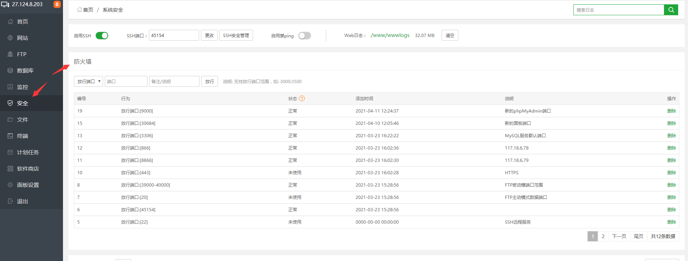
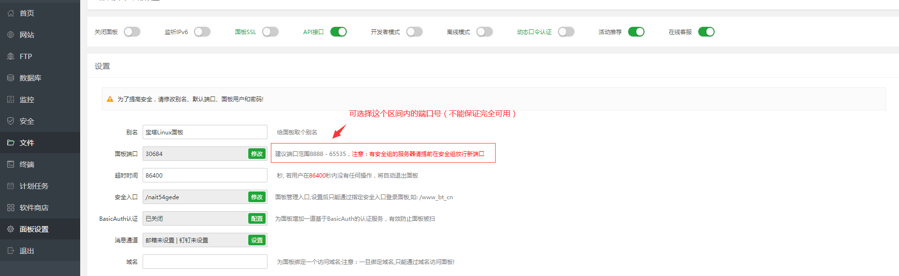

## 官方

GitHub：https://github.com/aaPanel

### 中文版

主页：https://www.bt.cn/

安装：
1. https://www.bt.cn/new/download.html - *宝塔面板下载，免费全能的服务器运维软件*
2. https://www.bt.cn/bbs/thread-19376-1-1.html - *宝塔Linux面板安装教程 - 2022年7月14日更新 - 7.9.3正式版 - Linux面板 - 宝塔面板论坛*

### 国际版

主页：  
<i class="bi bi-ladder"></i> https://www.aapanel.com/ *国内网络无法访问*  
https://www.aapanel.com/feature.html

文档：https://doc.aapanel.com/web/

论坛：https://forum.aapanel.com/

演示：http://demo.aapanel.com/fdgi87jbn/

安装：https://www.aapanel.com/new/download.html

## 终端命令

https://www.bt.cn/btcode.html - *宝塔linux面板命令大全 - 宝塔面板*

## 面板API

官方：https://www.bt.cn/bbs/thread-20376-1-1.html - *API接口使用教程 - 第三方应用 - 宝塔面板论坛*

https://www.daniao.org/4296.html - *宝塔面板API接口抓取教程-宝塔接口配置文件 - 大鸟博客*

https://blog.szhcloud.cn/blog/2020/10/23/%E5%AE%9D%E5%A1%94%E9%9D%A2%E6%9D%BFapi-%E4%BD%BF%E7%94%A8%E6%8C%87%E5%8D%97/ - *宝塔面板API 使用指南 - 寰智博客*

https://blog.alipay168.cn/index/detail/item/680.html - *宝塔定时任务批量导入新服务器的宝塔-杂草猿工记-个人博客-韦炳生博客-技术分享*

## ssl

> 免费

1. 宝塔官网注册账号
2. 指定域名申请 ssl
3. 部署
4. 开启强制 HTTPS
5. 防火墙或者安全组放行 443 端口

**参考链接**

<https://developer.aliyun.com/article/705391>

## ftp

> 宝塔 Linux，FTP 端口：21，主动模式可连接；修改 FTP 端口为非 21，主动模式无法连接，被动模式需放行 FTP 被动端口 39000-40000 才可连接。

1️⃣ 宝塔面板FTP端口设置教程 (图文) https://www.idcnote.com/bt/14.html

2️⃣ 宝塔 pure-ftpd 如何开启被动模式(PASV)连接 https://vpsvt.com/reed/443.html

五、宝塔面板 FTP 安装与使用教程（图文步骤） https://www.php.cn/topic/bt/482698.html

宝塔面板的ftp无法使用解决 https://www.cnblogs.com/pxjbk/articles/10046960.html

被动模式下ftp设置端口范围有哪些？花生壳搭建ftp的步骤有哪些？ https://hsk.oray.com/news/8547.html

VsFtpd指定被动端口范围教程 https://blog.csdn.net/qq_22656871/article/details/109356147

### 「tool」pure-ftpd

<i class="fa fa-github fa-lg"></i> https://github.com/jedisct1/pure-ftpd/

参考链接 👇

Linux安装配置FTP(pure-ftpd) https://blog.csdn.net/renfeigui0/article/details/100163336

## link

https://www.php.cn/blog/detail/23119.html - *宝塔面板 – 修改默认端口以及一些常用端口的安全设置*
 
https://yangmao.info/225285.html - *新版宝塔面板降级并解除强制绑定手机号码-羊毛之家*

### 站长教程

https://www.daniao.org/btpanel/ - *宝塔linux面板使用教程，以及一些宝塔技术分享！*

## faq

### Linux 宝塔面板无法连接phpmyadmin

推荐使用`phpmyadmin`4.4版本，4.4版本可直接访问（无需登录）

解决方式：

1. 检查防火墙（可在面板安全中查看）

    

2. 检查安全组（需在服务器供应商中查看，比如阿里云、腾讯云）

3. 如果使用的默认888端口在防火墙中已放行，仍无法连接到，可能是安全组中没有放行导致，在无法修改安全组的情况下，可通过修改`phpmyadmin`访问端口的方式放行

   1. 设置

      

   2. 访问的端口应该为安全组中已放行的端口范围

       

### composer update topthink/framework报错

项目：`swarm`

时间：`2021/06/10`

问题：（问题解决耗时1小时）

执行命令时出现`“Failed to extract topthink/framework: (9) unzip -qq  '/www/wwwroot/tron_service/vendor/composer/tmp-2fc59eeea62afa8f0bc5ab230da84e14' -d '/www/wwwroot/tron_service/vendor/composer/c156dae7'”`错误

 

原因：

/根目录的`composer.lock`版本有冲突

解决：

删除`composer.lock`文件，重新执行`composer update`和`composer update topthink/framework`命令即可成功

 

另一种网上解决方式：<https://ask.fastadmin.net/question/26538.html> *（未尝试）*

### 国内宝塔面板降级

> Q：为什么要降级
> 
> A：屏蔽宝塔强制绑定手机号

https://www.zouht.com/2906.html - *宝塔面板 7.9.2 降级 7.7.0 方法 – 颢天*（亲测有效）
https://www.bilibili.com/read/mobile?id=17006523

https://www.huhexian.com/47380.html - *宝塔面板降级7.7低版本关闭强制绑定手机账号 | 青山绿水*

1. 打开系统终端
2. `wget https://github.com/wei/baota/releases/download/7.7.0/LinuxPanel-7.7.0.zip` - *下载 7.7.0 版本*
3. `unzip LinuxPanel-7.7.0.zip`
4. `cd panel/`
5. `bash update.sh` - *运行更新脚本降级*
6. `sed -i "s|bind_user == 'True'|bind_user == 'XXXX'|" /www/server/panel/BTPanel/static/js/index.js` - *屏蔽强制绑定手机号*
7. `rm -f /www/server/panel/data/bind.pl` - *删除强制绑定手机 js 文件*