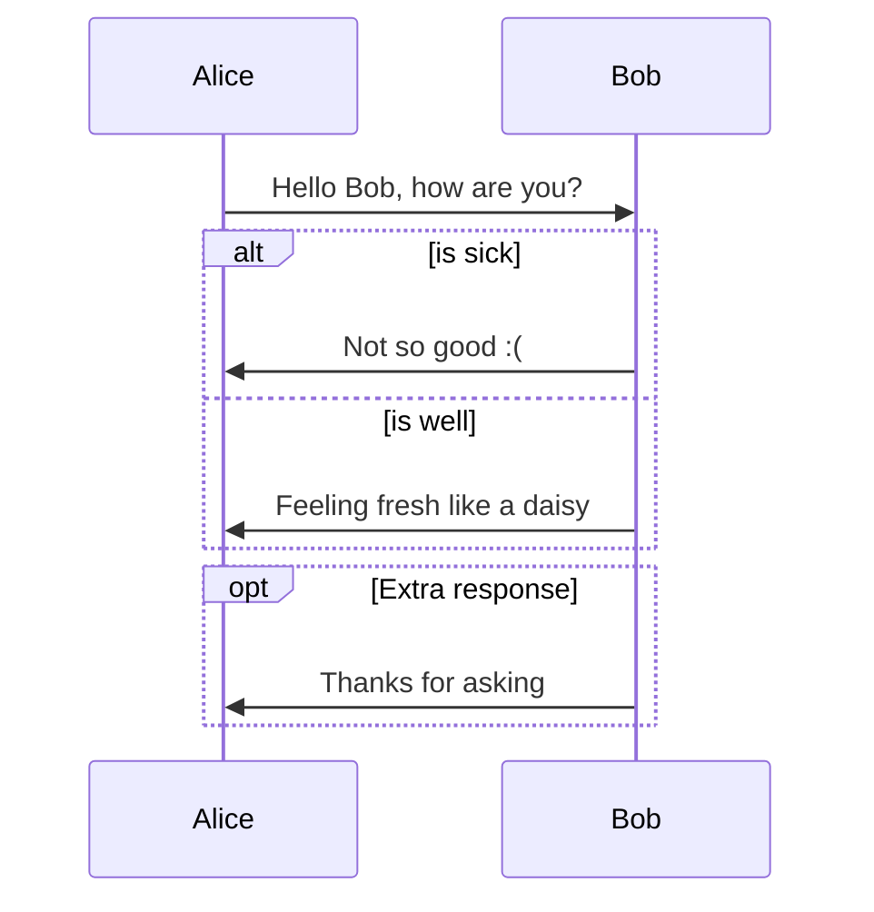
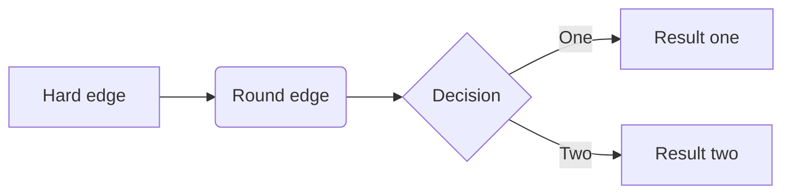
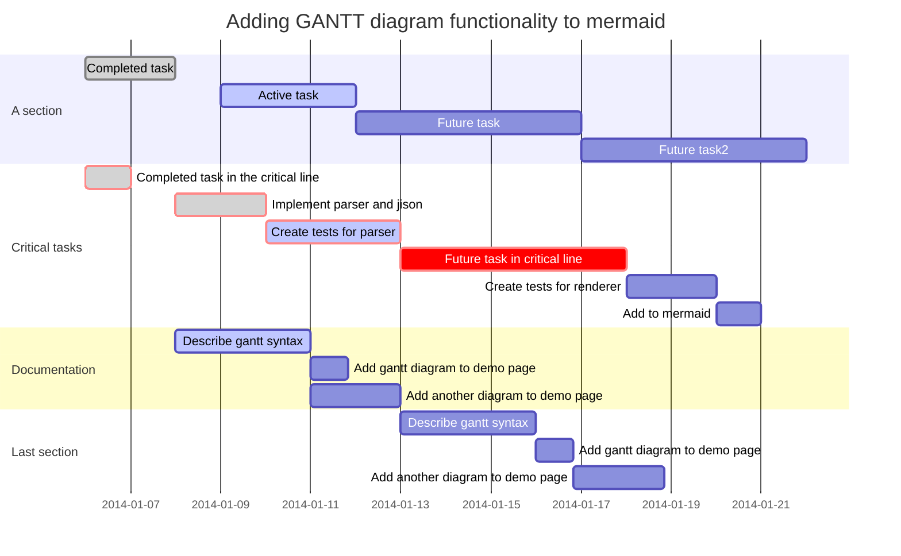
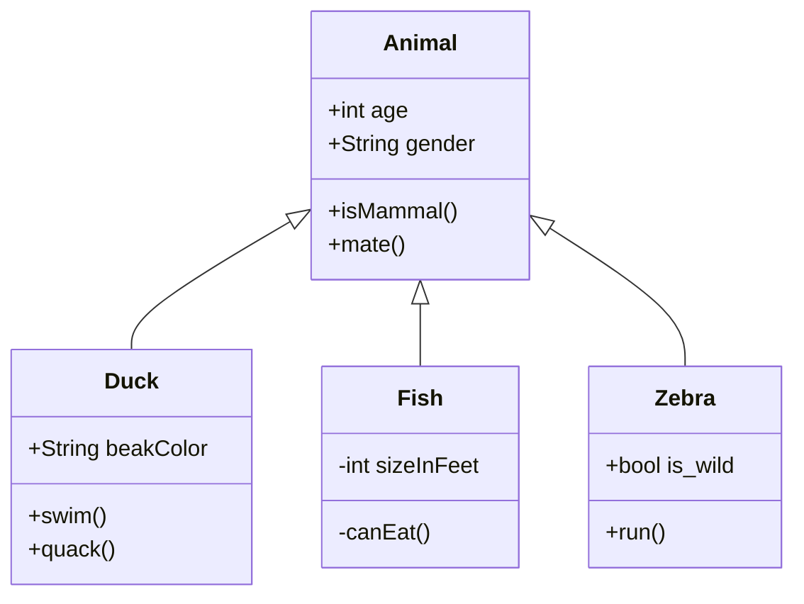
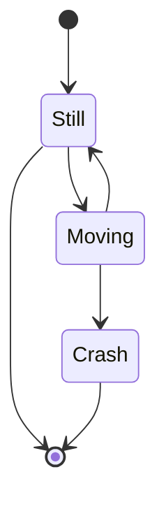

以上内容为：*YAML Front Matter*


!> 📢 软件功能优先查看官方文档

## 使用场景

*Markdown* 是做笔记、为网站创建内容以及生成可打印文档的快速、简便的方法。

- 静态网站
- 文件资料
- 笔记
- 书籍
- 演示文稿
- 邮件
- 协作
- 文档

## 书写工具

在线编辑器

1. [MdEditor](http://www.mdeditor.com/)

2. [Dillinger](https://dillinger.io/)


应用编辑器

1. [Typora](/tools/应用工具#markdown-Typora)

2. [Markor](os/mobile/README.md#markor)


## 布局样式

实例一：

 An awesome Libre and Open Source RSS feed reader

<br/>

_📋复制模板 - 方角图片_

``` markdown

```

实例二：

Text editor - Notes & ToDo (for Android) - Markdown, todo.txt, plaintext, math, ..

<br/>

_📋复制模板 - 圆角图片_

``` markdown

```

参考：
1. https://github.com/gsantner/markor/blob/master/README.md
2. https://github.com/p0deje/Maccy/blob/master/README.md


## 参考 🔥

1. https://www.markdownguide.org/ - *Markdown 指南*
2. https://www.markdown.xyz/ - *Markdown 指南中文版*
3. https://github.com/mundimark/awesome-markdown - *GitHub - mundimark/awesome-markdown: A collection of awesome markdown goodies (libraries, services, editors, tools, cheatsheets, etc.)*
4. https://www.runoob.com/markdown/md-tutorial.html - *Markdown 教程 | 菜鸟教程*

----

1. https://sspai.com/post/54912 - *Typora 完全使用详解*
2. https://www.jianshu.com/p/49dd84559d3b - *Markdown 语法 with Typora*
3. https://www.jianshu.com/p/b30955885e6d - *Typora Markdown 手册*
4. https://docs.github.com/zh/get-started/writing-on-github/getting-started-with-writing-and-formatting-on-github/basic-writing-and-formatting-syntax - *基本撰写和格式语法 - GitHub Docs*


## 语法


### 基本语法

#### 空格与换行

<!-- tabs:start -->

##### **空格**

在输入连续的空格后，Typora 会在编辑器视图里为你保留这些空格，但当你打印或导出时，这些空格会被省略成一个。 
你可以在源代码模式下，为每个空格前加一个 `\` 转义符，或者直接使用 HTML 风格的 `&nbsp;` 来保持连续的空格。


##### **软换行**

<kbd>Shift</kbd> + <kbd>Enter</kbd>

需要说明的是，在 Markdown 语法中，换行（line break）与换段是不同的。且换行分为软换行和硬换行。在 Typora 中，你可以通过 `Shift + Enter` 完成一次软换行。软换行只在编辑界面可见，当文档被导出时换行会被省略。


##### **硬换行**

<kbd>空格</kbd> + <kbd>空格</kbd> + <kbd>Shift</kbd> + <kbd>Enter</kbd>

你可以通过 `空格 + 空格 + Shift + Enter` 完成一次硬换行，而这也是许多 Markdown 编辑器所原生支持的。硬换行在文档被导出时将被保留，且没有换段的段后距。


##### **换段**

- <kbd>Enter</kbd>

  你可以通过 `Enter` 完成一次换段。Typora 会自动帮你完成两次 `Shift + Enter` 的软换行，从而完成一次换段。这也意味着在 Markdown 语法下，换段是通过在段与段之间加入空行来实现的。

- 换段 连续两次 <kbd>Shift</kbd> + <kbd>Enter</kbd> 

<!-- tabs:end -->

**Windows 风格（CR+LF）与 Unix 风格（CR）的换行符：**CR 表示回车 `\r` ，即回到一行的开头，而 LF 表示换行 `\n` ，即另起一行。 
所以 Windows 风格的换行符本质是「回车 + 换行」，而 Unix 风格的换行符是「换行」。这也是为什么 Unix / Mac 系统下的文件，如果在 Windows 系统直接打开会全部在同一行内。 你可以在 `文件 - 偏好设置 - 编辑器 - 默认换行符` 中对此进行切换。


#### 链接

<!-- tabs:start -->

##### **Rendered**

My favorite search engine is *[Duck Duck Go](https://duckduckgo.com)*.


##### 添加标题

[Duck Duck Go](https://duckduckgo.com  "The best search engine for privacy")


##### 网址和电子邮件地址

<https://www.markdownguide.org>

<fake@example.com>


##### 引用式链接

[John Gruber][df1]

[JavaScript Location 对象][JavaScript Location 对象]

[JavaScript Location 对象]: https://www.runoob.com/jsref/met-loc-reload.html	"Location reload()方法"
[df1]: http://daringfireball.net/projects/markdown	"Hobbit lifestyles"


##### **Markdown**

```markdown
My favorite search engine is *[Duck Duck Go](https://duckduckgo.com)*.

##### 添加标题
[Duck Duck Go](https://duckduckgo.com "The best search engine for privacy")

##### 网址和电子邮件地址
<https://www.markdownguide.org>
<fake@example.com>

##### 引用式链接
[John Gruber][df1]
[JavaScript Location 对象][JavaScript Location 对象]

[JavaScript Location 对象]: https://www.runoob.com/jsref/met-loc-reload.html "Location reload()方法"
[df1]: http://daringfireball.net/projects/markdown "Hobbit lifestyles"
```

<!-- tabs:end -->


#### 图片

<!-- tabs:start -->

##### **Rendered**


> `Typora` 编辑器中图片默认居中对齐，如需左对齐，在图片后加一个空格


##### 带链接的图片

[](http://liqucn.com/bz/1154169.wml)


##### **Markdown**

```markdown


> `Typora` 编辑器中图片默认居中对齐，如需左对齐，在图片后加一个空格

##### 带链接的图片

[](http://liqucn.com/bz/1154169.wml)
```

<!-- tabs:end -->


#### 段落元素

<!-- tabs:start -->

##### **Rendered**

**加粗**

<strong>标签</strong>


*斜体*

_this text is surrounded by literal asterisks_


~~删除线~~


<u>下划线</u>


##### **Markdown**

```markdown
**加粗**

<strong>标签</strong>

*斜体*

_this text is surrounded by literal asterisks_

~~删除线~~

<u>下划线</u>
```

<!-- tabs:end -->


##### 代码 / 代码块

<!-- tabs:start -->

###### **Rendered**

*代码*

Use the `printf()` function.

*代码块*

```
{
"firstName": "John",
"lastName": "Smith",
"age": 25
}
```


*语法高亮*

```json
{
"firstName": "John",
"lastName": "Smith",
"age": 25
}
```

```javascript
function test() {
 console.log("notice the blank line before this function?");
}
```

```php
Indent paragraphs to include them in the footnote.

`{ my code }`

Add as many paragraphs as you like.

```


###### **Markdown**

*代码*

```markdown
Use the `printf()` function.
```

*代码块*

````markdown
```
{
"firstName": "John",
"lastName": "Smith",
"age": 25
}
```
````


*语法高亮*

> - 语法语言  
>   命令行语言：`sh`、`shell`、`bash`、`powershell`

~~~markdown
```json
{
"firstName": "John",
"lastName": "Smith",
"age": 25
}
```
~~~


<!-- tabs:end -->


##### HTML 标签

<!-- tabs:start -->

###### **Rendered**

<code style="color: #c7254e;">`underline`</code>


<span style="color:red">This text is red.</span>


<ruby> 漢 <rt> ㄏㄢˋ </rt> </ruby>


*键盘*

<kbd>Ctrl</kbd> + <kbd>F9</kbd>


HTML entities like &reg; &#182;


<details>
 <summary>I have keys but no locks. I have space but no room. You can enter but can't leave. What am I?</summary>
 A keyboard.
</details>


*iframe*

<iframe height='265' scrolling='no' title='Fancy Animated SVG Menu' src='http://codepen.io/jeangontijo/embed/OxVywj/?height=265&theme-id=0&default-tab=css,result&embed-version=2' frameborder='no' allowtransparency='true' allowfullscreen='true' style='width: 100%;'></iframe>


<blockquote class="twitter-tweet"><p lang="en" dir="ltr">Sunsets don&#39;t get much better than this one over <a href="https://twitter.com/GrandTetonNPS?ref_src=twsrc%5Etfw">@GrandTetonNPS</a>. <a href="https://twitter.com/hashtag/nature?src=hash&amp;ref_src=twsrc%5Etfw">#nature</a> <a href="https://twitter.com/hashtag/sunset?src=hash&amp;ref_src=twsrc%5Etfw">#sunset</a> <a href="http://t.co/YuKy2rcjyU">pic.twitter.com/YuKy2rcjyU</a></p>&mdash; US Department of the Interior (@Interior) <a href="https://twitter.com/Interior/status/463440424141459456?ref_src=twsrc%5Etfw">May 5, 2014</a></blockquote>
<script async src="https://platform.twitter.com/widgets.js" charset="utf-8"></script>


###### **Markdown**

```markdown
<code style="color: #c7254e;">`underline`</code>
```


```markdown
<span style="color:red">This text is red.</span>
```


```html
<style>
    .text-danger {
        color: #c7254e;
    }
</style>
```


```markdown
<ruby> 漢 <rt> ㄏㄢˋ </rt> </ruby>
```


*键盘*

```markdown
<kbd>Ctrl</kbd> + <kbd>F9</kbd>
```


```markdown
HTML entities like &reg; &#182;
```


```html
<details>
 <summary>I have keys but no locks. I have space but no room. You can enter but can't leave. What am I?</summary>
 A keyboard.
</details>
```


*iframe*

```html
<iframe height='265' scrolling='no' title='Fancy Animated SVG Menu' src='http://codepen.io/jeangontijo/embed/OxVywj/?height=265&theme-id=0&default-tab=css,result&embed-version=2' frameborder='no' allowtransparency='true' allowfullscreen='true' style='width: 100%;'></iframe>
```


```html
<blockquote class="twitter-tweet"><p lang="en" dir="ltr">Sunsets don&#39;t get much better than this one over <a href="https://twitter.com/GrandTetonNPS?ref_src=twsrc%5Etfw">@GrandTetonNPS</a>. <a href="https://twitter.com/hashtag/nature?src=hash&amp;ref_src=twsrc%5Etfw">#nature</a> <a href="https://twitter.com/hashtag/sunset?src=hash&amp;ref_src=twsrc%5Etfw">#sunset</a> <a href="http://t.co/YuKy2rcjyU">pic.twitter.com/YuKy2rcjyU</a></p>&mdash; US Department of the Interior (@Interior) <a href="https://twitter.com/Interior/status/463440424141459456?ref_src=twsrc%5Etfw">May 5, 2014</a></blockquote>
<script async src="https://platform.twitter.com/widgets.js" charset="utf-8"></script>
```

<!-- tabs:end -->


#### 列表

<!-- tabs:start -->

##### **Rendered**

*有序列表*

1. 序号1
2. 序号2
3. 序号3


*无序列表*

- 序号1
- 序号2
- 序号3


*任务列表*

- [x] 任务1
- [ ] 任务2
- [ ] 任务3


##### **Markdown**

*有序列表*

```markdown
1. 序号1
2. 序号2
3. 序号3
```


*无序列表*

```markdown
- 序号1
- 序号2
- 序号3
```


*任务列表*

```markdown
- [x] 任务1
- [ ] 任务2
- [ ] 任务3
```


<!-- tabs:end -->


#### 水平分隔线

<!-- tabs:start -->

##### **Rendered**

***

---

___


##### **Markdown**

```markdown
***

---

___
```


<!-- tabs:end -->


#### 转义字符

要显示原本用于格式化 Markdown 文档的字符，请在字符前面添加反斜杠字符 (`\`) 。

<!-- tabs:start -->

##### **Rendered**

\* 如果没有开头的反斜杠字符的话，这一行将显示为无序列表。

##### **Markdown**

```markdown
\* 如果没有开头的反斜杠字符的话，这一行将显示为无序列表。
```

<!-- tabs:end -->

### 扩展语法

#### 目录

> *TOC* 是 *Table of Contents* 的缩写


<!-- tabs:start -->

##### **Rendered**

下列的*渲染效果*仅在`Typora`编辑器可见

[TOC]

##### **Markdown**

```markdown
[TOC]
```

<!-- tabs:end -->

#### 表格

<!-- tabs:start -->

##### **Rendered**

| Syntax    | Description |
| --------- | ----------- |
| Header    | Title       |
| Paragraph | Text        |

*对齐*

| Syntax    | Description |   Test Text |
| :-------- | :---------: | ----------: |
| Header    |    Title    | Here's this |
| Paragraph |    Text     |    And more |


##### **Markdown**

```markdown
| Syntax      | Description |
| ----------- | ----------- |
| Header      | Title       |
| Paragraph   | Text        |
```

*对齐*

```markdown
| Syntax      | Description | Test Text     |
| :---        |    :----:   |          ---: |
| Header      | Title       | Here's this   |
| Paragraph   | Text        | And more      |
```

<!-- tabs:end -->

#### Emoji 表情

<!-- tabs:start -->

##### **Rendered**

*复制并粘贴表情符号*

[emojipedia](https://emojipedia.org/ "简单地从 Emojipedia 等来源复制表情符号，然后将其粘贴到文档中。")

[emojikeyboard](https://emojikeyboard.org/ "可安装google扩展程序")

🎅🐶

*使用表情符号的简码*

[表情符号简码列表](https://gist.github.com/rxaviers/7360908 "请记住，表情符号的简码随着 Markdown 应用程序的不同而不同。")

Gone camping! :tent: Be back soon.

That is so funny! :joy:

:smirk::smile::cold_sweat::tent::game_die:

##### **Markdown**

*复制并粘贴表情符号*

```markdown
🎅🐶
```

*使用表情符号的简码*

```markdown
Gone camping! :tent: Be back soon.

That is so funny! :joy:

:smirk::smile::cold_sweat::tent::game_die:
```

<!-- tabs:end -->


#### 高亮

<!-- tabs:start -->

##### **Rendered**

==highlight==

I need to highlight these <mark>very important words</mark>.


##### **Markdown**

```markdown
==highlight==

I need to highlight these <mark>very important words</mark>.
```

<!-- tabs:end -->

#### 脚注

Here's a simple footnote,[^1] and here's a longer one.[^bignote]

[^1]:This is the first footnote.

[^bignote]:Here's one with multiple paragraphs and code.

#### 上标

> 需开启`Typora`工具的*上标*设置 `文件` -> `偏好设置` -> `Markdown` -> `Markdown扩展语法`，设置完后重启工具

<!-- tabs:start -->

##### **Rendered**

X^2^

X<sup>2</sup>

##### **Markdown**

```markdown
X^2^

X<sup>2</sup>
```

<!-- tabs:end -->

#### 下标

> 需开启`Typora`工具的*上标*设置 `文件` -> `偏好设置` -> `Markdown` -> `Markdown扩展语法`，设置完后重启工具

<!-- tabs:start -->

##### **Rendered**

H~2~O, X~long\ text~

H<sub>2</sub>O

##### **Markdown**

```markdown
H~2~O, X~long\ text~

H<sub>2</sub>O
```


<!-- tabs:end -->


#### 图表

> Diagrams

🪜 http://support.Typora.io/Draw-Diagrams-With-Markdown/ - *Draw Diagrams With Markdown - Typora Support*
- Sequence Diagrams - _序列图_
- Flowcharts - _流程图_
- Gantt Charts - _甘特图_
- Class Diagrams - _类图_
- State Diagrams - _状态图_
- Pie Charts - _饼图_
- Requirement Diagram - _需求图_
- 更多查阅上述链接

JS 插件：
1. https://github.com/mermaid-js/mermaid - *GitHub - mermaid-js/mermaid: Generation of diagrams like flowcharts or sequence diagrams from text in a similar manner as markdown*
2. https://github.com/Leward/mermaid-docsify - *GitHub - Leward/mermaid-docsify: A plugin to render mermaid diagrams in docsify*

<!-- tabs:start -->

##### **Rendered**

_序列图_ （依赖 [js-sequence-diagrams](开发框架/javascript-plugins.md#流程图) 插件）

```sequence
Alice->Bob: Hello Bob, how are you?
Note right of Bob: Bob thinks
Bob-->Alice: I am good thanks!
```

<details class="details-reset"><summary class="btn">依赖 Mermaid 插件 <span class="dropdown-caret"></summary>
<div class="border p-3 mt-2">


_序列图_



_流程图_



_甘特图_



_类图_



_状态图_



</div>
</details>

##### **Markdown**

_时序图_

~~~markdown
```sequence
Alice->Bob: Hello Bob, how are you?
Note right of Bob: Bob thinks
Bob-->Alice: I am good thanks!
```
~~~


<!-- tabs:end -->


#### 数学公式

> LaTex 语法

🪜 https://support.typora.io/Math/ - *Math and Academic Functions - Typora Support*

JS 插件：
1. https://github.com/scruel/docsify-latex - *GitHub - scruel/docsify-latex: A docsify.js plugin for typesetting LaTeX with display engines from markdown.*


<!-- tabs:start -->

##### **Rendered**

$$
E=mc^2
$$

##### **Markdown**

``` markdown
$$
E=mc^2
$$
```

<!-- tabs:end -->


##### 内联公式

🪜 https://support.typora.io/Math/#inline-math - *Math and Academic Functions - Typora Support*


#### 自动将 URL 转换为链接

许多 Markdown 解析器会自动将 URL 转换为链接。这意味着，即使你没有 [使用中括号](https://www.markdown.xyz/basic-syntax/#links)，如果你输入 <http://www.example.com/>，你的 Markdown 解析器也会自动将其转换为链接。

#### 禁止自动将 URL 转换为链接

如果你不希望自动将 URL 转换为链接，则可以通过反引号 将 URL 表示为代码 。

<!-- tabs:start -->

##### **Rendered**

`http://www.example.com`

##### **Markdown**

```
`http://www.example.com`
```


<!-- tabs:end -->


#### 自定义标题的 ID

<!-- tabs:start -->

##### **Rendered**

*链接到标题的ID*

[Heading IDs](#使用场景)

[Heading IDs](https://www.markdown.xyz/extended-syntax#heading-ids)


##### **Markdown**

```markdown
### My Great Heading {#custom-id}
<h3 id="custom-id">My Great Heading</h3>
```

*链接到标题的ID*

```markdown
[Heading IDs](#使用场景)
[Heading IDs](https://www.markdown.xyz/extended-syntax#heading-ids)
```

<!-- tabs:end -->


#### 定义列表

> `Typora` 不支持

<!-- tabs:start -->

##### **Rendered**

First Term  
: This is the definition of the first term.

Second Term  
: This is one definition of the second term.
: This is another definition of the second term.

---

<dl>
<dt>First Term</dt>
<dd>This is the definition of the first term.</dd>
<dt>Second Term</dt>
<dd>This is one definition of the second term. </dd>
<dd>This is another definition of the second term.</dd>
</dl>


##### **Markdown**

```markdown
First Term  
: This is the definition of the first term.

Second Term  
: This is one definition of the second term.
: This is another definition of the second term.
---
<dl>
<dt>First Term</dt>
<dd>This is the definition of the first term.</dd>
<dt>Second Term</dt>
<dd>This is one definition of the second term. </dd>
<dd>This is another definition of the second term.</dd>
</dl>
```

<!-- tabs:end -->


### YAML Front Matter

<!-- tabs:start -->

#### **Rendered**

---

title: Markdown in Typora
author: John Snow
creator: Typora inc.
subject: Tutorial

---

#### **Markdown**


> YAML Front Matter 的用法与 Hexo 、Jekyll 有关？


```yaml
---
title: Markdown in Typora
author: John Snow
creator: Typora inc.
subject: Tutorial
keywords: [Pandoc, Tutorial, Export]
---
```


<!-- tabs:end -->

🪜 [_YAML Front Matter_ 用法](https://support.Typora.io/YAML/)

```yaml
title: Typora
```

```yaml
Typora-root-url: image
```

🪜 [_Typora-root-url_ 用法](https://support.Typora.io/Markdown-Reference/#images)
