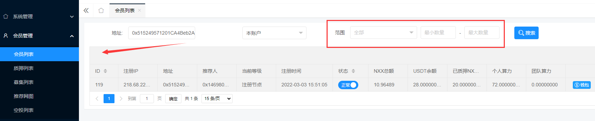
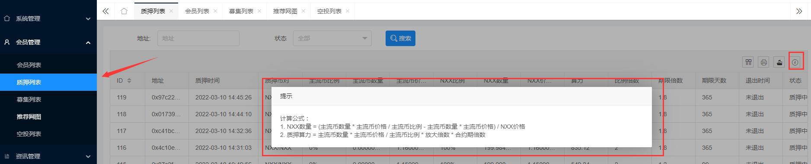
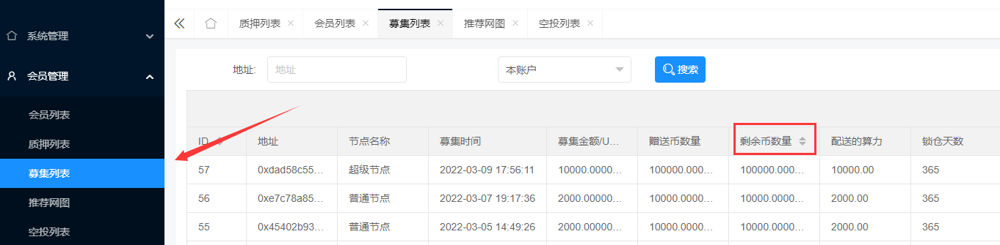
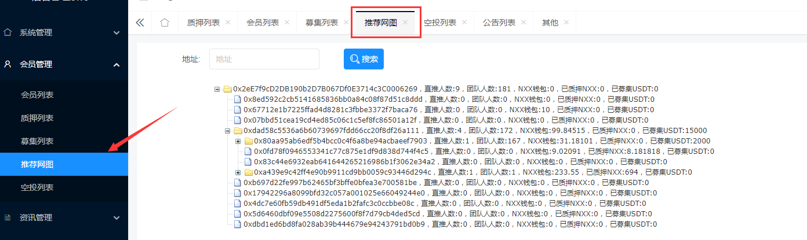

后台二开

- swarm *
- 5G探索 *
- 猎鹰 
- 财务系统（权限管理功能）-使用猎鹰源码二开 *
- 财务系统（后台操作日志）


- TRC_USDT /猎鹰
- ETC_USDT /猎鹰
- ETH /奈特
- TRC_LOH /LOH
- TRC_USDT批量提币/财务系统


web 页面类型

- 单页版（spa）

- iframe版（iframe）即多标签页版（muiltTab）


后台模板选型

- Table表格
  - 字段排序
  - 筛选
  - 搜索
  - 分页
  - 导出
  - 打印
  - 统计
  - 批量操作


## 后台布局

### Xenon + Bootstrap

官方网址：https://themes.laborator.co/xenon/

布局参考：

\- ShopXO https://ask.shopxo.net/article/4

---

Xenon 表单验证的使用方式

1. 引入两个文件

   1. jquery.validate.min.js

   2. messages_zh.min.js （中文提示信息）

2. 在表单标签里添加规则

   ```html
   <form
   role="form"
   method="post"
   enctype="multipart/form-data"
   class="form-horizontal validate">
   <!-- class 里面必须要填写 validate -->
   ```

`equalTo: "你的输入不相同"` 此验证方式多用于验证确认密码

用法：在 input 标签中添加 `data-validate="equalTo[#field-2]"` 其中 field-2 是上一个 input 标签属性id的值

例如：

```html
<input type="password"
name="login_password_confirm"
    class="form-control"
    data-validate="equalTo[#field-2]"
    placeholder="确认登录密码"
    value=""
    id="field-3">
```

---

参考项目

- 项目 swarm

 

一级菜单排序（升序排列）

- 会员管理
- 充值管理
- 财务管理
- 币价管理
- 交易大厅
- 提现管理
- 节点管理
- 管理员管理
- 信息中心
- 网站配置

### EleAdmin + Layui

源码位置：[source](√ 开发框架/web框架/√ EleAdmin)

官方网址：https://eleadmin.com/

参考项目：skybet

后台批量审核 参考项目 skybet 的提现列表

后台批量导出 参考项目 skybet 的提现列表

---

下图“合计金额”写法可参考项目 NXX


下图“范围搜索”写法可参考项目 NXX



下图“提示”写法可参考项目 NXX



下图“排序”写法可参考项目 NXX



下图“推荐网图”写法可参考项目 NXX



## 工作台（展示页/首页）

> 依据UI，需求文档中的内容酌情添加

 

总xx量或累计xx量 + 今日xx量 （常规组合）

 

总用户量 `user_count`

今日用户量 `today_user_count`


各用户等级的数量 `user_vip_count`

1级用户的数量 `user_vip1_count`

2级用户的数量 `user_vip2_count`


各钱包总金额 `<钱包名>_sum`

- 现有<钱包名>


累计收益 `income_sum`

今日收益 `today_income_sum`


各钱包累计提现 `withdrawal_<钱包名_>sum`

各钱包今日提现 `today_withdrawal_<钱包名_>sum`


待审核的数量 `pending_<数据表>_count`

## 会员管理

Member/user

- /member/index 展示索引页(data table page/operate) 会员列表

- /member/add 添加(empty form page/operate)
- /member/edit 编辑(data form page/operate)
- /member/delete 删除(operate)
- /member/status 状态设置（快捷操作）(operate)
- /member/mark (operate) 标记
- /member/tree (data table page) 推荐网图
- /member/team (data table page) 团队列表


- /member/machineAdd + machine_add.html
- /member/machineEdit + machine_edit.html
- /member/machineStatus


- Member-list.html 会员列表
- Member-form.html 编辑会员
- Member-new.html 新增会员

 

后台表格数据（红色字体为基础数据）

- `序号`

- `地址`

- `推荐人`

- `注册ip`

- `状态`

- `注册时间`

- `操作`
  - `钱包`

 

表数据

- ID

- 账号

- 手机号

- 用户名

- 地址

- 邀请码

- 注册IP

- 当前等级

  0 注册节点

  1 初级节点

  2 中级节点

  3 高级节点

  4 超级节点

- 推荐人

- 各资产的数量

- 钱包账户的金额

- 注册时间

- 状态

- 操作

## 充值管理

Recharge

- 后台充值
  - 新增充值
  - 充值列表

- 会员充值

 

## 价格管理

[项目：猎鹰]

Price

- 猎鹰币

  create.html

  index.html

 

## 配套管理

[项目：猎鹰]

Package

- create.html
- edit.html
- index.html

 

## 收益管理

Reward

- reward-static 静态收益
- reward-dynamic 动态收益
- reward-config.html 收益设置


## 结算管理

Settlement


## 管理员管理

Admin

- admin-list.html 管理员列表
- admin-form.html 编辑管理员


## 菜单规则

参考：https://demo.fastadmin.net/admin.php/auth/rule

 

## 订单管理

Order

- order-list.html 订单列表

 

## 网站设置

Config

- 参数设置

  parameter()

  parameter.html

 

- 短信平台

  sms()

  sms.html

 

- 提现配置

 

- App 更新

  app()

 

- 回收站

  recycle()

 

- 清除缓存

  clear()

 

- 数据备份

  backups()

 

- 钱包配置

  admin/config/wallet()

  - 划转 transfer
    - 划转最小数量
    - 划转最大数量
    - 划转是否开启
  - 提现 withdrawal
    - 提现最小数量 min_amount
    - 提现最大数量 max_amount
    - 提现是否开启 status
    - 提现手续费 fee
  - 兑换 exchange


## 财务中心

Finance

 

## 商城管理

Mall/shop

 

## 提现管理

Withdrawal/extract

 

## 充值管理

Recharge

 

## 信息中心

Info

- News 新闻管理
- Adv 轮播图管理

 

## 广告管理

Adv

 

## Form/表单

 

## Table/表格

form搜索

placeholder值

= 请输入搜索内容

= 

