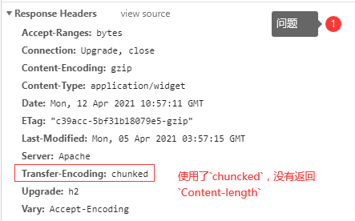
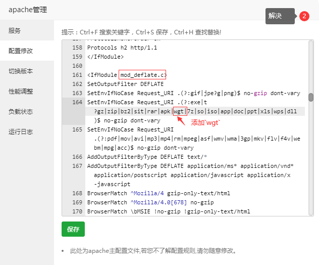

todo...

## 目录结构

```markdown
project/ #目录结构
├─ common/ # 外部引入的css及js文件存放目录
│  ├─ locales/ #语言包
│  │  ├─ my.js #马来语
│  │  ├─ en.js #英文
│  │  └─ zh.js #中文
│  ├─ clipboard.js #APP平台复制文件至粘贴板
│  ├─ custom.css #自定义样式
│  ├─ helper.js #助手函数
│  ├─ http.interceptor.js #拦截器 --from uview
│  ├─ http.api.js #*API集中管理 --from uView
│  ├─ util.js #工具类
│  └─ ...
├─ components #*符合vue组件规范的uni-app组件目录
│  ├─ 项目组件 #仅适用于单一项目
│  └─ 公共组件 #可适用所有项目
├─ js_sdk/ #uniapp官方插件市场
│  ├─ mmmm-image-tools #图像转换工具，可用于图像和base64的转换
│  └─ ...
├─ node_modules/ #npm安装模块
│  └─ vue-i18n/ #多语言
├─ pages/ #页面命名参考本文档 [位置]
│  └─ login/ #未登录可访问的页面
│      ├─ download.vue
│      ├─ forgetPassword.vue
│      ├─ login.vue
│      ├─ register.vue
│      └─ start.vue #启动页面（启动视频、启动图片 etc）
│  └─ tabbarA/
│      └─ index.vue
│  └─ tabbarB/
│      └─ index.vue
│  └─ tabbarC/
│      ├─ me.vue #我的页面
│      ├─ meShare.vue #分享页面
│      └─ index.vue
├─ static/ #更多可查看后端资源存放
│  * css、less/scss 等资源不要放在 static 目录下，建议这些公用的资源放在自建的 common 目录下
│  * static 目录下的 js 文件不会被编译，如果里面有 es6 的代码，不经过转换直接运行，在手机设备上会报错
│  * 存放应用引用的本地静态资源（如图片、视频等）的目录，注意：静态资源只能存放于此
│      ├─ images|imgs/
│      │   ├─ avatar/ #头像
│      │   │   ├─ avatar-square.png #圆角方形
│      │   │   └─ avatar-circle.png #圆形
│      │   ├─ background/ #背景图
│      │   │   └─ bg-i-user.png #图片背景
│      │   └─ empty/ #内容为空 --from uView的Empty组件
│      │	    └─ empty-message.png #消息列表为空
│      │   ├─ start/
│      │   │   └─ start-image.png #启动图
│      │   ├─ common/
│      │   ├─ icon/
│      │   │   └─ icon-upload.png #上传图标
│      │   ├─ logo/
│      │   │   └─ logo.png
│      │   └─ tabbarA/ #底部标签页A、B、C...内的图片
├─ store/ #vuex状态管理
│      └─ index.js
├─ utils/ #工具集，从uniapp插件导入的插件
├─ App.vue
├─ main.js
├─ manifest.json
├─ pages.json
└─ uni.scss
```

## Uniapp wgt热更新进度条异常

项目：`Nait`

时间：`2021/03/26`

问题：（问题解决耗时5小时）

Uniapp wgt热更新进度条异常

原因：

服务器没有响应`Content-Length`

 

解决：

Apache 配置`mod_deflate.c`模块，添加`wgt`文件类型

 


## HBuilder原生App云打包应用版本不一致提示

项目：`LOH`

时间：`2021/04/24`

问题：（问题解决耗时2小时）

uni-app运行环境版本和编译器版本不一致的问题

原因：

https://ask.dcloud.net.cn/article/35627

解决：

1. HBuilder编辑器版本升级（升级完重新启动编辑器）

2. 删除项目根目录`unpackage`文件夹（文件夹包含了旧版本的打包配置）

3. 卸载重装编辑器插件`App真机运行`、`uni-app编译`（完成后重新启动编辑器）

 
