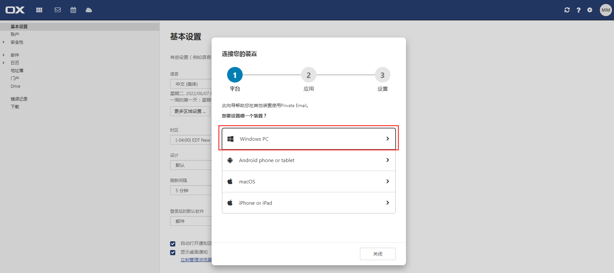
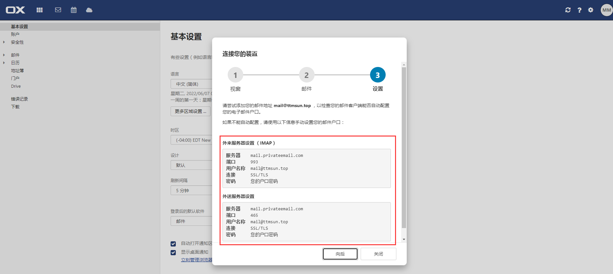

## php 发送邮件

### composer

<i class="ri-link"></i> [phpmailer/phpmailer 6.5.1](/开发框架/composer?id=phpmailerphpmailer-651)


### 参考项目

- 20211009_covid19
- 20211125_dsta
- 20220224_nimtech


### 参考链接

- phpmailer/phpmailer
  - 👍 https://blog.csdn.net/wx145/article/details/82686413 - *PHP使用PHPMailer发送邮件*（网易邮箱）
  - https://www.runoob.com/w3cnote/php-phpmailer.html - *PHP 使用 phpmailer 发送电子邮件*（网易邮箱）
  - https://www.cnblogs.com/ql-smile/p/10938680.html - *php使用邮箱发送验证码*（QQ企业邮箱）
  - https://www.jb51.net/article/198402.htm - *基于PHP实现邮箱验证激活过程详解*


- 获取授权码

  - 👍 https://www.yuque.com/changyou/cysysm/lylh0p - 包含教程：腾讯邮箱（QQ）、网易邮箱（126/163）、谷歌邮箱（Gmail）、雅虎邮箱（yahoo）、微软邮箱（hotmail/outlook）、移动邮箱（139）
  - Gmail

    - 👍 https://zhuanlan.zhihu.com/p/339174361 - *Gmail邮箱如何授权码和添加到第三方客户端？*
- <https://www.yuque.com/changyou/cysysm#一、基础设置> - *谷歌邮箱（Gmail）：代理设置+两部验证+访问权限*
    - http://www.360doc.com/content/20/0513/08/3046928_912010153.shtml - *如何设置收件邮箱和授权码*（包含教程：QQ邮箱、网易邮箱、新浪邮箱、Gmail邮箱、hotmail/outlook邮箱、Yahoo邮箱）
- https://www.bt.cn/bbs/forum.php?mod=viewthread&tid=66183 - *面板设置消息通道配置之邮箱配置教程*（宝塔面板）
- 百度搜索：google邮箱有发送限制吗

  - 


### 邮件服务器

网易邮箱配置如下图：

 


<i class="bi bi-ladder"></i> https://support.google.com/mail/answer/7126229 - *通过其他电子邮件平台查看 Gmail*

<i class="bi bi-ladder"></i> https://support.google.com/mail/answer/7104828  - *在使用 POP 的其他电子邮件客户端上查阅 Gmail 邮件*


### 邮件服务提供商

#### Gmail

?> 个人邮箱；有发送数量限制，一天内发送不能超过 500 封电子邮件 <i class="bi bi-ladder"></i> https://support.google.com/mail/answer/22839

- 如何使用 phpmailer 发送 Gmail 邮件?

  - ~~方式一、使用邮箱密码授权~~

    1. ~~注册 Google 账号~~

    2. ~~登录 Gmail https://mail.google.com/~~

    3. ~~登录后进入设置页面~~

    4. ~~设置项 “ IMAP 访问 ”，启用 IMAP（**重要**）~~

    5. ~~谷歌账号要开启低安全性应用登陆认证（**重要**）~~

       ~~开启地址：https://myaccount.google.com/lesssecureapps *⚠️谷歌官方 2022-05-30 开始，此方式不可用，详见[官方发文](https://support.google.com/accounts/answer/6010255)*~~

    - ~~参考链接~~

      - ~~👍 <https://www.cnblogs.com/zongsir/p/10063856.html> - *使用 php+gmail 发送邮件*（文末三行信息重要）~~
      - ~~https://blog.csdn.net/zdgdq/article/details/78518508 - *怎样开通gmail邮箱smtp服务*~~

  - 方式二、使用应用专用密码授权

    1. 注册 Google 账号

    2. 登录 Gmail https://mail.google.com/

    3. 登录后进入设置页面

    4. 设置项 “ IMAP 访问 ”，启用 IMAP（**重要**）

    5. 谷歌账号开启两步验证（**重要**）

       开启地址：https://myaccount.google.com/signinoptions/two-step-verification

       *⚠️开启两步验证需要收取三次短信进行验证*

    6. 谷歌账号设置 “ 应用专用密码 ”

       设置地址：https://myaccount.google.com/apppasswords

    - 参考链接
      - 👍 https://www.cnblogs.com/niuben/p/13613635.html - *php 配置 Gmail 发送邮件 PHPMailer*
      - https://sspai.com/post/28545 - *手把手教你设置 Google 两步验证*

  - 在 `phpmailer/phpmailer` 中测试
    - Google Gmail 测试通过

#### PrivateEmail

?> 企业邮箱、域名邮箱

通过 https://privateemail.com/ 可以免费体验 60 天的 https://www.namecheap.com/hosting/email/ 企业邮箱。

- 注册账号 https://www.namecheap.com/myaccount/signup/ - *需要 1 个已注册的邮箱账号，登录时通过这个邮箱收取验证码*

- 开始试用

  1. 绑定域名 - *直接到 namecheap 购买一个新域名或者使用已购买的域名*

  2. 填写地址信息，填写内容可以参照 https://www.zhihu.com/question/497506591

  3. 按照提示解析域名

  4. 创建邮箱账号，例如：`mail@域名`

  5. 登录已创建的邮箱账号 https://privateemail.com/

  6. 查看授权 “ IMAP " 访问信息

     

     

     

     

- 在 `phpmailer/phpmailer` 中测试

  

  ```markdown
  privateemail.com
  
  
  
  Incoming Server Settings (IMAP)
  
  Server：mail.privateemail.com
  
  Port：993
  
  Username：mail@88618.xyz
  
  Connection：SSL/TLS
  
  Password：S2asSQ21 (Your account password)
  
  
  
  Outgoing Server Settings
  
  Server：mail.privateemail.com
  
  Port：465
  
  Username：mail@88618.xyz
  
  Connection：SSL/TLS
  
  Password：S2asSQ21 (Your account password)
  ```

  

  - PrivateEmail 测试通过


#### 宝塔邮局管理器

> 未尝试

https://www.bt.cn/bbs/thread-87496-1-1.html - *【宝塔邮局管理器】使用教程 - Linux面板 - 宝塔面板论坛*


### 邮件模板

> 文案参考个人邮箱（caiyongwen@yeah.net）中的文件夹分类 > 邮箱验证


- 邮箱验证码文案
  - 邮件标题：`欢迎注册<项目名>`
  - 邮件内容：`你本次注册的验证码为：194559，请在5分钟之内使用它！`


- 验证邮箱文案
  - 邮件标题：`<项目名>新用户激活`
  - 邮件内容：`感谢您注册EasyWeb网站，请点击此激活链接激活您的账户：https://eleadmin.com/account/active/ea04fc42e4b843e899d3d242f0285fad，如果无法验证，请复制链接使用浏览器打开。`


### 多语言

```php
'email_validation_subject' => 'DST新用户激活',

'email_validation_message' => '感谢您注册DST，请点击此激活链接激活您的账户：%s，如果无法验证，请复制链接使用浏览器打开。',

'email_validation_success_message' => '验证成功，返回APP或浏览器激活页面进行下一步操作!',

'email_validation_failure_message' => '邮箱账户已验证成功，返回APP或浏览器激活页面进行下一步操作!',


'邮件标题' => '欢迎注册%s',

'邮件内容' => '你本次注册的验证码为：%d，请在5分钟之内使用它！',
```

