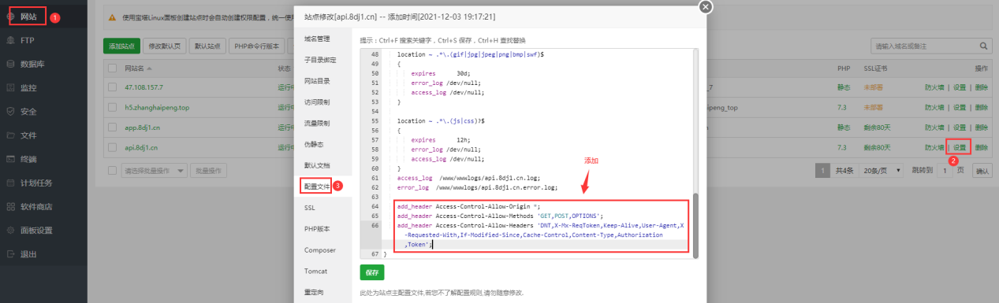
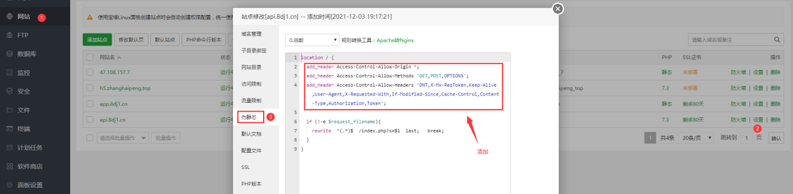

## 参考链接

👍 可能是最好的跨域解决方案了 https://github.com/campcc/blog/issues/15

浏览器的同源策略 https://developer.mozilla.org/zh-CN/docs/Web/Security/Same-origin_policy

### cookie 跨域

thinkphp解决cookie跨域 https://www.cnblogs.com/xfstu/p/15705285.html

ThinkPHP中的跨域名共享session https://blog.csdn.net/leejianjun/article/details/52880253

thinkphp中session跨域问题 https://www.cnblogs.com/shitouzi/archive/2017/10/03/7623885.html

【thinkphp】跨域共享cookies session https://cloud.tencent.com/developer/article/1190563


## 代码实现

<!-- tabs:start -->

### **uni-app**

uni-app H5跨域问题解决方案（CORS、Cross-Origin） https://ask.dcloud.net.cn/article/35267


### **php**

```php
header('Content-Type:text/html; charset=utf-8'); // 设置程序编码
header('Access-Control-Allow-Origin:*');
header('Access-Control-Allow-Origin:http://tongxuehui.qw1000.cn'); // 指定允许其他域名访问
header('Access-Control-Allow-Methods:GET, POST, PATCH, PUT, DELETE, OPTIONS'); // 响应类型
header('Access-Control-Allow-Headers:Authorization, Content-Type, If-Match, If-Modified-Since, If-None-Match, If-Unmodified-Since, X-Requested-With');
header('Access-Control-Allow-Credentials:true'); // 配置允许发送认证信息 比如cookies（会话机制的前提）
```


参考链接 👇

PHP后台代码解决跨域问题 https://www.cnblogs.com/mmykdbc/p/8024105.html


### **thinkphp**

**项目**

- 猎鹰

- swarm

 

------

**tp3.2.3**

TP3.2.3 怎么开启允许跨域 http://www.thinkphp.cn/topic/55695.html


------

**tp5.1**

ThinkPHP 5.1 跨域配置方法 https://www.jb51.net/article/171692.htm

 

- 方式一：需要有官方开发手册 `路由` 内容的基础

  > 根目录 `/route` 下新建 `api.php` 文件

  ```php
  use think\facade\Route;
  
  // 设置 api 模块跨域请求
  Route::rule(':controller/:function', 'api/:controller/:function')
      ->header('Access-Control-Allow-Origin', '*')
      ->header('Access-Control-Allow-Credentials', 'true')
      ->header('Access-Control-Allow-Headers', 'Origin, X-Requested-With, Content-Type, Accept, Connection, User-Agent, Cookie, Authorization, Token')
      ->allowCrossDomain();
  
  return [
  
  ];
  ```

  或者

  > [手册 -- 路由 -> 跨域请求](https://www.kancloud.cn/manual/thinkphp5_1/489844)

  ```php
  // 设置 api 模块跨域请求
  Route::rule('api/:version/:controller/:function','api/:version.:controller/:function')
    ->header('Access-Control-Allow-Origin','*')
    ->header('Access-Control-Allow-Credentials', 'true')
    ->header('Access-Control-Allow-Headers', 'Origin,X-Requested-With,Content-Type,Accept,Connection,User-Agent,Cookie,Token')
    ->allowCrossDomain();
  ```

  


- 方式二：直接添加 `header()` 函数


------

**参考链接 👇**

Thinkphp 允许跨域问题(实例+解决方法) https://zhuanlan.zhihu.com/p/105386883

thinkphp5 关于跨域的一些坑，附上解决办法（比较全面了） https://www.cnblogs.com/lamplnmp/p/13141689.html


### **nginx**

```nginx
add_header Access-Control-Allow-Origin *;
add_header Access-Control-Allow-Methods 'GET,POST,OPTIONS';
add_header Access-Control-Allow-Headers 'DNT,X-Mx-ReqToken,Keep-Alive,User-Agent,X-Requested-With,If-Modified-Since,Cache-Control,Content-Type,Authorization,Token';
```


方式一




方式二




参考链接 👇

nginx反向代理允许跨域应该怎么设置 https://www.bt.cn/bbs/forum.php?mod=viewthread&tid=81405


 <!-- tabs:end -->


## 工具

> 跨域请求调试工具

### web浏览器跨域调试

> 👍 [跨域调试 - 浏览器随意打开一个网页 console中输入以下代码调试（注：http或https要一致）](http://www.04007.cn/article/799.html)
>
> ajax菜鸟教程链接：https://www.runoob.com/ajax/ajax-tutorial.html

```js
var xhr = new XMLHttpRequest();

xhr.open('GET', 'https://www.04007.cn/');

// xhr.open('GET', 'https://www.04007.cn/?username=xxx&password=xxx');

xhr.setRequestHeader('token','');

xhr.send(null);

xhr.onload = function(e) {

  var xhr = e.target;

  console.log(xhr.responseText);

}

```


## faqs

本地开发调试出现无法跨域的问题

> 检查电脑或浏览器是否开启了 vpn
>
> 使用浏览器无痕窗口打开

