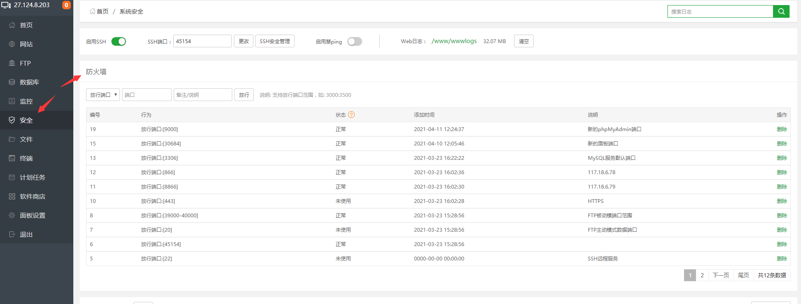
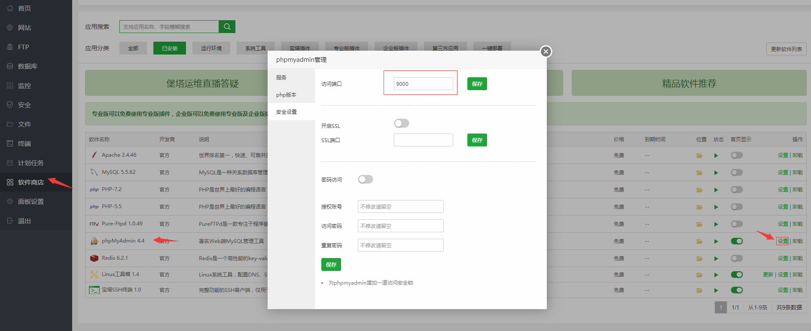
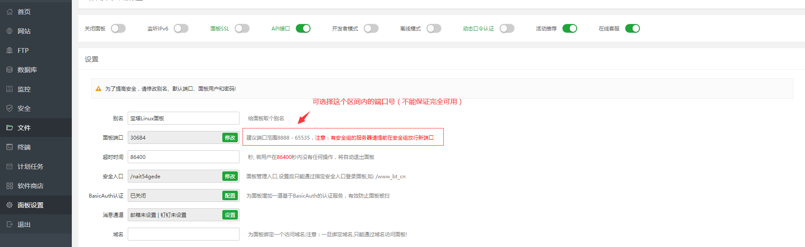
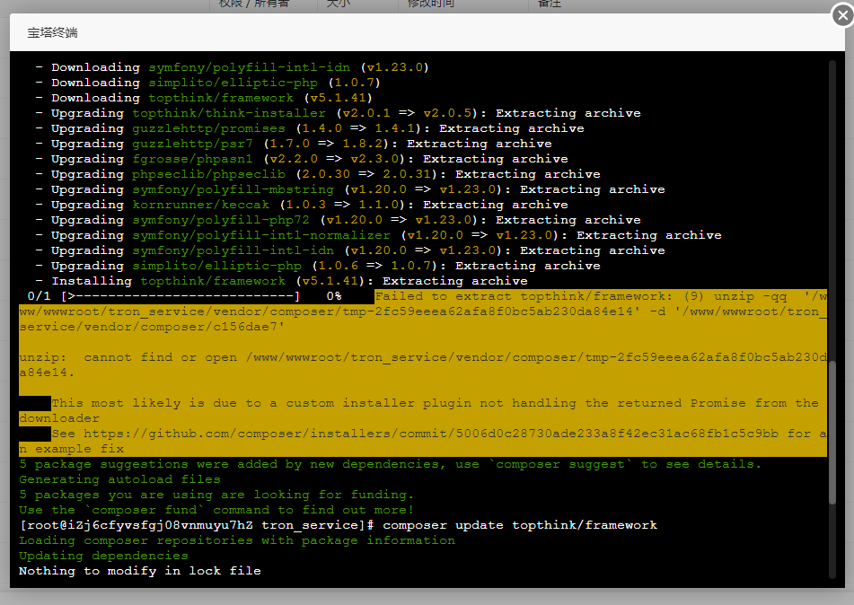

## 官方

Github：https://github.com/aaPanel

### 中文版

主页：https://www.bt.cn/

### 国际版

主页：  
https://www.aapanel.com/ *国内网络无法访问*  
https://www.aapanel.com/feature.html

文档：https://doc.aapanel.com/web/

论坛：https://forum.aapanel.com/

## 免费ssl

1. 宝塔官网注册账号
2. 指定域名申请ssl
3. 部署
4. 强制HTTPS
5. 防火墙或者安全组放行443端口

**参考链接**

<https://developer.aliyun.com/article/705391>

## FAQ

### Linux 宝塔面板无法连接phpmyadmin

推荐使用`phpmyadmin`4.4版本，4.4版本可直接访问（无需登录）

解决方式：

1. 检查防火墙（可在面板安全中查看）

    

2. 检查安全组（需在服务器供应商中查看，比如阿里云、腾讯云）

3. 如果使用的默认888端口在防火墙中已放行，仍无法连接到，可能是安全组中没有放行导致，在无法修改安全组的情况下，可通过修改`phpmyadmin`访问端口的方式放行

   1. 设置

      

   2. 访问的端口应该为安全组中已放行的端口范围

       

### composer update topthink/framework报错

项目：`swarm`

时间：`2021/06/10`

问题：（问题解决耗时1小时）

执行命令时出现`“Failed to extract topthink/framework: (9) unzip -qq  '/www/wwwroot/tron_service/vendor/composer/tmp-2fc59eeea62afa8f0bc5ab230da84e14' -d '/www/wwwroot/tron_service/vendor/composer/c156dae7'”`错误

 

原因：

/根目录的`composer.lock`版本有冲突

解决：

删除`composer.lock`文件，重新执行`composer update`和`composer update topthink/framework`命令即可成功

 

另一种网上解决方式：<https://ask.fastadmin.net/question/26538.html> *（未尝试）*

