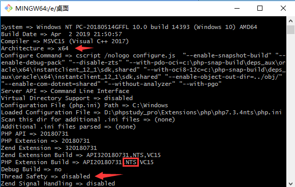

## 官方

?> php 服务器组件

官网：https://www.xp.cn/


## 伪静态

- Apache

  `.htaccess` 文件名；重写规则

  `.htaccess` 文件代码在线生成工具

  URL 重写：开启模块 `mod_rewrite`

  ```nginx
  <IfModule mod_rewrite.c>
    Options +FollowSymlinks -Multiviews
    RewriteEngine On
  
    RewriteCond %{REQUEST_FILENAME} !-d
    RewriteCond %{REQUEST_FILENAME} !-f
    RewriteRule ^(.*)$ index.php?/$1 [QSA,PT,L]
    RewriteRule .* - [env=HTTP_AUTHORIZATION:%{HTTP:Authorization},last]
  </IfModule>
  ```

  

- Nginx

  `nginx.htaccess` 文件名

  ```nginx
  location / {
      if (!-e $request_filename) {
          rewrite ^(.*)$ /index.php?s=/$1 last;
      }
  }
  ```

  

## 反向代理

- 在 nginx 服务器中使用

  ```nginx
   location /api {
         proxy_pass http://localhost:3000/api;            
   }
  ```

  参考：https://www.csdn.net/tags/NtTaggysMzA0NDEtYmxvZwO0O0OO0O0O.html - *phpstudy 反向代理 - CSDN*

## Redis

1. php 添加 redis 扩展

2. 打开 redis 程序服务

   程序位置：`D:\phpstudy_pro\Extensions\redis3.0.504\redis-server.exe`


## 安装 php 扩展

1. 前往 <http://pecl.php.net> 下载需要的扩展（版本可选择最新 stable 稳定版）

2. 选择对应 php 版本的扩展包

   

   

   **如何选取扩展包**

   - 输入命令 `php -i` 或者 `php -r "phpinfo();"`

     

     

     参考：[使用 php 命令行工具查看架构及是否支持线程安全](https://blog.csdn.net/hfut_wowo/article/details/88169634)

## 参考链接

VC10 64位_phpstudy集成安装环境运行库-php中文网工具下载  
https://www.php.cn/xiazai/gongju/1480

PHPStudy 加载64位PHP环境 - Lovestu  
http://www.lovestu.com/phpconfig01.html

如何使用phpstudy安装PHP7的64位运行环境？  
https://blog.csdn.net/xgocn/article/details/95754790

phpstudy安装64位PHP  
https://blog.csdn.net/weixin_36185028/article/details/76144941
