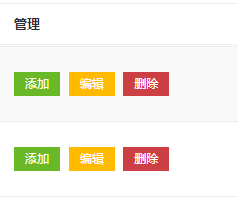
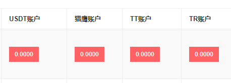

> 时间：2019/07/18

Xenon响应式后台管理模板  
<http://www.mycodes.net/154/7865.htm>  
http://demo.cssmoban.com/cssthemes3/mstp_115_enonadmin/dashboard-1.html

Xenon Admin响应式后台管理员bootstrap模板  
http://www.cssmoban.com/cssthemes/5610.shtml


## 后台模块

会员管理

- [ ] 添加会员
- [ ] 会员列表
- [ ] 配套列表

充值管理

- [ ] 后台充值
  - [ ] 账户充值
  - [ ] 充值列表

价格管理

- [ ] 猎鹰币

财务中心

- [ ] USDT钱包
- [ ] 猎鹰钱包
- [ ] TT钱包
- [ ] TR钱包

配套管理

提现管理

管理员管理

消息中心

网站设置


## 后台布局

*图*

> 

```html
<a href="{:url('admin/finance/funding')}">
    <span class="title">本金</span>
    <span class="label label-info pull-right">配资</span>
</a>
```


*图*

>  

```html
<h3 class="panel-title">本金<mark>实资</mark>明细</h3>
```

 *图*

> 

> 表体行数据垂直居中显示（不支持表头数据垂直居中显示）

```html
<tbody class="middle-align">...</tbody>
```

 

  *图*

>   

```html
<td>
    <a href="#" class="btn btn-pink btn-sm">{$mem['wallet']['price_i_info']|default='0.0000'}</a>
</td>
```

 *图*

>  

```html
<td>
    <div>
        <label>USDT：</label>
        <a href="#">
            <span class="label label-default">0.0000</span>
        </a>
    </div>
    <div>
        <label>USDT：</label>
        <a href="#">
            <span class="label label-default">0.0000</span>
        </a>
    </div>
</td>
```


 布局参考

>  